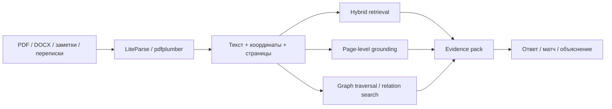
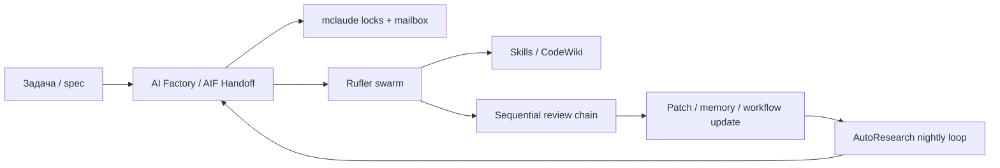
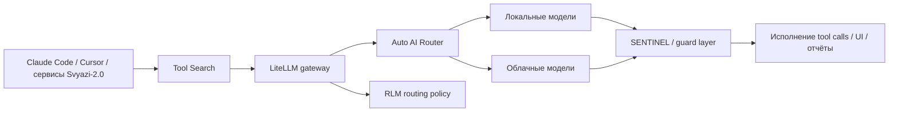

# Софтверные комбинации на Хабре для Svyazi 2.0

## Executive summary

Если смотреть не на отдельные статьи, а на то, как их можно состыковать, то на Хабре за первые месяцы 2026 года уже сложился почти полный конструктор для **Svyazi‑2.0**: ingestion и нормализация профилей из свободного текста, agent‑first knowledge base, файлосистемная память для агентов, ассоциативная и консолидируемая долговременная память, визуально проверяемый RAG, многоагентная оркестрация, безопасный MCP‑слой, локальный voice→vault вход и бюджетно‑осознанный роутинг моделей. Самостоятельно каждый блок выглядит либо как аккуратный pet‑project, либо как «узкая» инженерная находка. Но вместе они уже дают не “ещё один AI‑ассистент”, а операционную систему для обнаружения коллабораций, накопления доказуемого знания и полуавтономной работы агентов в локальном контуре. citeturn41search0turn33view3turn33view4turn21view0turn22view4turn20view5turn20view6turn20view11

Самая сильная линия синергии выглядит так. Основа — Svyazi‑подобный гибридный пайплайн: LLM извлекает смысл, детерминированный код нормализует, а **CardIndex** фиксирует состояние карточки и версионирование. Поверх этого нужен agent‑readable слой знаний и единый source of truth для разных рантаймов — здесь хорошо ложатся knowledge‑space и AgentFS. Дальше память должна не просто хранить факты, а уметь усиливать слабые сигналы, консолидировать эпизоды и забывать шум — это зона Yodoca, NGT Memory, MemNet и более инженерных систем вроде agent-memory-mcp/Memory OS. Для многоагентной работы уже есть mclaude, AI Factory, AIF Handoff, Rufler и протокол Sequential; для forensic‑режима — research-docs/LiteParse, Legal RAG, Hybrid RAG и Graph RAG; для безопасного и дешёвого исполнения — Tool Search, LiteLLM, Auto AI Router, RLM-Toolkit и SENTINEL. citeturn33view2turn27view0turn21view1turn22view3turn21view4turn20view16turn39view3turn20view2turn20view3turn20view4turn20view11turn20view5turn34view2turn34view3turn39view1turn39view0turn20view18turn20view10

Главный аналитический вывод: **на Хабре пока не видно одного готового проекта, который уже собрал все слои в единое целое, но видно много авторов, каждый из которых почти идеально закрывает один слой будущей системы.** Поэтому реальная ценность исследования — не в списке ссылок, а в правильной сборке ансамблей. Наиболее прагматичный путь — не строить большой новый монолит, а начать с минимального прототипа из пяти компонентов: Svyazi‑подобный import/normalize/CardIndex, AgentFS‑подобное файловое ядро, NGT կամ Yodoca‑подобная память, research-docs/LiteParse‑подобный evidence‑слой и LiteLLM/Auto AI Router+SENTINEL как исполнительный периметр. citeturn41search0turn27view0turn22view4turn21view0turn20view5turn11search2turn39view0turn20view10

## Методика и рамка отбора

Поиск вёлся с приоритетом на **Хабр как первичный слой описания идеи** и на **репозитории как первичный слой верификации лицензии, зрелости и интеграционного интерфейса**. В выборку включались только те вещи, которые одновременно отвечали хотя бы двум условиям: дают новый слой в Svyazi‑2.0, могут быть состыкованы с другими слоями без полной переписи, либо в явном виде улучшают доказуемость, безопасность, локальность или стоимость выполнения. Когда у статьи не было публичного репозитория или лицензии, это отмечено как **«неуточнено»**.

Для зрелости использовалась простая шкала: **эксперимент** — исследовательский или концептуальный код; **рабочий прототип** — можно поставить и проверить сценарий; **активный OSS** — есть явная публичная разработка, релизы или активное развитие; **внутренний/закрытый прототип** — архитектура раскрыта, но код закрыт. Эта шкала — аналитическая, а не официальная оценка авторов.

Ниже таблица умышленно смешивает одиночные проекты и «малые связки». Это сделано потому, что часть ценности лежит не в одном репозитории, а в уже сложившемся на Хабре паттерне: например, “forensic RAG” — это не один продукт, а совместимая линия из research-docs/LiteParse, page‑level Legal RAG и более общего Hybrid/Graph RAG. Аналогично “безопасный бюджетный execution plane” — это не один инструмент, а сочетание gateway, lazy tool loading, security firewall и маршрутизации режимов работы. citeturn20view5turn20view6turn34view2turn34view3turn39view1turn39view0turn20view10turn20view18

## Карта найденных проектов и паттернов

| Проект или связка | Автор | Ссылка на статью и репо | Краткое описание | Ключевые компоненты и паттерны | Лицензия | Maturity / статус | Релевантность к Svyazi‑2.0 |
|---|---|---|---|---|---|---|---|
| **Svyazi** | Андрей Чуян | Хабр citeturn41search0 | Гибридная система извлечения структурированных профилей участников сообщества из свободного текста; уже показала кейс «карточек коллабораций». | 6 слоёв, YAML, SHA256‑дедупликация, Ollama+Qwen, LLM+детерминированный код, CardIndex, privacy by design. | **Код закрыт**. citeturn41search0 | Активный закрытый авторский прототип. citeturn41search0 | **Очень высокая**: это базовый ingest/normalize/discovery‑слой. |
| **knowledge-space** | Sonia_Black / AnastasiyaW | Хабр + GitHub citeturn33view0turn33view2turn37search1 | Agent‑first референсная база: 785+ карточек по 26 доменам, растущая из реальных research‑сессий. | Dense reference cards, gotchas, wiki‑links, `research/inbox/`, «для агентов, не людей». | **MIT**. citeturn33view0turn37search1 | Активный OSS, база растёт почти ежедневно. citeturn33view1turn37search1 | **Высокая**: это внешний knowledge layer для агентов и нормализатора. |
| **AgentFS** | kksudo | Хабр + GitHub citeturn33view4turn33view7turn27view0 | Превращает Obsidian‑vault в операционную систему для AI‑агентов с единым `.agentos/`‑ядром. | Compile‑to‑native configs, persistent state, security policies, memory consolidation, doctor/triage/compile CLI. | **MIT**. citeturn33view4turn27view0 | Рабочий прототип, версия 0.1.5; “рабочая, но не финальная”. citeturn33view7 | **Очень высокая**: это лучший кандидат на файловое ядро Svyazi‑2.0. |
| **mclaude** | AnastasiyaW | Хабр + GitHub citeturn20view2turn37search0 | Координация нескольких сессий Claude Code и других coding‑агентов над одним проектом. | Locks, handoffs, mailbox, multi‑session turn‑taking, shared project memory. | **MIT**. citeturn37search0 | Активный OSS. citeturn37search0 | **Высокая**: решает параллельную работу модераторов/агентов над общим графом. |
| **AI Factory + AIF Handoff** | lee-to / Cutcode | Хабр + GitHub citeturn20view3turn29search0turn29search9 | Spec‑driven многоагентный development‑framework и автономный Kanban‑слой поверх него. | Skills, patches, self‑learning, worktrees, MCP handoff, plan/implement/review, WebSocket Kanban. | **MIT**. citeturn29search0turn29search9 | Активный OSS, релизы v2.x; handoff добавлен в свежих релизах. citeturn29search4 | **Высокая**: готовый оркестратор для build‑ и moderation‑контуров Svyazi‑2.0. |
| **Rufler** | zodigancode / lib4u | Хабр + repo/DEV citeturn20view4turn21view8turn32search0 | Декларативный YAML‑слой для запуска автономного роя Claude Code‑агентов. | `depends_on`, auto‑objective prompts, pause/resume, token accounting, MCP server management. | **MIT**. citeturn32search0 | Активный OSS. citeturn32search0 | **Средне‑высокая**: быстрый orchestration‑слой без тяжёлого UI. |
| **research-docs + LiteParse** | nlaik / Jerry Liu / LlamaIndex | Хабр + GitHub citeturn20view5turn15search1turn15search5turn40search0 | Forensic document QA с HTML‑отчётом и bounding boxes на страницах PDF. | Локальный парсер, spatial text parsing, visual citations, multi‑format docs, HTML evidence report. | **Apache 2.0** для LiteParse; для samples — неуточнено в просмотренных источниках. citeturn40search0turn40search1 | Активный OSS. citeturn15search1turn15search5 | **Очень высокая**: даёт visual grounding, которого Svyazi‑подобным системам обычно не хватает. |
| **Hybrid RAG knowledge base** | iximy | Хабр citeturn34view2 | Минималистский Hybrid RAG без тяжёлых фреймворков. | `pdfplumber`, координаты слов, TF‑IDF, FAISS, metadata filtering, прозрачный retrieval‑layer. | Неуточнено. citeturn34view2 | Практический implementation guide; публичный код в статье не акцентирован. citeturn34view2 | **Высокая**: полезен как быстрый базовый retrieval‑контур. |
| **Legal RAG** | tagir_analyzes | Хабр citeturn20view6 | Подробный кейс page‑level Legal RAG с 17 итерациями и измерением пределов масштабирования. | Page‑level grounding, context distillation, систематический eval loop, error analysis. | Неуточнено. citeturn20view6 | Зрелый инженерный кейс, а не только концепт. citeturn20view6 | **Очень высокая**: лучший источник для evidence‑first и audit‑friendly retrieval. |
| **Graph RAG** | VladSpace / vpakspace | Хабр + GitHub citeturn34view3turn40search2 | Графовый RAG с provenance‑trace и typed API, собранный из 5 исследовательских техник. | Skeleton Indexing, Phrase/Passage dual nodes, VectorCypher, Datalog reasoning, agentic routing. | Неуточнено. citeturn34view3turn40search2 | Активный публичный repo / production‑ready ambition. citeturn34view3turn40search2 | **Высокая**: добавляет multi‑hop retrieval и relation‑reasoning. |
| **Yodoca** | VitalyOborin | Хабр + GitHub citeturn38view7turn21view0turn21view1turn18search1 | Локальный self‑evolving AI assistant с долговременной памятью и ночной консолидацией. | Hot/slow path, private write‑path consolidator, `is_session_consolidated`, Ebbinghaus decay, causal edges, proactive memory. | **Apache 2.0**. citeturn18search1 | Активный OSS. citeturn18search1 | **Очень высокая**: лучший слой для nightly consolidation и controlled forgetting. |
| **NGT Memory** | spbmolot / ngt-memory | Хабр + GitHub/site citeturn22view4turn22view3turn32search2 | Персистентная память для LLM‑приложений с ассоциативным графом и миллисекундным retrieval overhead. | Cosine similarity + Hebbian graph + hierarchical consolidation, REST API, Docker, 2–3 ms собственных затрат. | **BSL 1.1**; в статье прямо сказано «бесплатно для личных проектов». citeturn22view5 | Активная разработка. citeturn22view3turn32search2 | **Очень высокая**: быстрый ассоциативный memory‑слой для discovery и matching. |
| **MemNet / memory-is-all-you-need** | Antipozitive | Хабр + GitHub citeturn21view4turn17search0turn18search2 | Исследовательская активная память для трансформеров. | Hebbian graph memory, STDP, spreading activation, “dreaming”, anti‑forgetting. | **MIT**. citeturn17search0turn18search2 | Экспериментальный research codebase. citeturn17search0 | **Средне‑высокая**: не MVP‑слой, но сильная идея для future memory engine. |
| **agent-memory-mcp + Memory OS** | VitaliySemenov / moshael | Хабр + GitHub + Хабр citeturn20view16turn15search3turn39view3 | Typed memory MCP плюс более тяжёлая концепция Memory OS с онтологией, gardener‑loop и bi‑temporal facts. | SQLite+WAL, typed memories, repo/doc search, path guard; ontology, concept loop, maintenance contour, planner/scout/synthesizer. | Для `agent-memory-mcp` — неуточнено; для Memory OS — неуточнено. citeturn15search3turn39view3 | `agent-memory-mcp` — рабочий OSS; Memory OS — концептуально амбициозный кейс без явного публичного репо в статье. citeturn15search3turn39view3 | **Высокая**: слой typed memory и governance для более поздних итераций. |
| **Self‑Aware MCP + Skills + CodeWiki** | akazant / akzhankalimatov / AnastasiyaW | Хабр + repo/marketplace + Хабр/репо citeturn20view12turn30search1turn20view15turn12search2turn37search7 | Контекст реального мира для агента плюс reusable skills и авто‑документация кодовой базы. | location/time/OS tools, skill files in repo, hooks, subagents, code wiki generation. | Self‑Aware MCP — **MIT** по карточке MCP Marketplace; config‑kit — **MIT**; CodeWiki — неуточнено. citeturn30search1turn37search7turn12search2 | Активный стек инструментов. citeturn20view12turn37search7turn12search2 | **Высокая**: делает агентный слой контекстным, переносимым и предсказуемым. |
| **Voice/local-first stack** | atatchin / askid / обзоры Handy/OpenWhispr | Хабр citeturn21view10turn21view11turn21view12turn35search0 | Локальный speech→text→LLM transform и более широкий local‑first knowledge workspace с recording/transcription. | Whisper локально, Ollama post‑processing, Handy/OpenWhispr/GigaAM, live transcription, diarization, semantic links, SQLite. | Смешанная картина; для Yttri лицензия в просмотренных источниках не уточнена. citeturn35search0turn21view11 | От usable scripts до beta‑продукта. citeturn21view10turn35search0 | **Средне‑высокая**: лучший входной канал для “raw episodes” в память. |
| **Yjs + Automerge** | Kevin Jahns / Automerge team | Документация и репо citeturn11search0turn11search7turn11search13turn11search1turn11search11turn11search23 | Базовый local‑first/CRDT sync‑слой для оффлайн‑совместимости и мультидевайсной синхронизации. | Shared types, automatic merge without conflicts, offline sync, local‑first data engine. | **MIT**. citeturn11search13turn11search23 | Активный OSS. citeturn11search13turn11search11 | **Средняя**, но стратегически важная: синхронизация между устройствами и узлами. |
| **Security + routing plane** | Dmitriila / BerriAI / MiXaiLL76 / Maslennikovig | Хабр + GitHub/docs citeturn20view10turn11search2turn19search5turn39view0turn39view1turn20view18 | Рантайм‑безопасность и бюджетный execution plane для агентных систем. | SENTINEL micro‑model swarm; LiteLLM unified API; Auto AI Router on Go; Tool Search lazy MCP loading; budget/privacy presets in RLM‑Toolkit. | Смешанная: SENTINEL — неуточнено; LiteLLM — MIT вне enterprise‑директорий; Auto AI Router — Apache 2.0. citeturn20view10turn19search5turn28search3 | Активный operational stack. citeturn20view10turn11search2turn39view0turn39view1 | **Очень высокая**: без этого Svyazi‑2.0 будет либо дорогой, либо небезопасной. |
| **AutoResearch + Sequential** | Андрей Карпаты / Виктория Дочкина | Хабр + GitHub/обзор citeturn20view19turn20view11 | Ночной цикл самоулучшения и протокол reviewer‑цепочки без централизованного координатора. | Edit‑run‑measure‑rollback loop, bounded experiments, sequential protocol, strong-model self‑organization. | Для AutoResearch — по статье на GitHub; лицензия в Habr‑обзоре не уточнялась. Для Sequential — исследовательская статья без OSS‑лицензии. citeturn20view19turn20view11 | Active research / practical harness. citeturn20view19turn20view11 | **Высокая**: это кандидат на self‑improvement и multi‑review для Svyazi‑2.0. |

## Приоритетные ансамбли

Ниже — не все теоретически возможные комбинации, а **пять ансамблей с максимальным приростом свойств при минимальном интеграционном риске**.

**Ансамбль A — Collaboration OS**

Это базовый сценарий для Svyazi‑2.0: Svyazi отвечает за извлечение и нормализацию профилей, AgentFS — за единое файловое ядро и политику, knowledge-space — за agent‑readable reference layer, NGT Memory — за быстрые ассоциативные связи, Yodoca — за ночную консолидацию и забывание шумов. Такой стек превращает “случайные находки коллабораций” в воспроизводимую машинерию. citeturn41search0turn27view0turn33view2turn22view4turn21view0

Ожидаемые новые свойства:

- **Serendipity не как баг, а как режим работы**: быстрый поиск больше не ограничен совпадением явных skills; ассоциативная память подтягивает слабые ко‑активации тем и интересов. citeturn41search0turn22view4
- **Единый source of truth для разных агентов и сессий**: rules, memory, security и task state больше не дублируются по `CLAUDE.md`, `.cursor/rules/` и другим runtime‑форматам. citeturn33view4turn27view0
- **Контролируемое забывание вместо бесконечного накопления мусора**: Yodoca явно вводит Ebbinghaus‑decay, prune и приватный write‑path‑консолидатор. citeturn21view0turn21view1
- **Agent‑first knowledge retrieval**: knowledge-space снижает стоимость «ориентации в проекте», потому что хранит не туториалы, а уже очищенные reference‑карты с граблями и рабочими паттернами. citeturn33view3turn37search1

**Ансамбль B — Forensic RAG для доказуемого matching и review**

Если Svyazi‑2.0 должен не только находить людей и идеи, но и объяснять, *почему* возникла рекомендация, нужен evidence‑first слой. Здесь research-docs/LiteParse даёт spatial grounding и HTML‑отчёты, Legal RAG — page‑level модель доказуемости, Hybrid RAG — лёгкий контролируемый backend, а Graph RAG — multi‑hop reasoning по связям между сущностями и пассажами. citeturn20view5turn20view6turn34view2turn34view3

Ожидаемые новые свойства:

- **Верифицируемые ответы**: у пользователя появляется не просто текстовый вывод, а визуально подсвеченный фрагмент страницы, к которому можно вернуться. citeturn20view5turn34view2
- **Правильная единица доказательства — страница, а не чанк**: Legal RAG прямо показывает, почему page‑level grounding удобнее для обратного перехода к источнику. citeturn20view6
- **Multi‑hop объяснения**: Graph RAG добавляет ответы на вопросы о связях и косвенных маршрутах между объектами, где обычный chunk‑RAG ломается. citeturn34view3
- **Контроль над retrieval‑слоем без «фреймворкового тумана»**: Hybrid RAG‑подход на pdfplumber/FAISS/TF‑IDF проще дебажить и дешевле держать в локальном контуре, чем тяжёлые универсальные RAG‑фреймворки. citeturn34view2

**Ансамбль C — Spec‑driven multi‑agent factory**

Для развития самого продукта нужен не просто один агент, а управляемая фабрика: mclaude закрывает locks/handoffs/mailbox, AI Factory/AIF Handoff — spec‑driven pipeline и self‑learning patches, Rufler — декларативное поднятие роя, Skills/CodeWiki — reusable skills и автоматическую кодовую документацию, Sequential — более сильный reviewer‑режим, а AutoResearch — ночную петлю самоулучшения. citeturn20view2turn20view3turn20view4turn12search2turn20view11turn20view19

Ожидаемые новые свойства:

- **Параллелизм без хаоса**: locks, mailbox и handoffs снижают шанс, что два агента одновременно поломают один участок системы или понесут устаревший контекст. citeturn20view2turn37search0
- **Patch‑driven learning**: AI Factory накапливает патчи и умеет эволюционно обновлять skills по повторяющимся классам ошибок. citeturn21view6turn29search0
- **Повторяемая оркестрация**: Rufler выносит структуру роя в YAML и даже показывает разрез токенов по задачам, что критично для cost discipline. citeturn20view4turn21view8
- **Улучшение не по интуиции, а по циклу “изменил → измерил → откатил/сохранил”**: AutoResearch ровно эту петлю и формализует. citeturn20view19
- **Review без центрального bottleneck**: Sequential‑протокол в экспериментах автора даёт качество выше coordinator‑режима на сильных моделях. citeturn20view11

**Ансамбль D — Voice‑first local knowledge mesh**

Для реальных пользователей и операторов Svyazi‑2.0 важно не только “искать по базе”, но и пополнять её без боли. Здесь локальный Whisper/Ollama‑стек даёт ввод, Handy/OpenWhispr/GigaAM — удобный UX, Yttri — более широкий local‑first workspace вокруг заметок/встреч/документов, AgentFS — файловую агентную оболочку, а Yjs/Automerge — мультидевайсный sync‑слой. Self‑Aware MCP добавляет правильный time/location context поверх этого. citeturn21view10turn21view11turn21view12turn35search0turn27view0turn11search0turn11search11turn20view12

Ожидаемые новые свойства:

- **Нулевой friction для входа данных**: мысль после звонка или встречи сразу превращается в текст и может быть автоматически структурирована. citeturn21view10turn35search0
- **Локальная обработка вместо облачной утечки контекста**: и локальный speech‑to‑text, и local‑first workspace, и CRDT‑sync работают в модели “данные принадлежат устройству пользователя”. citeturn21view10turn35search0turn11search11
- **Meeting‑to‑graph pipeline**: Yttri уже мыслит встречу как workspace с транскрипцией, summary и связями; Svyazi‑2.0 может забирать оттуда эпизоды в память и профили. citeturn35search0
- **Контекст реального мира доступен агенту как tool, а не как догадка**: Self‑Aware MCP закрывает проблемы часового пояса, ОС, даты и локации. citeturn20view12turn30search1

**Ансамбль E — Safe and cheap execution plane**

Даже идеальный memory/discovery‑стек провалится, если исполнение дорого или уязвимо. Поэтому нужен периметр: LiteLLM как центральный unified API, Auto AI Router как лёгкий Go‑sidecar для rate limits и failover, Tool Search как lazy loading MCP‑инструментов, RLM‑Toolkit как формализованный budget/privacy routing, а SENTINEL как runtime‑защита агентной поверхности. citeturn11search2turn39view0turn39view1turn20view18turn20view10

Ожидаемые новые свойства:

- **Реальная экономия контекста ещё до первого токена работы**: в кейсе Tool Search MCP‑overhead упал с 82k до 5.7k токенов, а свободное окно выросло на 76k. citeturn39view1
- **Бюджетный и privacy‑aware роутинг**: RLM‑Toolkit уже описывает budget‑first, quality‑first и privacy‑first конфигурации как первый класс настроек. citeturn20view18
- **Меньший blast radius на gateway‑слое**: Auto AI Router даёт lightweight sidecar в Go с 30–80 MB RAM и OpenAI‑совместимым endpoint, что удобно для self‑hosted периметра. citeturn39view0
- **Защитный барьер между агентом и реальным миром**: SENTINEL позиционируется как “иммунная система” для AI‑приложений с быстрыми Rust‑движками и micro‑model swarm. citeturn20view10

## План прототипа и возможные контакты

Наиболее рациональный прототип — **не собирать всё сразу**, а доказать одну центральную способность: *система находит и объясняет кандидатные коллаборации по свободным описаниям, документам и речевым эпизодам, не теряя доказуемость и локальность*. Для этого достаточно минимального набора из пяти слоёв: Svyazi‑style ingestion, AgentFS‑style kernel, NGT Memory *или* Yodoca для памяти, research-docs/LiteParse для evidence и LiteLLM/Auto AI Router + SENTINEL для runtime‑периметра. Всё остальное лучше подключать как phase‑2, а не в день первый. citeturn41search0turn27view0turn22view4turn21view0turn20view5turn11search2turn39view0turn20view10

**Минимальная сборка прототипа**

| Контур | Что входит | Зачем | Оценка усилий |
|---|---|---|---|
| Ядро данных | CardIndex‑схема, профили, raw/inferred разделение, файловый vault в стиле AgentFS | Сделать единый source of truth и трассируемый lifecycle карточки | 2–3 дня |
| Ingest и память | LLM extraction + нормализация + NGT Memory **или** Yodoca‑lite | Доказать, что из свободного текста получаются устойчивые профили и связи | 4–6 дней |
| Evidence | LiteParse/research-docs + page‑level viewer | Не просто показать match, а показать основание | 3–4 дня |
| Исполнение | LiteLLM/Auto AI Router + Tool Search + базовые правила безопасности | Удержать стоимость и не утонуть в MCP/context overhead | 2–3 дня |
| Guardrails | PII‑фильтры, allowlists, manual review для inferred | Снизить риск ложных связей и утечек | 1–2 дня |

**Итого**: реалистичный MVP — **12–18 инженерных дней** для одного сильного разработчика или пары “backend + agent/operator”. Это оценка‑инференс на основе сложности и зрелости выбранных компонентов.

**Ключевые риски и как их закрывать**

| Риск | Почему это важно | Снижение риска |
|---|---|---|
| Schema drift и самовольная “оптимизация” структуры моделью | На extraction‑этапе сильная модель может начать “улучшать” схему вместо исполнения | Держать extraction на constrained schema + низком reasoning, а смысл переносить в post‑processing; это совпадает и с логикой Svyazi, и с выводами Memory OS. citeturn41search0turn39view3 |
| Ложные ассоциации в памяти | Ассоциативная память полезна, но легко порождает шум | Вводить review queue для `inferred`, разделять raw vs normalized, не писать Proposal сразу в Truth‑граф. citeturn41search0turn36search0 |
| Утечка PII в карточки и prompts | Discovery‑система почти неизбежно работает с чувствительными профилями | Повторить Svyazi‑паттерн privacy‑by‑design, хранить контакты отдельно, использовать allowlist/path guard, локальные embeddings там, где можно. citeturn41search0turn20view16turn35search0 |
| Лицензионный тупик на memory‑слое | Не все “open” memory‑решения одинаково permissive | Если нужен строго permissive/commercial‑friendly стек, NGT Memory надо проверять отдельно, потому что в статье указана BSL 1.1 и free‑for‑personal grant; на таком пути проще начать с Yodoca или agent-memory-mcp. citeturn22view5turn18search1turn15search3 |
| Многоагентный хаос раньше пользы | Рой даёт выгоду только после появления handoff/lock и чётких спецификаций | Начинать с mclaude + AI Factory/AIF Handoff, а Rufler/Sequential/AutoResearch добавлять после того, как появилась стабильная spec и критерии качества. citeturn20view2turn20view3turn20view4turn20view11turn20view19 |

**Первые контакты, которые имеют наибольший шанс сдвинуть прототип**

| Кому писать | Почему именно он или она | Публичный вектор из просмотренных источников | Контакт в источниках |
|---|---|---|---|
| **andrey_chuyan** | Единственный из найденных авторов, у кого уже есть рабочий кейс “карточки коллаборации” и CardIndex‑мышление. citeturn41search0 | Комментарии к статье Svyazi на Хабре. citeturn41search0 | Публичный email/Telegram в просмотренных источниках **не найден**. |
| **Sonia_Black / AnastasiyaW** | Закрывает сразу два слоя: knowledge-space и multi-session coordination через mclaude. citeturn33view3turn20view2turn37search0 | Комментарии к статьям; issues/discussions в репозиториях knowledge-space и mclaude. citeturn33view0turn37search0 | Публичный прямой контакт **не найден**. |
| **kksudo** | Наиболее важный кандидат для слоя `.agentos/` и compile‑to‑runtime политики. citeturn33view4turn27view0 | Комментарии к статье и GitHub issues в AgentFS. citeturn33view7turn27view0 | Публичный прямой контакт **не найден**. |
| **VitalyOborin** | Сильнейший кандидат на consolidator/forgetting‑слой. citeturn21view0turn21view1turn18search1 | Комментарии к статье Yodoca и GitHub issues/discussions в repo. citeturn38view7turn18search1 | Публичный прямой контакт **не найден**. |
| **spbmolot** | Нужен для ассоциативной памяти и очень дешёвого memory retrieval с graph‑подтягиванием слабых связей. citeturn22view4turn22view5 | Комментарии к статье NGT Memory и GitHub repository. citeturn22view5turn32search2 | Публичный прямой контакт **не найден**. |

**Шаблон первого сообщения**

> Здравствуйте. Я собираю software-first прототип **Svyazi‑2.0** — локальную систему, которая объединяет:  
> — гибридный ingest из свободного текста в карточки,  
> — agent-readable knowledge layer,  
> — долговременную память с review/forgetting,  
> — evidence-first RAG с page-level grounding,  
> — безопасный self-hosted execution plane.  
>   
> В вашем проекте мне особенно важен слой **[указать слой: CardIndex / .agentos / consolidator / associative memory / visual citations / multi-session handoff]**.  
>   
> Я не предлагаю “делать всё вместе с нуля”. Я хочу сначала собрать узкий MVP и проверить один сценарий: **обнаружение и объяснение полезных коллабораций**.  
>   
> Если вам интересно, я пришлю очень короткую схему из 1 страницы: что именно беру из вашего подхода, что не трогаю, и где вижу точку стыковки без переписывания вашего проекта. Если нет — всё равно спасибо за публикацию, она уже повлияла на архитектуру прототипа.

Если писать в комментарии на Хабре, лучше сократить до 5–6 строк и добавить один конкретный вопрос, а не “давайте сотрудничать”. Лучший формат — **одна архитектурная гипотеза + один вопрос на стык систем**.

## Безопасность, приватность и бюджетный роутинг

Для Svyazi‑2.0 безопасная архитектура — не “добавить сканер в конце”, а **с самого начала считать skills, MCP servers, импорты документов и memory writes потенциально недоверенными**. Это не паранойя, а прямой вывод из материалов про Prompt Worms, катастрофы автономных агентов и практик защиты AI Factory/SENTINEL. Дополнительный важный сигнал: сами reference MCP servers указываются как образовательные примеры, а не production‑готовые решения — значит, прод‑политики доступа и аудит нужно строить отдельно. citeturn34view4turn34view5turn29search6turn20view10turn15search10

**Что стоит зафиксировать как default policy**

| Контроль | Практический дефолт | Основание |
|---|---|---|
| Разделение tool‑классов | По умолчанию разрешать read‑only tools; любые send/write/delete/execute — только через явный approval | Автономный агент отличается от чатбота именно доступом к реальным действиям; это и создаёт катастрофы. citeturn34view5 |
| Quarantine для external skills/MCP | Любой внешний skill/MCP сначала в sandbox, потом статический/репутационный скан, потом allowlist | AI Factory прямо предупреждает о prompt injection в SKILL.md и запускает двухуровневый security scan. citeturn29search6 |
| Path allowlist | Жёстко ограничить, что агент вообще может читать и писать на диске | `agent-memory-mcp` демонстрирует хороший паттерн Path Guard/allowlist против traversal и выхода за пределы проекта. citeturn20view16 |
| PII separation | Любые контакты, email, Telegram, ссылки — в отдельном raw‑слое; в карточки уходит только очищенный профиль | Так делает Svyazi; это правильный privacy‑baseline для людей и сообществ. citeturn41search0 |
| Truth vs Proposal | `inferred` и weak signals не писать сразу в «истину», а ставить в pending review | И Svyazi, и более тяжёлые memory‑системы сходятся на нужде в review‑контуре. citeturn41search0turn36search0 |
| Runtime firewall | Между агентом и mutating tools держать специализированный защитный слой | Именно для этого и нужен SENTINEL‑подобный слой, а не только “умный промпт”. citeturn20view10 |

С точки зрения приватности лучший режим для первых версий — **local-first by default, cloud by exception**. Голос, стенограммы, первичные профили, внутренние документы и memory‑база должны оставаться локально; в облако есть смысл отправлять только самые сложные этапы, где действительно нужен дорогой reasoning. Такой подход уже поддерживают и локальные voice‑пайплайны, и AgentFS/knowledge‑workspace‑подходы, и budget/privacy‑режимы RLM‑Toolkit. citeturn21view10turn35search0turn27view0turn20view18

**Практичный бюджетный роутинг моделей**

| Этап | Дефолт | Когда эскалировать |
|---|---|---|
| Extraction из свободного текста | Локальная или дешёвая модель + строгая schema guidance | Только если extraction‑quality стабильно проваливает ваши acceptance tests |
| Нормализация | Детерминированный код | Практически никогда не переводить это на дорогую модель |
| Retrieval / rerank | Non‑LLM hybrid retrieval или локальный reranker | При multi-hop вопросах и слабой explainability |
| Объяснение матча / summary | Средний облачный tier | Если нужен высокий stylistic quality, а не только фактология |
| Финальный внешний отчёт | Сильная модель | Только для user-facing/public/legal‑style текста |
| Ночной ресёрч / оптимизация | AutoResearch‑подход с жёстким бюджетом и rollback | Когда уже есть benchmark и понятная функция качества |

Эта схема опирается сразу на несколько наблюдений из найденных источников. Во‑первых, Memory OS показывает, что на extraction высокий reasoning не всегда полезен и может ломать schema discipline. Во‑вторых, Tool Search снижает context tax ещё до начала работы. В‑третьих, Auto AI Router и LiteLLM позволяют скрыть провайдерную сложность за единым API, а RLM‑Toolkit прямо формализует budget‑first / privacy‑first конфигурации. citeturn39view3turn39view1turn39view0turn11search2turn20view18

Практически это означает следующее. Если нужен **самый дешёвый** режим — запускать extraction, indexing и basic memory на локальной модели, а в облако отправлять только ambiguous ranking и финальное объяснение. Если нужен **самый приватный** режим — использовать локальные модели и gateway только как внутренний abstraction layer. Если нужен **самый качественный** режим — оставить локально retrieval и memory, а премиум‑модель включать только на объяснение, конфликт‑resolution и сложные relation‑queries. При таком подходе дорогая модель перестаёт быть “двигателем всего” и становится “дорогим, но редким specialist step”. citeturn20view18turn39view0turn11search2

## Выводы

По итогам поиска видно, что **Svyazi‑2.0 уже можно собирать из существующих software‑first кирпичей**, не придумывая половину архитектуры заново. Самый дефицитный слой — не память, не RAG и не оркестрация по отдельности: все они уже представлены на Хабре и в репозиториях. Дефицитный слой — **правильная сборка**: где CardIndex остаётся source of truth, где память умеет и усиливать, и забывать, где retrieval остаётся доказуемым, где агентность не ломает безопасность, и где стоимость не взрывается ещё до первой полезной операции. citeturn41search0turn27view0turn22view4turn21view0turn20view5turn20view6turn20view11turn20view10turn39view1turn39view0

Если ранжировать найденные направления по практической силе именно для старта, то порядок такой. **Первое** — Svyazi + AgentFS + NGT/Yodoca + LiteParse: это даёт уже полезный MVP. **Второе** — добавить AI Factory/mclaude/Rufler/Sequential как build‑ и moderation‑контур. **Третье** — подключить voice/local-first sync и только потом AutoResearch. Другими словами, наиболее реалистичная стратегия — сначала собрать **машину обнаружения и объяснения коллабораций**, а уже затем превращать её в полностью самоулучшающуюся агентную фабрику. Именно такой порядок лучше всего соответствует зрелости найденных проектов и снижает интеграционный риск. citeturn41search0turn27view0turn21view0turn22view4turn20view5turn20view3turn20view2turn20view4turn20view11turn21view10turn11search11turn20view19