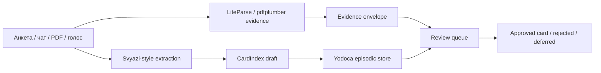
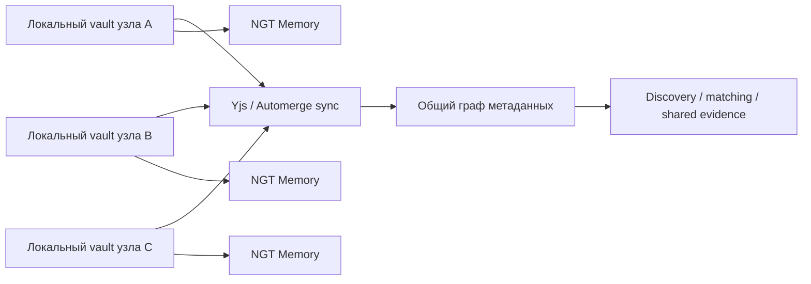

# Продолжение исследования для Svyazi 2.0

## Что это продолжение добавляет

Предыдущая карта уже показала, что вокруг entity["organization","Хабр","tech media"] и entity["company","GitHub","software hosting"] сложился почти полный software-first конструктор для Svyazi‑2.0: ingest, memory, forensic RAG, orchestration, security и budget routing. Следующий полезный шаг — не расширять список проектов бесконечно, а уточнить **где именно находится архитектурная ценность**, какие сочетания уже можно прототипировать без переписывания половины стека, какие интерфейсы надо стандартизировать сразу, и какие связки пока лучше не собирать в один релиз. Это продолжение поэтому сосредоточено на трёх вещах: архитектурных зазорах, новых ансамблях следующего шага и практическом интеграционном контракте между слоями. citeturn41search0turn33view2turn33view4turn22view4turn21view0turn20view5turn20view10turn39view1

Главный дополнительный вывод такой: из уже найденных компонентов лучше всего складывается не просто “система матчей между людьми”, а **доказуемая community intelligence platform**. В ней Svyazi‑подобный CardIndex становится не только профилем участника, но и унифицированной карточкой для проекта, эпизода, документа, обсуждения, гипотезы и action item; forensic RAG превращает любой вывод в проверяемое evidence pack; memory‑слой усиливает слабые сигналы и гасит шум; а многоагентный контур перестаёт быть “кодогенерацией” и начинает работать как модератор, аналитик и исследователь поверх общего графа. Это уже другой класс системы, чем исходный “парсер анкет”, хотя он наследует ту же базовую логику LLM → нормализация → индекс/карточка → discovery. citeturn41search0turn20view5turn20view6turn34view3turn22view4turn21view0turn20view2turn20view3

## Архитектурные зазоры, которые важнее новых инструментов

После первичного обзора видно, что дефицит уже не в наличии компонентов, а в **стыках между ними**. Svyazi хорошо закрывает ingest и нормализацию; AgentFS даёт `.agentos` и compile‑to‑runtime политику; knowledge-space формирует agent‑readable reference cards; NGT Memory и Yodoca решают разные режимы памяти; research-docs/LiteParse и Legal RAG решают доказуемость; LiteLLM, Auto AI Router и Tool Search — execution plane; SENTINEL и path‑guard практики — безопасность. Но именно на переходах “card ↔ memory”, “memory ↔ evidence”, “evidence ↔ review”, “review ↔ agent execution” сегодня остаётся больше всего архитектурного риска. citeturn41search0turn27view0turn33view2turn22view4turn21view0turn20view5turn20view6turn39view0turn39view1turn20view10

В практическом смысле есть пять зазоров, которые стоит считать приоритетнее поиска ещё десяти новых инструментов. Во‑первых, нужен **единый тип карточки**, который умеет хранить и “человека”, и “проект”, и “эпизод”, и “документ”, и “слабую гипотезу”. Во‑вторых, нужен **evidence envelope**: стандарт, по которому любой вывод системы можно обратно привязать к странице, координате, фрагменту текста или истории изменения. В‑третьих, нужен **memory governance layer**, который не даёт ассоциативной памяти записывать предлагаемое как истинное. В‑четвёртых, нужен **agent contract layer**, где навыки, маршрутизация и права оформлены как исполнимые правила, а не как размазанные инструкции по разным файлам. В‑пятых, нужен **review protocol**, который отделяет “обнаружено системой” от “принято в индекс сообщества” или “использовано во внешнем отчёте”. Каждый из этих зазоров уже частично покрыт найденными решениями, но не целиком одной системой. citeturn41search0turn20view5turn20view6turn22view4turn21view0turn20view16turn27view0turn20view3turn20view11

Ниже — концентрированная таблица именно по архитектурным зазорам, а не по самим проектам.

| Архитектурный зазор | Уже сильные кандидаты | Что в них уже хорошо закрыто | Что пока остаётся незакрытым | Что брать в MVP |
|---|---|---|---|---|
| Карточка как единица правды | Svyazi, AgentFS | CardIndex, hash/dedup, versionable vault, persistent state | Универсальная типизация для person/project/doc/episode/hypothesis | Card schema + raw/inferred split + immutable IDs citeturn41search0turn27view0turn33view4 |
| Доказуемое основание вывода | research-docs/LiteParse, Legal RAG, Hybrid RAG | Bounding boxes, page-level grounding, coordinates, transparent retrieval | Единый формат “evidence pack” между retrieval и интерфейсом | Page-level viewer + source_id/page/span/box schema citeturn20view5turn20view6turn34view2 |
| Память с контролируемым статусом | NGT Memory, Yodoca, agent-memory-mcp, Memory OS | Associative retrieval, consolidation, forgetting, typed memory, guard rails | Чёткая граница truth/proposal/conflict/decayed | Pending queue + confidence/state machine на наполнение графа citeturn22view4turn21view0turn20view16turn39view3 |
| Оркестрация и review | mclaude, AI Factory, Rufler, Sequential | Locks, mailbox, patch learning, YAML swarm, sequential review | Стандарт handoff для non-code workflow и knowledge moderation | 2–3 роли: extractor → reviewer → publisher citeturn20view2turn20view3turn20view4turn20view11 |
| Безопасный execution plane | LiteLLM, Auto AI Router, Tool Search, SENTINEL | Unified API, lightweight routing, lazy tool loading, runtime guard | Общая policy matrix на tool classes и external skills | Read-only by default + write approval + path allowlist citeturn11search2turn39view0turn39view1turn20view10turn20view16 |

Из этого следует важный практический принцип: **Svyazi‑2.0 нужно начинать не с “самой умной модели”, а с самой строгой структуры переходов между слоями**. Сильная модель без карточного статуса, evidence envelope и review protocol быстро превращает систему в красивый, но плохо аудитируемый генератор гипотез. Наоборот, даже средний model tier даёт много пользы, если extract/normalize/review/evidence и memory status already pinned. Это согласуется и с Svyazi‑подходом к CardIndex и privacy by design, и с Memory OS‑критикой “thoughtful but schema-breaking reasoning”, и с Legal RAG‑подходом к page‑level доказуемости. citeturn41search0turn39view3turn20view6turn20view18

## Новые ансамбли следующего шага

Самые интересные продолжения — не просто добавление ещё одного инструмента в уже найденные пять ансамблей, а сборка **трёх новых ансамблей второго порядка**, где компоненты перестают быть “рядами функций” и начинают образовывать новые свойства на уровне процесса сообщества, исследовательской группы или прототипной фабрики.

Первый такой ансамбль — **Evidence‑Backed Community Intake**. Его цель не в том, чтобы искать коллаборации по уже готовым карточкам, а в том, чтобы превращать хаотичный входящий поток — анкеты, чаты, PDF‑документы, заметки после созвонов, голосовые эпизоды — в нормализованный поток карточек с подтверждаемыми основаниями и review‑очередью. Здесь Svyazi даёт extraction и CardIndex, LiteParse/Hybrid RAG — evidence‑слой, Self‑Aware MCP — контекст времени и среды, а Yodoca — консолидатор для “сырых эпизодов”, которые не должны сразу попадать в долгоживущую истину. Это превращает intake‑контур в нечто вроде “редакции сигналов”, а не только “парсера профилей”. citeturn41search0turn20view5turn34view2turn20view12turn21view0

Новые свойства этого ансамбля состоят в том, что система начинает различать **достоверное, предположительное и просто свежее**. Для сообществ и коллабораций это критически важно: некоторые сигналы должны жить как “видели это в разговоре”, а не как “подтверждённый навык или проектная роль”. Без такого режима memory‑слой слишком быстро переходит от полезной ассоциации к плохому структурному слуху. Эту разницу прямо поддерживают и Svyazi через `raw`/`inferred`‑мышление, и Yodoca через conservative consolidator, и forensic RAG через доказуемую привязку к источнику. citeturn41search0turn21view0turn20view5turn20view6

Второй ансамбль — **Federated Local‑First Community Graph**. Здесь главный эффект даёт не одна новая функция, а изменение формы владения системой. AgentFS даёт vault‑ядро, Yjs/Automerge — conflict‑free local‑first sync, NGT Memory — очень быстрый ассоциативный слой, Self‑Aware MCP — contextual tools, а budget/security plane — периметр. Из этих частей получается не просто одна база знаний на одном ноутбуке, а сеть локальных узлов, которые умеют синхронизировать часть структуры без навязывания полного централизованного облака. На этом уровне Svyazi‑2.0 превращается из single-operator инструмента в community infrastructure, где узлы могут быть персональными, командными или тематическими. citeturn27view0turn11search0turn11search11turn22view4turn20view12turn39view0turn20view10

Главное новое свойство здесь — **не только privacy, но и архитектурная живучесть**. Когда профиль, заметка, эпизод и документ существуют локально, а наружу синхронизируется только та часть структуры, которую сообщество хочет шарить, появляется новый класс возможных сценариев: приватные персональные слои, полуобщие тематические слои и публичный discovery‑индекс. Это намного лучше соответствует задачам экспертных сообществ, чем either/or‑выбор между “всё в облако” и “всё только локально”. Технически такую форму владения поддерживают local‑first движки и файловые агентные слои; смысловое усиление даёт NGT‑style associative memory поверх разделённого пространства. citeturn11search11turn27view0turn22view4

Третий ансамбль — **Research‑to‑Product Flywheel**. Предыдущая версия отчёта уже показывала, что AI Factory, mclaude, Rufler, Skills и AutoResearch хорошо смотрятся как build‑контур. Но следующий шаг интереснее: knowledge-space становится не просто хранилищем знаний, а приёмником результатов ночных исследований; CodeWiki и Skills превращают эти результаты в переносимую агентную компетенцию; а AutoResearch и Sequential работают не только по коду, но и по prompts, card policies, evidence scoring и quality thresholds. Это делает Svyazi‑2.0 не просто продуктом, а системой, которая сама постепенно улучшает собственные правила интерпретации и модерации. citeturn33view2turn20view15turn12search2turn20view2turn20view3turn20view4turn20view19turn20view11

Здесь появляется новое свойство, которого нет у большинства “умных CRM” и “matching‑ботов”: **изменение качества системы становится повторяемым артефактом**. Ошибка не заканчивается “мы поправили prompt”, а порождает новый card pattern, skill patch, regression test или benchmark case. С этой точки зрения knowledge-space и AI Factory особенно комплементарны: один умеет хранить уже осмысленные reference‑карты и gotchas, другой — эволюционно перерабатывать практические ошибки в навыки и workflow‑правила. citeturn33view2turn20view3turn29search0

## Интеграционный контракт, который стоит зафиксировать сразу

Чтобы все эти ансамбли не рассыпались, полезно зафиксировать **минимальный интерфейсный контракт** между слоями. Это не заменяет будущую реализацию, но резко уменьшает риск того, что через две недели появятся три несовместимые сущности с названием “карточка”, два разных формата evidence и четыре несовместимых местоположения памяти.

Первый контракт — **Card Envelope**. У каждой карточки должен быть неизменяемый `card_id`, `card_type`, статус `raw | normalized | inferred | approved | rejected | decayed`, список source links, список relation edges, временные метки и хэш полезной нагрузки. Эта структура логически следует из CardIndex‑мышления Svyazi, immutable/event‑style практик AgentFS и Memory OS, а также из необходимости разводить truth и proposal в memory‑системах. Это не “идеальная онтология”, а минимальный договор, который позволяет системам вообще разговаривать между собой. citeturn41search0turn27view0turn39view3turn20view16

Второй контракт — **Evidence Envelope**. Любой retrieval‑ответ, match suggestion, profile enrichment или auto‑summary должен возвращать не только текст, но и `source_id`, `page`, `span`, `box`, `retrieval_method`, `confidence`, `supporting_nodes`. Для документов это page+box; для чатов и заметок — message/thread/time span; для голосовых эпизодов — timestamp window; для ассоциативных выводов — список triggered nodes и path explanation. Это прямой синтез из LiteParse/research-docs, Legal RAG, Hybrid RAG и Graph RAG. Без такого формата нельзя построить ни нормальную ручную модерацию, ни “объяснение рекомендации”. citeturn20view5turn20view6turn34view2turn34view3

Третий контракт — **Memory Write Policy**. Система должна различать хотя бы четыре режима записи: `episode` для сырых наблюдений, `fact` для подтверждённого знания, `proposal` для гипотез и `decay_event` для понижения значимости. Yodoca уже мыслит память через consolidation + forgetting, NGT Memory — через ассоциативные связи и иерархическую консолидацию, agent-memory-mcp — через typed memory primitives, а Memory OS — через bi‑temporal и provenance‑heavy представление знаний. Из этих линий следует, что “записать что-то в память” никогда не должно быть одной неразличимой операцией. citeturn21view0turn22view4turn20view16turn39view3

Четвёртый контракт — **Skill and Tool Policy**. Каждый skill или MCP‑инструмент должен иметь класс доступа, класс среды, условия вызова и postcondition. Простейшее разбиение: `read`, `annotate`, `plan`, `mutate`, `publish`, `external_send`. Это дополняет Tool Search, который экономит контекст, но сам по себе не задаёт governance; LiteLLM и Auto AI Router, которые управляют провайдерами, но не правами; и SENTINEL, который контролирует угрозы, но выигрывает от того, что политика уже структурирована, а не размазана по промптам. citeturn39view1turn11search2turn39view0turn20view10

Ниже — упрощённая интеграционная спецификация, которую реально можно внедрить в MVP без чрезмерной формализации.

| Контракт | Минимальные поля | Зачем нужен в MVP | На какие идеи опирается |
|---|---|---|---|
| Card Envelope | `card_id`, `card_type`, `state`, `sources`, `edges`, `updated_at`, `payload_hash` | Единый source of truth и dedup/version trace | Svyazi, AgentFS, Memory OS citeturn41search0turn27view0turn39view3 |
| Evidence Envelope | `source_id`, `page_or_span`, `bbox_or_offset`, `method`, `confidence`, `supporting_nodes` | Проверяемость выводов и ручной review | LiteParse, Legal RAG, Hybrid/Graph RAG citeturn20view5turn20view6turn34view2turn34view3 |
| Memory Write Policy | `write_type`, `promotion_rule`, `review_required`, `decay_policy` | Развести факт, эпизод и гипотезу | Yodoca, NGT Memory, agent-memory-mcp citeturn21view0turn22view4turn20view16 |
| Skill Policy | `tool_class`, `approval_mode`, `path_scope`, `network_scope`, `output_target` | Снизить blast radius и упростить audit | Tool Search, SENTINEL, AI Factory practices citeturn39view1turn20view10turn29search6 |
| Review Record | `reviewer_role`, `decision`, `reason`, `evidence_refs`, `follow_up` | Не путать machine suggestion с accepted truth | mclaude, AI Factory, Sequential citeturn20view2turn20view3turn20view11 |

## Дорожная карта прототипа следующей итерации

Если идти дальше после базового MVP, то лучшая стратегия — не “добавить всё”, а пройти **три короткие итерации**, каждая из которых поднимает один новый класс свойств. Первая итерация должна закрепить контракт и доказуемость. Вторая — добавить controlled memory и human review. Третья — подключить orchestration и local‑first ingestion. Такой порядок лучше соответствует зрелости уже найденных компонентов и снижает риск, что вы сначала построите красивую агентную фабрику, а потом обнаружите, что утверждения в ней невозможно надёжно проверить. citeturn20view5turn20view6turn21view0turn22view4turn20view2turn20view3

В первой итерации разумно сосредоточиться на **evidence-first card graph**: привести Card Envelope к одному формату, внедрить Evidence Envelope и сделать два типа карточек — `person` и `project`, плюс `episode` как сырой контейнер. В этой фазе память можно держать даже в упрощённом режиме, но без явного evidence‑слоя дальше лучше не идти. Эта фаза даёт уже очень ценный эффект: объяснимые suggestions вместо “магического мэтчинга”. citeturn41search0turn20view5turn34view2turn20view6

Во второй итерации имеет смысл включить **двухуровневую память и review queue**. На практике это означает: episode store, proposal queue, approved facts, plus decay/archival path. Тут нужно решить прежде всего не “какая память умнее”, а “какая licence/policy лучше подходит”. Если нужен максимально permissive и понятный старт, Yodoca‑style паттерн и typed memory выглядят безопаснее; если важнее предельно быстрый ассоциативный matching, NGT Memory выглядит сильнее, но его BSL‑режим уже требует аккуратной проверки коммерческих планов. Это не недостаток одного проекта, а просто лицензионная развилка, которую лучше признать заранее. citeturn21view0turn22view5turn20view16

В третьей итерации стоит включать **orchestration and federation**: mclaude или AI Factory на moderation/build side, plus local‑first voice intake и CRDT sync для мультидевайсности. Именно здесь Svyazi‑2.0 перестаёт быть одиночным инструментом исследователя и становится системой для маленькой команды или сообщества. Но делать это раньше, чем специфицированы card/evidence/memory policies, невыгодно: рой агентов лишь ускорит накопление неструктурированного долга. citeturn20view2turn20view3turn21view10turn11search11

Ниже — практичная дорожная карта на короткий цикл, если продолжать от уже описанного MVP.

| Итерация | Главная цель | Минимум, который должен заработать | Оценка усилий | Главный риск |
|---|---|---|---|---|
| Evidence-first core | Из любого suggestions можно перейти к основанию | Unified cards + page/span evidence + manual reviewer UI | 1–2 недели | Переусложнение схемы слишком рано |
| Memory governance | Ассоциации перестают путаться с фактами | Episode store + proposal queue + approval/decay states | 1–2 недели | Ложная уверенность в “умной памяти” без жёсткого review |
| Agented moderation | Рой помогает, а не создаёт шум | extractor/reviewer/publisher roles + handoff/journal | 1–2 недели | Многоагентный хаос без хороших критериев качества |
| Local-first ingestion | Система начинает жить в ежедневном потоке | voice→episode, local vault, selective sync | 1–2 недели | Sync-конфликты и таскание лишних данных наружу |
| Self-improvement loop | Ошибки превращаются в benchmark и patch | benchmark set + nightly eval + rollback policy | 1 неделя на каркас, дальше непрерывно | Большой соблазн автоматизировать раньше, чем появилась метрика |

Эта дорожная карта остаётся реалистичной именно потому, что почти каждый слой уже имеет сильный референс в найденных источниках. Самая большая инженерная работа здесь — **не реализация низкоуровневых библиотек, а проектирование статусов, границ и ручных переходов**. Это хорошая новость: такую архитектуру можно собрать без огромной команды, если с самого начала дисциплинировать стыки. citeturn41search0turn27view0turn21view0turn20view5turn20view2turn39view1

## Контактная стратегия и узкие вопросы для авторов

С практической точки зрения следующие письма или комментарии лучше строить не вокруг общей фразы “давайте сделаем Svyazi‑2.0”, а вокруг **одного конкретного шва**, который автор уже хорошо понимает. У каждого сильного кандидата стоит просить не участие “во всём проекте”, а реакцию на один архитектурный вопрос. Это резко повышает шанс содержательного ответа и уменьшает ощущение, что человеку предлагают стать бесплатным сооснователем чужой интеграции. Такой стиль особенно естественен для Хабр‑комментариев и открытых issue‑трекеров. citeturn41search0turn33view2turn27view0turn21view0turn22view4

Самый логичный первый контакт — **entity["people","Андрей Чуян","habr author"]**, потому что именно у него уже есть работающий кейс карт коллабораций и CardIndex‑мышление. Но вопрос ему лучше задавать не “готовы ли вы сотрудничать”, а, например: *если бы CardIndex стал хранить не только профиль человека, но и project card / episode card / evidence card, вы бы расширяли текущую схему или держали бы отдельные индексы?* Такой вопрос уважает его уже проделанную архитектурную работу и попадает в реальную техническую развилку. citeturn41search0

Второй сильный адресат — **entity["people","Виталий Оборин","software engineer"]** вокруг Yodoca. Ему лучше задавать вопрос о memory write policy и conservative consolidation: *что в вашей архитектуре оказалось критичнее для качества — отдельный private consolidator, decay или строгий раздел episode/fact?* Это полезнее, чем спрашивать “можно ли к вам прикрутить community graph”, потому что именно в политике перехода между памятью и фактом лежит его уникальная экспертиза. citeturn21view0turn21view1turn18search1

Третий потенциально самый ценный разговор — с **kksudo** по AgentFS, хотя публичный прямой контакт в просмотренных материалах не просматривается. Вопрос наилучшего качества здесь звучит так: *если `.agentos` должен стать каноническим ядром для сообщества, где есть и люди, и проекты, и review‑очереди, что вы считаете более правильным — расширять vault conventions или держать отдельный kernel namespace для machine-only state?* Такой вопрос бьёт ровно в центр AgentFS‑идеи compile‑to‑runtime и persistent state. citeturn33view4turn33view7turn27view0

Четвёртый узкий и перспективный адресат — **spbmolot** по NGT Memory. Наилучший вопрос: *где практика показывает границу между полезным Hebbian recall и ложной тематической ко‑активацией, если память используется не для личного ассистента, а для коллаборационного discovery между людьми и проектами?* Этот вопрос важнее, чем просто обсуждение latency, потому что главная ценность NGT тут не в миллисекундах, а в характере ассоциативных маршрутов. citeturn22view4turn22view5turn32search2

Пятый разговор имеет смысл вести с авторами knowledge-space и mclaude, потому что именно здесь хорошо сходятся agent‑readable knowledge এবং multi‑session coordination. Формулировка вопроса может быть такой: *если knowledge-space становится не просто reference base, а живым review‑слоем для системных ошибок и спорных матчей, вы бы держали это как dense cards в одной базе или отделяли “benchmarks/gotchas” от “операционной памяти” строго на уровне директорий и типов?* Это полезный, конкретный и хорошо мотивированный стык между knowledge-space, mclaude и AI Factory. citeturn33view2turn20view2turn37search0turn20view3

Чтобы не перегружать первые обращения, ниже — более короткие шаблоны на один вопрос.

| Кому | Лучший первый вопрос | Почему именно он |
|---|---|---|
| entity["people","Андрей Чуян","habr author"] | Стоит ли расширять CardIndex до `person/project/episode/evidence`, или для discovery и moderation лучше держать разные индексы? | Это продолжает его реальную архитектурную линию, а не уводит в абстракцию. citeturn41search0 |
| **kksudo** | Что лучше класть в `.agentos`, а что выносить в machine-only state вне vault conventions? | Это вопрос в сердце AgentFS, а не общая просьба о сотрудничестве. citeturn27view0turn33view4 |
| entity["people","Виталий Оборин","software engineer"] | Что сильнее всего влияет на качество памяти: отдельный consolidator, decay или строгая типизация записей? | Это позволяет использовать Yodoca как policy reference, а не как “ещё один ассистент”. citeturn21view0turn21view1 |
| **spbmolot** | Где проходит практическая граница между полезной ассоциацией и ложной ко‑активацией тем? | Это самый важный вопрос для community matching. citeturn22view4turn22view5 |
| **авторы knowledge-space / mclaude** | Держать операционные benchmark/gotcha cards в одной базе с reference cards или отдельным слоем? | Это шов между памятью, знаниями и orchestration. citeturn33view2turn20view2 |

## Ограничения, лицензии и что пока лучше не склеивать

Самое важное ограничение не техническое, а управленческое: часть самых ценных компонентов находится в разных режимах зрелости и лицензирования. Svyazi как базовый паттерн остаётся авторским закрытым прототипом в просмотренных материалах, NGT Memory использует BSL 1.1 и прямо говорит о бесплатности для личных проектов, а по ряду других систем лицензия в просмотренных источниках либо не акцентирована, либо требует проверки уже на стороне репозитория и бизнес‑сценария. Это означает, что для коммерчески чувствительного стека ранний выбор memory‑слоя — не только инженерный, но и лицензионный. citeturn41search0turn22view5turn18search1turn15search3

Второе ограничение относится к оркестрации. Хотя mclaude, AI Factory, Rufler и Sequential выглядят очень привлекательно, их не стоит собирать все сразу в один контур. mclaude хорошо решает синхронизацию нескольких сессий; AI Factory — spec/pipeline/patch evolution; Rufler — YAML‑рой; Sequential — reviewer‑логика. Если попытаться включить все четыре слоя одновременно до стабилизации card/evidence contracts, получится “очень умный операционный шум”. Поэтому на ранней стадии разумнее выбрать **один основной orchestration spine** и один review pattern, а не строить суперкомбайн. citeturn20view2turn20view3turn20view4turn20view11

Третье ограничение касается voice/local‑first mesh. Голосовой вход очень соблазнительно добавляет “живую ткань” системы, но именно здесь легко утонуть в необязательной инженерии: streaming transcription, diarization, semantic post‑processing, multi-device sync, offline UX, conflict resolution. Для первой публично полезной версии достаточно не “идеальной диктовки”, а простого и надёжного пути `voice → episode card → review`. Всё, что дальше, лучше добавлять после того, как уже появилась ценность от графа, evidence и review. Такой порядок согласуется и с Yttri‑подходом к workspace вокруг записей, и с простыми локальными whisper‑сценариями, и с идеей local-first sync как следующего, а не первого слоя сложности. citeturn21view10turn21view11turn35search0turn11search11

Последняя развилка — это уровень “самоулучшения”. AutoResearch и Sequential выглядят очень мощно, но только после того, как появилась **метрика качества**, benchmark set и отчетливое понимание, что считать регрессией. До этого автоматическая оптимизация будет скорее производить вариации, чем устойчивые улучшения. Поэтому self-improvement контур разумно активировать только тогда, когда вы уже можете померить quality of match, quality of evidence и false positive rate по review‑очереди. Это не консерватизм, а инженерная трезвость, полностью согласующаяся с духом AutoResearch — “изменяй только то, что умеешь измерить и откатывать”. citeturn20view19turn20view11turn20view6

Итоговое продолжение therefore выглядит так. Лучший следующий шаг — **не искать ещё двадцать новых проектов**, а собрать второй, более строгий слой поверх уже найденных: Card Envelope, Evidence Envelope, Memory Write Policy, Skill Policy и Review Record. На этом основании уже можно по‑настоящему проверить, превращается ли набор “скромных” pet‑проектов с Хабра в новую систему свойств — discovery, explainability, local ownership, controlled memory и cheap/safe execution. Если этот слой заработает, тогда уже есть смысл возвращаться к расширению ансамблей в сторону federation, richer voice UX и self-improving research loop. citeturn41search0turn27view0turn20view5turn21view0turn39view1turn20view10