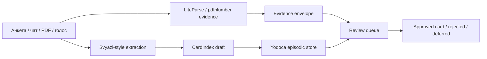
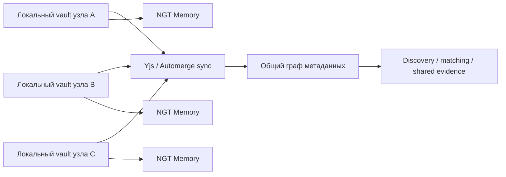
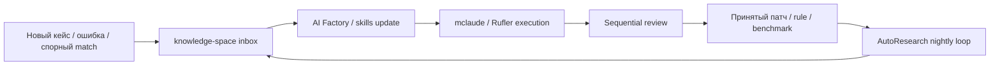

<!-- summary -->
> Самые интересные продолжения — не просто добавление ещё одного инструмента в уже найденные пять ансамблей, а сборка **трёх новых ансамблей второго порядка**, где компоненты перестают быть “рядами функ
**Проекты:** Svyazi, CardIndex, AgentFS, knowledge-space, mclaude, AI Factory, Rufler, LiteParse

---
<!-- tags: memory, rag, orchestration, knowledge, ingestion, local-first, architecture, roadmap, self-improve, collaboration -->

## Новые ансамбли следующего шага

Самые интересные продолжения — не просто добавление ещё одного инструмента в уже найденные пять ансамблей, а сборка **трёх новых ансамблей второго порядка**, где компоненты перестают быть “рядами функций” и начинают образовывать новые свойства на уровне процесса сообщества, исследовательской группы или прототипной фабрики.

Первый такой ансамбль — **Evidence‑Backed Community Intake**. Его цель не в том, чтобы искать коллаборации по уже готовым карточкам, а в том, чтобы превращать хаотичный входящий поток — анкеты, чаты, PDF‑документы, заметки после созвонов, голосовые эпизоды — в нормализованный поток карточек с подтверждаемыми основаниями и review‑очередью. Здесь Svyazi даёт extraction и CardIndex, LiteParse/Hybrid RAG — evidence‑слой, Self‑Aware MCP — контекст времени и среды, а Yodoca — консолидатор для “сырых эпизодов”, которые не должны сразу попадать в долгоживущую истину. Это превращает intake‑контур в нечто вроде “редакции сигналов”, а не только “парсера профилей”. citeturn41search0turn20view5turn34view2turn20view12turn21view0

Новые свойства этого ансамбля состоят в том, что система начинает различать **достоверное, предположительное и просто свежее**. Для сообществ и коллабораций это критически важно: некоторые сигналы должны жить как “видели это в разговоре”, а не как “подтверждённый навык или проектная роль”. Без такого режима memory‑слой слишком быстро переходит от полезной ассоциации к плохому структурному слуху. Эту разницу прямо поддерживают и Svyazi через `raw`/`inferred`‑мышление, и Yodoca через conservative consolidator, и forensic RAG через доказуемую привязку к источнику. citeturn41search0turn21view0turn20view5turn20view6

Второй ансамбль — **Federated Local‑First Community Graph**. Здесь главный эффект даёт не одна новая функция, а изменение формы владения системой. AgentFS даёт vault‑ядро, Yjs/Automerge — conflict‑free local‑first sync, NGT Memory — очень быстрый ассоциативный слой, Self‑Aware MCP — contextual tools, а budget/security plane — периметр. Из этих частей получается не просто одна база знаний на одном ноутбуке, а сеть локальных узлов, которые умеют синхронизировать часть структуры без навязывания полного централизованного облака. На этом уровне Svyazi‑2.0 превращается из single-operator инструмента в community infrastructure, где узлы могут быть персональными, командными или тематическими. citeturn27view0turn11search0turn11search11turn22view4turn20view12turn39view0turn20view10

Главное новое свойство здесь — **не только privacy, но и архитектурная живучесть**. Когда профиль, заметка, эпизод и документ существуют локально, а наружу синхронизируется только та часть структуры, которую сообщество хочет шарить, появляется новый класс возможных сценариев: приватные персональные слои, полуобщие тематические слои и публичный discovery‑индекс. Это намного лучше соответствует задачам экспертных сообществ, чем either/or‑выбор между “всё в облако” и “всё только локально”. Технически такую форму владения поддерживают local‑first движки и файловые агентные слои; смысловое усиление даёт NGT‑style associative memory поверх разделённого пространства. citeturn11search11turn27view0turn22view4

Третий ансамбль — **Research‑to‑Product Flywheel**. Предыдущая версия отчёта уже показывала, что AI Factory, mclaude, Rufler, Skills и AutoResearch хорошо смотрятся как build‑контур. Но следующий шаг интереснее: knowledge-space становится не просто хранилищем знаний, а приёмником результатов ночных исследований; CodeWiki и Skills превращают эти результаты в переносимую агентную компетенцию; а AutoResearch и Sequential работают не только по коду, но и по prompts, card policies, evidence scoring и quality thresholds. Это делает Svyazi‑2.0 не просто продуктом, а системой, которая сама постепенно улучшает собственные правила интерпретации и модерации. citeturn33view2turn20view15turn12search2turn20view2turn20view3turn20view4turn20view19turn20view11

Здесь появляется новое свойство, которого нет у большинства “умных CRM” и “matching‑ботов”: **изменение качества системы становится повторяемым артефактом**. Ошибка не заканчивается “мы поправили prompt”, а порождает новый card pattern, skill patch, regression test или benchmark case. С этой точки зрения knowledge-space и AI Factory особенно комплементарны: один умеет хранить уже осмысленные reference‑карты и gotchas, другой — эволюционно перерабатывать практические ошибки в навыки и workflow‑правила. citeturn33view2turn20view3turn29search0
