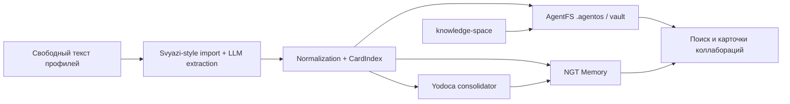
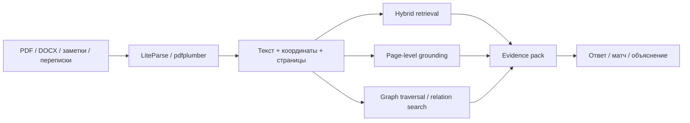
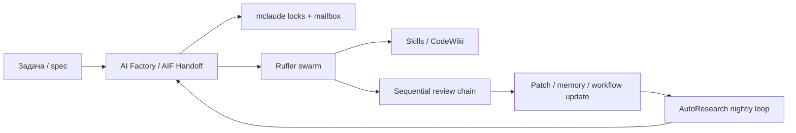
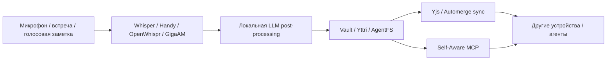
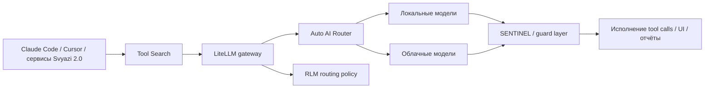
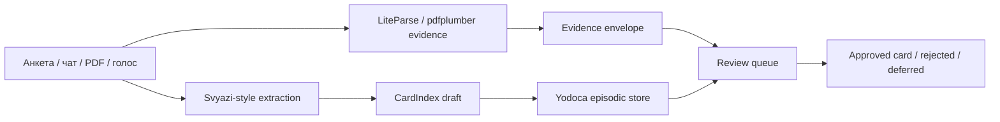
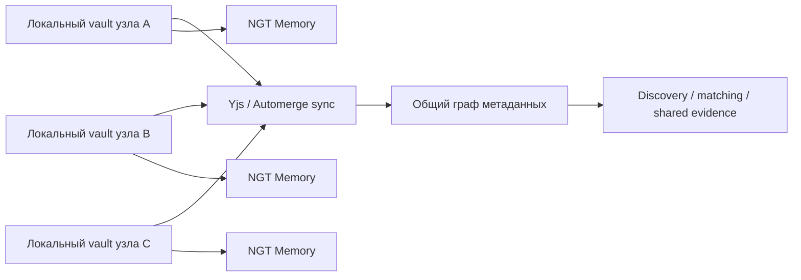
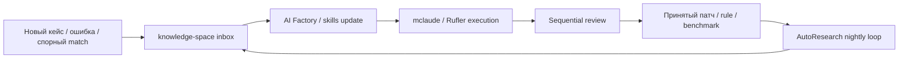

# Code-блоки репозитория

> [!TIP]
> Документ содержит практические рекомендации и лучшие практики.

<!-- alert-added -->

**Всего блоков:** 327

| Язык | Блоков |
|------|--------|
| 📝 Без языка | 174 |
| 💻 Bash / Shell | 37 |
| 🐍 Python | 35 |
| 📦 JSON | 23 |
| 📊 Диаграммы Mermaid | 22 |
| markdown | 21 |
| 📋 YAML | 14 |
| typescript | 1 |

## 📊 Диаграммы Mermaid (22)


### Приоритетные ансамбли
_`docs/01-svyazi/04-ensembles-overview.md` | 10 строк_



### Приоритетные ансамбли
_`docs/01-svyazi/04-ensembles-overview.md` | 10 строк_



### Приоритетные ансамбли
_`docs/01-svyazi/04-ensembles-overview.md` | 9 строк_



### Приоритетные ансамбли
_`docs/01-svyazi/04-ensembles-overview.md` | 8 строк_



### Приоритетные ансамбли
_`docs/01-svyazi/04-ensembles-overview.md` | 10 строк_



### Новые ансамбли следующего шага
_`docs/01-svyazi/10-second-order-ensembles.md` | 9 строк_



### Новые ансамбли следующего шага
_`docs/01-svyazi/10-second-order-ensembles.md` | 9 строк_



### Новые ансамбли следующего шага
_`docs/01-svyazi/10-second-order-ensembles.md` | 8 строк_



### Диаграмма
_`docs/CONCEPT_GRAPH.md` | 101 строк_

```mermaid
graph TD
    docs["docs\n(995)"]
    anthropic["anthropic\n(791)"]
    claude["claude\n(502)"]
    summary["summary\n(497)"]
    vacancies["vacancies\n(474)"]
    источник["источник\n(467)"]
    mhtml["mhtml\n(412)"]
    снимок["снимок\n(400)"]
    репозитория("репозитория\n(387)")
    корень["корень\n(377)"]
    agent{{"agent\n(358)"}}
    tags["tags\n(353)"]
    nautilus["nautilus\n(322)"]
    раздел["раздел\n(310)"]
    вакансии["вакансии\n(305)"]
    кластерам["кластерам\n(295)"]
    диалога["диалога\n(269)"]
    svyazi("svyazi\n(251)")
    knowledge["knowledge\n(244)"]
    architecture["architecture\n(236)"]
    сходство["сходство\n(235)"]
    memory[("memory\n(192)")]
    collaboration["collaboration\n(189)"]
    habr["habr\n(166)"]
    layer[/"layer\n(159)"/]
    work["work\n(158)"]
# ... (обрезано)
```

### Граф связей
_`docs/CROSS_SECTION.md` | 22 строк_

```mermaid
graph LR
    01_svyazi["Svyazi 2.0"]
    02_anthropic_vacancies["Anthropic"]
    03_technology_combinations["Технологии"]
    04_ai_collaborations["AI-ансамбли"]
    05_habr_projects["Хабр-проекты"]
    contacts["Контакты"]
    01_svyazi -- 9% --> 02_anthropic_vacancies
    01_svyazi -- 16% --> 03_technology_combinations
    01_svyazi -- 94% --> 04_ai_collaborations
    01_svyazi -- 19% --> 05_habr_projects
    01_svyazi -- 7% --> contacts
    02_anthropic_vacancies -- 22% --> 03_technology_combinations
    02_anthropic_vacancies -- 16% --> 04_ai_collaborations
    02_anthropic_vacancies -- 23% --> 05_habr_projects
    02_anthropic_vacancies -- 7% --> contacts
    03_technology_combinations -- 28% --> 04_ai_collaborations
    03_technology_combinations -- 42% --> 05_habr_projects
    03_te
# ... (обрезано)
```

### Схема
_`docs/svyazi-2-0/ensembles/A-collaboration-os.md` | 10 строк_


### Схема
_`docs/svyazi-2-0/ensembles/B-forensic-rag.md` | 10 строк_


### Схема
_`docs/svyazi-2-0/ensembles/C-multi-agent-factory.md` | 9 строк_


### Схема
_`docs/svyazi-2-0/ensembles/D-voice-first-mesh.md` | 8 строк_


### Схема
_`docs/svyazi-2-0/ensembles/E-execution-plane.md` | 10 строк_


_...и ещё 7 блоков этого языка_

## 🐍 Python (35)


### portal-mcp.py
_`docs/02-anthropic-vacancies/123-portal-mcp-py.md` | 702 строк_

```python
"""
Nautilus Portal MCP Wrapper
============================

Exposes Nautilus Portal as Model Context Protocol tools for LLM clients
(Claude Desktop, Cursor, etc).

MCP Tools Exposed:
- nautilus_query: Search across ecosystem with consensus awareness
- nautilus_query_repo: Search a single repository by name
- nautilus_list_repos: List all registered repositories with metadata
- nautilus_consensus_check: Validate concept agreement across repos
- nautilus_describe: Ecosystem philosophy, version, adapters overview
- nautilus_q6_neighbors: Find Q6-adjacent concepts by Hamming distance
- nautilus_health: Get ecosystem health score (0-100)

Protocol: Nautilus Portal Protocol v1.1
Dependencies: mcp>=1.0.0 (only external dep)
Python: 3.10+

Install:
    pip install mcp>=1.0.0

Run (stdio mode, fo
# ... (обрезано)
```

### 6.1. BaseAdapter Contract
_`docs/02-anthropic-vacancies/18-6-adapter-interface.md` | 16 строк_

```python
class BaseAdapter:
    name: str
    repo_path: str  # local path или git URL
    
    def describe(self) -> dict:
        """Level 1+: return metadata about the repo."""
        ...
    
    def fetch(self, query: str) -> list[PortalEntry]:
        """Level 2+: search the repo, return unified entries."""
        ...
    
    def translate_to(self, entry: "PortalEntry", 
                     target_repo: str) -> str | None:
        """Level 3: translate entry to another repo's native concept."""
        return None
```

### 6.2. `describe()` — Required for Level 1+
_`docs/02-anthropic-vacancies/18-6-adapter-interface.md` | 8 строк_

```python
{
    "name": str,                    # совпадает с self.name
    "format": str,                  # native format identifier
    "total_entries": int | None,    # сколько записей всего
    "last_updated": str | None,     # ISO 8601 timestamp
    "topics": list[str],            # ключевые темы
    "bridges": dict[str, str]       # копия из nautilus.json bridges
}
```

### 7. PortalEntry Structure
_`docs/02-anthropic-vacancies/19-7-portalentry-structure.md` | 10 строк_

```python
class PortalEntry:
    repo_name: str           # REQUIRED: откуда пришло
    native_id: str           # REQUIRED: id в native формате
    title: str               # REQUIRED: человекочитаемое имя
    summary: str             # REQUIRED: до 280 символов
    content: str             # REQUIRED: полный текст
    tags: list[str]          # OPTIONAL: ключевые слова
    confidence: float        # OPTIONAL: 0.0–1.0, default 1.0
    native_metadata: dict    # OPTIONAL: любые native-специфичные поля
    url: str | None          # OPTIONAL: прямая ссылка на источник
```

### 10. QueryResult Structure
_`docs/02-anthropic-vacancies/22-10-queryresult-structure.md` | 8 строк_

```python
class QueryResult:
    query: str
    results_by_repo: dict[str, list[PortalEntry]]
    consensus: Consensus
    total_entries: int
    repos_queried: list[str]
    errors: dict[str, str]        # repo_name → error message
    timing: dict[str, float]      # repo_name → seconds elapsed
```

### A.2. Minimal Adapter
_`docs/02-anthropic-vacancies/28-appendix-a-minimal-working-example.md` | 36 строк_

```python
from pathlib import Path
from base import BaseAdapter, PortalEntry


class MyNotesAdapter(BaseAdapter):
    name = "my_notes"
    
    def __init__(self, repo_path):
        self.repo_path = Path(repo_path)
    
    def describe(self):
        md_files = list(self.repo_path.glob("**/*.md"))
        return {
            "name": self.name,
            "format": ".md",
            "total_entries": len(md_files),
            "topics": []
        }
    
    def fetch(self, query):
        results = []
        for path in self.repo_path.glob("**/*.md"):
            text = path.read_text()
            if query.lower() in text.lower():
                results.append(PortalEntry(
                    repo_name=self.name,
                    native_id=str(path.relative_to(self.repo_path)),
          
# ... (обрезано)
```

### 6.1. BaseAdapter Contract
_`docs/02-anthropic-vacancies/81-6-adapter-interface.md` | 15 строк_

```python
from abc import ABC, abstractmethod
from typing import Any

class BaseAdapter(ABC):
    name: str = "unnamed"
    
    @abstractmethod
    def fetch(self, query: str) -> list["PortalEntry"]:
        """Search the repo, return unified entries. MUST NOT raise."""
        ...
    
    @abstractmethod
    def describe(self) -> dict[str, Any]:
        """Return metadata about the repo."""
        ...
```

### 6.3. `describe()` — Required
_`docs/02-anthropic-vacancies/81-6-adapter-interface.md` | 10 строк_

```python
{
    "repo": str,                    # owner/repo-name
    "format": str,                  # format identifier
    "native_unit": str,             # human description
    "total_items": int | str,       # сколько записей (int или "N+")
    "compatibility": int,           # 0..3
    "q6_key": str | None,           # rule for Q6 mapping, optional
    "bridges": dict[str, str],      # копия из nautilus.json
    "last_updated": str | None      # ISO 8601, optional
}
```

### 7. PortalEntry Structure
_`docs/02-anthropic-vacancies/82-7-portalentry-structure.md` | 13 строк_

```python
from dataclasses import dataclass, field
from typing import Any

@dataclass
class PortalEntry:
    id: str                              # REQUIRED: "format:slug"
    title: str                           # REQUIRED: human-readable
    source: str                          # REQUIRED: owner/repo-name
    format_type: str                     # REQUIRED: concept type
    content: str                         # REQUIRED: full text
    metadata: dict[str, Any] = field(default_factory=dict)
    links: list[str] = field(default_factory=list)
    is_fallback: bool = False
```

### 7.2. Q6 Metadata
_`docs/02-anthropic-vacancies/82-7-portalentry-structure.md` | 10 строк_

```python
PortalEntry(
    id="info1:synthesis",
    title="Синтез",
    source="svend4/info1",
    format_type="concept",
    content="...",
    metadata={"q6": "010100", "alpha": 0},
    links=["pro2:q6:010100", "meta:hexagram:20"],
    is_fallback=False
)
```

### 8.4. Q6-Neighbors (Hamming Distance)
_`docs/02-anthropic-vacancies/83-8-q6-space-normative.md` | 21 строк_

```python
def q6_neighbors(bits: str, max_distance: int) -> list[str]:
    """BFS по 6-битному гиперкубу. Returns all vertices within max_distance."""
    assert len(bits) == 6
    assert all(c in "01" for c in bits)
    
    visited = {bits: 0}
    queue = [bits]
    
    while queue:
        current = queue.pop(0)
        current_dist = visited[current]
        if current_dist >= max_distance:
            continue
        
        for i in range(6):
            neighbor = current[:i] + ("1" if current[i] == "0" else "0") + current[i+1:]
            if neighbor not in visited:
                visited[neighbor] = current_dist + 1
                queue.append(neighbor)
    
    return list(visited.keys())
```

### 9.2. Consensus Structure
_`docs/02-anthropic-vacancies/84-9-consensus-algorithm.md` | 8 строк_

```python
@dataclass
class Consensus:
    present_in: list[str]             # repos с real entries
    present_in_fallback: list[str]    # repos только с fallback
    missing_in: list[str]             # repos без entries
    coverage: float                   # len(present_in) / total_repos
    coverage_with_fallback: float     # включая fallback
    agreed: bool                      # coverage == 1.0
```

### 9.4. Algorithm
_`docs/02-anthropic-vacancies/84-9-consensus-algorithm.md` | 42 строк_

```python
def compute_consensus(
    query: str,
    results_by_repo: dict[str, list[PortalEntry]]
) -> Consensus:
    total_repos = len(results_by_repo)
    
    present_in = []
    present_in_fallback = []
    missing_in = []
    
    for repo_name, entries in results_by_repo.items():
        real_matches = [
            e for e in entries 
            if not e.is_fallback 
            and query_matches(query, e)
        ]
        fallback_matches = [
            e for e in entries
            if e.is_fallback
            and query_matches(query, e)
        ]
        
        if real_matches:
            present_in.append(repo_name)
        elif fallback_matches:
            present_in_fallback.append(repo_name)
        else:
            missing_in.append(repo_name)
    
    coverage = len(present
# ... (обрезано)
```

### 11.1. Scoring Formula
_`docs/02-anthropic-vacancies/86-11-relevance-ranking.md` | 26 строк_

```python
def relevance_score(e: PortalEntry, q: str) -> float:
    score = 0.0
    q_lower = q.lower()
    title_lower = e.title.lower()
    content_lower = e.content.lower()
    id_lower = e.id.lower()
    
    if q_lower == title_lower:
        score += 1.0
    elif q_lower in title_lower:
        score += 0.7
    
    if q_lower in content_lower:
        score += 0.3
    
    if q_lower in id_lower:
        score += 0.4
    
    # Bonus for connectivity
    score += min(len(e.links) * 0.05, 0.2)
    
    # Penalty for fallback
    if e.is_fallback:
        score *= 0.5
    
    return score
```

### 14.1. Required SDK Methods
_`docs/02-anthropic-vacancies/89-14-sdk-contract-informative.md` | 6 строк_

```python
class NautilusClient:
    def __init__(self, base_url: str = "http://localhost:8080"): ...
    
    def query(self, q: str, ranked: bool = True) -> QueryResult: ...
    def describe(self) -> dict: ...
    def health(self) -> HealthReport: ...
```

_...и ещё 20 блоков этого языка_

## 📋 YAML (14)


### Appendix B: Sub-Agent Registry Schema (Sketch)
_`docs/02-anthropic-vacancies/270-appendix-b-sub-agent-registry-schema-sketch.md` | 56 строк_

```yaml
sub_agent:
  id: "sgb-ix-paragraph-78-24-7-assistance"
  name: "SGB IX § 78 Abs. 6 — 24/7 Psychiatric Assistance"
  domain: "german-social-law"
  specialization_path: 
    - "law"
    - "german"
    - "social-law"
    - "sgb-ix"
    - "section-78"
    - "subsection-6"
  scope:
    covers:
      - "Right to 24/7 psychiatric assistance"
      - "Documentation requirements"
      - "Procedural pathways"
      - "Appeal mechanisms"
    does_not_cover:
      - "Other forms of psychiatric care"
      - "Voluntary commitment procedures"
      - "Tax implications"
  knowledge_base:
    primary_sources:
      - "SGB IX § 78"
      - "BSG B 8 SO 9/19 R"
      - "Implementing regulations"
    methodology:
      - "Case-based reasoning"
      - "Statutory interpretation"
      - "Procedural guidance"

# ... (обрезано)
```

### Appendix C: Configuration Template Example
_`docs/02-anthropic-vacancies/271-appendix-c-configuration-template-example.md` | 37 строк_

```yaml
configuration:
  name: "General Disability Rights Advocate (Saxony)"
  description: |
    Starting configuration for advocates working on disability 
    rights cases in Saxony, Germany. Suitable for practitioners 
    handling general SGB IX and SGB XII cases without specific 
    sub-specialization.
  base_profile:
    profession: "legal-advocate"
    sub_specialty: "disability-rights"
    jurisdiction: "germany-saxony"
    languages: ["de", "en"]
  sub_agents:
    foundational:
      - "sgb-ix-general-overview"
      - "sgb-xii-general-overview"
      - "german-procedural-law-basics"
      - "general-legal-drafting-german"
    specialized:
      - "sgb-ix-section-78-eingliederungshilfe"
      - "sgb-ix-personal-budget-procedures"
      - "bsg-precedent-disability-cases"
      - "saxony-
# ... (обрезано)
```

### Appendix C: Sample InGit MCP Server Tool Specifications
_`docs/02-anthropic-vacancies/323-appendix-c-sample-ingit-mcp-server-tool-specificat.md` | 116 строк_

```yaml
tool: ingit_search_wiki
description: |
  Search the InGit Project wiki for relevant content.
  Searches both content and metadata.
parameters:
  query: 
    type: string
    description: Search query
  path_filter:
    type: string
    optional: true
    description: Limit search to subfolder of 80_wiki/
returns:
  type: list
  items:
    path: string
    title: string
    excerpt: string
    metadata: object
    last_modified: datetime

tool: ingit_create_document
description: |
  Create new document in InGit Project following 
  conventions for the document type.
parameters:
  document_type:
    type: enum
    values: [note, report, specification, draft]
  title:
    type: string
  content:
    type: string
  metadata:
    type: object
    description: Additional YAML metadata
  location
# ... (обрезано)
```

### Приложение C: Образец Спецификаций Инструментов InGit MCP Се
_`docs/02-anthropic-vacancies/341-приложение-c-образец-спецификаций-инструментов-ing.md` | 122 строк_

```yaml
tool: ingit_search_wiki
description: |
  Поиск в InGit Project wiki соответствующего
  содержания. Ищет и в содержании, и в
  метаданных.
parameters:
  query: 
    type: string
    description: Поисковый запрос
  path_filter:
    type: string
    optional: true
    description: Ограничить поиск подпапкой
                 80_wiki/
returns:
  type: list
  items:
    path: string
    title: string
    excerpt: string
    metadata: object
    last_modified: datetime

tool: ingit_create_document
description: |
  Создать новый документ в InGit Project,
  следуя конвенциям для типа документа.
parameters:
  document_type:
    type: enum
    values: [note, report, specification, draft]
  title:
    type: string
  content:
    type: string
  metadata:
    type: object
    description: Дополнительные
# ... (обрезано)
```

### Контракт взаимодействия
_`docs/templates/ensemble.md` | 6 строк_

```yaml
input:
  type: [тип входа]
  format: [формат]
output:
  type: [тип выхода]
  format: [формат]
```

### 3. Registry / Discovery
_`docs/templates/protocol-spec.md` | 3 строк_

```yaml
registry:
  url: ...
  version: 1.0
```

### 7. PortalEntry
_`docs/templates/protocol-spec.md` | 6 строк_

```yaml
portal_entry:
  id: uuid
  type: card|document|fragment
  source: ...
  payload: ...
  timestamp: ...
```

### Контракт интеграции
_`docs/templates/tech-pair.md` | 6 строк_

```yaml
A_to_B:
  format: ...
  protocol: ...
B_to_A:
  format: ...
  protocol: ...
```

### 1. Frontmatter (YAML)
_`docs/templates/template-of-templates.md` | 7 строк_

```yaml
---
template: <имя>
version: "1.0"
[обязательные поля для этого типа документа]
created: 2026-04-29
tags: [тег1, тег2]
---
```

### Поле статуса (enum)
_`docs/templates/template-of-templates.md` | 1 строк_

```yaml
status: draft  # draft | proposed | accepted | rejected | superseded
```

### Поле даты (формат)
_`docs/templates/template-of-templates.md` | 1 строк_

```yaml
created: 2026-04-29  # YYYY-MM-DD
```

### Поле списка тегов
_`docs/templates/template-of-templates.md` | 1 строк_

```yaml
tags: [тег1, тег2, тег3]
```

### Поле ссылки на другой шаблон
_`docs/templates/template-of-templates.md` | 1 строк_

```yaml
related: ["docs/templates/other.md"]
```

### ID с регулярным выражением
_`docs/templates/template-of-templates.md` | 1 строк_

```yaml
some_id: "PREFIX-NNNN"  # схема: pattern: "^PREFIX-\\d{4}$"
```

## 💻 Bash / Shell (37)


### Чтобы я мог сделать конкретный code-level анализ
_`docs/02-anthropic-vacancies/01-интегральный-анализ-профиля-svend4.md` | 1 строк_

```bash
cat ~/storage/shared/pro2/nautilus/README.md
```

### Чтобы я мог сделать конкретный code-level анализ
_`docs/02-anthropic-vacancies/01-интегральный-анализ-профиля-svend4.md` | 2 строк_

```bash
cd ~/storage/shared/pro2/nautilus
ls -la && echo "---" && find . -type f \( -name "*.py" -o -name "*.md" -o -name "*.yaml" \) | head -30
```

### Что сделать прямо сейчас
_`docs/02-anthropic-vacancies/01-интегральный-анализ-профиля-svend4.md` | 2 строк_

```bash
cd ~/<путь-к-pro2>/nautilus
cat adapters/base.py adapters/info1.py nautilus.json
```

### Как правильно прислать код
_`docs/02-anthropic-vacancies/01-интегральный-анализ-профиля-svend4.md` | 2 строк_

```bash
cd ~/<путь-к-pro2>/nautilus
cat adapters/base.py
```

### Что на самом деле ускоряет работу
_`docs/02-anthropic-vacancies/01-интегральный-анализ-профиля-svend4.md` | 6 строк_

```bash
cd ~/путь/к/pro2/nautilus
for f in adapters/base.py adapters/info1.py nautilus.json; do
  echo "=== $f ==="
  cat "$f"
  echo ""
done
```

### 3.1. Для каждого расхождения применяются правила
_`docs/02-anthropic-vacancies/109-3-принципы-консолидации-фаза-c.md` | 15 строк_

```bash
# LOC в Python-коде
find . -name "*.py" ! -path "./.git/*" ! -path "*/node_modules/*" | xargs wc -l | tail -1

# Количество тестов
find tests -name "*.py" | xargs wc -l | tail -1
pytest --co -q 2>/dev/null | grep -c "::"

# Число адаптеров
ls adapters/*.py | grep -v "__\|base\|cache" | wc -l

# Health score
python health_check.py | grep -i "score"

# Q6-покрытие
python gap_detection.py | grep -i "covered\|coverage"
```

### 10.1. IMPLEMENTATION_STAGE_PART_[1-4].md
_`docs/02-anthropic-vacancies/117-10-конкретный-план-применения-к-текущим-документам.md` | 6 строк_

```bash
# В Termux
cd ~/path/to/nautilus
find . -name "*.py" ! -path "./.git/*" | xargs wc -l | tail -1
find tests -name "*.py" | xargs wc -l | tail -1
pytest --co -q 2>/dev/null | grep -c "::"
ls adapters/*.py | grep -v "__\|base\|cache" | wc -l
```

### B.1. Расхождение в числе строк кода
_`docs/02-anthropic-vacancies/119-appendix-b-примеры-расхождений-и-их-разрешения.md` | 2 строк_

```bash
$ find . -name "*.py" ! -path "./.git/*" | xargs wc -l | tail -1
    6812 total
```

### B.2. Расхождение в количестве строк тестов
_`docs/02-anthropic-vacancies/119-appendix-b-примеры-расхождений-и-их-разрешения.md` | 2 строк_

```bash
$ find tests -name "*.py" | xargs wc -l | tail -1
     769 total
```

### 1. Установить MCP SDK
_`docs/02-anthropic-vacancies/126-установка.md` | 1 строк_

```bash
pip install 'mcp>=1.0.0'
```

### 2. Проверить, что portal.py работает
_`docs/02-anthropic-vacancies/126-установка.md` | 2 строк_

```bash
cd /path/to/nautilus
python portal.py --query "synthesis"
```

### 3. Протестировать MCP-обёртку локально
_`docs/02-anthropic-vacancies/126-установка.md` | 2 строк_

```bash
python portal-mcp.py --warmup
# Ждёт stdio-input; Ctrl+C для выхода
```

### Сервер не подключается
_`docs/02-anthropic-vacancies/130-отладка.md` | 2 строк_

```bash
cd /path/to/nautilus
   python3 -c "from portal import NautilusPortal; print(NautilusPortal())"
```

### Tool-call падает с "adapter_failed"
_`docs/02-anthropic-vacancies/130-отладка.md` | 1 строк_

```bash
python3 portal.py --query ""
```

### Быстрый старт
_`docs/02-anthropic-vacancies/67-о-проекте.md` | 13 строк_

```bash
git clone https://github.com/svend4/nautilus
cd nautilus
pip install -r requirements.txt

# CLI
python portal.py --query "кристалл"

# Веб-интерфейс
python portal.py --serve
# открыть http://localhost:8000

# MCP для Claude Desktop (в разработке)
# см. MCP-EXTENSION.md
```

_...и ещё 22 блоков этого языка_

## 📦 JSON (23)


### 3.2. Schema
_`docs/02-anthropic-vacancies/08-3-registry-nautilus-json.md` | 19 строк_

```json
{
  "protocol_version": "1.0",
  "ecosystem_name": "string",
  "repositories": [
    {
      "name": "string",
      "url": "string (git URL)",
      "format": "string (e.g. '.info1')",
      "native_unit": "string (human description)",
      "adapter": "string (relative path to adapter file)",
      "passport": "string (relative path to passport file)",
      "angle": "methodological | semantic | symbolic | other",
      "compatibility_level": 0 | 1 | 2 | 3,
      "bridges": {
        "other_repo_name": "string (description of bridge)"
      }
    }
  ]
}
```

### Конфигурация для Claude Desktop
_`docs/02-anthropic-vacancies/124-конфигурация-для-claude-desktop.md` | 13 строк_

```json
{
  "mcpServers": {
    "nautilus-portal": {
      "command": "python3",
      "args": [
        "/absolute/path/to/nautilus/portal-mcp.py"
      ],
      "env": {
        "PYTHONPATH": "/absolute/path/to/nautilus"
      }
    }
  }
}
```

### Содержимое
_`docs/02-anthropic-vacancies/127-подключение-к-claude-desktop.md` | 11 строк_

```json
{
  "mcpServers": {
    "nautilus-portal": {
      "command": "python3",
      "args": ["/absolute/path/to/nautilus/portal-mcp.py"],
      "env": {
        "PYTHONPATH": "/absolute/path/to/nautilus"
      }
    }
  }
}
```

### 5.2. Pattern Library Architecture
_`docs/02-anthropic-vacancies/142-5-pattern-library-as-bridge-between-triangles.md` | 15 строк_

```json
{
  "name": "my-case-2026",
  "format": "case_instance",
  "inherits_from": [
    "public:nautilus-legal:pattern/eingliederungshilfe_denial_reversal",
    "public:nautilus-legal:norm/sgb_xii_90",
    "public:nautilus-legal:template/widerspruch_generic"
  ],
  "overrides": {
    "eingliederungshilfe_denial_reversal": {
      "specific_to": "Sachsen jurisdiction",
      "timeline_adjusted": true
    }
  }
}
```

### A.1. Minimal `nautilus.json`
_`docs/02-anthropic-vacancies/28-appendix-a-minimal-working-example.md` | 12 строк_

```json
{
  "protocol_version": "1.0",
  "ecosystem_name": "example",
  "repositories": [
    {
      "name": "my_notes",
      "format": ".md",
      "adapter": "adapters/my_notes.py",
      "compatibility_level": 2
    }
  ]
}
```

### Подключить свой репозиторий
_`docs/02-anthropic-vacancies/67-о-проекте.md` | 10 строк_

```json
{
  "name": "my-repo",
  "format": ".my-format",
  "native_unit": "что хранится",
  "bridges": {
    "info1": "как концепты соотносятся",
    "pro2": "...",
    "meta": "..."
  }
}
```

### Connect Your Repository
_`docs/02-anthropic-vacancies/68-about.md` | 10 строк_

```json
{
  "name": "my-repo",
  "format": ".my-format",
  "native_unit": "what is stored",
  "bridges": {
    "info1": "how concepts correspond",
    "pro2": "...",
    "meta": "..."
  }
}
```

### 3.2. Schema
_`docs/02-anthropic-vacancies/78-3-registry-nautilus-json.md` | 21 строк_

```json
{
  "protocol_version": "1.1",
  "ecosystem_name": "string",
  "registry": [
    {
      "name": "string",
      "repo": "string (owner/repo-name)",
      "url": "string (git URL, optional)",
      "format": "string (e.g. 'info1', 'pro2')",
      "native_unit": "string (human description)",
      "adapter": "string (module name, e.g. 'info1' or 'auto')",
      "passport": "string (path, e.g. 'passports/info1.md')",
      "angle": "string (e.g. 'methodological', 'semantic', 'symbolic')",
      "compatibility": 0 | 1 | 2 | 3,
      "q6_key": "string (rule for mapping to Q6)",
      "bridges": {
        "other_repo_name": "string (bridge description)"
      }
    }
  ]
}
```

### 13.3. Response Schemas
_`docs/02-anthropic-vacancies/88-13-rest-api-contract-normative-for-portals.md` | 26 строк_

```json
{
  "query": "string",
  "entries": [
    {
      "id": "string",
      "title": "string",
      "source": "owner/repo",
      "format_type": "string",
      "content": "string",
      "metadata": { "q6": "010100", ... },
      "links": ["pro2:q6:010100", ...],
      "is_fallback": false,
      "relevance_score": 0.85
    }
  ],
  "consensus": {
    "present_in": ["info1", "pro2"],
    "present_in_fallback": ["meta"],
    "missing_in": ["data2"],
    "coverage": 0.5,
    "coverage_with_fallback": 0.75,
    "agreed": false
  },
  "cross_links": [...],
  "errors": {}
}
```

### 13.3. Response Schemas
_`docs/02-anthropic-vacancies/88-13-rest-api-contract-normative-for-portals.md` | 6 строк_

```json
{
  "adapters": {
    "info1": { "repo": "svend4/info1", "format": "info1", ... },
    "pro2": { "repo": "svend4/pro2", "format": "pro2", ... }
  }
}
```

### 13.3. Response Schemas
_`docs/02-anthropic-vacancies/88-13-rest-api-contract-normative-for-portals.md` | 7 строк_

```json
{
  "score": 82,
  "adapters_count": 7,
  "real_entries": 8,
  "fallback_entries": 68,
  "issues": ["info1: 0 real entries", "pro2: 0 real entries"]
}
```

### 13.6. Error Responses
_`docs/02-anthropic-vacancies/88-13-rest-api-contract-normative-for-portals.md` | 5 строк_

```json
{
  "error": "string (machine-readable code)",
  "message": "string (human-readable)",
  "details": { ... }
}
```

### A.1. Minimal `nautilus.json`
_`docs/02-anthropic-vacancies/98-appendix-a-minimal-working-example.md` | 15 строк_

```json
{
  "protocol_version": "1.1",
  "ecosystem_name": "example",
  "registry": [
    {
      "name": "my_notes",
      "repo": "owner/my-notes",
      "format": "my_notes",
      "adapter": "my_notes",
      "passport": "passports/my_notes.md",
      "compatibility": 1,
      "q6_key": "не определено"
    }
  ]
}
```

### 5.2. Pattern Library Architecture
_`docs/nautilus/double-triangle-architecture/05-pattern-library-bridge.md` | 15 строк_

```json
{
"name": "my-case-2026",
"format": "case_instance",
"inherits_from": [
"public:nautilus-legal:pattern/eingliederungshilfe_denial_reversal",
"public:nautilus-legal:norm/sgb_xii_90",
"public:nautilus-legal:template/widerspruch_generic"
],
"overrides": {
"eingliederungshilfe_denial_reversal": {
"specific_to": "Sachsen jurisdiction",
"timeline_adjusted": true
}
}
}
```

### 3.2. Schema
_`docs/nautilus/npp-v1-0/03-registry.md` | 19 строк_

```json
{
"protocol_version": "1.0",
"ecosystem_name": "string",
"repositories": [
{
"name": "string",
"url": "string (git URL)",
"format": "string (e.g. '.info1')",
"native_unit": "string (human description)",
"adapter": "string (relative path to adapter file)",
"passport": "string (relative path to passport file)",
"angle": "methodological | semantic | symbolic | other",
"compatibility_level": 0 | 1 | 2 | 3,
"bridges": {
"other_repo_name": "string (description of bridge)"
}
}
]
}
```

_...и ещё 8 блоков этого языка_

## 📝 Без языка (174)


### Оставшиеся 53 репозитория — как получить список
_`docs/02-anthropic-vacancies/00-intro.md` | 3 строк_

```
curl -s "https://api.github.com/users/svend4/repos?per_page=100&sort=updated&type=owner" \
  | jq -r '.[] | "\(.name) | ⭐\(.stargazers_count) | \(.language // "—") | \(.description // "")"' \
  > repos.txt
```

### Оставшиеся 53 репозитория — как получить список
_`docs/02-anthropic-vacancies/00-intro.md` | 2 строк_

```
curl -s "https://api.github.com/users/svend4/repos?per_page=100&sort=updated" \
  | python -c "import json,sys; [print(f\"{r['name']} | ⭐{r['stargazers_count']} | {r.get('language','—')} | {r.get('description','')}\") for r in json.load(sys.stdin)]"
```

### Чтобы я мог сделать конкретный code-level анализ
_`docs/02-anthropic-vacancies/01-интегральный-анализ-профиля-svend4.md` | 1 строк_

```
https://raw.githubusercontent.com/svend4/pro2/main/README.md
```

### Чтобы я мог сделать конкретный code-level анализ
_`docs/02-anthropic-vacancies/01-интегральный-анализ-профиля-svend4.md` | 1 строк_

```
https://raw.githubusercontent.com/svend4/pro2/main/nautilus/README.md
```

### Что сделать прямо сейчас
_`docs/02-anthropic-vacancies/01-интегральный-анализ-профиля-svend4.md` | 3 строк_

```
https://raw.githubusercontent.com/svend4/pro2/main/nautilus/adapters/base.py
https://raw.githubusercontent.com/svend4/pro2/main/nautilus/adapters/info1.py
https://raw.githubusercontent.com/svend4/pro2/main/nautilus/nautilus.json
```

### Как правильно прислать код
_`docs/02-anthropic-vacancies/01-интегральный-анализ-профиля-svend4.md` | 1 строк_

```
https://raw.githubusercontent.com/svend4/pro2/main/nautilus/adapters/base.py
```

### Что на самом деле ускоряет работу
_`docs/02-anthropic-vacancies/01-интегральный-анализ-профиля-svend4.md` | 1 строк_

```
https://raw.githubusercontent.com/svend4/pro2/main/nautilus/adapters/base.py
```

### Финальная честная рекомендация
_`docs/02-anthropic-vacancies/01-интегральный-анализ-профиля-svend4.md` | 3 строк_

```
https://raw.githubusercontent.com/svend4/pro2/main/nautilus/adapters/base.py
https://raw.githubusercontent.com/svend4/pro2/main/nautilus/adapters/info1.py
https://raw.githubusercontent.com/svend4/pro2/main/nautilus/nautilus.json
```

### Возвращаемся к опции C
_`docs/02-anthropic-vacancies/01-интегральный-анализ-профиля-svend4.md` | 3 строк_

```
https://raw.githubusercontent.com/svend4/pro2/main/nautilus/adapters/base.py
https://raw.githubusercontent.com/svend4/pro2/main/nautilus/adapters/info1.py
https://raw.githubusercontent.com/svend4/pro2/main/nautilus/nautilus.json
```

### Что изменилось со времени embedded-версии
_`docs/02-anthropic-vacancies/01-интегральный-анализ-профиля-svend4.md` | 9 строк_

```
nautilus/
├── README.md           ← крайне лаконичный: "инфопортал"
├── adapters/           ← папка адаптеров (как и планировалось)
├── passports/          ← паспорта репо (как и планировалось)
├── glyph_adapter.py    ← НОВЫЙ: адаптер "глифов" в корне
├── index.html          ← GitHub Pages статический портал
├── nautilus.json       ← реестр репо
├── portal.py           ← движок
└── requirements.txt    ← НОВОЕ: зависимости
```

### Что нужно для MCP-обёртки опции C
_`docs/02-anthropic-vacancies/01-интегральный-анализ-профиля-svend4.md` | 1 строк_

```
https://raw.githubusercontent.com/svend4/nautilus/main/adapters/base.py
```

### Что нужно для MCP-обёртки опции C
_`docs/02-anthropic-vacancies/01-интегральный-анализ-профиля-svend4.md` | 1 строк_

```
https://raw.githubusercontent.com/svend4/nautilus/main/nautilus.json
```

### Что нужно для MCP-обёртки опции C
_`docs/02-anthropic-vacancies/01-интегральный-анализ-профиля-svend4.md` | 1 строк_

```
https://raw.githubusercontent.com/svend4/nautilus/main/portal.py
```

### Что нужно для MCP-обёртки опции C
_`docs/02-anthropic-vacancies/01-интегральный-анализ-профиля-svend4.md` | 1 строк_

```
https://raw.githubusercontent.com/svend4/nautilus/main/requirements.txt
```

### Что нужно для MCP-обёртки опции C
_`docs/02-anthropic-vacancies/01-интегральный-анализ-профиля-svend4.md` | 1 строк_

```
https://raw.githubusercontent.com/svend4/nautilus/main/glyph_adapter.py
```

_...и ещё 159 блоков этого языка_

## markdown (21)


### 2.4. Заголовок транзитного состояния
_`docs/02-anthropic-vacancies/108-2-формальный-workflow.md` | 11 строк_

```markdown
> ⚠️ **Статус документа**: сравнительный промежуточный вариант.
> 
> Этот файл содержит **параллельно сохранённые версии** из двух 
> независимых анализов: Вариант A (ветка ``) и Вариант B 
> (ветка ``). Дубликаты таблиц и параграфов — 
> **намеренные**, для сохранения информации из обоих независимых 
> анализов.
> 
> Финальная консолидированная версия v3 будет создана после ручной 
> верификации. До тех пор этот документ — **internal reference 
> material**, не предназначен для внешнего аудита.
```

### Q6-покрытие
_`docs/02-anthropic-vacancies/109-3-принципы-консолидации-фаза-c.md` | 2 строк_

```markdown
| Python LOC | 6 782 | _(verified 2026-04-19, see ADR or 
                        commit abc123; both A=6782 and B=6600 noted)_ |
```

### Appendix A: Шаблон для header warning
_`docs/02-anthropic-vacancies/118-appendix-a-шаблон-для-header-warning.md` | 16 строк_

```markdown
> ⚠️ **Статус документа**: сравнительный промежуточный вариант.
> 
> Этот файл содержит **параллельно сохранённые версии** из двух 
> независимых анализов: Вариант A (ветка ``) и 
> Вариант B (ветка ``). Дубликаты таблиц и 
> параграфов — **намеренные**, для сохранения информации из обоих 
> независимых анализов.
>
> **Методология**: см. [REVIEW_METHODOLOGY.md](./REVIEW_METHODOLOGY.md)
>
> Финальная консолидированная версия будет создана в рамках Фазы C
> (deadline: ``). До тех пор этот документ — **internal 
> reference material**, не предназначен для внешнего аудита.
>
> **Не цитировать** метрики из этого документа без проверки — 
> числа могут расходиться между вариантами.
```

### B.1. Расхождение в числе строк кода
_`docs/02-anthropic-vacancies/119-appendix-b-примеры-расхождений-и-их-разрешения.md` | 2 строк_

```markdown
| Python LOC | 6 812 | _(verified 2026-04-19; both A=6782 and 
                        B=~6600 were point-in-time estimates)_ |
```

### 4.2. Required Structure
_`docs/02-anthropic-vacancies/79-4-passport-passport-md.md` | 9 строк_

```markdown
# Паспорт: /

| Поле | Значение |
|------|----------|
| Репозиторий | / |
| Формат | `.` — краткое описание |
| Единица | что является одной записью |
| Адаптер | `adapters/.py` |
| Уровень совместимости | <0-3> —  |
```

### Пример синтаксиса
_`docs/ALERTS.md` | 11 строк_

```markdown
> [!NOTE]
> Это заметка.

> [!TIP]
> Практический совет.

> [!WARNING]
> Предупреждение.

> [!IMPORTANT]
> Важная информация.
```

### Markdown сниппеты для README
_`docs/BADGES.md` | 8 строк_

```markdown


```

### Как это работает
_`docs/FOOTNOTES.md` | 3 строк_

```markdown
Используем MCP[^mcp] для подключения инструментов.

[^mcp]: Model Context Protocol — протокол для AI-инструментов
```

### Использование в README
_`docs/badges/README.md` | 7 строк_

```markdown


```

### 4.2. Recommended Structure
_`docs/nautilus/npp-v1-0/04-passport.md` | 23 строк_

```markdown
# 

## Essence
Один абзац: что это, для кого, почему существует.

## Native Format
Формат хранения: `.ext`, структура, примеры.

## Content Overview
Что внутри: типы данных, приблизительный объём, основные темы.

## Angle / Perspective
С какого угла Repo смотрит на общие концепты 
(methodological / semantic / symbolic / other).

## Bridges
Как концепты Repo соотносятся с концепциями других Repos в экосистеме.

## Author & Contact
Кто поддерживает, как связаться.

## History
Когда создан, ключевые версии, направление развития.
```

### A.3. Minimal Passport
_`docs/nautilus/npp-v1-0/15-glossary.md` | 16 строк_

```markdown
# my_notes

## Essence
Персональная коллекция Markdown-заметок.

## Native Format
`.md` файлы в произвольной иерархии.

## Content Overview
~200 заметок, темы: software engineering, philosophy, music.

## Angle / Perspective
Methodological: how-to и reflection.

## Author
example_user, example@email.com
```

### 4.2. Required Structure
_`docs/nautilus/npp-v1-1/04-passport.md` | 9 строк_

```markdown
# Паспорт: /

| Поле | Значение |
|------|----------|
| Репозиторий | / |
| Формат | `.` — краткое описание |
| Единица | что является одной записью |
| Адаптер | `adapters/.py` |
| Уровень совместимости | <0-3> — |
```

### A.3. Minimal Passport
_`docs/nautilus/npp-v1-1/22-glossary.md` | 27 строк_

```markdown
# Паспорт: owner/my-notes

| Поле | Значение |
|------|----------|
| Репозиторий | owner/my-notes |
| Формат | `.md` — Markdown notes |
| Единица | Markdown-документ |
| Адаптер | `adapters/my_notes.py` |
| Уровень совместимости | 1 — читаемый |

## Описание

Персональная коллекция Markdown-заметок.

## Объём

- Единиц: 5 (demo)

## Q6-отображение

Не определено (Level 1).

## Доступ к данным

- Тип: static
- Требует токен: нет
- Fallback: всегда возвращает static entries
```

### 2.4. Заголовок транзитного состояния
_`docs/nautilus/review-methodology/02-formal-workflow.md` | 11 строк_

```markdown
> ⚠️ **Статус документа**: сравнительный промежуточный вариант.
> 
> Этот файл содержит **параллельно сохранённые версии** из двух 
> независимых анализов: Вариант A (ветка ``) и Вариант B 
> (ветка ``). Дубликаты таблиц и параграфов — 
> **намеренные**, для сохранения информации из обоих независимых 
> анализов.
> 
> Финальная консолидированная версия v3 будет создана после ручной 
> верификации. До тех пор этот документ — **internal reference 
> material**, не предназначен для внешнего аудита.
```

### Q6-покрытие
_`docs/nautilus/review-methodology/03-consolidation-principles.md` | 2 строк_

```markdown
| Python LOC | 6 782 | _(verified 2026-04-19, see ADR or 
commit abc123; both Ag82 and Bf00 noted)_ |
```

_...и ещё 6 блоков этого языка_

## typescript (1)


### 6. Adapter Interface
_`docs/templates/protocol-spec.md` | 4 строк_

```typescript
interface Adapter {
  query(input: Query): Result;
  ingest(data: Document): void;
}
```

<!-- see-also -->

---

**Смотрите также:**
- [READING_ORDER](docs/READING_ORDER.md)
- [SEARCH](docs/SEARCH.md)
- [CLUSTERS](docs/CLUSTERS.md)
- [CONTENT_GAPS](docs/CONTENT_GAPS.md)

