# Граф концептов базы знаний

<!-- summary -->
> > 🎯 **Проблема:** Граф концептов базы знаний Обновлено: 2026-04-29 Концептов: 40 Связей: 726 (мин.
**Проекты:** Svyazi, CardIndex

---
<!-- tags: knowledge, ingestion, architecture, anthropic -->

<!-- abstract-auto -->
> **Абстракт** (авто)
>
> 🎯 **Проблема:** Граф концептов базы знаний Обновлено: 2026-04-29 Концептов: 40 Связей: 726 (мин.
> 🏷️ **Ключевые слова:** `other`, `architecture`, `концептов`, `agent`, `связей`, `memory`, `знаний`, `обновлено`
>

_Обновлено: 2026-04-29_

Концептов: **40** | Связей: **726** (мин. вес: 2)

## Диаграмма

```mermaid
graph TD
    docs["docs\n(412)"]
    anthropic["anthropic\n(347)"]
    vacancies["vacancies\n(333)"]
    summary["summary\n(241)"]
    сходство["сходство\n(225)"]
    tags["tags\n(164)"]
    agent{{"agent\n(118)"}}
    architecture["architecture\n(113)"]
    knowledge["knowledge\n(105)"]
    nautilus["nautilus\n(104)"]
    svyazi("svyazi\n(92)")
    portal["portal\n(88)"]
    appendix["appendix\n(88)"]
    collaboration["collaboration\n(83)"]
    agents{{"agents\n(76)"}}
    work["work\n(75)"]
    protocol[/"protocol\n(72)"/]
    слой[/"слой\n(70)"/]
    memory[("memory\n(65)")]
    документы["документы\n(65)"]
    если["если\n(63)"]
    layer[/"layer\n(63)"/]
    cowork["cowork\n(63)"]
    документ["документ\n(62)"]
    what["what\n(61)"]
    ingit["ingit\n(61)"]
    first["first\n(59)"]
    через["через\n(59)"]
    claude["claude\n(59)"]
    infrastructure["infrastructure\n(59)"]
    document[\"document\n(53)"\]
    проект("проект\n(50)")
    svend["svend\n(49)"]
    github("github\n(48)")
    open["open\n(47)"]
    агентов{{"агентов\n(46)"}}
    similar["similar\n(46)"]
    cardindex["cardindex\n(45)"]
    project["project\n(45)"]
    specific["specific\n(44)"]
    anthropic -- 336 |толстый|--> docs
    anthropic -- 333 |толстый|--> vacancies
    docs -- 330 |толстый|--> vacancies
    docs -- 224 |толстый|--> сходство
    docs -- 199 |толстый|--> summary
    anthropic -- 198 |толстый|--> сходство
    vacancies -- 198 |толстый|--> сходство
    anthropic -- 176 |толстый|--> summary
    summary -- 175 |толстый|--> vacancies
    summary -- 156 |толстый|--> tags
    summary -- 141 |толстый|--> сходство
    docs -- 136 |толстый|--> tags
    anthropic -- 126 |толстый|--> tags
    tags -- 125 |толстый|--> vacancies
    agent -- 108 |толстый|--> docs
    tags -- 105 |толстый|--> сходство
    architecture -- 105 |толстый|--> docs
    anthropic -- 101 |толстый|--> architecture
    architecture -- 98 |толстый|--> vacancies
    agent -- 98 |толстый|--> anthropic
    docs -- 95 |толстый|--> nautilus
    anthropic -- 94 |толстый|--> nautilus
    docs -- 92 |толстый|--> knowledge
    agent -- 90 |толстый|--> vacancies
    nautilus -- 88 |толстый|--> vacancies
    anthropic -- 82 |толстый|--> appendix
    appendix -- 82 |толстый|--> docs
    anthropic -- 81 |толстый|--> portal
    docs -- 81 |толстый|--> portal
    appendix -- 78 |толстый|--> vacancies
    collaboration -- 77 |толстый|--> docs
    portal -- 77 |толстый|--> vacancies
    agents -- 73 |толстый|--> anthropic
    anthropic -- 72 |толстый|--> collaboration
    anthropic -- 72 |толстый|--> work
    docs -- 71 |толстый|--> svyazi
    collaboration -- 70 |толстый|--> vacancies
    architecture -- 70 |толстый|--> summary
    collaboration -- 69 |толстый|--> summary
    agents -- 69 |толстый|--> docs
    architecture -- 68 |толстый|--> tags
    agents -- 68 |толстый|--> vacancies
    docs -- 68 |толстый|--> work
    collaboration -- 67 |толстый|--> tags
    vacancies -- 67 |толстый|--> work
    anthropic -- 66 |толстый|--> protocol
    collaboration -- 66 |толстый|--> сходство
    architecture -- 66 |толстый|--> сходство
    docs -- 64 |толстый|--> protocol
    docs -- 64 |толстый|--> документы
    nautilus -- 63 |толстый|--> portal
    docs -- 61 |толстый|--> layer
    anthropic -- 61 |толстый|--> what
    agent -- 61 |толстый|--> agents
    protocol -- 60 |толстый|--> vacancies
    anthropic -- 60 |толстый|--> layer
    docs -- 59 |толстый|--> документ
    anthropic -- 59 |толстый|--> knowledge
    docs -- 59 |толстый|--> what
    vacancies -- 59 |толстый|--> what
```

## Топ концептов по связям

| Концепт | Файлов | Связей | Категория |
|---------|--------|--------|-----------|
| `docs` | 412 | 3265 | other |
| `anthropic` | 347 | 2926 | other |
| `vacancies` | 333 | 2807 | other |
| `сходство` | 225 | 1990 | other |
| `summary` | 241 | 1875 | other |
| `tags` | 164 | 1432 | other |
| `architecture` | 113 | 1123 | other |
| `agent` | 118 | 1120 | agent |
| `nautilus` | 104 | 1040 | other |
| `knowledge` | 105 | 905 | other |
| `portal` | 88 | 872 | other |
| `collaboration` | 83 | 855 | other |
| `appendix` | 88 | 797 | other |
| `protocol` | 72 | 761 | architecture |
| `work` | 75 | 746 | other |
| `agents` | 76 | 739 | agent |
| `cowork` | 63 | 708 | other |
| `layer` | 63 | 699 | architecture |
| `ingit` | 61 | 648 | other |
| `svyazi` | 92 | 640 | project |
| `document` | 53 | 612 | data |
| `infrastructure` | 59 | 595 | other |
| `документы` | 65 | 593 | other |
| `claude` | 59 | 587 | other |
| `what` | 61 | 574 | other |
| `first` | 59 | 536 | other |
| `документ` | 62 | 532 | other |
| `слой` | 70 | 515 | architecture |
| `svend` | 49 | 507 | other |
| `memory` | 65 | 494 | memory |

<!-- similar-docs -->

---

**Похожие документы:**
- [WORD_CLOUD](docs/WORD_CLOUD.md) (сходство 0.30)
- [KEYWORD_INDEX](docs/KEYWORD_INDEX.md) (сходство 0.29)
- [123-portal-mcp-py](docs/02-anthropic-vacancies/123-portal-mcp-py.md) (сходство 0.27)

