# Граф концептов базы знаний

_Обновлено: 2026-04-29_

Концептов: **40** | Связей: **733** (мин. вес: 2)

## Диаграмма

```mermaid
graph TD
    auto["auto\n(299)"]
    документы["документы\n(261)"]
    summary["summary\n(245)"]
    tags["tags\n(200)"]
    anthropic["anthropic\n(190)"]
    сходство["сходство\n(184)"]
    appendix["appendix\n(144)"]
    agent{{"agent\n(131)"}}
    nautilus["nautilus\n(128)"]
    knowledge["knowledge\n(125)"]
    architecture["architecture\n(119)"]
    svyazi("svyazi\n(116)")
    contents["contents\n(116)"]
    ingit["ingit\n(103)"]
    portal["portal\n(99)"]
    cowork["cowork\n(93)"]
    collaboration["collaboration\n(90)"]
    docs["docs\n(88)"]
    agents{{"agents\n(88)"}}
    protocol[/"protocol\n(79)"/]
    work["work\n(79)"]
    readme["readme\n(76)"]
    memory[("memory\n(74)")]
    layer[/"layer\n(73)"/]
    what["what\n(71)"]
    claude["claude\n(65)"]
    документ["документ\n(65)"]
    open["open\n(65)"]
    document[\"document\n(64)"\]
    abstract["abstract\n(64)"]
    статус["статус\n(63)"]
    infrastructure["infrastructure\n(61)"]
    agentfs{{"agentfs\n(57)"}}
    если["если\n(57)"]
    упоминается["упоминается\n(56)"]
    project["project\n(56)"]
    проекты("проекты\n(55)")
    first["first\n(55)"]
    yodoca("yodoca\n(54)")
    через["через\n(54)"]
    auto -- 226 |толстый|--> документы
    summary -- 192 |толстый|--> tags
    auto -- 189 |толстый|--> summary
    auto -- 173 |толстый|--> tags
    summary -- 162 |толстый|--> документы
    auto -- 161 |толстый|--> сходство
    документы -- 155 |толстый|--> сходство
    tags -- 146 |толстый|--> документы
    summary -- 119 |толстый|--> сходство
    tags -- 109 |толстый|--> сходство
    anthropic -- 109 |толстый|--> auto
    anthropic -- 104 |толстый|--> документы
    auto -- 99 |толстый|--> contents
    anthropic -- 94 |толстый|--> summary
    appendix -- 85 |толстый|--> документы
    contents -- 84 |толстый|--> документы
    anthropic -- 84 |толстый|--> tags
    appendix -- 83 |толстый|--> auto
    appendix -- 83 |толстый|--> summary
    cowork -- 83 |толстый|--> ingit
    anthropic -- 79 |толстый|--> appendix
    anthropic -- 77 |толстый|--> сходство
    architecture -- 77 |толстый|--> auto
    architecture -- 75 |толстый|--> документы
    auto -- 74 |толстый|--> collaboration
    nautilus -- 74 |толстый|--> документы
    appendix -- 72 |толстый|--> tags
    contents -- 70 |толстый|--> summary
    collaboration -- 70 |толстый|--> документы
    agent -- 70 |толстый|--> agents
    nautilus -- 66 |толстый|--> portal
    appendix -- 66 |толстый|--> nautilus
    auto -- 65 |толстый|--> nautilus
    collaboration -- 65 |толстый|--> summary
    appendix -- 64 |толстый|--> сходство
    ingit -- 64 |толстый|--> summary
    nautilus -- 63 |толстый|--> summary
    architecture -- 63 |толстый|--> сходство
    cowork -- 63 |толстый|--> документы
    auto -- 62 |толстый|--> portal
    portal -- 62 |толстый|--> документы
    contents -- 62 |толстый|--> tags
    architecture -- 62 |толстый|--> summary
    architecture -- 62 |толстый|--> tags
    portal -- 61 |толстый|--> protocol
    collaboration -- 61 |толстый|--> tags
    portal -- 61 |толстый|--> summary
    auto -- 61 |толстый|--> ingit
    auto -- 60 |толстый|--> knowledge
    ingit -- 60 |толстый|--> документы
    anthropic -- 59 |толстый|--> ingit
    auto -- 59 |толстый|--> cowork
    agent -- 58 |толстый|--> knowledge
    ingit -- 58 |толстый|--> tags
    agent -- 58 |толстый|--> architecture
    auto -- 57 |толстый|--> svyazi
    memory -- 56 |толстый|--> svyazi
    agent -- 56 |толстый|--> auto
    agent -- 56 |толстый|--> документы
    appendix -- 56 |толстый|--> portal
```

## Топ концептов по связям

| Концепт | Файлов | Связей | Категория |
|---------|--------|--------|-----------|
| `auto` | 299 | 2467 | other |
| `документы` | 261 | 2322 | other |
| `summary` | 245 | 2055 | other |
| `tags` | 200 | 1737 | other |
| `сходство` | 184 | 1681 | other |
| `anthropic` | 190 | 1572 | other |
| `appendix` | 144 | 1285 | other |
| `nautilus` | 128 | 1191 | other |
| `architecture` | 119 | 1163 | other |
| `agent` | 131 | 1154 | agent |
| `knowledge` | 125 | 1089 | other |
| `ingit` | 103 | 1052 | other |
| `contents` | 116 | 1041 | other |
| `cowork` | 93 | 1026 | other |
| `portal` | 99 | 935 | other |
| `svyazi` | 116 | 929 | project |
| `collaboration` | 90 | 864 | other |
| `agents` | 88 | 829 | agent |
| `docs` | 88 | 774 | other |
| `layer` | 73 | 764 | architecture |
| `work` | 79 | 739 | other |
| `protocol` | 79 | 723 | architecture |
| `readme` | 76 | 700 | other |
| `document` | 64 | 661 | data |
| `abstract` | 64 | 648 | other |
| `open` | 65 | 633 | other |
| `what` | 71 | 594 | other |
| `memory` | 74 | 571 | memory |
| `claude` | 65 | 566 | other |
| `infrastructure` | 61 | 565 | other |

<!-- backlinks-auto -->
## Упоминается в

- [AI-саммари разделов документации](LLM_SUMMARIES.md)
- [Word Cloud](WORD_CLOUD.md)
- [docs](README.md)
- [Все таблицы репозитория](TABLES.md)
- [Инвертированный индекс ключевых слов](KEYWORD_INDEX.md)
- [Карта репозитория Lorenzo](SITEMAP.md)
