# Граф концептов базы знаний

_Обновлено: 2026-04-29_

Концептов: **40** | Связей: **773** (мин. вес: 2)

## Диаграмма

```mermaid
graph TD
    docs["docs\n(1002)"]
    anthropic["anthropic\n(792)"]
    summary["summary\n(504)"]
    claude["claude\n(503)"]
    vacancies["vacancies\n(475)"]
    источник["источник\n(467)"]
    mhtml["mhtml\n(412)"]
    снимок["снимок\n(400)"]
    репозитория("репозитория\n(387)")
    корень["корень\n(377)"]
    agent{{"agent\n(359)"}}
    tags["tags\n(353)"]
    nautilus["nautilus\n(322)"]
    раздел["раздел\n(310)"]
    вакансии["вакансии\n(305)"]
    кластерам["кластерам\n(295)"]
    диалога["диалога\n(269)"]
    svyazi("svyazi\n(252)")
    knowledge["knowledge\n(244)"]
    architecture["architecture\n(237)"]
    сходство["сходство\n(235)"]
    memory[("memory\n(193)")]
    collaboration["collaboration\n(192)"]
    habr["habr\n(168)"]
    layer[/"layer\n(160)"/]
    work["work\n(158)"]
    projects["projects\n(155)"]
    agents{{"agents\n(153)"}}
    portal["portal\n(147)"]
    protocol[/"protocol\n(146)"/]
    infrastructure["infrastructure\n(145)"]
    legal["legal\n(144)"]
    first["first\n(139)"]
    auto["auto\n(137)"]
    appendix["appendix\n(135)"]
    research[["research\n(131)"]]
    what["what\n(126)"]
    проекты("проекты\n(126)")
    если["если\n(124)"]
    review["review\n(124)"]
    anthropic -- 733 |толстый|--> docs
    anthropic -- 475 |толстый|--> vacancies
    docs -- 468 |толстый|--> vacancies
    claude -- 460 |толстый|--> docs
    docs -- 442 |толстый|--> источник
    anthropic -- 408 |толстый|--> claude
    mhtml -- 407 |толстый|--> источник
    mhtml -- 400 |толстый|--> снимок
    источник -- 400 |толстый|--> снимок
    docs -- 399 |толстый|--> summary
    claude -- 389 |толстый|--> источник
    claude -- 386 |толстый|--> mhtml
    docs -- 386 |толстый|--> mhtml
    claude -- 381 |толстый|--> снимок
    mhtml -- 377 |толстый|--> корень
    источник -- 377 |толстый|--> корень
    источник -- 377 |толстый|--> репозитория
    корень -- 377 |толстый|--> снимок
    mhtml -- 376 |толстый|--> репозитория
    репозитория -- 376 |толстый|--> снимок
    docs -- 376 |толстый|--> снимок
    корень -- 375 |толстый|--> репозитория
    claude -- 360 |толстый|--> репозитория
    docs -- 359 |толстый|--> репозитория
    claude -- 359 |толстый|--> корень
    docs -- 353 |толстый|--> корень
    summary -- 340 |толстый|--> tags
    docs -- 325 |толстый|--> tags
    anthropic -- 319 |толстый|--> источник
    anthropic -- 316 |толстый|--> mhtml
    agent -- 315 |толстый|--> docs
    anthropic -- 307 |толстый|--> снимок
    anthropic -- 304 |толстый|--> вакансии
    anthropic -- 301 |толстый|--> репозитория
    claude -- 301 |толстый|--> вакансии
    anthropic -- 299 |толстый|--> nautilus
    mhtml -- 299 |толстый|--> вакансии
    вакансии -- 299 |толстый|--> источник
    вакансии -- 299 |толстый|--> снимок
    anthropic -- 297 |толстый|--> корень
    anthropic -- 295 |толстый|--> кластерам
    mhtml -- 295 |толстый|--> кластерам
    вакансии -- 295 |толстый|--> кластерам
    источник -- 295 |толстый|--> кластерам
    кластерам -- 295 |толстый|--> снимок
    claude -- 294 |толстый|--> кластерам
    вакансии -- 292 |толстый|--> корень
    кластерам -- 292 |толстый|--> корень
    вакансии -- 291 |толстый|--> репозитория
    кластерам -- 290 |толстый|--> репозитория
    docs -- 289 |толстый|--> nautilus
    anthropic -- 289 |толстый|--> раздел
    источник -- 288 |толстый|--> раздел
    docs -- 283 |толстый|--> раздел
    docs -- 281 |толстый|--> вакансии
    claude -- 275 |толстый|--> раздел
    agent -- 273 |толстый|--> anthropic
    раздел -- 273 |толстый|--> репозитория
    anthropic -- 272 |толстый|--> summary
    вакансии -- 271 |толстый|--> раздел
```

## Топ концептов по связям

| Концепт | Файлов | Связей | Категория |
|---------|--------|--------|-----------|
| `docs` | 1002 | 9358 | other |
| `anthropic` | 792 | 7948 | other |
| `claude` | 503 | 6160 | other |
| `источник` | 467 | 5971 | other |
| `mhtml` | 412 | 5529 | other |
| `снимок` | 400 | 5464 | other |
| `репозитория` | 387 | 5294 | project |
| `корень` | 377 | 5244 | other |
| `вакансии` | 305 | 4478 | other |
| `раздел` | 310 | 4405 | other |
| `кластерам` | 295 | 4396 | other |
| `vacancies` | 475 | 4301 | other |
| `summary` | 504 | 4282 | other |
| `диалога` | 269 | 4044 | other |
| `nautilus` | 322 | 3801 | other |
| `agent` | 359 | 3633 | agent |
| `tags` | 353 | 3502 | other |
| `architecture` | 237 | 2534 | other |
| `knowledge` | 244 | 2308 | other |
| `collaboration` | 192 | 2023 | other |
| `svyazi` | 252 | 1977 | project |
| `сходство` | 235 | 1849 | other |
| `habr` | 168 | 1844 | other |
| `layer` | 160 | 1759 | architecture |
| `memory` | 193 | 1744 | memory |
| `protocol` | 146 | 1738 | architecture |
| `work` | 158 | 1721 | other |
| `portal` | 147 | 1693 | other |
| `projects` | 155 | 1574 | other |
| `infrastructure` | 145 | 1551 | other |
