# Граф концептов базы знаний

_Обновлено: 2026-04-29_

Концептов: **40** | Связей: **735** (мин. вес: 2)

## Диаграмма

```mermaid
graph TD
    docs["docs\n(482)"]
    anthropic["anthropic\n(398)"]
    vacancies["vacancies\n(375)"]
    auto["auto\n(292)"]
    документы["документы\n(251)"]
    summary["summary\n(230)"]
    tags["tags\n(181)"]
    сходство["сходство\n(176)"]
    appendix["appendix\n(136)"]
    agent{{"agent\n(126)"}}
    nautilus["nautilus\n(123)"]
    knowledge["knowledge\n(122)"]
    svyazi("svyazi\n(119)")
    architecture["architecture\n(112)"]
    contents["contents\n(108)"]
    ingit["ingit\n(101)"]
    portal["portal\n(93)"]
    cowork["cowork\n(93)"]
    agents{{"agents\n(85)"}}
    collaboration["collaboration\n(84)"]
    memory[("memory\n(78)")]
    work["work\n(75)"]
    protocol[/"protocol\n(73)"/]
    layer[/"layer\n(72)"/]
    what["what\n(69)"]
    readme["readme\n(68)"]
    claude["claude\n(63)"]
    document[\"document\n(62)"\]
    abstract["abstract\n(62)"]
    статус["статус\n(62)"]
    open["open\n(62)"]
    infrastructure["infrastructure\n(59)"]
    документ["документ\n(57)"]
    project["project\n(56)"]
    если["если\n(54)"]
    first["first\n(53)"]
    yodoca("yodoca\n(52)")
    проекты("проекты\n(52)")
    через["через\n(52)"]
    collaborations["collaborations\n(51)"]
    anthropic -- 385 |толстый|--> docs
    anthropic -- 375 |толстый|--> vacancies
    docs -- 372 |толстый|--> vacancies
    auto -- 281 |толстый|--> docs
    docs -- 250 |толстый|--> документы
    anthropic -- 225 |толстый|--> auto
    docs -- 223 |толстый|--> summary
    auto -- 220 |толстый|--> vacancies
    auto -- 211 |толстый|--> документы
    anthropic -- 207 |толстый|--> документы
    vacancies -- 206 |толстый|--> документы
    docs -- 180 |толстый|--> tags
    summary -- 177 |толстый|--> tags
    auto -- 176 |толстый|--> summary
    docs -- 176 |толстый|--> сходство
    anthropic -- 174 |толстый|--> summary
    anthropic -- 171 |толстый|--> сходство
    vacancies -- 171 |толстый|--> сходство
    summary -- 170 |толстый|--> vacancies
    auto -- 155 |толстый|--> tags
    auto -- 153 |толстый|--> сходство
    anthropic -- 150 |толстый|--> tags
    tags -- 148 |толстый|--> vacancies
    summary -- 147 |толстый|--> документы
    документы -- 145 |толстый|--> сходство
    appendix -- 133 |толстый|--> docs
    anthropic -- 132 |толстый|--> appendix
    tags -- 129 |толстый|--> документы
    appendix -- 129 |толстый|--> vacancies
    agent -- 117 |толстый|--> docs
    docs -- 117 |толстый|--> nautilus
    docs -- 111 |толстый|--> knowledge
    architecture -- 110 |толстый|--> docs
    docs -- 109 |толстый|--> svyazi
    anthropic -- 109 |толстый|--> architecture
    agent -- 108 |толстый|--> anthropic
    contents -- 107 |толстый|--> docs
    summary -- 106 |толстый|--> сходство
    architecture -- 106 |толстый|--> vacancies
    anthropic -- 104 |толстый|--> nautilus
    agent -- 100 |толстый|--> vacancies
    nautilus -- 98 |толстый|--> vacancies
    docs -- 96 |толстый|--> ingit
    tags -- 95 |толстый|--> сходство
    auto -- 93 |толстый|--> contents
    docs -- 89 |толстый|--> portal
    anthropic -- 89 |толстый|--> contents
    cowork -- 88 |толстый|--> docs
    anthropic -- 87 |толстый|--> portal
    contents -- 86 |толстый|--> vacancies
    cowork -- 84 |толстый|--> ingit
    agents -- 83 |толстый|--> anthropic
    portal -- 83 |толстый|--> vacancies
    collaboration -- 83 |толстый|--> docs
    anthropic -- 83 |толстый|--> ingit
    ingit -- 82 |толстый|--> vacancies
    agents -- 82 |толстый|--> docs
    agents -- 80 |толстый|--> vacancies
    anthropic -- 79 |толстый|--> knowledge
    appendix -- 78 |толстый|--> auto
```

## Топ концептов по связям

| Концепт | Файлов | Связей | Категория |
|---------|--------|--------|-----------|
| `docs` | 482 | 4264 | other |
| `anthropic` | 398 | 3642 | other |
| `vacancies` | 375 | 3503 | other |
| `auto` | 292 | 2834 | other |
| `документы` | 251 | 2642 | other |
| `summary` | 230 | 2280 | other |
| `сходство` | 176 | 1935 | other |
| `tags` | 181 | 1862 | other |
| `appendix` | 136 | 1451 | other |
| `nautilus` | 123 | 1328 | other |
| `agent` | 126 | 1323 | agent |
| `architecture` | 112 | 1309 | other |
| `knowledge` | 122 | 1196 | other |
| `ingit` | 101 | 1147 | other |
| `contents` | 108 | 1136 | other |
| `cowork` | 93 | 1109 | other |
| `portal` | 93 | 1046 | other |
| `svyazi` | 119 | 990 | project |
| `collaboration` | 84 | 966 | other |
| `agents` | 85 | 943 | agent |
| `layer` | 72 | 880 | architecture |
| `work` | 75 | 840 | other |
| `protocol` | 73 | 814 | architecture |
| `document` | 62 | 761 | data |
| `abstract` | 62 | 724 | other |
| `readme` | 68 | 709 | other |
| `what` | 69 | 707 | other |
| `open` | 62 | 705 | other |
| `infrastructure` | 59 | 665 | other |
| `claude` | 63 | 653 | other |
