# Граф концептов базы знаний

_Обновлено: 2026-04-29_

Концептов: **40** | Связей: **720** (мин. вес: 2)

## Диаграмма

```mermaid
graph TD
    docs["docs\n(437)"]
    anthropic["anthropic\n(364)"]
    vacancies["vacancies\n(340)"]
    summary["summary\n(283)"]
    tags["tags\n(231)"]
    сходство["сходство\n(203)"]
    architecture["architecture\n(127)"]
    agent{{"agent\n(123)"}}
    svyazi("svyazi\n(119)")
    knowledge["knowledge\n(111)"]
    nautilus["nautilus\n(108)"]
    appendix["appendix\n(93)"]
    portal["portal\n(88)"]
    collaboration["collaboration\n(88)"]
    agents{{"agents\n(75)"}}
    memory[("memory\n(73)")]
    cowork["cowork\n(72)"]
    work["work\n(72)"]
    protocol[/"protocol\n(71)"/]
    ingit["ingit\n(71)"]
    слой[/"слой\n(67)"/]
    layer[/"layer\n(66)"/]
    документ["документ\n(65)"]
    first["first\n(62)"]
    what["what\n(62)"]
    документы["документы\n(61)"]
    если["если\n(59)"]
    через["через\n(59)"]
    claude["claude\n(59)"]
    infrastructure["infrastructure\n(59)"]
    статус["статус\n(54)"]
    проекты("проекты\n(53)")
    readme["readme\n(53)"]
    svend["svend\n(53)"]
    cardindex["cardindex\n(51)"]
    document[\"document\n(51)"\]
    проект("проект\n(50)")
    github("github\n(50)")
    yodoca("yodoca\n(47)")
    агентов{{"агентов\n(47)"}}
    anthropic -- 350 |толстый|--> docs
    anthropic -- 340 |толстый|--> vacancies
    docs -- 337 |толстый|--> vacancies
    docs -- 241 |толстый|--> summary
    summary -- 227 |толстый|--> tags
    docs -- 206 |толстый|--> tags
    docs -- 203 |толстый|--> сходство
    anthropic -- 200 |толстый|--> summary
    summary -- 192 |толстый|--> vacancies
    anthropic -- 190 |толстый|--> сходство
    vacancies -- 190 |толстый|--> сходство
    anthropic -- 182 |толстый|--> tags
    tags -- 175 |толстый|--> vacancies
    summary -- 153 |толстый|--> сходство
    tags -- 142 |толстый|--> сходство
    architecture -- 118 |толстый|--> docs
    agent -- 113 |толстый|--> docs
    anthropic -- 113 |толстый|--> architecture
    architecture -- 110 |толстый|--> vacancies
    agent -- 100 |толстый|--> anthropic
    docs -- 99 |толстый|--> nautilus
    docs -- 98 |толстый|--> svyazi
    docs -- 96 |толстый|--> knowledge
    anthropic -- 93 |толстый|--> nautilus
    agent -- 93 |толстый|--> vacancies
    nautilus -- 88 |толстый|--> vacancies
    appendix -- 88 |толстый|--> docs
    architecture -- 86 |толстый|--> summary
    anthropic -- 86 |толстый|--> appendix
    architecture -- 83 |толстый|--> tags
    docs -- 83 |толстый|--> portal
    appendix -- 83 |толстый|--> vacancies
    anthropic -- 80 |толстый|--> portal
    collaboration -- 79 |толстый|--> docs
    portal -- 76 |толстый|--> vacancies
    anthropic -- 74 |толстый|--> collaboration
    collaboration -- 74 |толстый|--> summary
    agents -- 71 |толстый|--> anthropic
    collaboration -- 71 |толстый|--> tags
    collaboration -- 71 |толстый|--> vacancies
    architecture -- 71 |толстый|--> сходство
    agents -- 70 |толстый|--> docs
    anthropic -- 69 |толстый|--> work
    agents -- 67 |толстый|--> vacancies
    docs -- 66 |толстый|--> work
    docs -- 65 |толстый|--> protocol
    collaboration -- 65 |толстый|--> сходство
    cowork -- 65 |толстый|--> docs
    vacancies -- 65 |толстый|--> work
    anthropic -- 64 |толстый|--> protocol
    docs -- 64 |толстый|--> ingit
    anthropic -- 64 |толстый|--> knowledge
    cowork -- 63 |толстый|--> ingit
    docs -- 63 |толстый|--> layer
    nautilus -- 62 |толстый|--> portal
    anthropic -- 62 |толстый|--> cowork
    docs -- 61 |толстый|--> memory
    docs -- 61 |толстый|--> слой
    docs -- 61 |толстый|--> документ
    anthropic -- 61 |толстый|--> ingit
```

## Топ концептов по связям

| Концепт | Файлов | Связей | Категория |
|---------|--------|--------|-----------|
| `docs` | 437 | 3480 | other |
| `anthropic` | 364 | 2969 | other |
| `vacancies` | 340 | 2813 | other |
| `summary` | 283 | 2280 | other |
| `tags` | 231 | 1946 | other |
| `сходство` | 203 | 1856 | other |
| `architecture` | 127 | 1224 | other |
| `agent` | 123 | 1133 | agent |
| `nautilus` | 108 | 1054 | other |
| `knowledge` | 111 | 962 | other |
| `svyazi` | 119 | 926 | project |
| `portal` | 88 | 897 | other |
| `collaboration` | 88 | 895 | other |
| `appendix` | 93 | 839 | other |
| `cowork` | 72 | 761 | other |
| `protocol` | 71 | 737 | architecture |
| `ingit` | 71 | 719 | other |
| `agents` | 75 | 691 | agent |
| `layer` | 66 | 684 | architecture |
| `work` | 72 | 658 | other |
| `memory` | 73 | 582 | memory |
| `документы` | 61 | 568 | other |
| `слой` | 67 | 565 | architecture |
| `claude` | 59 | 564 | other |
| `document` | 51 | 549 | data |
| `infrastructure` | 59 | 549 | other |
| `документ` | 65 | 547 | other |
| `first` | 62 | 544 | other |
| `what` | 62 | 532 | other |
| `svend` | 53 | 527 | other |
