# Граф концептов базы знаний

_Обновлено: 2026-04-29_

Концептов: **40** | Связей: **722** (мин. вес: 2)

## Диаграмма

```mermaid
graph TD
    docs["docs\n(436)"]
    anthropic["anthropic\n(364)"]
    vacancies["vacancies\n(338)"]
    summary["summary\n(283)"]
    tags["tags\n(231)"]
    сходство["сходство\n(203)"]
    architecture["architecture\n(125)"]
    agent{{"agent\n(124)"}}
    svyazi("svyazi\n(117)")
    knowledge["knowledge\n(110)"]
    nautilus["nautilus\n(109)"]
    appendix["appendix\n(92)"]
    portal["portal\n(88)"]
    collaboration["collaboration\n(88)"]
    agents{{"agents\n(75)"}}
    protocol[/"protocol\n(72)"/]
    cowork["cowork\n(72)"]
    ingit["ingit\n(72)"]
    work["work\n(72)"]
    memory[("memory\n(70)")]
    layer[/"layer\n(67)"/]
    слой[/"слой\n(66)"/]
    документ["документ\n(66)"]
    what["what\n(62)"]
    first["first\n(60)"]
    документы["документы\n(60)"]
    если["если\n(59)"]
    через["через\n(59)"]
    claude["claude\n(59)"]
    infrastructure["infrastructure\n(59)"]
    readme["readme\n(54)"]
    проекты("проекты\n(53)")
    статус["статус\n(53)"]
    svend["svend\n(52)"]
    document[\"document\n(52)"\]
    cardindex["cardindex\n(51)"]
    github("github\n(51)")
    проект("проект\n(49)")
    contacts["contacts\n(47)"]
    open["open\n(47)"]
    anthropic -- 349 |толстый|--> docs
    anthropic -- 338 |толстый|--> vacancies
    docs -- 335 |толстый|--> vacancies
    docs -- 239 |толстый|--> summary
    summary -- 226 |толстый|--> tags
    docs -- 207 |толстый|--> tags
    docs -- 203 |толстый|--> сходство
    anthropic -- 200 |толстый|--> summary
    anthropic -- 190 |толстый|--> сходство
    summary -- 190 |толстый|--> vacancies
    vacancies -- 190 |толстый|--> сходство
    anthropic -- 182 |толстый|--> tags
    tags -- 175 |толстый|--> vacancies
    summary -- 153 |толстый|--> сходство
    tags -- 142 |толстый|--> сходство
    architecture -- 117 |толстый|--> docs
    agent -- 113 |толстый|--> docs
    anthropic -- 113 |толстый|--> architecture
    architecture -- 109 |толстый|--> vacancies
    agent -- 101 |толстый|--> anthropic
    docs -- 100 |толстый|--> nautilus
    docs -- 96 |толстый|--> knowledge
    docs -- 96 |толстый|--> svyazi
    anthropic -- 95 |толстый|--> nautilus
    agent -- 93 |толстый|--> vacancies
    nautilus -- 89 |толстый|--> vacancies
    appendix -- 87 |толстый|--> docs
    anthropic -- 86 |толстый|--> appendix
    architecture -- 85 |толстый|--> summary
    docs -- 83 |толстый|--> portal
    appendix -- 82 |толстый|--> vacancies
    architecture -- 82 |толстый|--> tags
    anthropic -- 81 |толстый|--> portal
    collaboration -- 79 |толстый|--> docs
    portal -- 76 |толстый|--> vacancies
    anthropic -- 74 |толстый|--> collaboration
    collaboration -- 74 |толстый|--> summary
    agents -- 72 |толстый|--> anthropic
    collaboration -- 71 |толстый|--> tags
    collaboration -- 71 |толстый|--> vacancies
    architecture -- 71 |толстый|--> сходство
    agents -- 70 |толстый|--> docs
    anthropic -- 69 |толстый|--> work
    agents -- 67 |толстый|--> vacancies
    anthropic -- 66 |толстый|--> protocol
    docs -- 66 |толстый|--> protocol
    docs -- 66 |толстый|--> work
    collaboration -- 65 |толстый|--> сходство
    cowork -- 65 |толстый|--> docs
    docs -- 65 |толстый|--> ingit
    anthropic -- 65 |толстый|--> knowledge
    vacancies -- 65 |толстый|--> work
    docs -- 64 |толстый|--> layer
    anthropic -- 63 |толстый|--> cowork
    anthropic -- 63 |толстый|--> ingit
    anthropic -- 63 |толстый|--> layer
    cowork -- 63 |толстый|--> ingit
    nautilus -- 62 |толстый|--> portal
    docs -- 62 |толстый|--> документ
    anthropic -- 62 |толстый|--> what
```

## Топ концептов по связям

| Концепт | Файлов | Связей | Категория |
|---------|--------|--------|-----------|
| `docs` | 436 | 3473 | other |
| `anthropic` | 364 | 3001 | other |
| `vacancies` | 338 | 2817 | other |
| `summary` | 283 | 2271 | other |
| `tags` | 231 | 1950 | other |
| `сходство` | 203 | 1855 | other |
| `architecture` | 125 | 1216 | other |
| `agent` | 124 | 1149 | agent |
| `nautilus` | 109 | 1083 | other |
| `knowledge` | 110 | 949 | other |
| `svyazi` | 117 | 905 | project |
| `portal` | 88 | 900 | other |
| `collaboration` | 88 | 895 | other |
| `appendix` | 92 | 857 | other |
| `cowork` | 72 | 774 | other |
| `protocol` | 72 | 757 | architecture |
| `ingit` | 72 | 740 | other |
| `agents` | 75 | 715 | agent |
| `layer` | 67 | 707 | architecture |
| `work` | 72 | 677 | other |
| `document` | 52 | 568 | data |
| `документы` | 60 | 565 | other |
| `infrastructure` | 59 | 563 | other |
| `claude` | 59 | 558 | other |
| `what` | 62 | 558 | other |
| `документ` | 66 | 550 | other |
| `memory` | 70 | 539 | memory |
| `слой` | 66 | 529 | architecture |
| `first` | 60 | 509 | other |
| `svend` | 52 | 507 | other |
