# Граф концептов базы знаний

_Обновлено: 2026-04-29_

Концептов: **40** | Связей: **770** (мин. вес: 2)

## Диаграмма

```mermaid
graph TD
    docs["docs\n(950)"]
    anthropic["anthropic\n(812)"]
    claude["claude\n(552)"]
    источник["источник\n(532)"]
    summary["summary\n(471)"]
    mhtml["mhtml\n(471)"]
    снимок["снимок\n(461)"]
    vacancies["vacancies\n(457)"]
    репозитория("репозитория\n(442)")
    корень["корень\n(434)"]
    tags["tags\n(384)"]
    раздел["раздел\n(359)"]
    вакансии["вакансии\n(352)"]
    agent{{"agent\n(348)"}}
    кластерам["кластерам\n(342)"]
    nautilus["nautilus\n(316)"]
    диалога["диалога\n(315)"]
    architecture["architecture\n(263)"]
    knowledge["knowledge\n(243)"]
    svyazi("svyazi\n(231)")
    сходство["сходство\n(208)"]
    collaboration["collaboration\n(184)"]
    work["work\n(165)"]
    memory[("memory\n(164)")]
    habr["habr\n(161)"]
    agents{{"agents\n(154)"}}
    layer[/"layer\n(154)"/]
    portal["portal\n(147)"]
    legal["legal\n(146)"]
    first["first\n(144)"]
    infrastructure["infrastructure\n(141)"]
    protocol[/"protocol\n(138)"/]
    research[["research\n(133)"]]
    appendix["appendix\n(132)"]
    через["через\n(126)"]
    проекты("проекты\n(125)")
    what["what\n(125)"]
    paper["paper\n(125)"]
    проектов("проектов\n(124)")
    document[\"document\n(123)"\]
    anthropic -- 707 |толстый|--> docs
    mhtml -- 467 |толстый|--> источник
    mhtml -- 461 |толстый|--> снимок
    источник -- 461 |толстый|--> снимок
    anthropic -- 457 |толстый|--> vacancies
    claude -- 453 |толстый|--> docs
    docs -- 451 |толстый|--> vacancies
    anthropic -- 450 |толстый|--> claude
    claude -- 446 |толстый|--> источник
    docs -- 444 |толстый|--> источник
    claude -- 443 |толстый|--> mhtml
    claude -- 439 |толстый|--> снимок
    mhtml -- 434 |толстый|--> корень
    источник -- 434 |толстый|--> корень
    источник -- 434 |толстый|--> репозитория
    корень -- 434 |толстый|--> снимок
    mhtml -- 433 |толстый|--> репозитория
    репозитория -- 433 |толстый|--> снимок
    корень -- 432 |толстый|--> репозитория
    docs -- 416 |толстый|--> summary
    claude -- 414 |толстый|--> репозитория
    claude -- 413 |толстый|--> корень
    docs -- 389 |толстый|--> mhtml
    docs -- 381 |толстый|--> снимок
    summary -- 378 |толстый|--> tags
    anthropic -- 366 |толстый|--> источник
    anthropic -- 362 |толстый|--> mhtml
    docs -- 361 |толстый|--> репозитория
    docs -- 357 |толстый|--> корень
    anthropic -- 355 |толстый|--> снимок
    docs -- 351 |толстый|--> tags
    anthropic -- 351 |толстый|--> вакансии
    claude -- 348 |толстый|--> вакансии
    anthropic -- 347 |толстый|--> репозитория
    mhtml -- 346 |толстый|--> вакансии
    вакансии -- 346 |толстый|--> источник
    вакансии -- 346 |толстый|--> снимок
    anthropic -- 344 |толстый|--> корень
    anthropic -- 342 |толстый|--> кластерам
    mhtml -- 342 |толстый|--> кластерам
    вакансии -- 342 |толстый|--> кластерам
    источник -- 342 |толстый|--> кластерам
    кластерам -- 342 |толстый|--> снимок
    claude -- 341 |толстый|--> кластерам
    вакансии -- 339 |толстый|--> корень
    источник -- 339 |толстый|--> раздел
    кластерам -- 339 |толстый|--> корень
    вакансии -- 338 |толстый|--> репозитория
    кластерам -- 337 |толстый|--> репозитория
    anthropic -- 332 |толстый|--> раздел
    claude -- 320 |толстый|--> раздел
    раздел -- 318 |толстый|--> репозитория
    вакансии -- 316 |толстый|--> раздел
    mhtml -- 315 |толстый|--> диалога
    mhtml -- 315 |толстый|--> раздел
    кластерам -- 315 |толстый|--> раздел
    корень -- 315 |толстый|--> раздел
    раздел -- 315 |толстый|--> снимок
    anthropic -- 314 |толстый|--> summary
    claude -- 314 |толстый|--> диалога
```

## Топ концептов по связям

| Концепт | Файлов | Связей | Категория |
|---------|--------|--------|-----------|
| `docs` | 950 | 9145 | other |
| `anthropic` | 812 | 8398 | other |
| `claude` | 552 | 6839 | other |
| `источник` | 532 | 6761 | other |
| `mhtml` | 471 | 6305 | other |
| `снимок` | 461 | 6251 | other |
| `репозитория` | 442 | 6052 | project |
| `корень` | 434 | 6010 | other |
| `вакансии` | 352 | 5149 | other |
| `кластерам` | 342 | 5069 | other |
| `раздел` | 359 | 5027 | other |
| `диалога` | 315 | 4712 | other |
| `summary` | 471 | 4444 | other |
| `vacancies` | 457 | 4213 | other |
| `nautilus` | 316 | 3823 | other |
| `tags` | 384 | 3797 | other |
| `agent` | 348 | 3656 | agent |
| `architecture` | 263 | 2799 | other |
| `knowledge` | 243 | 2338 | other |
| `collaboration` | 184 | 2053 | other |
| `work` | 165 | 1857 | other |
| `layer` | 154 | 1849 | architecture |
| `paper` | 125 | 1807 | other |
| `svyazi` | 231 | 1791 | project |
| `habr` | 161 | 1741 | other |
| `сходство` | 208 | 1704 | other |
| `portal` | 147 | 1655 | other |
| `protocol` | 138 | 1637 | architecture |
| `infrastructure` | 141 | 1633 | other |
| `agents` | 154 | 1563 | agent |
