# Граф концептов базы знаний

<!-- summary -->
> Концептов: **40** | Связей: **773** (мин. вес: 2)
**Проекты:** Svyazi

---
<!-- tags: ingestion, architecture, anthropic, collaboration -->

_Обновлено: 2026-04-29_

Концептов: **40** | Связей: **773** (мин. вес: 2)

## Диаграмма

```mermaid
graph TD
    docs["docs\n(980)"]
    anthropic["anthropic\n(793)"]
    claude["claude\n(501)"]
    summary["summary\n(485)"]
    vacancies["vacancies\n(476)"]
    источник["источник\n(465)"]
    mhtml["mhtml\n(411)"]
    снимок["снимок\n(400)"]
    репозитория("репозитория\n(387)")
    корень["корень\n(377)"]
    agent{{"agent\n(355)"}}
    tags["tags\n(334)"]
    nautilus["nautilus\n(320)"]
    раздел["раздел\n(309)"]
    вакансии["вакансии\n(305)"]
    кластерам["кластерам\n(295)"]
    диалога["диалога\n(270)"]
    svyazi("svyazi\n(249)")
    knowledge["knowledge\n(242)"]
    сходство["сходство\n(237)"]
    architecture["architecture\n(237)"]
    memory[("memory\n(192)")]
    collaboration["collaboration\n(188)"]
    habr["habr\n(172)"]
    work["work\n(158)"]
    layer[/"layer\n(157)"/]
    agents{{"agents\n(152)"}}
    auto["auto\n(150)"]
    portal["portal\n(149)"]
    protocol[/"protocol\n(143)"/]
    infrastructure["infrastructure\n(143)"]
    legal["legal\n(142)"]
    projects["projects\n(140)"]
    first["first\n(138)"]
    appendix["appendix\n(135)"]
    research[["research\n(127)"]]
    what["what\n(125)"]
    проекты("проекты\n(125)")
    document[\"document\n(121)"\]
    если["если\n(120)"]
    anthropic -- 734 |толстый|--> docs
    anthropic -- 476 |толстый|--> vacancies
    docs -- 469 |толстый|--> vacancies
    claude -- 459 |толстый|--> docs
    docs -- 440 |толстый|--> источник
    anthropic -- 408 |толстый|--> claude
    mhtml -- 407 |толстый|--> источник
    mhtml -- 400 |толстый|--> снимок
    источник -- 400 |толстый|--> снимок
    claude -- 389 |толстый|--> источник
    claude -- 386 |толстый|--> mhtml
    docs -- 385 |толстый|--> mhtml
    docs -- 381 |толстый|--> summary
    claude -- 381 |толстый|--> снимок
    mhtml -- 377 |толстый|--> корень
    источник -- 377 |толстый|--> корень
    источник -- 377 |толстый|--> репозитория
    корень -- 377 |толстый|--> снимок
    mhtml -- 376 |толстый|--> репозитория
    репозитория -- 376 |толстый|--> снимок
    docs -- 376 |толстый|--> снимок
    корень -- 375 |толстый|--> репозитория
    claude -- 360 |толстый|--> репозитория
    docs -- 359 |толстый|--> репозитория
    claude -- 359 |толстый|--> корень
    docs -- 353 |толстый|--> корень
    summary -- 320 |толстый|--> tags
    anthropic -- 319 |толстый|--> источник
    anthropic -- 315 |толстый|--> mhtml
    agent -- 312 |толстый|--> docs
    docs -- 308 |толстый|--> tags
    anthropic -- 307 |толстый|--> снимок
    anthropic -- 304 |толстый|--> вакансии
    anthropic -- 301 |толстый|--> репозитория
    claude -- 301 |толстый|--> вакансии
    anthropic -- 299 |толстый|--> nautilus
    mhtml -- 299 |толстый|--> вакансии
    вакансии -- 299 |толстый|--> источник
    вакансии -- 299 |толстый|--> снимок
    anthropic -- 297 |толстый|--> корень
    anthropic -- 295 |толстый|--> кластерам
    mhtml -- 295 |толстый|--> кластерам
    вакансии -- 295 |толстый|--> кластерам
    источник -- 295 |толстый|--> кластерам
    кластерам -- 295 |толстый|--> снимок
    claude -- 294 |толстый|--> кластерам
    вакансии -- 292 |толстый|--> корень
    кластерам -- 292 |толстый|--> корень
    вакансии -- 291 |толстый|--> репозитория
    кластерам -- 290 |толстый|--> репозитория
    anthropic -- 289 |толстый|--> раздел
    источник -- 288 |толстый|--> раздел
    docs -- 286 |толстый|--> nautilus
    docs -- 282 |толстый|--> раздел
    docs -- 281 |толстый|--> вакансии
    claude -- 276 |толстый|--> раздел
    anthropic -- 273 |толстый|--> summary
    раздел -- 273 |толстый|--> репозитория
    agent -- 272 |толстый|--> anthropic
    вакансии -- 271 |толстый|--> раздел
```

## Топ концептов по связям

| Концепт | Файлов | Связей | Категория |
|---------|--------|--------|-----------|
| `docs` | 980 | 9271 | other |
| `anthropic` | 793 | 7971 | other |
| `claude` | 501 | 6150 | other |
| `источник` | 465 | 5969 | other |
| `mhtml` | 411 | 5539 | other |
| `снимок` | 400 | 5476 | other |
| `репозитория` | 387 | 5304 | project |
| `корень` | 377 | 5255 | other |
| `вакансии` | 305 | 4492 | other |
| `кластерам` | 295 | 4410 | other |
| `раздел` | 309 | 4403 | other |
| `vacancies` | 476 | 4319 | other |
| `summary` | 485 | 4228 | other |
| `диалога` | 270 | 4075 | other |
| `nautilus` | 320 | 3786 | other |
| `agent` | 355 | 3595 | agent |
| `tags` | 334 | 3459 | other |
| `architecture` | 237 | 2527 | other |
| `knowledge` | 242 | 2305 | other |
| `collaboration` | 188 | 1993 | other |
| `svyazi` | 249 | 1941 | project |
| `сходство` | 237 | 1879 | other |
| `habr` | 172 | 1865 | other |
| `layer` | 157 | 1750 | architecture |
| `work` | 158 | 1749 | other |
| `protocol` | 143 | 1723 | architecture |
| `portal` | 149 | 1709 | other |
| `memory` | 192 | 1704 | memory |
| `infrastructure` | 143 | 1548 | other |
| `projects` | 140 | 1488 | other |

<!-- similar-docs -->

---

**Похожие документы:**
- [CONCEPT_GRAPH](docs/obsidian/CONCEPT_GRAPH.md) (сходство 0.47)
- [00-question-habr-link](docs/nautilus/community-discussions/habr-article-1-reaction/00-question-habr-link.md) (сходство 0.30)
- [00-intro](docs/lorenzo-agent/00-intro.md) (сходство 0.28)

