# Граф концептов базы знаний

_Обновлено: 2026-04-29_

Концептов: **40** | Связей: **779** (мин. вес: 2)

## Диаграмма

```mermaid
graph TD
    docs["docs\n(954)"]
    сходство["сходство\n(775)"]
    anthropic["anthropic\n(774)"]
    vacancies["vacancies\n(497)"]
    claude["claude\n(496)"]
    источник["источник\n(449)"]
    nautilus["nautilus\n(405)"]
    summary["summary\n(395)"]
    mhtml["mhtml\n(394)"]
    снимок["снимок\n(386)"]
    agent{{"agent\n(378)"}}
    репозитория("репозитория\n(378)")
    вакансии["вакансии\n(367)"]
    корень["корень\n(359)"]
    кластерам["кластерам\n(347)"]
    документы["документы\n(289)"]
    раздел["раздел\n(287)"]
    auto["auto\n(285)"]
    svyazi("svyazi\n(273)")
    knowledge["knowledge\n(253)"]
    диалога["диалога\n(250)"]
    tags["tags\n(244)"]
    architecture["architecture\n(219)"]
    readme["readme\n(207)"]
    appendix["appendix\n(192)"]
    memory[("memory\n(191)")]
    habr["habr\n(191)"]
    collaboration["collaboration\n(177)"]
    layer[/"layer\n(170)"/]
    agents{{"agents\n(170)"}}
    work["work\n(155)"]
    projects["projects\n(153)"]
    portal["portal\n(150)"]
    what["what\n(143)"]
    infrastructure["infrastructure\n(142)"]
    cowork["cowork\n(140)"]
    ingit["ingit\n(138)"]
    legal["legal\n(137)"]
    first["first\n(136)"]
    protocol[/"protocol\n(136)"/]
    docs -- 690 |толстый|--> сходство
    anthropic -- 645 |толстый|--> docs
    anthropic -- 515 |толстый|--> сходство
    anthropic -- 496 |толстый|--> vacancies
    docs -- 486 |толстый|--> vacancies
    claude -- 460 |толстый|--> docs
    docs -- 448 |толстый|--> источник
    источник -- 444 |толстый|--> сходство
    claude -- 409 |толстый|--> сходство
    anthropic -- 398 |толстый|--> claude
    docs -- 393 |толстый|--> mhtml
    mhtml -- 392 |толстый|--> сходство
    mhtml -- 390 |толстый|--> источник
    docs -- 386 |толстый|--> снимок
    mhtml -- 386 |толстый|--> снимок
    источник -- 386 |толстый|--> снимок
    снимок -- 386 |толстый|--> сходство
    docs -- 373 |толстый|--> репозитория
    репозитория -- 372 |толстый|--> сходство
    claude -- 372 |толстый|--> источник
    claude -- 366 |толстый|--> mhtml
    anthropic -- 364 |толстый|--> вакансии
    claude -- 363 |толстый|--> снимок
    источник -- 359 |толстый|--> репозитория
    docs -- 359 |толстый|--> корень
    mhtml -- 359 |толстый|--> корень
    источник -- 359 |толстый|--> корень
    корень -- 359 |толстый|--> снимок
    корень -- 359 |толстый|--> сходство
    mhtml -- 358 |толстый|--> репозитория
    репозитория -- 357 |толстый|--> снимок
    корень -- 356 |толстый|--> репозитория
    docs -- 354 |толстый|--> summary
    vacancies -- 354 |толстый|--> сходство
    docs -- 353 |толстый|--> nautilus
    anthropic -- 347 |толстый|--> кластерам
    вакансии -- 347 |толстый|--> кластерам
    вакансии -- 345 |толстый|--> сходство
    claude -- 344 |толстый|--> репозитория
    claude -- 341 |толстый|--> корень
    anthropic -- 340 |толстый|--> nautilus
    кластерам -- 331 |толстый|--> сходство
    summary -- 328 |толстый|--> сходство
    docs -- 313 |толстый|--> вакансии
    claude -- 306 |толстый|--> вакансии
    anthropic -- 305 |толстый|--> источник
    claude -- 302 |толстый|--> кластерам
    docs -- 302 |толстый|--> кластерам
    agent -- 301 |толстый|--> docs
    anthropic -- 298 |толстый|--> mhtml
    anthropic -- 292 |толстый|--> снимок
    mhtml -- 285 |толстый|--> вакансии
    вакансии -- 285 |толстый|--> источник
    anthropic -- 284 |толстый|--> репозитория
    вакансии -- 284 |толстый|--> снимок
    docs -- 282 |толстый|--> раздел
    mhtml -- 281 |толстый|--> кластерам
    источник -- 281 |толстый|--> кластерам
    кластерам -- 280 |толстый|--> снимок
    anthropic -- 279 |толстый|--> корень
```

## Топ концептов по связям

| Концепт | Файлов | Связей | Категория |
|---------|--------|--------|-----------|
| `docs` | 954 | 9640 | other |
| `сходство` | 775 | 8681 | other |
| `anthropic` | 774 | 8364 | other |
| `claude` | 496 | 6446 | other |
| `источник` | 449 | 6110 | other |
| `vacancies` | 497 | 5719 | other |
| `mhtml` | 394 | 5694 | other |
| `снимок` | 386 | 5618 | other |
| `репозитория` | 378 | 5548 | project |
| `вакансии` | 367 | 5376 | other |
| `корень` | 359 | 5345 | other |
| `кластерам` | 347 | 5210 | other |
| `nautilus` | 405 | 4822 | other |
| `раздел` | 287 | 4393 | other |
| `диалога` | 250 | 4087 | other |
| `summary` | 395 | 4049 | other |
| `agent` | 378 | 3925 | agent |
| `tags` | 244 | 2808 | other |
| `документы` | 289 | 2589 | other |
| `knowledge` | 253 | 2450 | other |
| `architecture` | 219 | 2415 | other |
| `auto` | 285 | 2243 | other |
| `svyazi` | 273 | 2213 | project |
| `appendix` | 192 | 2091 | other |
| `habr` | 191 | 2086 | other |
| `collaboration` | 177 | 1998 | other |
| `layer` | 170 | 1975 | architecture |
| `readme` | 207 | 1894 | other |
| `portal` | 150 | 1796 | other |
| `memory` | 191 | 1762 | memory |
