# Граф концептов базы знаний

_Обновлено: 2026-04-29_

Концептов: **40** | Связей: **776** (мин. вес: 2)

## Диаграмма

```mermaid
graph TD
    docs["docs\n(949)"]
    anthropic["anthropic\n(771)"]
    summary["summary\n(526)"]
    claude["claude\n(499)"]
    источник["источник\n(465)"]
    vacancies["vacancies\n(456)"]
    mhtml["mhtml\n(411)"]
    снимок["снимок\n(400)"]
    репозитория("репозитория\n(385)")
    tags["tags\n(378)"]
    корень["корень\n(377)"]
    agent{{"agent\n(348)"}}
    nautilus["nautilus\n(312)"]
    раздел["раздел\n(308)"]
    вакансии["вакансии\n(305)"]
    кластерам["кластерам\n(295)"]
    диалога["диалога\n(270)"]
    architecture["architecture\n(260)"]
    knowledge["knowledge\n(242)"]
    svyazi("svyazi\n(229)")
    сходство["сходство\n(208)"]
    collaboration["collaboration\n(182)"]
    work["work\n(166)"]
    memory[("memory\n(162)")]
    habr["habr\n(158)"]
    agents{{"agents\n(157)"}}
    layer[/"layer\n(156)"/]
    portal["portal\n(147)"]
    first["first\n(146)"]
    legal["legal\n(146)"]
    infrastructure["infrastructure\n(141)"]
    protocol[/"protocol\n(139)"/]
    appendix["appendix\n(132)"]
    research[["research\n(126)"]]
    через["через\n(125)"]
    what["what\n(125)"]
    проекты("проекты\n(123)")
    document[\"document\n(123)"\]
    если["если\n(120)"]
    review["review\n(115)"]
    anthropic -- 705 |толстый|--> docs
    anthropic -- 456 |толстый|--> vacancies
    claude -- 450 |толстый|--> docs
    docs -- 450 |толстый|--> vacancies
    docs -- 440 |толстый|--> источник
    docs -- 411 |толстый|--> summary
    mhtml -- 407 |толстый|--> источник
    anthropic -- 403 |толстый|--> claude
    mhtml -- 400 |толстый|--> снимок
    источник -- 400 |толстый|--> снимок
    claude -- 389 |толстый|--> источник
    claude -- 386 |толстый|--> mhtml
    docs -- 385 |толстый|--> mhtml
    claude -- 381 |толстый|--> снимок
    mhtml -- 377 |толстый|--> корень
    источник -- 377 |толстый|--> корень
    источник -- 377 |толстый|--> репозитория
    корень -- 377 |толстый|--> снимок
    mhtml -- 376 |толстый|--> репозитория
    репозитория -- 376 |толстый|--> снимок
    docs -- 376 |толстый|--> снимок
    корень -- 375 |толстый|--> репозитория
    summary -- 372 |толстый|--> tags
    claude -- 360 |толстый|--> репозитория
    claude -- 359 |толстый|--> корень
    docs -- 357 |толстый|--> репозитория
    docs -- 353 |толстый|--> корень
    docs -- 345 |толстый|--> tags
    anthropic -- 319 |толстый|--> источник
    anthropic -- 315 |толстый|--> mhtml
    anthropic -- 311 |толстый|--> summary
    anthropic -- 307 |толстый|--> снимок
    anthropic -- 304 |толстый|--> вакансии
    claude -- 301 |толстый|--> вакансии
    agent -- 300 |толстый|--> docs
    anthropic -- 300 |толстый|--> репозитория
    mhtml -- 299 |толстый|--> вакансии
    вакансии -- 299 |толстый|--> источник
    вакансии -- 299 |толстый|--> снимок
    anthropic -- 297 |толстый|--> корень
    anthropic -- 295 |толстый|--> кластерам
    mhtml -- 295 |толстый|--> кластерам
    вакансии -- 295 |толстый|--> кластерам
    источник -- 295 |толстый|--> кластерам
    кластерам -- 295 |толстый|--> снимок
    claude -- 294 |толстый|--> кластерам
    вакансии -- 292 |толстый|--> корень
    кластерам -- 292 |толстый|--> корень
    вакансии -- 291 |толстый|--> репозитория
    anthropic -- 290 |толстый|--> nautilus
    кластерам -- 290 |толстый|--> репозитория
    источник -- 288 |толстый|--> раздел
    anthropic -- 287 |толстый|--> раздел
    docs -- 282 |толстый|--> раздел
    docs -- 281 |толстый|--> вакансии
    anthropic -- 279 |толстый|--> tags
    docs -- 275 |толстый|--> nautilus
    claude -- 275 |толстый|--> раздел
    раздел -- 273 |толстый|--> репозитория
    вакансии -- 271 |толстый|--> раздел
```

## Топ концептов по связям

| Концепт | Файлов | Связей | Категория |
|---------|--------|--------|-----------|
| `docs` | 949 | 9083 | other |
| `anthropic` | 771 | 7850 | other |
| `claude` | 499 | 6171 | other |
| `источник` | 465 | 5998 | other |
| `mhtml` | 411 | 5557 | other |
| `снимок` | 400 | 5496 | other |
| `репозитория` | 385 | 5316 | project |
| `корень` | 377 | 5274 | other |
| `вакансии` | 305 | 4528 | other |
| `кластерам` | 295 | 4447 | other |
| `summary` | 526 | 4434 | other |
| `раздел` | 308 | 4426 | other |
| `vacancies` | 456 | 4224 | other |
| `диалога` | 270 | 4112 | other |
| `tags` | 378 | 3721 | other |
| `nautilus` | 312 | 3704 | other |
| `agent` | 348 | 3560 | agent |
| `architecture` | 260 | 2696 | other |
| `knowledge` | 242 | 2286 | other |
| `collaboration` | 182 | 1943 | other |
| `work` | 166 | 1835 | other |
| `svyazi` | 229 | 1751 | project |
| `layer` | 156 | 1744 | architecture |
| `сходство` | 208 | 1727 | other |
| `protocol` | 139 | 1682 | architecture |
| `portal` | 147 | 1665 | other |
| `habr` | 158 | 1616 | other |
| `infrastructure` | 141 | 1542 | other |
| `agents` | 157 | 1526 | agent |
| `document` | 123 | 1411 | data |
