# Граф концептов базы знаний

_Обновлено: 2026-04-29_

Концептов: **40** | Связей: **764** (мин. вес: 2)

## Диаграмма

```mermaid
graph TD
    документы["документы\n(318)"]
    anthropic["anthropic\n(273)"]
    auto["auto\n(264)"]
    упоминается["упоминается\n(247)"]
    связанные["связанные\n(187)"]
    readme["readme\n(184)"]
    summary["summary\n(165)"]
    анализ["анализ\n(162)"]
    appendix["appendix\n(160)"]
    сходство["сходство\n(156)"]
    вакансии["вакансии\n(147)"]
    nautilus["nautilus\n(131)"]
    кластерам["кластерам\n(127)"]
    agent{{"agent\n(122)"}}
    svyazi("svyazi\n(118)")
    knowledge["knowledge\n(118)"]
    contents["contents\n(110)"]
    ingit["ingit\n(106)"]
    portal["portal\n(97)"]
    tags["tags\n(95)"]
    cowork["cowork\n(95)"]
    agents{{"agents\n(84)"}}
    architecture["architecture\n(84)"]
    abstract["abstract\n(79)"]
    memory[("memory\n(77)")]
    protocol[/"protocol\n(77)"/]
    docs["docs\n(74)"]
    work["work\n(73)"]
    what["what\n(72)"]
    layer[/"layer\n(71)"/]
    collaboration["collaboration\n(69)"]
    open["open\n(67)"]
    claude["claude\n(65)"]
    table["table\n(65)"]
    приложение["приложение\n(61)"]
    document[\"document\n(60)"\]
    references["references\n(59)"]
    first["first\n(58)"]
    infrastructure["infrastructure\n(57)"]
    документ["документ\n(57)"]
    auto -- 220 |толстый|--> документы
    документы -- 212 |толстый|--> упоминается
    auto -- 196 |толстый|--> упоминается
    документы -- 187 |толстый|--> связанные
    anthropic -- 183 |толстый|--> документы
    anthropic -- 166 |толстый|--> упоминается
    связанные -- 165 |толстый|--> упоминается
    anthropic -- 161 |толстый|--> auto
    документы -- 156 |толстый|--> сходство
    anthropic -- 152 |толстый|--> анализ
    auto -- 146 |толстый|--> связанные
    auto -- 146 |толстый|--> readme
    readme -- 146 |толстый|--> документы
    readme -- 143 |толстый|--> упоминается
    anthropic -- 142 |толстый|--> вакансии
    anthropic -- 141 |толстый|--> readme
    вакансии -- 140 |толстый|--> упоминается
    анализ -- 136 |толстый|--> упоминается
    auto -- 135 |толстый|--> вакансии
    анализ -- 135 |толстый|--> вакансии
    auto -- 128 |толстый|--> анализ
    anthropic -- 127 |толстый|--> кластерам
    анализ -- 127 |толстый|--> кластерам
    вакансии -- 127 |толстый|--> кластерам
    readme -- 126 |толстый|--> анализ
    кластерам -- 125 |толстый|--> упоминается
    summary -- 124 |толстый|--> документы
    readme -- 123 |толстый|--> вакансии
    anthropic -- 122 |толстый|--> appendix
    вакансии -- 121 |толстый|--> документы
    auto -- 119 |толстый|--> сходство
    readme -- 119 |толстый|--> кластерам
    auto -- 118 |толстый|--> кластерам
    анализ -- 118 |толстый|--> документы
    anthropic -- 117 |толстый|--> сходство
    auto -- 114 |толстый|--> summary
    сходство -- 110 |толстый|--> упоминается
    readme -- 109 |толстый|--> связанные
    anthropic -- 108 |толстый|--> связанные
    документы -- 106 |толстый|--> кластерам
    appendix -- 101 |толстый|--> документы
    summary -- 100 |толстый|--> упоминается
    summary -- 99 |толстый|--> связанные
    readme -- 94 |толстый|--> summary
    anthropic -- 94 |толстый|--> summary
    appendix -- 91 |толстый|--> упоминается
    анализ -- 88 |толстый|--> связанные
    вакансии -- 87 |толстый|--> связанные
    вакансии -- 86 |толстый|--> сходство
    nautilus -- 85 |толстый|--> документы
    auto -- 84 |толстый|--> tags
    кластерам -- 84 |толстый|--> связанные
    appendix -- 82 |толстый|--> auto
    readme -- 82 |толстый|--> tags
    contents -- 81 |толстый|--> документы
    анализ -- 80 |толстый|--> сходство
    summary -- 80 |толстый|--> tags
    cowork -- 80 |толстый|--> ingit
    appendix -- 78 |толстый|--> readme
    readme -- 78 |толстый|--> сходство
```

## Топ концептов по связям

| Концепт | Файлов | Связей | Категория |
|---------|--------|--------|-----------|
| `документы` | 318 | 3108 | other |
| `anthropic` | 273 | 2821 | other |
| `auto` | 264 | 2583 | other |
| `упоминается` | 247 | 2562 | other |
| `readme` | 184 | 2072 | other |
| `связанные` | 187 | 1975 | other |
| `анализ` | 162 | 1863 | other |
| `appendix` | 160 | 1805 | other |
| `вакансии` | 147 | 1764 | other |
| `сходство` | 156 | 1747 | other |
| `summary` | 165 | 1630 | other |
| `кластерам` | 127 | 1582 | other |
| `nautilus` | 131 | 1305 | other |
| `contents` | 110 | 1190 | other |
| `agent` | 122 | 1157 | agent |
| `ingit` | 106 | 1128 | other |
| `portal` | 97 | 1089 | other |
| `tags` | 95 | 1077 | other |
| `cowork` | 95 | 1017 | other |
| `knowledge` | 118 | 985 | other |
| `abstract` | 79 | 944 | other |
| `architecture` | 84 | 938 | other |
| `protocol` | 77 | 843 | architecture |
| `svyazi` | 118 | 842 | project |
| `agents` | 84 | 837 | agent |
| `table` | 65 | 799 | other |
| `collaboration` | 69 | 784 | other |
| `layer` | 71 | 768 | architecture |
| `work` | 73 | 727 | other |
| `references` | 59 | 704 | other |
