# Граф концептов базы знаний

_Обновлено: 2026-04-29_

Концептов: **40** | Связей: **773** (мин. вес: 2)

## Диаграмма

```mermaid
graph TD
    docs["docs\n(981)"]
    anthropic["anthropic\n(794)"]
    claude["claude\n(501)"]
    summary["summary\n(485)"]
    vacancies["vacancies\n(477)"]
    источник["источник\n(465)"]
    mhtml["mhtml\n(411)"]
    снимок["снимок\n(400)"]
    репозитория("репозитория\n(387)")
    корень["корень\n(377)"]
    agent{{"agent\n(356)"}}
    tags["tags\n(334)"]
    nautilus["nautilus\n(321)"]
    раздел["раздел\n(309)"]
    вакансии["вакансии\n(305)"]
    кластерам["кластерам\n(295)"]
    диалога["диалога\n(270)"]
    svyazi("svyazi\n(250)")
    knowledge["knowledge\n(243)"]
    architecture["architecture\n(238)"]
    сходство["сходство\n(237)"]
    memory[("memory\n(191)")]
    collaboration["collaboration\n(188)"]
    habr["habr\n(173)"]
    layer[/"layer\n(158)"/]
    work["work\n(158)"]
    agents{{"agents\n(153)"}}
    auto["auto\n(150)"]
    portal["portal\n(149)"]
    infrastructure["infrastructure\n(144)"]
    protocol[/"protocol\n(143)"/]
    legal["legal\n(142)"]
    projects["projects\n(141)"]
    first["first\n(138)"]
    appendix["appendix\n(136)"]
    research[["research\n(127)"]]
    what["what\n(126)"]
    проекты("проекты\n(125)")
    document[\"document\n(121)"\]
    если["если\n(120)"]
    anthropic -- 735 |толстый|--> docs
    anthropic -- 477 |толстый|--> vacancies
    docs -- 470 |толстый|--> vacancies
    claude -- 459 |толстый|--> docs
    docs -- 440 |толстый|--> источник
    anthropic -- 408 |толстый|--> claude
    mhtml -- 407 |толстый|--> источник
    mhtml -- 400 |толстый|--> снимок
    источник -- 400 |толстый|--> снимок
    claude -- 389 |толстый|--> источник
    claude -- 386 |толстый|--> mhtml
    docs -- 385 |толстый|--> mhtml
    docs -- 381 |толстый|--> summary
    claude -- 381 |толстый|--> снимок
    mhtml -- 377 |толстый|--> корень
    источник -- 377 |толстый|--> корень
    источник -- 377 |толстый|--> репозитория
    корень -- 377 |толстый|--> снимок
    mhtml -- 376 |толстый|--> репозитория
    репозитория -- 376 |толстый|--> снимок
    docs -- 376 |толстый|--> снимок
    корень -- 375 |толстый|--> репозитория
    claude -- 360 |толстый|--> репозитория
    docs -- 359 |толстый|--> репозитория
    claude -- 359 |толстый|--> корень
    docs -- 353 |толстый|--> корень
    summary -- 320 |толстый|--> tags
    anthropic -- 319 |толстый|--> источник
    anthropic -- 315 |толстый|--> mhtml
    agent -- 313 |толстый|--> docs
    docs -- 308 |толстый|--> tags
    anthropic -- 307 |толстый|--> снимок
    anthropic -- 304 |толстый|--> вакансии
    anthropic -- 301 |толстый|--> репозитория
    claude -- 301 |толстый|--> вакансии
    anthropic -- 300 |толстый|--> nautilus
    mhtml -- 299 |толстый|--> вакансии
    вакансии -- 299 |толстый|--> источник
    вакансии -- 299 |толстый|--> снимок
    anthropic -- 297 |толстый|--> корень
    anthropic -- 295 |толстый|--> кластерам
    mhtml -- 295 |толстый|--> кластерам
    вакансии -- 295 |толстый|--> кластерам
    источник -- 295 |толстый|--> кластерам
    кластерам -- 295 |толстый|--> снимок
    claude -- 294 |толстый|--> кластерам
    вакансии -- 292 |толстый|--> корень
    кластерам -- 292 |толстый|--> корень
    вакансии -- 291 |толстый|--> репозитория
    кластерам -- 290 |толстый|--> репозитория
    anthropic -- 289 |толстый|--> раздел
    источник -- 288 |толстый|--> раздел
    docs -- 287 |толстый|--> nautilus
    docs -- 282 |толстый|--> раздел
    docs -- 281 |толстый|--> вакансии
    claude -- 276 |толстый|--> раздел
    anthropic -- 273 |толстый|--> summary
    agent -- 273 |толстый|--> anthropic
    раздел -- 273 |толстый|--> репозитория
    вакансии -- 271 |толстый|--> раздел
```

## Топ концептов по связям

| Концепт | Файлов | Связей | Категория |
|---------|--------|--------|-----------|
| `docs` | 981 | 9284 | other |
| `anthropic` | 794 | 7984 | other |
| `claude` | 501 | 6150 | other |
| `источник` | 465 | 5969 | other |
| `mhtml` | 411 | 5539 | other |
| `снимок` | 400 | 5476 | other |
| `репозитория` | 387 | 5304 | project |
| `корень` | 377 | 5255 | other |
| `вакансии` | 305 | 4492 | other |
| `кластерам` | 295 | 4410 | other |
| `раздел` | 309 | 4403 | other |
| `vacancies` | 477 | 4332 | other |
| `summary` | 485 | 4228 | other |
| `диалога` | 270 | 4075 | other |
| `nautilus` | 321 | 3799 | other |
| `agent` | 356 | 3608 | agent |
| `tags` | 334 | 3459 | other |
| `architecture` | 238 | 2541 | other |
| `knowledge` | 243 | 2316 | other |
| `collaboration` | 188 | 1993 | other |
| `svyazi` | 250 | 1953 | project |
| `сходство` | 237 | 1879 | other |
| `habr` | 173 | 1877 | other |
| `layer` | 158 | 1764 | architecture |
| `work` | 158 | 1750 | other |
| `protocol` | 143 | 1722 | architecture |
| `portal` | 149 | 1709 | other |
| `memory` | 191 | 1693 | memory |
| `infrastructure` | 144 | 1562 | other |
| `projects` | 141 | 1500 | other |
