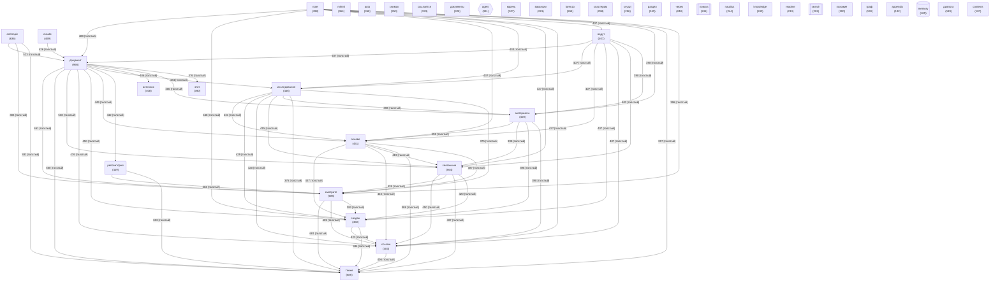

# Граф концептов базы знаний

<!-- toc-auto -->

> [!NOTE]
> Раздел `CONCEPT_GRAPH` автоматически формируется из данных репозитория.

<!-- alert-added -->
<!-- tags: concept-graph, docs -->

<!-- summary -->
> `CONCEPT_GRAPH` — раздел документации проекта Lorenzo.

_Обновлено: 2026-05-11_

Концептов: **40** | Связей: **774** (мин. вес: 2)

## Диаграмма

```mermaid
graph TD
    документ["документ\n(990)"]
    смотрите["смотрите\n(685)"]
    также["также\n(685)"]
    anthropic["anthropic\n(636)"]
    связанные["связанные\n(564)"]
    note["note\n(498)"]
    ссылки["ссылки\n(483)"]
    claude["claude\n(469)"]
    основе["основе\n(451)"]
    создан["создан\n(450)"]
    репозитория("репозитория\n(449)")
    исследования["исследования\n(436)"]
    источник["источник\n(408)"]
    ведут["ведут\n(407)"]
    материалы["материалы\n(400)"]
    этот["этот\n(390)"]
    mhtml["mhtml\n(364)"]
    auto["auto\n(358)"]
    снимок["снимок\n(350)"]
    ссылается["ссылается\n(333)"]
    документы["документы\n(328)"]
    agent{{"agent\n(311)"}}
    корень["корень\n(307)"]
    вакансии["вакансии\n(281)"]
    lorenzo["lorenzo\n(264)"]
    кластерам["кластерам\n(258)"]
    svyazi("svyazi\n(256)")
    раздел["раздел\n(249)"]
    через["через\n(248)"]
    поиска[["поиска\n(245)"]]
    nautilus["nautilus\n(244)"]
    knowledge["knowledge\n(240)"]
    readme["readme\n(213)"]
    search[["search\n(201)"]]
    похожие["похожие\n(200)"]
    граф["граф\n(193)"]
    appendix["appendix\n(192)"]
    memory[("memory\n(189)")]
    диалога["диалога\n(189)"]
    contents["contents\n(187)"]
    смотрите -- 681 |толстый|--> также
    документ -- 651 |толстый|--> смотрите
    документ -- 650 |толстый|--> также
    документ -- 538 |толстый|--> связанные
    anthropic -- 523 |толстый|--> документ
    note -- 488 |толстый|--> документ
    документ -- 476 |толстый|--> ссылки
    связанные -- 450 |толстый|--> ссылки
    документ -- 450 |толстый|--> создан
    документ -- 449 |толстый|--> основе
    note -- 448 |толстый|--> создан
    документ -- 442 |толстый|--> репозитория
    связанные -- 439 |толстый|--> смотрите
    связанные -- 437 |толстый|--> также
    note -- 437 |толстый|--> основе
    основе -- 437 |толстый|--> создан
    документ -- 434 |толстый|--> исследования
    исследования -- 431 |толстый|--> основе
    note -- 430 |толстый|--> исследования
    исследования -- 429 |толстый|--> создан
    note -- 427 |толстый|--> связанные
    note -- 427 |толстый|--> ссылки
    claude -- 426 |толстый|--> документ
    основе -- 423 |толстый|--> ссылки
    создан -- 423 |толстый|--> ссылки
    исследования -- 420 |толстый|--> ссылки
    связанные -- 420 |толстый|--> создан
    основе -- 419 |толстый|--> связанные
    исследования -- 415 |толстый|--> связанные
    note -- 407 |толстый|--> ведут
    ведут -- 407 |толстый|--> документ
    ведут -- 407 |толстый|--> исследования
    ведут -- 407 |толстый|--> основе
    ведут -- 407 |толстый|--> создан
    ведут -- 407 |толстый|--> ссылки
    ссылки -- 406 |толстый|--> также
    документ -- 406 |толстый|--> источник
    смотрите -- 405 |толстый|--> ссылки
    ведут -- 403 |толстый|--> связанные
    документ -- 400 |толстый|--> материалы
    note -- 398 |толстый|--> материалы
    ведут -- 398 |толстый|--> материалы
    исследования -- 398 |толстый|--> материалы
    материалы -- 398 |толстый|--> основе
    материалы -- 398 |толстый|--> связанные
    материалы -- 398 |толстый|--> создан
    материалы -- 398 |толстый|--> ссылки
    note -- 397 |толстый|--> также
    note -- 396 |толстый|--> смотрите
    основе -- 388 |толстый|--> также
    основе -- 387 |толстый|--> смотрите
    репозитория -- 384 |толстый|--> смотрите
    создан -- 384 |толстый|--> также
    anthropic -- 383 |толстый|--> смотрите
    репозитория -- 383 |толстый|--> также
    смотрите -- 383 |толстый|--> создан
    anthropic -- 381 |толстый|--> также
    исследования -- 376 |толстый|--> также
    документ -- 376 |толстый|--> этот
    исследования -- 375 |толстый|--> смотрите
```

## Топ концептов по связям

| Концепт | Файлов | Связей | Категория |
|---------|--------|--------|-----------|
| `документ` | 990 | 12719 | other |
| `смотрите` | 685 | 10684 | other |
| `также` | 685 | 10668 | other |
| `связанные` | 564 | 9433 | other |
| `ссылки` | 483 | 8807 | other |
| `note` | 498 | 8718 | other |
| `основе` | 451 | 8442 | other |
| `создан` | 450 | 8429 | other |
| `исследования` | 436 | 8266 | other |
| `anthropic` | 636 | 8134 | other |
| `репозитория` | 449 | 8073 | project |
| `ведут` | 407 | 7938 | other |
| `материалы` | 400 | 7832 | other |
| `источник` | 408 | 7588 | other |
| `claude` | 469 | 7427 | other |
| `mhtml` | 364 | 6991 | other |
| `снимок` | 350 | 6875 | other |
| `корень` | 307 | 6172 | other |
| `вакансии` | 281 | 5566 | other |
| `кластерам` | 258 | 5252 | other |
| `этот` | 390 | 4919 | other |
| `раздел` | 249 | 4642 | other |
| `поиска` | 245 | 4411 | knowledge |
| `ссылается` | 333 | 4294 | other |
| `lorenzo` | 264 | 4255 | other |
| `через` | 248 | 4040 | other |
| `документы` | 328 | 3963 | other |
| `диалога` | 189 | 3955 | other |
| `auto` | 358 | 3571 | other |
| `граф` | 193 | 3384 | other |

## Смотрите также
- [Главная](README.md)
- [Метрики](METRICS.md)
- [Здоровье](HEALTH.md)
- [Глоссарий](GLOSSARY.md)
- [Сущности](ENTITIES.md)
