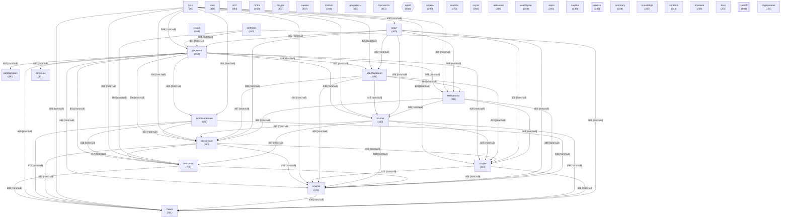

# Граф концептов базы знаний

<!-- toc-auto -->
## Contents

- [Диаграмма](#диаграмма)
- [Топ концептов по связям](#топ-концептов-по-связям)
- [Смотрите также](#смотрите-также)

> [!NOTE]
> Раздел `CONCEPT_GRAPH` формируется автоматически из данных репозитория.

<!-- alert-added -->
<!-- tags: concept-graph, docs -->

<!-- summary -->
> `CONCEPT_GRAPH` — раздел документации проекта Lorenzo.

_Обновлено: 2026-05-11_

Концептов: **40** | Связей: **776** (мин. вес: 2)

## Диаграмма

```mermaid
graph TD
    документ["документ\n(953)"]
    смотрите["смотрите\n(705)"]
    также["также\n(701)"]
    использование["использование\n(656)"]
    anthropic["anthropic\n(630)"]
    связанные["связанные\n(563)"]
    note["note\n(545)"]
    репозитория("репозитория\n(492)")
    ссылки["ссылки\n(473)"]
    claude["claude\n(468)"]
    основе["основе\n(440)"]
    создан["создан\n(440)"]
    исследования["исследования\n(430)"]
    источник["источник\n(401)"]
    ведут["ведут\n(400)"]
    материалы["материалы\n(391)"]
    auto["auto\n(368)"]
    этот["этот\n(364)"]
    mhtml["mhtml\n(358)"]
    раздел["раздел\n(353)"]
    снимок["снимок\n(344)"]
    lorenzo["lorenzo\n(341)"]
    документы["документы\n(331)"]
    ссылается["ссылается\n(313)"]
    agent{{"agent\n(302)"}}
    корень["корень\n(293)"]
    readme["readme\n(272)"]
    svyazi("svyazi\n(268)")
    вакансии["вакансии\n(266)"]
    кластерам["кластерам\n(248)"]
    через["через\n(243)"]
    nautilus["nautilus\n(239)"]
    поиска[["поиска\n(238)"]]
    summary["summary\n(238)"]
    knowledge["knowledge\n(237)"]
    contents["contents\n(213)"]
    похожие["похожие\n(209)"]
    docs["docs\n(203)"]
    search[["search\n(194)"]]
    содержание["содержание\n(192)"]
    смотрите -- 698 |толстый|--> также
    документ -- 653 |толстый|--> смотрите
    документ -- 649 |толстый|--> также
    использование -- 616 |толстый|--> смотрите
    использование -- 612 |толстый|--> также
    документ -- 605 |толстый|--> использование
    документ -- 536 |толстый|--> связанные
    note -- 506 |толстый|--> документ
    anthropic -- 504 |толстый|--> документ
    документ -- 467 |толстый|--> репозитория
    документ -- 465 |толстый|--> ссылки
    связанные -- 447 |толстый|--> смотрите
    связанные -- 443 |толстый|--> также
    связанные -- 440 |толстый|--> ссылки
    note -- 438 |толстый|--> создан
    документ -- 438 |толстый|--> основе
    документ -- 438 |толстый|--> создан
    документ -- 429 |толстый|--> исследования
    note -- 427 |толстый|--> основе
    основе -- 427 |толстый|--> создан
    note -- 425 |толстый|--> исследования
    исследования -- 425 |толстый|--> основе
    использование -- 423 |толстый|--> связанные
    исследования -- 423 |толстый|--> создан
    claude -- 421 |толстый|--> документ
    note -- 416 |толстый|--> связанные
    note -- 414 |толстый|--> ссылки
    основе -- 410 |толстый|--> связанные
    связанные -- 410 |толстый|--> создан
    создан -- 410 |толстый|--> ссылки
    исследования -- 408 |толстый|--> ссылки
    основе -- 408 |толстый|--> ссылки
    исследования -- 407 |толстый|--> связанные
    note -- 406 |толстый|--> смотрите
    note -- 406 |толстый|--> также
    ссылки -- 405 |толстый|--> также
    смотрите -- 404 |толстый|--> ссылки
    note -- 400 |толстый|--> ведут
    ведут -- 400 |толстый|--> документ
    ведут -- 400 |толстый|--> исследования
    ведут -- 400 |толстый|--> основе
    ведут -- 400 |толстый|--> создан
    ведут -- 400 |толстый|--> ссылки
    документ -- 400 |толстый|--> источник
    ведут -- 396 |толстый|--> связанные
    note -- 391 |толстый|--> использование
    документ -- 391 |толстый|--> материалы
    note -- 389 |толстый|--> материалы
    ведут -- 389 |толстый|--> материалы
    исследования -- 389 |толстый|--> материалы
    материалы -- 389 |толстый|--> основе
    материалы -- 389 |толстый|--> связанные
    материалы -- 389 |толстый|--> создан
    материалы -- 389 |толстый|--> ссылки
    anthropic -- 388 |толстый|--> смотрите
    основе -- 388 |толстый|--> также
    основе -- 387 |толстый|--> смотрите
    использование -- 386 |толстый|--> ссылки
    создан -- 386 |толстый|--> также
    anthropic -- 385 |толстый|--> также
```

## Топ концептов по связям

| Концепт | Файлов | Связей | Категория |
|---------|--------|--------|-----------|
| `документ` | 953 | 13060 | other |
| `смотрите` | 705 | 11154 | other |
| `также` | 701 | 11104 | other |
| `использование` | 656 | 10495 | other |
| `связанные` | 563 | 9466 | other |
| `note` | 545 | 9361 | other |
| `ссылки` | 473 | 8710 | other |
| `репозитория` | 492 | 8440 | project |
| `создан` | 440 | 8371 | other |
| `основе` | 440 | 8366 | other |
| `исследования` | 430 | 8247 | other |
| `anthropic` | 630 | 8130 | other |
| `ведут` | 400 | 7887 | other |
| `материалы` | 391 | 7738 | other |
| `источник` | 401 | 7451 | other |
| `claude` | 468 | 7391 | other |
| `mhtml` | 358 | 6866 | other |
| `снимок` | 344 | 6741 | other |
| `корень` | 293 | 5837 | other |
| `раздел` | 353 | 5398 | other |
| `вакансии` | 266 | 5249 | other |
| `этот` | 364 | 5238 | other |
| `lorenzo` | 341 | 5029 | other |
| `кластерам` | 248 | 4999 | other |
| `ссылается` | 313 | 4672 | other |
| `поиска` | 238 | 4261 | knowledge |
| `auto` | 368 | 4164 | other |
| `документы` | 331 | 4129 | other |
| `через` | 243 | 3889 | other |
| `svyazi` | 268 | 3074 | project |

## Смотрите также
- [Главная](README.md)
- [Метрики](METRICS.md)
- [Здоровье](HEALTH.md)
- [Глоссарий](GLOSSARY.md)
- [Сущности](ENTITIES.md)
