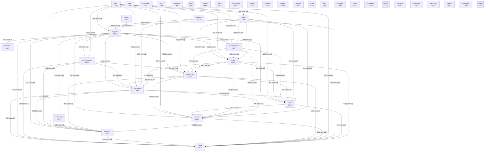

# Граф концептов базы знаний

<!-- toc-auto -->

> [!NOTE]
> Раздел `CONCEPT_GRAPH` формируется автоматически из данных репозитория.

<!-- alert-added -->
<!-- tags: concept-graph, docs -->

<!-- summary -->
> `CONCEPT_GRAPH` — раздел документации проекта Lorenzo.

_Обновлено: 2026-05-13_

Концептов: **40** | Связей: **776** (мин. вес: 2)

## Диаграмма

```mermaid
graph TD
    документ["документ\n(938)"]
    сходство["сходство\n(723)"]
    смотрите["смотрите\n(688)"]
    также["также\n(683)"]
    использование["использование\n(637)"]
    anthropic["anthropic\n(631)"]
    note["note\n(550)"]
    связанные["связанные\n(549)"]
    репозитория("репозитория\n(473)")
    ссылки["ссылки\n(456)"]
    документы["документы\n(445)"]
    создан["создан\n(430)"]
    основе["основе\n(424)"]
    claude["claude\n(422)"]
    исследования["исследования\n(415)"]
    ведут["ведут\n(384)"]
    auto["auto\n(378)"]
    материалы["материалы\n(370)"]
    этот["этот\n(368)"]
    источник["источник\n(365)"]
    agent{{"agent\n(347)"}}
    lorenzo["lorenzo\n(344)"]
    mhtml["mhtml\n(321)"]
    ссылается["ссылается\n(312)"]
    раздел["раздел\n(311)"]
    снимок["снимок\n(301)"]
    readme["readme\n(289)"]
    nautilus["nautilus\n(282)"]
    svyazi("svyazi\n(277)")
    docs["docs\n(264)"]
    summary["summary\n(249)"]
    через["через\n(241)"]
    knowledge["knowledge\n(238)"]
    поиска[["поиска\n(237)"]]
    похожие["похожие\n(234)"]
    вакансии["вакансии\n(234)"]
    vacancies["vacancies\n(228)"]
    корень["корень\n(211)"]
    кластерам["кластерам\n(205)"]
    search[["search\n(202)"]]
    смотрите -- 680 |толстый|--> также
    документ -- 672 |толстый|--> сходство
    документ -- 644 |толстый|--> смотрите
    документ -- 640 |толстый|--> также
    использование -- 604 |толстый|--> смотрите
    использование -- 599 |толстый|--> также
    документ -- 596 |толстый|--> использование
    документ -- 523 |толстый|--> связанные
    смотрите -- 522 |толстый|--> сходство
    сходство -- 521 |толстый|--> также
    note -- 490 |толстый|--> документ
    anthropic -- 488 |толстый|--> документ
    использование -- 483 |толстый|--> сходство
    документ -- 451 |толстый|--> ссылки
    note -- 446 |толстый|--> сходство
    связанные -- 433 |толстый|--> смотрите
    документ -- 430 |толстый|--> репозитория
    связанные -- 430 |толстый|--> также
    связанные -- 429 |толстый|--> ссылки
    документ -- 429 |толстый|--> создан
    note -- 428 |толстый|--> создан
    документ -- 422 |толстый|--> основе
    документ -- 416 |толстый|--> документы
    репозитория -- 415 |толстый|--> сходство
    документ -- 414 |толстый|--> исследования
    использование -- 413 |толстый|--> связанные
    note -- 411 |толстый|--> основе
    основе -- 411 |толстый|--> создан
    связанные -- 408 |толстый|--> сходство
    note -- 408 |толстый|--> исследования
    исследования -- 408 |толстый|--> основе
    исследования -- 406 |толстый|--> создан
    note -- 402 |толстый|--> связанные
    note -- 399 |толстый|--> ссылки
    основе -- 396 |толстый|--> связанные
    создан -- 396 |толстый|--> ссылки
    основе -- 395 |толстый|--> ссылки
    связанные -- 395 |толстый|--> создан
    исследования -- 393 |толстый|--> связанные
    исследования -- 393 |толстый|--> ссылки
    note -- 389 |толстый|--> смотрите
    ссылки -- 388 |толстый|--> также
    note -- 388 |толстый|--> также
    смотрите -- 387 |толстый|--> ссылки
    anthropic -- 385 |толстый|--> смотрите
    ссылки -- 384 |толстый|--> сходство
    note -- 384 |толстый|--> ведут
    ведут -- 384 |толстый|--> документ
    ведут -- 384 |толстый|--> исследования
    ведут -- 384 |толстый|--> основе
    ведут -- 384 |толстый|--> создан
    ведут -- 384 |толстый|--> ссылки
    ведут -- 381 |толстый|--> связанные
    anthropic -- 380 |толстый|--> также
    note -- 376 |толстый|--> использование
    создан -- 376 |толстый|--> также
    смотрите -- 375 |толстый|--> создан
    claude -- 374 |толстый|--> документ
    основе -- 374 |толстый|--> также
    основе -- 373 |толстый|--> смотрите
```

## Топ концептов по связям

| Концепт | Файлов | Связей | Категория |
|---------|--------|--------|-----------|
| `документ` | 938 | 13187 | other |
| `сходство` | 723 | 11177 | other |
| `смотрите` | 688 | 11045 | other |
| `также` | 683 | 10996 | other |
| `использование` | 637 | 10318 | other |
| `note` | 550 | 9431 | other |
| `связанные` | 549 | 9361 | other |
| `ссылки` | 456 | 8623 | other |
| `создан` | 430 | 8300 | other |
| `основе` | 424 | 8222 | other |
| `репозитория` | 473 | 8206 | project |
| `anthropic` | 631 | 8188 | other |
| `исследования` | 415 | 8123 | other |
| `ведут` | 384 | 7728 | other |
| `материалы` | 370 | 7489 | other |
| `источник` | 365 | 7109 | other |
| `claude` | 422 | 6669 | other |
| `mhtml` | 321 | 6461 | other |
| `документы` | 445 | 6373 | other |
| `снимок` | 301 | 6146 | other |
| `этот` | 368 | 5289 | other |
| `lorenzo` | 344 | 5212 | other |
| `вакансии` | 234 | 4829 | other |
| `раздел` | 311 | 4763 | other |
| `ссылается` | 312 | 4749 | other |
| `поиска` | 237 | 4412 | knowledge |
| `корень` | 211 | 4406 | other |
| `кластерам` | 205 | 4352 | other |
| `auto` | 378 | 4269 | other |
| `через` | 241 | 3986 | other |

## Смотрите также
- [Главная](README.md)
- [Метрики](METRICS.md)
- [Здоровье](HEALTH.md)
- [Глоссарий](GLOSSARY.md)
- [Сущности](ENTITIES.md)

<!-- backlinks -->

---

**Кто ссылается на этот документ (15):**
- [CROSS_SECTION](CROSS_SECTION.md)
- [EMPTY_SECTIONS](EMPTY_SECTIONS.md)
- [LLM_GAPS](LLM_GAPS.md)
- [LLM_SUMMARIES](LLM_SUMMARIES.md)
- [OUTLINE](OUTLINE.md)
- [READABILITY](READABILITY.md)
- [READING_TIME](READING_TIME.md)
- [README](README.md)
- _...ещё 7_

