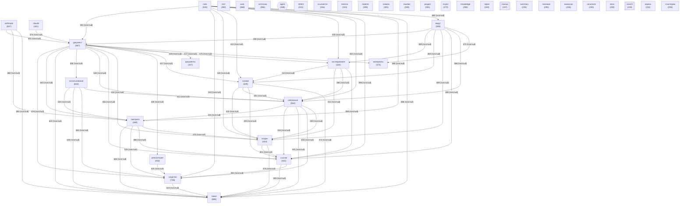

# Граф концептов базы знаний

_Обновлено: 2026-05-12_

Концептов: **40** | Связей: **776** (мин. вес: 2)

## Диаграмма

```mermaid
graph TD
    документ["документ\n(957)"]
    сходство["сходство\n(736)"]
    смотрите["смотрите\n(690)"]
    также["также\n(686)"]
    anthropic["anthropic\n(637)"]
    использование["использование\n(634)"]
    связанные["связанные\n(554)"]
    note["note\n(530)"]
    ссылки["ссылки\n(461)"]
    репозитория("репозитория\n(453)")
    документы["документы\n(447)"]
    создан["создан\n(434)"]
    основе["основе\n(429)"]
    claude["claude\n(421)"]
    исследования["исследования\n(420)"]
    ведут["ведут\n(389)"]
    этот["этот\n(382)"]
    материалы["материалы\n(375)"]
    auto["auto\n(368)"]
    источник["источник\n(365)"]
    agent{{"agent\n(348)"}}
    mhtml["mhtml\n(321)"]
    ссылается["ссылается\n(316)"]
    lorenzo["lorenzo\n(313)"]
    readme["readme\n(309)"]
    снимок["снимок\n(301)"]
    nautilus["nautilus\n(283)"]
    раздел["раздел\n(281)"]
    svyazi("svyazi\n(273)")
    knowledge["knowledge\n(250)"]
    через["через\n(240)"]
    поиска[["поиска\n(237)"]]
    summary["summary\n(235)"]
    похожие["похожие\n(235)"]
    вакансии["вакансии\n(234)"]
    vacancies["vacancies\n(230)"]
    docs["docs\n(230)"]
    search[["search\n(228)"]]
    корень["корень\n(211)"]
    кластерам["кластерам\n(205)"]
    смотрите -- 683 |толстый|--> также
    документ -- 676 |толстый|--> сходство
    документ -- 643 |толстый|--> смотрите
    документ -- 640 |толстый|--> также
    использование -- 604 |толстый|--> смотрите
    использование -- 600 |толстый|--> также
    документ -- 590 |толстый|--> использование
    документ -- 528 |толстый|--> связанные
    смотрите -- 524 |толстый|--> сходство
    сходство -- 523 |толстый|--> также
    anthropic -- 501 |толстый|--> документ
    note -- 491 |толстый|--> документ
    использование -- 483 |толстый|--> сходство
    документ -- 456 |толстый|--> ссылки
    note -- 453 |толстый|--> сходство
    связанные -- 434 |толстый|--> смотрите
    связанные -- 434 |толстый|--> ссылки
    документ -- 434 |толстый|--> создан
    связанные -- 431 |толстый|--> также
    документ -- 430 |толстый|--> репозитория
    note -- 428 |толстый|--> создан
    документ -- 427 |толстый|--> основе
    репозитория -- 420 |толстый|--> сходство
    документ -- 419 |толстый|--> исследования
    документ -- 417 |толстый|--> документы
    основе -- 416 |толстый|--> создан
    исследования -- 413 |толстый|--> основе
    использование -- 412 |толстый|--> связанные
    note -- 412 |толстый|--> основе
    исследования -- 411 |толстый|--> создан
    note -- 409 |толстый|--> исследования
    связанные -- 408 |толстый|--> сходство
    note -- 402 |толстый|--> связанные
    основе -- 401 |толстый|--> связанные
    создан -- 401 |толстый|--> ссылки
    основе -- 400 |толстый|--> ссылки
    связанные -- 400 |толстый|--> создан
    note -- 399 |толстый|--> ссылки
    исследования -- 398 |толстый|--> связанные
    исследования -- 398 |толстый|--> ссылки
    ссылки -- 389 |толстый|--> также
    ведут -- 389 |толстый|--> документ
    ведут -- 389 |толстый|--> исследования
    ведут -- 389 |толстый|--> основе
    ведут -- 389 |толстый|--> создан
    ведут -- 389 |толстый|--> ссылки
    anthropic -- 388 |толстый|--> смотрите
    смотрите -- 388 |толстый|--> ссылки
    note -- 388 |толстый|--> смотрите
    note -- 388 |толстый|--> также
    ведут -- 386 |толстый|--> связанные
    note -- 385 |толстый|--> ведут
    ссылки -- 384 |толстый|--> сходство
    anthropic -- 383 |толстый|--> также
    создан -- 376 |толстый|--> также
    документ -- 375 |толстый|--> материалы
    смотрите -- 375 |толстый|--> создан
    claude -- 374 |толстый|--> документ
    основе -- 374 |толстый|--> также
    ведут -- 373 |толстый|--> материалы
```

## Топ концептов по связям

| Концепт | Файлов | Связей | Категория |
|---------|--------|--------|-----------|
| `документ` | 957 | 13300 | other |
| `сходство` | 736 | 11266 | other |
| `смотрите` | 690 | 11064 | other |
| `также` | 686 | 11025 | other |
| `использование` | 634 | 10253 | other |
| `связанные` | 554 | 9405 | other |
| `note` | 530 | 9312 | other |
| `ссылки` | 461 | 8665 | other |
| `создан` | 434 | 8337 | other |
| `основе` | 429 | 8264 | other |
| `anthropic` | 637 | 8242 | other |
| `исследования` | 420 | 8166 | other |
| `репозитория` | 453 | 8081 | project |
| `ведут` | 389 | 7770 | other |
| `материалы` | 375 | 7531 | other |
| `источник` | 365 | 7108 | other |
| `claude` | 421 | 6654 | other |
| `mhtml` | 321 | 6459 | other |
| `документы` | 447 | 6381 | other |
| `снимок` | 301 | 6145 | other |
| `этот` | 382 | 5363 | other |
| `lorenzo` | 313 | 4993 | other |
| `вакансии` | 234 | 4827 | other |
| `ссылается` | 316 | 4769 | other |
| `раздел` | 281 | 4562 | other |
| `поиска` | 237 | 4411 | knowledge |
| `корень` | 211 | 4405 | other |
| `кластерам` | 205 | 4351 | other |
| `auto` | 368 | 4188 | other |
| `через` | 240 | 3977 | other |
