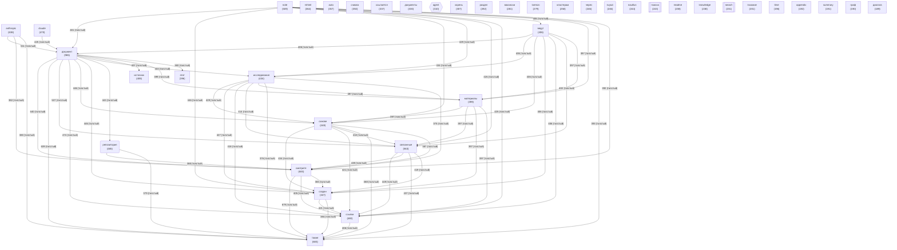

# Граф концептов базы знаний

<!-- toc-auto -->
## Contents

- [Диаграмма](#диаграмма)
- [Топ концептов по связям](#топ-концептов-по-связям)

<!-- tags: concept-graph, docs -->

<!-- summary -->
> `CONCEPT_GRAPH` — раздел документации проекта Lorenzo.

> [!NOTE]
> Документ создан на основе исследования. Ссылки ведут на связанные материалы.

<!-- alert-added -->

_Обновлено: 2026-05-11_

Концептов: **40** | Связей: **773** (мин. вес: 2)

## Диаграмма

```mermaid
graph TD
    документ["документ\n(965)"]
    смотрите["смотрите\n(683)"]
    также["также\n(683)"]
    anthropic["anthropic\n(638)"]
    связанные["связанные\n(563)"]
    note["note\n(509)"]
    ссылки["ссылки\n(480)"]
    claude["claude\n(470)"]
    репозитория("репозитория\n(465)")
    основе["основе\n(448)"]
    создан["создан\n(447)"]
    исследования["исследования\n(434)"]
    источник["источник\n(408)"]
    ведут["ведут\n(406)"]
    материалы["материалы\n(399)"]
    этот["этот\n(396)"]
    mhtml["mhtml\n(364)"]
    auto["auto\n(357)"]
    снимок["снимок\n(350)"]
    ссылается["ссылается\n(337)"]
    документы["документы\n(330)"]
    agent{{"agent\n(310)"}}
    корень["корень\n(307)"]
    раздел["раздел\n(292)"]
    вакансии["вакансии\n(281)"]
    lorenzo["lorenzo\n(279)"]
    кластерам["кластерам\n(258)"]
    через["через\n(246)"]
    svyazi("svyazi\n(246)")
    nautilus["nautilus\n(244)"]
    поиска[["поиска\n(243)"]]
    readme["readme\n(238)"]
    knowledge["knowledge\n(238)"]
    search[["search\n(231)"]]
    похожие["похожие\n(201)"]
    time["time\n(196)"]
    appendix["appendix\n(192)"]
    summary["summary\n(191)"]
    граф["граф\n(190)"]
    диалога["диалога\n(189)"]
    смотрите -- 679 |толстый|--> также
    документ -- 640 |толстый|--> смотрите
    документ -- 639 |толстый|--> также
    документ -- 537 |толстый|--> связанные
    anthropic -- 511 |толстый|--> документ
    note -- 481 |толстый|--> документ
    документ -- 474 |толстый|--> ссылки
    связанные -- 449 |толстый|--> ссылки
    note -- 446 |толстый|--> создан
    документ -- 446 |толстый|--> основе
    документ -- 446 |толстый|--> создан
    документ -- 443 |толстый|--> репозитория
    связанные -- 439 |толстый|--> смотрите
    связанные -- 437 |толстый|--> также
    note -- 434 |толстый|--> основе
    основе -- 434 |толстый|--> создан
    документ -- 433 |толстый|--> исследования
    note -- 429 |толстый|--> исследования
    исследования -- 429 |толстый|--> основе
    исследования -- 427 |толстый|--> создан
    note -- 426 |толстый|--> связанные
    claude -- 425 |толстый|--> документ
    note -- 425 |толстый|--> ссылки
    основе -- 421 |толстый|--> ссылки
    создан -- 421 |толстый|--> ссылки
    связанные -- 419 |толстый|--> создан
    исследования -- 418 |толстый|--> ссылки
    основе -- 418 |толстый|--> связанные
    исследования -- 414 |толстый|--> связанные
    документ -- 407 |толстый|--> источник
    ссылки -- 406 |толстый|--> также
    note -- 406 |толстый|--> ведут
    ведут -- 406 |толстый|--> документ
    ведут -- 406 |толстый|--> исследования
    ведут -- 406 |толстый|--> основе
    ведут -- 406 |толстый|--> создан
    ведут -- 406 |толстый|--> ссылки
    смотрите -- 405 |толстый|--> ссылки
    ведут -- 402 |толстый|--> связанные
    документ -- 399 |толстый|--> материалы
    note -- 397 |толстый|--> материалы
    ведут -- 397 |толстый|--> материалы
    исследования -- 397 |толстый|--> материалы
    материалы -- 397 |толстый|--> основе
    материалы -- 397 |толстый|--> связанные
    материалы -- 397 |толстый|--> создан
    материалы -- 397 |толстый|--> ссылки
    note -- 393 |толстый|--> также
    note -- 392 |толстый|--> смотрите
    основе -- 388 |толстый|--> также
    основе -- 387 |толстый|--> смотрите
    создан -- 384 |толстый|--> также
    смотрите -- 383 |толстый|--> создан
    anthropic -- 382 |толстый|--> смотрите
    anthropic -- 380 |толстый|--> также
    репозитория -- 380 |толстый|--> смотрите
    документ -- 380 |толстый|--> этот
    репозитория -- 379 |толстый|--> также
    исследования -- 376 |толстый|--> также
    исследования -- 375 |толстый|--> смотрите
```

## Топ концептов по связям

| Концепт | Файлов | Связей | Категория |
|---------|--------|--------|-----------|
| `документ` | 965 | 12576 | other |
| `смотрите` | 683 | 10552 | other |
| `также` | 683 | 10538 | other |
| `связанные` | 563 | 9371 | other |
| `note` | 509 | 8837 | other |
| `ссылки` | 480 | 8748 | other |
| `основе` | 448 | 8371 | other |
| `создан` | 447 | 8370 | other |
| `исследования` | 434 | 8223 | other |
| `репозитория` | 465 | 8220 | project |
| `anthropic` | 638 | 8104 | other |
| `ведут` | 406 | 7901 | other |
| `материалы` | 399 | 7797 | other |
| `источник` | 408 | 7575 | other |
| `claude` | 470 | 7432 | other |
| `mhtml` | 364 | 6975 | other |
| `снимок` | 350 | 6858 | other |
| `корень` | 307 | 6157 | other |
| `вакансии` | 281 | 5540 | other |
| `кластерам` | 258 | 5242 | other |
| `раздел` | 292 | 4982 | other |
| `этот` | 396 | 4974 | other |
| `поиска` | 243 | 4399 | knowledge |
| `lorenzo` | 279 | 4384 | other |
| `ссылается` | 337 | 4322 | other |
| `через` | 246 | 4015 | other |
| `диалога` | 189 | 3953 | other |
| `документы` | 330 | 3915 | other |
| `auto` | 357 | 3590 | other |
| `граф` | 190 | 3354 | other |

<!-- see-also -->

---

**Смотрите также:**
- [00-question-habr-link](nautilus/community-discussions/habr-article-1-reaction/00-question-habr-link.md)
- [11-relevance-ranking](nautilus/npp-v1-1/11-relevance-ranking.md)
- [13-communications](anthropic-vacancies/clusters/13-communications.md)
- [14-other-ai-relationships](lorenzo-agent/14-other-ai-relationships.md)

