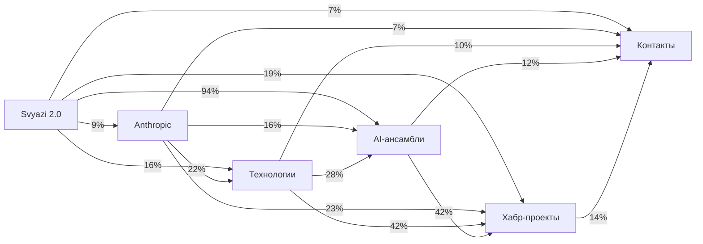

# Кросс-секционный анализ

<!-- summary -->
> _(косинусное сходство TF-IDF векторов)_
**Проекты:** Svyazi, CardIndex, AgentFS, Yodoca, MemNet

---

<!-- toc -->
## Содержание

- [Матрица сходства секций](#матрица-сходства-секций)
- [Граф связей](#граф-связей)
- [Топ-40 кросс-секционных концептов](#топ-40-кросс-секционных-концептов)
- [Детальная карта концептов](#детальная-карта-концептов)

---

<!-- tags: memory, knowledge, ingestion, anthropic, collaboration -->

_Обновлено: 2026-04-29_

---

## Матрица сходства секций

_(косинусное сходство TF-IDF векторов)_

| Секция | Svyazi 2.0 | Anthropic | Технологии | AI-ансамбли | Хабр-проекты | Контакты |
|--------|------|------|------|------|------|------|
| `Svyazi 2.0` | **—** | 0.09 ░░░░░ | 0.16 █░░░░ | 0.94 █████ | 0.19 █░░░░ | 0.07 ░░░░░ |
| `Anthropic` | 0.09 ░░░░░ | **—** | 0.22 ██░░░ | 0.16 █░░░░ | 0.23 ██░░░ | 0.07 ░░░░░ |
| `Технологии` | 0.16 █░░░░ | 0.22 ██░░░ | **—** | 0.28 ██░░░ | 0.42 ████░ | 0.10 ░░░░░ |
| `AI-ансамбли` | 0.94 █████ | 0.16 █░░░░ | 0.28 ██░░░ | **—** | 0.42 ████░ | 0.12 █░░░░ |
| `Хабр-проекты` | 0.19 █░░░░ | 0.23 ██░░░ | 0.42 ████░ | 0.42 ████░ | **—** | 0.14 █░░░░ |
| `Контакты` | 0.07 ░░░░░ | 0.07 ░░░░░ | 0.10 ░░░░░ | 0.12 █░░░░ | 0.14 █░░░░ | **—** |

## Граф связей

_(толщина / процент = косинусное сходство × 100)_

## Топ-40 кросс-секционных концептов

_Присутствуют в ≥ 2 секциях_

| Концепт | Секций | Авг. TF-IDF | Присутствует в |
|---------|--------|-------------|----------------|
| `svyazi` | 6 | 14.8827 | `Svyazi 2.0`, `Anthropic`, `Технологии`, `AI-ансамбли`, `Хабр-проекты`, `Контакты` |
| `связи` | 6 | 10.8618 | `Svyazi 2.0`, `Anthropic`, `Технологии`, `AI-ансамбли`, `Хабр-проекты`, `Контакты` |
| `сходство` | 6 | 10.1983 | `Svyazi 2.0`, `Anthropic`, `Технологии`, `AI-ансамбли`, `Хабр-проекты`, `Контакты` |
| `профиль` | 6 | 8.2149 | `Svyazi 2.0`, `Anthropic`, `Технологии`, `AI-ансамбли`, `Хабр-проекты`, `Контакты` |
| `вопросы` | 6 | 6.5560 | `Svyazi 2.0`, `Anthropic`, `Технологии`, `AI-ансамбли`, `Хабр-проекты`, `Контакты` |
| `проекты` | 6 | 6.1530 | `Svyazi 2.0`, `Anthropic`, `Технологии`, `AI-ансамбли`, `Хабр-проекты`, `Контакты` |
| `knowledge` | 6 | 6.0293 | `Svyazi 2.0`, `Anthropic`, `Технологии`, `AI-ансамбли`, `Хабр-проекты`, `Контакты` |
| `habr` | 6 | 5.9814 | `Svyazi 2.0`, `Anthropic`, `Технологии`, `AI-ансамбли`, `Хабр-проекты`, `Контакты` |
| `memory` | 6 | 5.6917 | `Svyazi 2.0`, `Anthropic`, `Технологии`, `AI-ансамбли`, `Хабр-проекты`, `Контакты` |
| `legal` | 6 | 4.3504 | `Svyazi 2.0`, `Anthropic`, `Технологии`, `AI-ансамбли`, `Хабр-проекты`, `Контакты` |
| `документы` | 6 | 3.9300 | `Svyazi 2.0`, `Anthropic`, `Технологии`, `AI-ансамбли`, `Хабр-проекты`, `Контакты` |
| `похожие` | 6 | 3.7044 | `Svyazi 2.0`, `Anthropic`, `Технологии`, `AI-ансамбли`, `Хабр-проекты`, `Контакты` |
| `cardindex` | 6 | 3.6463 | `Svyazi 2.0`, `Anthropic`, `Технологии`, `AI-ансамбли`, `Хабр-проекты`, `Контакты` |
| `yodoca` | 6 | 3.5423 | `Svyazi 2.0`, `Anthropic`, `Технологии`, `AI-ансамбли`, `Хабр-проекты`, `Контакты` |
| `agentfs` | 6 | 2.7332 | `Svyazi 2.0`, `Anthropic`, `Технологии`, `AI-ансамбли`, `Хабр-проекты`, `Контакты` |
| `автоматически` | 6 | 2.6732 | `Svyazi 2.0`, `Anthropic`, `Технологии`, `AI-ансамбли`, `Хабр-проекты`, `Контакты` |
| `contents` | 6 | 2.6600 | `Svyazi 2.0`, `Anthropic`, `Технологии`, `AI-ансамбли`, `Хабр-проекты`, `Контакты` |
| `space` | 6 | 2.6465 | `Svyazi 2.0`, `Anthropic`, `Технологии`, `AI-ансамбли`, `Хабр-проекты`, `Контакты` |
| `executive` | 6 | 2.6073 | `Svyazi 2.0`, `Anthropic`, `Технологии`, `AI-ансамбли`, `Хабр-проекты`, `Контакты` |
| `router` | 6 | 2.3725 | `Svyazi 2.0`, `Anthropic`, `Технологии`, `AI-ансамбли`, `Хабр-проекты`, `Контакты` |
| `graph` | 6 | 2.3342 | `Svyazi 2.0`, `Anthropic`, `Технологии`, `AI-ансамбли`, `Хабр-проекты`, `Контакты` |
| `между` | 6 | 2.3156 | `Svyazi 2.0`, `Anthropic`, `Технологии`, `AI-ансамбли`, `Хабр-проекты`, `Контакты` |
| `auto` | 6 | 1.8066 | `Svyazi 2.0`, `Anthropic`, `Технологии`, `AI-ансамбли`, `Хабр-проекты`, `Контакты` |
| `research` | 6 | 1.7141 | `Svyazi 2.0`, `Anthropic`, `Технологии`, `AI-ансамбли`, `Хабр-проекты`, `Контакты` |
| `state` | 6 | 1.4958 | `Svyazi 2.0`, `Anthropic`, `Технологии`, `AI-ансамбли`, `Хабр-проекты`, `Контакты` |
| `лучше` | 6 | 1.4943 | `Svyazi 2.0`, `Anthropic`, `Технологии`, `AI-ансамбли`, `Хабр-проекты`, `Контакты` |
| `memnet` | 6 | 1.2179 | `Svyazi 2.0`, `Anthropic`, `Технологии`, `AI-ансамбли`, `Хабр-проекты`, `Контакты` |
| `vault` | 6 | 1.1168 | `Svyazi 2.0`, `Anthropic`, `Технологии`, `AI-ансамбли`, `Хабр-проекты`, `Контакты` |
| `discovery` | 6 | 1.1147 | `Svyazi 2.0`, `Anthropic`, `Технологии`, `AI-ансамбли`, `Хабр-проекты`, `Контакты` |
| `project` | 6 | 0.8605 | `Svyazi 2.0`, `Anthropic`, `Технологии`, `AI-ансамбли`, `Хабр-проекты`, `Контакты` |
| `одной` | 6 | 0.8243 | `Svyazi 2.0`, `Anthropic`, `Технологии`, `AI-ансамбли`, `Хабр-проекты`, `Контакты` |
| `agentos` | 6 | 0.8098 | `Svyazi 2.0`, `Anthropic`, `Технологии`, `AI-ансамбли`, `Хабр-проекты`, `Контакты` |
| `содержание` | 6 | 0.6447 | `Svyazi 2.0`, `Anthropic`, `Технологии`, `AI-ансамбли`, `Хабр-проекты`, `Контакты` |
| `community` | 6 | 0.6409 | `Svyazi 2.0`, `Anthropic`, `Технологии`, `AI-ансамбли`, `Хабр-проекты`, `Контакты` |
| `качество` | 6 | 0.5198 | `Svyazi 2.0`, `Anthropic`, `Технологии`, `AI-ансамбли`, `Хабр-проекты`, `Контакты` |
| `отдельный` | 6 | 0.5186 | `Svyazi 2.0`, `Anthropic`, `Технологии`, `AI-ансамбли`, `Хабр-проекты`, `Контакты` |
| `only` | 6 | 0.4592 | `Svyazi 2.0`, `Anthropic`, `Технологии`, `AI-ансамбли`, `Хабр-проекты`, `Контакты` |
| `файлов` | 6 | 0.3404 | `Svyazi 2.0`, `Anthropic`, `Технологии`, `AI-ансамбли`, `Хабр-проекты`, `Контакты` |
| `статус` | 5 | 14.9001 | `Svyazi 2.0`, `Anthropic`, `AI-ансамбли`, `Хабр-проекты`, `Контакты` |
| `view` | 5 | 12.6927 | `Svyazi 2.0`, `Anthropic`, `Технологии`, `AI-ансамбли`, `Хабр-проекты` |

## Детальная карта концептов

_Для каждого концепта — TF-IDF вес в каждой секции_

| Концепт | Svyazi 2.0 | Anthropic | Технологии | AI-ансамбл | Хабр-проек | Контакты |
|---------|------|------|------|------|------|------|
| `svyazi` | **20.388** | **1.193** | **15.888** | **17.134** | **8.422** | **26.271** |
| `связи` | **0.324** | **0.067** | **0.935** | **1.872** | **2.651** | **59.322** |
| `сходство` | **4.747** | **5.624** | **7.009** | **2.400** | **3.275** | **38.136** |
| `профиль` | **0.324** | **0.177** | **0.935** | **0.240** | **0.156** | **47.458** |
| `вопросы` | **1.079** | **0.961** | **0.467** | **0.768** | **0.468** | **35.593** |
| `проекты` | **1.726** | **0.349** | **5.607** | **2.544** | **2.963** | **23.729** |
| `knowledge` | **4.854** | **2.631** | **12.617** | **4.703** | **3.743** | **7.627** |
| `habr` | **0.755** | **1.279** | **10.280** | **4.223** | **7.486** | **11.864** |
| `memory` | **10.464** | **1.554** | **0.935** | **8.783** | **7.330** | **5.085** |
| `legal` | **1.834** | **1.334** | **11.682** | **3.408** | **5.303** | **2.542** |
| `документы` | **1.942** | **2.680** | **3.271** | **1.104** | **1.871** | **12.712** |
| `похожие` | **1.726** | **2.142** | **3.271** | **0.816** | **1.560** | **12.712** |
| `cardindex` | **5.178** | **0.239** | **7.944** | **3.792** | **2.183** | **2.542** |
| `yodoca` | **4.854** | **0.043** | **5.140** | **3.216** | **5.458** | **2.542** |
| `agentfs` | **6.149** | **0.092** | **1.869** | **4.032** | **1.716** | **2.542** |
| `автоматически` | **0.216** | **0.159** | **2.336** | **0.528** | **0.936** | **11.864** |
| `contents` | **1.079** | **1.842** | **0.467** | **0.240** | **0.468** | **11.864** |
| `space` | **3.560** | **0.422** | **1.869** | **3.072** | **1.871** | **5.085** |
| `executive` | **3.236** | **0.373** | **5.140** | **3.551** | **2.495** | **0.848** |
| `router` | **1.726** | **0.043** | **7.944** | **1.200** | **0.780** | **2.542** |

<!-- see-also -->

---

**Смотрите также:**
- [kksudo](docs/contacts/kksudo.md)
- [CONCEPT_GRAPH](docs/CONCEPT_GRAPH.md)
- [CONTACTS](docs/CONTACTS.md)
- [andrey-chuyan](docs/contacts/andrey-chuyan.md)

<!-- similar-docs -->

---

**Похожие документы:**
- [kksudo](docs/contacts/kksudo.md) (сходство 0.23)
- [kksudo](docs/obsidian/contacts/kksudo.md) (сходство 0.23)
- [andrey-chuyan](docs/obsidian/contacts/andrey-chuyan.md) (сходство 0.23)

