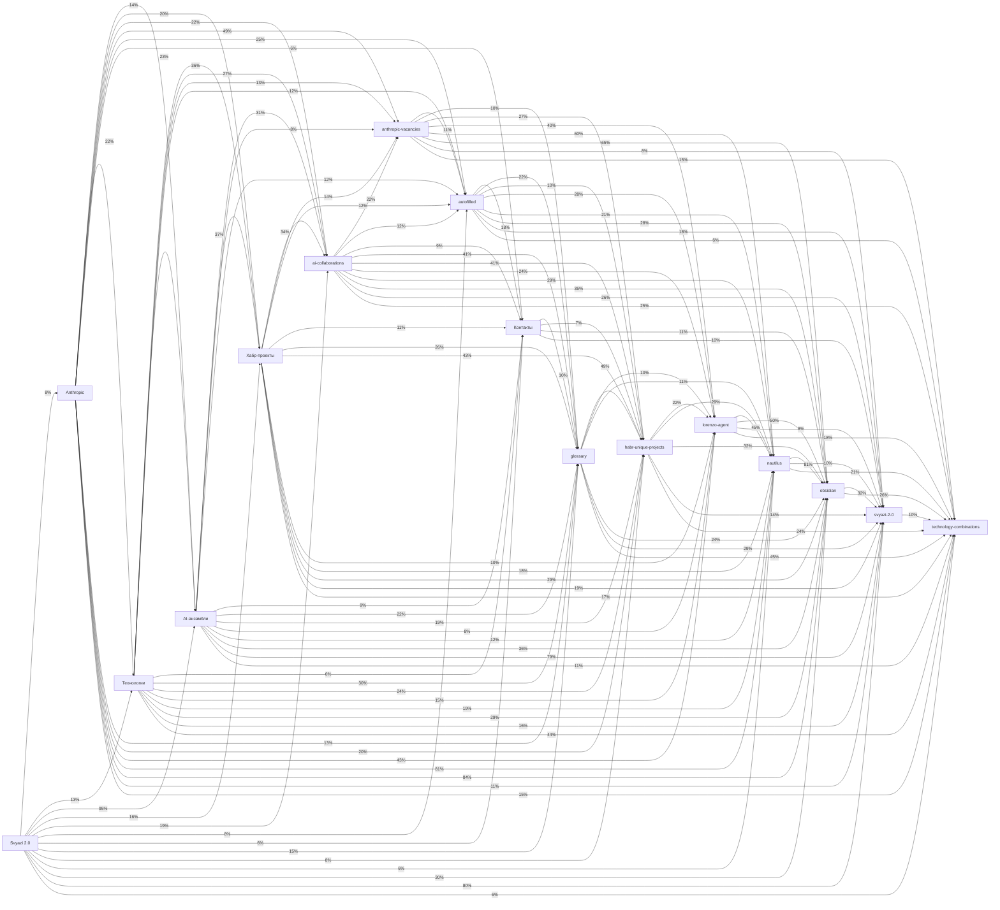

# Кросс-секционный анализ

_Обновлено: 2026-04-29_

---

## Матрица сходства секций

_(косинусное сходство TF-IDF векторов)_

| Секция | Svyazi 2.0 | Anthropic | Технологии | AI-ансамбли | Хабр-проекты | ai-collaborations | anthropic-vacancies | autofilled | Контакты | glossary | habr-unique-projects | lorenzo-agent | nautilus | obsidian | svyazi-2-0 | technology-combinations |
|--------|------|------|------|------|------|------|------|------|------|------|------|------|------|------|------|------|
| `Svyazi 2.0` | **—** | 0.08 ░░░░░ | 0.13 █░░░░ | 0.95 █████ | 0.16 █░░░░ | 0.19 █░░░░ | 0.04 ░░░░░ | 0.08 ░░░░░ | 0.06 ░░░░░ | 0.15 █░░░░ | 0.08 ░░░░░ | 0.05 ░░░░░ | 0.06 ░░░░░ | 0.30 ███░░ | 0.80 █████ | 0.06 ░░░░░ |
| `Anthropic` | 0.08 ░░░░░ | **—** | 0.22 ██░░░ | 0.14 █░░░░ | 0.20 ██░░░ | 0.22 ██░░░ | 0.49 ████░ | 0.25 ██░░░ | 0.06 ░░░░░ | 0.13 █░░░░ | 0.20 ██░░░ | 0.43 ████░ | 0.81 █████ | 0.84 █████ | 0.11 █░░░░ | 0.15 █░░░░ |
| `Технологии` | 0.13 █░░░░ | 0.22 ██░░░ | **—** | 0.23 ██░░░ | 0.36 ███░░ | 0.27 ██░░░ | 0.13 █░░░░ | 0.12 █░░░░ | 0.06 ░░░░░ | 0.30 ███░░ | 0.24 ██░░░ | 0.15 █░░░░ | 0.19 █░░░░ | 0.29 ██░░░ | 0.17 █░░░░ | 0.44 ████░ |
| `AI-ансамбли` | 0.95 █████ | 0.14 █░░░░ | 0.23 ██░░░ | **—** | 0.37 ███░░ | 0.31 ███░░ | 0.08 ░░░░░ | 0.12 █░░░░ | 0.09 ░░░░░ | 0.22 ██░░░ | 0.19 █░░░░ | 0.08 ░░░░░ | 0.12 █░░░░ | 0.36 ███░░ | 0.79 █████ | 0.11 █░░░░ |
| `Хабр-проекты` | 0.16 █░░░░ | 0.20 ██░░░ | 0.36 ███░░ | 0.37 ███░░ | **—** | 0.34 ███░░ | 0.14 █░░░░ | 0.12 █░░░░ | 0.11 █░░░░ | 0.27 ██░░░ | 0.43 ████░ | 0.10 █░░░░ | 0.18 █░░░░ | 0.29 ██░░░ | 0.19 █░░░░ | 0.17 █░░░░ |
| `ai-collaborations` | 0.19 █░░░░ | 0.22 ██░░░ | 0.27 ██░░░ | 0.31 ███░░ | 0.34 ███░░ | **—** | 0.22 ██░░░ | 0.12 █░░░░ | 0.09 ░░░░░ | 0.41 ████░ | 0.41 ████░ | 0.24 ██░░░ | 0.29 ██░░░ | 0.35 ███░░ | 0.26 ██░░░ | 0.25 ██░░░ |
| `anthropic-vacancies` | 0.04 ░░░░░ | 0.49 ████░ | 0.13 █░░░░ | 0.08 ░░░░░ | 0.14 █░░░░ | 0.22 ██░░░ | **—** | 0.11 █░░░░ | 0.04 ░░░░░ | 0.10 █░░░░ | 0.27 ██░░░ | 0.40 ████░ | 0.60 █████ | 0.65 █████ | 0.08 ░░░░░ | 0.15 █░░░░ |
| `autofilled` | 0.08 ░░░░░ | 0.25 ██░░░ | 0.12 █░░░░ | 0.12 █░░░░ | 0.12 █░░░░ | 0.12 █░░░░ | 0.11 █░░░░ | **—** | 0.18 █░░░░ | 0.22 ██░░░ | 0.10 ░░░░░ | 0.28 ██░░░ | 0.21 ██░░░ | 0.28 ██░░░ | 0.18 █░░░░ | 0.06 ░░░░░ |
| `Контакты` | 0.06 ░░░░░ | 0.06 ░░░░░ | 0.06 ░░░░░ | 0.09 ░░░░░ | 0.11 █░░░░ | 0.09 ░░░░░ | 0.04 ░░░░░ | 0.18 █░░░░ | **—** | 0.10 ░░░░░ | 0.07 ░░░░░ | 0.03 ░░░░░ | 0.05 ░░░░░ | 0.11 █░░░░ | 0.10 ░░░░░ | 0.04 ░░░░░ |
| `glossary` | 0.15 █░░░░ | 0.13 █░░░░ | 0.30 ███░░ | 0.22 ██░░░ | 0.27 ██░░░ | 0.41 ████░ | 0.10 █░░░░ | 0.22 ██░░░ | 0.10 ░░░░░ | **—** | 0.49 ████░ | 0.10 ░░░░░ | 0.11 █░░░░ | 0.24 ██░░░ | 0.29 ██░░░ | 0.45 ████░ |
| `habr-unique-projects` | 0.08 ░░░░░ | 0.20 ██░░░ | 0.24 ██░░░ | 0.19 █░░░░ | 0.43 ████░ | 0.41 ████░ | 0.27 ██░░░ | 0.10 ░░░░░ | 0.07 ░░░░░ | 0.49 ████░ | **—** | 0.22 ██░░░ | 0.29 ██░░░ | 0.32 ███░░ | 0.14 █░░░░ | 0.24 ██░░░ |
| `lorenzo-agent` | 0.05 ░░░░░ | 0.43 ████░ | 0.15 █░░░░ | 0.08 ░░░░░ | 0.10 █░░░░ | 0.24 ██░░░ | 0.40 ████░ | 0.28 ██░░░ | 0.03 ░░░░░ | 0.10 ░░░░░ | 0.22 ██░░░ | **—** | 0.45 ████░ | 0.50 ████░ | 0.08 ░░░░░ | 0.18 █░░░░ |
| `nautilus` | 0.06 ░░░░░ | 0.81 █████ | 0.19 █░░░░ | 0.12 █░░░░ | 0.18 █░░░░ | 0.29 ██░░░ | 0.60 █████ | 0.21 ██░░░ | 0.05 ░░░░░ | 0.11 █░░░░ | 0.29 ██░░░ | 0.45 ████░ | **—** | 0.81 █████ | 0.10 █░░░░ | 0.21 ██░░░ |
| `obsidian` | 0.30 ███░░ | 0.84 █████ | 0.29 ██░░░ | 0.36 ███░░ | 0.29 ██░░░ | 0.35 ███░░ | 0.65 █████ | 0.28 ██░░░ | 0.11 █░░░░ | 0.24 ██░░░ | 0.32 ███░░ | 0.50 ████░ | 0.81 █████ | **—** | 0.32 ███░░ | 0.26 ██░░░ |
| `svyazi-2-0` | 0.80 █████ | 0.11 █░░░░ | 0.17 █░░░░ | 0.79 █████ | 0.19 █░░░░ | 0.26 ██░░░ | 0.08 ░░░░░ | 0.18 █░░░░ | 0.10 ░░░░░ | 0.29 ██░░░ | 0.14 █░░░░ | 0.08 ░░░░░ | 0.10 █░░░░ | 0.32 ███░░ | **—** | 0.10 █░░░░ |
| `technology-combinations` | 0.06 ░░░░░ | 0.15 █░░░░ | 0.44 ████░ | 0.11 █░░░░ | 0.17 █░░░░ | 0.25 ██░░░ | 0.15 █░░░░ | 0.06 ░░░░░ | 0.04 ░░░░░ | 0.45 ████░ | 0.24 ██░░░ | 0.18 █░░░░ | 0.21 ██░░░ | 0.26 ██░░░ | 0.10 █░░░░ | **—** |

## Граф связей

_(толщина / процент = косинусное сходство × 100)_

## Топ-40 кросс-секционных концептов

_Присутствуют в ≥ 2 секциях_

| Концепт | Секций | Авг. TF-IDF | Присутствует в |
|---------|--------|-------------|----------------|
| `svyazi` | 16 | 17.5446 | `Svyazi 2.0`, `Anthropic`, `Технологии`, `AI-ансамбли`, `Хабр-проекты`, `ai-collaborations`, `anthropic-vacancies`, `autofilled`, `Контакты`, `glossary`, `habr-unique-projects`, `lorenzo-agent`, `nautilus`, `obsidian`, `svyazi-2-0`, `technology-combinations` |
| `сходство` | 16 | 10.9677 | `Svyazi 2.0`, `Anthropic`, `Технологии`, `AI-ансамбли`, `Хабр-проекты`, `ai-collaborations`, `anthropic-vacancies`, `autofilled`, `Контакты`, `glossary`, `habr-unique-projects`, `lorenzo-agent`, `nautilus`, `obsidian`, `svyazi-2-0`, `technology-combinations` |
| `habr` | 16 | 6.5704 | `Svyazi 2.0`, `Anthropic`, `Технологии`, `AI-ансамбли`, `Хабр-проекты`, `ai-collaborations`, `anthropic-vacancies`, `autofilled`, `Контакты`, `glossary`, `habr-unique-projects`, `lorenzo-agent`, `nautilus`, `obsidian`, `svyazi-2-0`, `technology-combinations` |
| `memory` | 16 | 5.9962 | `Svyazi 2.0`, `Anthropic`, `Технологии`, `AI-ансамбли`, `Хабр-проекты`, `ai-collaborations`, `anthropic-vacancies`, `autofilled`, `Контакты`, `glossary`, `habr-unique-projects`, `lorenzo-agent`, `nautilus`, `obsidian`, `svyazi-2-0`, `technology-combinations` |
| `документы` | 16 | 5.7820 | `Svyazi 2.0`, `Anthropic`, `Технологии`, `AI-ансамбли`, `Хабр-проекты`, `ai-collaborations`, `anthropic-vacancies`, `autofilled`, `Контакты`, `glossary`, `habr-unique-projects`, `lorenzo-agent`, `nautilus`, `obsidian`, `svyazi-2-0`, `technology-combinations` |
| `legal` | 16 | 5.4102 | `Svyazi 2.0`, `Anthropic`, `Технологии`, `AI-ансамбли`, `Хабр-проекты`, `ai-collaborations`, `anthropic-vacancies`, `autofilled`, `Контакты`, `glossary`, `habr-unique-projects`, `lorenzo-agent`, `nautilus`, `obsidian`, `svyazi-2-0`, `technology-combinations` |
| `knowledge` | 16 | 4.8940 | `Svyazi 2.0`, `Anthropic`, `Технологии`, `AI-ансамбли`, `Хабр-проекты`, `ai-collaborations`, `anthropic-vacancies`, `autofilled`, `Контакты`, `glossary`, `habr-unique-projects`, `lorenzo-agent`, `nautilus`, `obsidian`, `svyazi-2-0`, `technology-combinations` |
| `readme` | 16 | 4.2031 | `Svyazi 2.0`, `Anthropic`, `Технологии`, `AI-ансамбли`, `Хабр-проекты`, `ai-collaborations`, `anthropic-vacancies`, `autofilled`, `Контакты`, `glossary`, `habr-unique-projects`, `lorenzo-agent`, `nautilus`, `obsidian`, `svyazi-2-0`, `technology-combinations` |
| `проекты` | 16 | 3.9518 | `Svyazi 2.0`, `Anthropic`, `Технологии`, `AI-ансамбли`, `Хабр-проекты`, `ai-collaborations`, `anthropic-vacancies`, `autofilled`, `Контакты`, `glossary`, `habr-unique-projects`, `lorenzo-agent`, `nautilus`, `obsidian`, `svyazi-2-0`, `technology-combinations` |
| `похожие` | 16 | 3.7969 | `Svyazi 2.0`, `Anthropic`, `Технологии`, `AI-ансамбли`, `Хабр-проекты`, `ai-collaborations`, `anthropic-vacancies`, `autofilled`, `Контакты`, `glossary`, `habr-unique-projects`, `lorenzo-agent`, `nautilus`, `obsidian`, `svyazi-2-0`, `technology-combinations` |
| `research` | 16 | 3.2766 | `Svyazi 2.0`, `Anthropic`, `Технологии`, `AI-ансамбли`, `Хабр-проекты`, `ai-collaborations`, `anthropic-vacancies`, `autofilled`, `Контакты`, `glossary`, `habr-unique-projects`, `lorenzo-agent`, `nautilus`, `obsidian`, `svyazi-2-0`, `technology-combinations` |
| `также` | 16 | 3.2478 | `Svyazi 2.0`, `Anthropic`, `Технологии`, `AI-ансамбли`, `Хабр-проекты`, `ai-collaborations`, `anthropic-vacancies`, `autofilled`, `Контакты`, `glossary`, `habr-unique-projects`, `lorenzo-agent`, `nautilus`, `obsidian`, `svyazi-2-0`, `technology-combinations` |
| `смотрите` | 16 | 3.1513 | `Svyazi 2.0`, `Anthropic`, `Технологии`, `AI-ансамбли`, `Хабр-проекты`, `ai-collaborations`, `anthropic-vacancies`, `autofilled`, `Контакты`, `glossary`, `habr-unique-projects`, `lorenzo-agent`, `nautilus`, `obsidian`, `svyazi-2-0`, `technology-combinations` |
| `graph` | 16 | 2.3451 | `Svyazi 2.0`, `Anthropic`, `Технологии`, `AI-ансамбли`, `Хабр-проекты`, `ai-collaborations`, `anthropic-vacancies`, `autofilled`, `Контакты`, `glossary`, `habr-unique-projects`, `lorenzo-agent`, `nautilus`, `obsidian`, `svyazi-2-0`, `technology-combinations` |
| `obsidian` | 16 | 2.0737 | `Svyazi 2.0`, `Anthropic`, `Технологии`, `AI-ансамбли`, `Хабр-проекты`, `ai-collaborations`, `anthropic-vacancies`, `autofilled`, `Контакты`, `glossary`, `habr-unique-projects`, `lorenzo-agent`, `nautilus`, `obsidian`, `svyazi-2-0`, `technology-combinations` |
| `содержание` | 16 | 0.8583 | `Svyazi 2.0`, `Anthropic`, `Технологии`, `AI-ансамбли`, `Хабр-проекты`, `ai-collaborations`, `anthropic-vacancies`, `autofilled`, `Контакты`, `glossary`, `habr-unique-projects`, `lorenzo-agent`, `nautilus`, `obsidian`, `svyazi-2-0`, `technology-combinations` |
| `файлов` | 16 | 0.5786 | `Svyazi 2.0`, `Anthropic`, `Технологии`, `AI-ансамбли`, `Хабр-проекты`, `ai-collaborations`, `anthropic-vacancies`, `autofilled`, `Контакты`, `glossary`, `habr-unique-projects`, `lorenzo-agent`, `nautilus`, `obsidian`, `svyazi-2-0`, `technology-combinations` |
| `space` | 15 | 1.8914 | `Svyazi 2.0`, `Anthropic`, `Технологии`, `AI-ансамбли`, `Хабр-проекты`, `ai-collaborations`, `anthropic-vacancies`, `autofilled`, `Контакты`, `glossary`, `habr-unique-projects`, `lorenzo-agent`, `nautilus`, `obsidian`, `svyazi-2-0` |
| `проект` | 15 | 1.7887 | `Svyazi 2.0`, `Anthropic`, `Технологии`, `AI-ансамбли`, `Хабр-проекты`, `ai-collaborations`, `anthropic-vacancies`, `autofilled`, `glossary`, `habr-unique-projects`, `lorenzo-agent`, `nautilus`, `obsidian`, `svyazi-2-0`, `technology-combinations` |
| `auto` | 15 | 1.6341 | `Svyazi 2.0`, `Anthropic`, `Технологии`, `AI-ансамбли`, `Хабр-проекты`, `ai-collaborations`, `anthropic-vacancies`, `autofilled`, `Контакты`, `glossary`, `habr-unique-projects`, `nautilus`, `obsidian`, `svyazi-2-0`, `technology-combinations` |
| `между` | 15 | 1.4555 | `Svyazi 2.0`, `Anthropic`, `Технологии`, `AI-ансамбли`, `Хабр-проекты`, `ai-collaborations`, `anthropic-vacancies`, `Контакты`, `glossary`, `habr-unique-projects`, `lorenzo-agent`, `nautilus`, `obsidian`, `svyazi-2-0`, `technology-combinations` |
| `project` | 15 | 1.2155 | `Svyazi 2.0`, `Anthropic`, `Технологии`, `AI-ансамбли`, `Хабр-проекты`, `ai-collaborations`, `anthropic-vacancies`, `autofilled`, `Контакты`, `habr-unique-projects`, `lorenzo-agent`, `nautilus`, `obsidian`, `svyazi-2-0`, `technology-combinations` |
| `discovery` | 15 | 0.9526 | `Svyazi 2.0`, `Anthropic`, `Технологии`, `AI-ансамбли`, `Хабр-проекты`, `ai-collaborations`, `anthropic-vacancies`, `Контакты`, `glossary`, `habr-unique-projects`, `lorenzo-agent`, `nautilus`, `obsidian`, `svyazi-2-0`, `technology-combinations` |
| `state` | 15 | 0.9514 | `Svyazi 2.0`, `Anthropic`, `Технологии`, `AI-ансамбли`, `Хабр-проекты`, `ai-collaborations`, `anthropic-vacancies`, `Контакты`, `glossary`, `habr-unique-projects`, `lorenzo-agent`, `nautilus`, `obsidian`, `svyazi-2-0`, `technology-combinations` |
| `agent` | 14 | 10.3619 | `Svyazi 2.0`, `Anthropic`, `Технологии`, `AI-ансамбли`, `Хабр-проекты`, `ai-collaborations`, `anthropic-vacancies`, `glossary`, `habr-unique-projects`, `lorenzo-agent`, `nautilus`, `obsidian`, `svyazi-2-0`, `technology-combinations` |
| `claude` | 14 | 6.0560 | `Svyazi 2.0`, `Anthropic`, `Технологии`, `AI-ансамбли`, `Хабр-проекты`, `ai-collaborations`, `anthropic-vacancies`, `glossary`, `habr-unique-projects`, `lorenzo-agent`, `nautilus`, `obsidian`, `svyazi-2-0`, `technology-combinations` |
| `projects` | 14 | 5.9008 | `Anthropic`, `Технологии`, `AI-ансамбли`, `Хабр-проекты`, `ai-collaborations`, `anthropic-vacancies`, `autofilled`, `glossary`, `habr-unique-projects`, `lorenzo-agent`, `nautilus`, `obsidian`, `svyazi-2-0`, `technology-combinations` |
| `репозитория` | 14 | 4.6858 | `Svyazi 2.0`, `Anthropic`, `Технологии`, `AI-ансамбли`, `Хабр-проекты`, `ai-collaborations`, `anthropic-vacancies`, `autofilled`, `habr-unique-projects`, `lorenzo-agent`, `nautilus`, `obsidian`, `svyazi-2-0`, `technology-combinations` |
| `связи` | 14 | 4.6126 | `Svyazi 2.0`, `Anthropic`, `Технологии`, `AI-ансамбли`, `Хабр-проекты`, `ai-collaborations`, `anthropic-vacancies`, `Контакты`, `glossary`, `habr-unique-projects`, `nautilus`, `obsidian`, `svyazi-2-0`, `technology-combinations` |
| `first` | 14 | 4.3149 | `Svyazi 2.0`, `Anthropic`, `Технологии`, `AI-ансамбли`, `Хабр-проекты`, `ai-collaborations`, `anthropic-vacancies`, `glossary`, `habr-unique-projects`, `lorenzo-agent`, `nautilus`, `obsidian`, `svyazi-2-0`, `technology-combinations` |
| `collaborations` | 14 | 4.0100 | `Svyazi 2.0`, `Anthropic`, `Технологии`, `AI-ансамбли`, `Хабр-проекты`, `ai-collaborations`, `anthropic-vacancies`, `glossary`, `habr-unique-projects`, `lorenzo-agent`, `nautilus`, `obsidian`, `svyazi-2-0`, `technology-combinations` |
| `профиль` | 14 | 3.4156 | `Svyazi 2.0`, `Anthropic`, `Технологии`, `AI-ансамбли`, `Хабр-проекты`, `ai-collaborations`, `anthropic-vacancies`, `Контакты`, `glossary`, `habr-unique-projects`, `nautilus`, `obsidian`, `svyazi-2-0`, `technology-combinations` |
| `вопросы` | 14 | 3.1990 | `Svyazi 2.0`, `Anthropic`, `Технологии`, `AI-ансамбли`, `Хабр-проекты`, `ai-collaborations`, `anthropic-vacancies`, `autofilled`, `Контакты`, `lorenzo-agent`, `nautilus`, `obsidian`, `svyazi-2-0`, `technology-combinations` |
| `local` | 14 | 3.1655 | `Svyazi 2.0`, `Anthropic`, `Технологии`, `AI-ансамбли`, `Хабр-проекты`, `ai-collaborations`, `anthropic-vacancies`, `glossary`, `habr-unique-projects`, `lorenzo-agent`, `nautilus`, `obsidian`, `svyazi-2-0`, `technology-combinations` |
| `multi` | 14 | 3.1195 | `Svyazi 2.0`, `Anthropic`, `Технологии`, `AI-ансамбли`, `Хабр-проекты`, `ai-collaborations`, `anthropic-vacancies`, `glossary`, `habr-unique-projects`, `lorenzo-agent`, `nautilus`, `obsidian`, `svyazi-2-0`, `technology-combinations` |
| `github` | 14 | 2.9560 | `Svyazi 2.0`, `Anthropic`, `AI-ансамбли`, `Хабр-проекты`, `ai-collaborations`, `anthropic-vacancies`, `Контакты`, `glossary`, `habr-unique-projects`, `lorenzo-agent`, `nautilus`, `obsidian`, `svyazi-2-0`, `technology-combinations` |
| `self` | 14 | 2.8433 | `Svyazi 2.0`, `Anthropic`, `Технологии`, `AI-ансамбли`, `Хабр-проекты`, `ai-collaborations`, `anthropic-vacancies`, `glossary`, `habr-unique-projects`, `lorenzo-agent`, `nautilus`, `obsidian`, `svyazi-2-0`, `technology-combinations` |
| `review` | 14 | 2.8219 | `Svyazi 2.0`, `Anthropic`, `Технологии`, `AI-ансамбли`, `Хабр-проекты`, `ai-collaborations`, `anthropic-vacancies`, `glossary`, `habr-unique-projects`, `lorenzo-agent`, `nautilus`, `obsidian`, `svyazi-2-0`, `technology-combinations` |
| `code` | 14 | 2.6705 | `Svyazi 2.0`, `Anthropic`, `Технологии`, `AI-ансамбли`, `Хабр-проекты`, `ai-collaborations`, `anthropic-vacancies`, `glossary`, `habr-unique-projects`, `lorenzo-agent`, `nautilus`, `obsidian`, `svyazi-2-0`, `technology-combinations` |
| `cardindex` | 14 | 2.5050 | `Svyazi 2.0`, `Anthropic`, `Технологии`, `AI-ансамбли`, `Хабр-проекты`, `ai-collaborations`, `Контакты`, `glossary`, `habr-unique-projects`, `lorenzo-agent`, `nautilus`, `obsidian`, `svyazi-2-0`, `technology-combinations` |

## Детальная карта концептов

_Для каждого концепта — TF-IDF вес в каждой секции_

| Концепт | Svyazi 2.0 | Anthropic | Технологии | AI-ансамбл | Хабр-проек | ai-collabo | anthropic- | autofilled | Контакты | glossary | habr-uniqu | lorenzo-ag | nautilus | obsidian | svyazi-2-0 | technology |
|---------|------|------|------|------|------|------|------|------|------|------|------|------|------|------|------|------|
| `svyazi` | **20.974** | **1.020** | **12.906** | **17.443** | **7.294** | **10.195** | **0.071** | **83.808** | **21.513** | **52.343** | **7.352** | **0.468** | **0.069** | **4.520** | **35.260** | **5.478** |
| `сходство` | **4.427** | **5.108** | **4.450** | **2.277** | **2.735** | **12.011** | **12.089** | **31.733** | **31.228** | **4.392** | **13.479** | **10.770** | **6.589** | **5.404** | **15.760** | **13.031** |
| `habr` | **0.316** | **1.104** | **8.456** | **4.264** | **6.078** | **9.637** | **0.996** | **0.814** | **9.716** | **27.452** | **26.795** | **3.746** | **0.813** | **2.255** | **0.445** | **2.241** |
| `memory` | **10.223** | **1.335** | **0.445** | **8.867** | **12.612** | **12.710** | **2.453** | **3.255** | **4.164** | **16.105** | **4.085** | **0.585** | **0.242** | **2.770** | **13.267** | **2.822** |
| `документы` | **2.319** | **5.218** | **6.676** | **1.066** | **2.583** | **4.330** | **4.053** | **28.478** | **10.409** | **1.464** | **4.738** | **4.097** | **2.715** | **4.447** | **5.520** | **4.399** |
| `legal` | **1.686** | **1.141** | **14.241** | **3.343** | **5.166** | **3.212** | **2.098** | **0.814** | **2.082** | **10.249** | **3.840** | **0.761** | **2.049** | **2.505** | **2.582** | **30.794** |
| `knowledge` | **4.848** | **2.910** | **13.796** | **4.361** | **3.343** | **9.497** | **1.316** | **1.627** | **6.246** | **5.856** | **4.330** | **3.746** | **2.577** | **3.315** | **6.055** | **4.482** |
| `readme` | **0.632** | **3.323** | **4.895** | **0.145** | **5.470** | **4.050** | **2.062** | **26.851** | **1.388** | **2.928** | **3.431** | **1.756** | **1.167** | **3.749** | **3.740** | **1.660** |
| `проекты` | **1.686** | **0.298** | **4.895** | **2.519** | **4.559** | **4.749** | **0.391** | **8.137** | **19.431** | **2.928** | **3.268** | **1.522** | **0.242** | **1.074** | **4.541** | **2.988** |
| `похожие` | **1.686** | **1.942** | **2.670** | **0.775** | **1.368** | **4.050** | **3.911** | **10.578** | **10.409** | **1.464** | **4.575** | **3.570** | **2.205** | **1.895** | **5.253** | **4.399** |
| `research` | **1.686** | **1.235** | **2.670** | **1.696** | **1.520** | **1.955** | **5.156** | **9.764** | **1.388** | **5.490** | **3.186** | **1.873** | **0.908** | **1.781** | **9.794** | **2.324** |
| `также` | **1.370** | **2.025** | **2.225** | **0.872** | **0.912** | **3.631** | **3.591** | **7.323** | **9.716** | **1.098** | **3.921** | **3.102** | **1.902** | **1.750** | **4.541** | **3.984** |
| `смотрите` | **1.265** | **1.879** | **2.225** | **0.727** | **0.912** | **3.212** | **3.449** | **7.323** | **9.716** | **1.098** | **3.758** | **3.102** | **1.755** | **1.648** | **4.452** | **3.901** |
| `graph` | **1.686** | **0.188** | **6.676** | **1.696** | **0.608** | **2.933** | **0.782** | **1.627** | **2.082** | **5.125** | **1.062** | **0.702** | **0.017** | **0.938** | **4.096** | **7.304** |
| `obsidian` | **0.316** | **0.403** | **0.890** | **1.260** | **3.647** | **0.978** | **0.142** | **6.509** | **1.388** | **1.464** | **3.268** | **1.756** | **2.222** | **4.236** | **3.205** | **1.494** |
| `содержание` | **0.422** | **1.978** | **1.335** | **0.049** | **0.608** | **0.698** | **0.462** | **1.627** | **0.694** | **0.732** | **0.572** | **0.410** | **1.167** | **1.757** | **0.890** | **0.332** |
| `файлов` | **0.105** | **0.120** | **1.335** | **0.049** | **0.456** | **0.559** | **0.427** | **1.627** | **0.694** | **0.366** | **0.653** | **0.351** | **0.259** | **1.121** | **0.801** | **0.332** |
| `space` | **3.801** | **0.444** | **0.472** | **2.929** | **0.806** | **2.370** | **0.339** | **1.726** | **4.416** | **2.718** | **0.173** | **1.738** | **0.284** | **1.054** | **5.100** | — |
| `проект` | **9.055** | **0.377** | **0.472** | **5.961** | **2.417** | **2.814** | **0.981** | **0.863** | — | **0.388** | **1.386** | **0.124** | **0.312** | **1.051** | **0.189** | **0.440** |
| `auto` | **2.012** | **0.111** | **4.720** | **1.387** | **0.645** | **1.333** | **0.038** | **1.726** | **2.208** | **2.329** | **0.607** | — | **0.110** | **0.712** | **2.172** | **4.402** |
