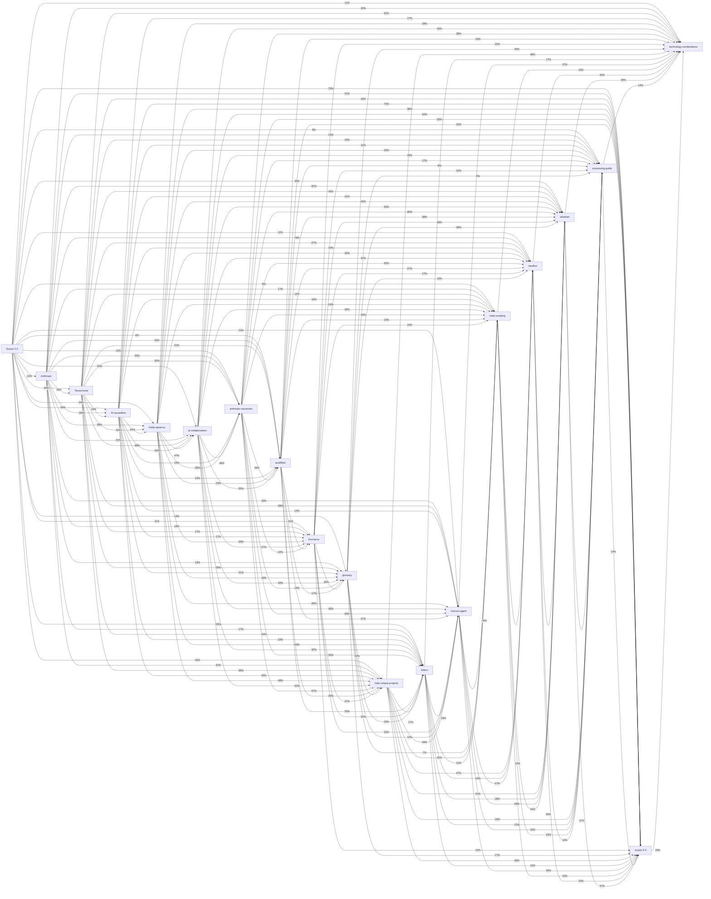

# Кросс-секционный анализ

<!-- summary -->
> _(косинусное сходство TF-IDF векторов)_
**Проекты:** Svyazi

---

_Обновлено: 2026-05-12_

---

## Матрица сходства секций

_(косинусное сходство TF-IDF векторов)_

| Секция | Svyazi 2.0 | Anthropic | Технологии | AI-ансамбли | Хабр-проекты | ai-collaborations | anthropic-vacancies | autofilled | Контакты | glossary | habr-unique-projects | letters | lorenzo-agent | meta-scripting | nautilus | obsidian | processing-guide | svyazi-2-0 | technology-combinations |
|--------|------|------|------|------|------|------|------|------|------|------|------|------|------|------|------|------|------|------|------|
| `Svyazi 2.0` | **—** | 0.12 █░░░░ | 0.16 █░░░░ | 0.94 █████ | 0.24 ██░░░ | 0.22 ██░░░ | 0.12 █░░░░ | 0.09 ░░░░░ | 0.11 █░░░░ | 0.14 █░░░░ | 0.15 █░░░░ | 0.15 █░░░░ | 0.11 █░░░░ | 0.08 ░░░░░ | 0.11 █░░░░ | 0.35 ███░░ | 0.08 ░░░░░ | 0.75 █████ | 0.11 █░░░░ |
| `Anthropic` | 0.12 █░░░░ | **—** | 0.29 ██░░░ | 0.16 █░░░░ | 0.28 ██░░░ | 0.31 ███░░ | 0.45 ████░ | 0.34 ███░░ | 0.19 █░░░░ | 0.13 █░░░░ | 0.32 ███░░ | 0.17 █░░░░ | 0.43 ████░ | 0.17 █░░░░ | 0.76 █████ | 0.81 █████ | 0.14 █░░░░ | 0.21 ██░░░ | 0.26 ██░░░ |
| `Технологии` | 0.16 █░░░░ | 0.29 ██░░░ | **—** | 0.24 ██░░░ | 0.42 ████░ | 0.38 ███░░ | 0.30 ███░░ | 0.21 ██░░░ | 0.17 █░░░░ | 0.28 ██░░░ | 0.38 ███░░ | 0.20 █░░░░ | 0.28 ██░░░ | 0.12 █░░░░ | 0.27 ██░░░ | 0.40 ███░░ | 0.15 █░░░░ | 0.29 ██░░░ | 0.52 █████ |
| `AI-ансамбли` | 0.94 █████ | 0.16 █░░░░ | 0.24 ██░░░ | **—** | 0.44 ████░ | 0.33 ███░░ | 0.15 █░░░░ | 0.13 █░░░░ | 0.17 █░░░░ | 0.21 ██░░░ | 0.25 ██░░░ | 0.22 ██░░░ | 0.13 █░░░░ | 0.10 ░░░░░ | 0.16 █░░░░ | 0.41 ████░ | 0.12 █░░░░ | 0.74 █████ | 0.17 █░░░░ |
| `Хабр-проекты` | 0.24 ██░░░ | 0.28 ██░░░ | 0.42 ████░ | 0.44 ████░ | **—** | 0.47 ████░ | 0.30 ███░░ | 0.23 ██░░░ | 0.33 ███░░ | 0.29 ██░░░ | 0.48 ████░ | 0.44 ████░ | 0.26 ██░░░ | 0.14 █░░░░ | 0.26 ██░░░ | 0.44 ████░ | 0.20 █░░░░ | 0.36 ███░░ | 0.29 ██░░░ |
| `ai-collaborations` | 0.22 ██░░░ | 0.31 ███░░ | 0.38 ███░░ | 0.33 ███░░ | 0.47 ████░ | **—** | 0.48 ████░ | 0.23 ██░░░ | 0.27 ██░░░ | 0.40 ███░░ | 0.60 █████ | 0.32 ███░░ | 0.45 ████░ | 0.20 ██░░░ | 0.42 ████░ | 0.50 █████ | 0.18 █░░░░ | 0.42 ████░ | 0.43 ████░ |
| `anthropic-vacancies` | 0.12 █░░░░ | 0.45 ████░ | 0.30 ███░░ | 0.15 █░░░░ | 0.30 ███░░ | 0.48 ████░ | **—** | 0.26 ██░░░ | 0.22 ██░░░ | 0.14 █░░░░ | 0.57 █████ | 0.20 ██░░░ | 0.63 █████ | 0.20 ██░░░ | 0.65 █████ | 0.66 █████ | 0.17 █░░░░ | 0.33 ███░░ | 0.38 ███░░ |
| `autofilled` | 0.09 ░░░░░ | 0.34 ███░░ | 0.21 ██░░░ | 0.13 █░░░░ | 0.23 ██░░░ | 0.23 ██░░░ | 0.26 ██░░░ | **—** | 0.31 ███░░ | 0.17 █░░░░ | 0.25 ██░░░ | 0.25 ██░░░ | 0.27 ██░░░ | 0.10 █░░░░ | 0.27 ██░░░ | 0.38 ███░░ | 0.09 ░░░░░ | 0.22 ██░░░ | 0.17 █░░░░ |
| `Контакты` | 0.11 █░░░░ | 0.19 █░░░░ | 0.17 █░░░░ | 0.17 █░░░░ | 0.33 ███░░ | 0.27 ██░░░ | 0.22 ██░░░ | 0.31 ███░░ | **—** | 0.16 █░░░░ | 0.27 ██░░░ | 0.32 ███░░ | 0.22 ██░░░ | 0.10 █░░░░ | 0.17 █░░░░ | 0.28 ██░░░ | 0.10 █░░░░ | 0.24 ██░░░ | 0.20 ██░░░ |
| `glossary` | 0.14 █░░░░ | 0.13 █░░░░ | 0.28 ██░░░ | 0.21 ██░░░ | 0.29 ██░░░ | 0.40 ███░░ | 0.14 █░░░░ | 0.17 █░░░░ | 0.16 █░░░░ | **—** | 0.41 ████░ | 0.20 █░░░░ | 0.12 █░░░░ | 0.07 ░░░░░ | 0.13 █░░░░ | 0.28 ██░░░ | 0.05 ░░░░░ | 0.27 ██░░░ | 0.40 ███░░ |
| `habr-unique-projects` | 0.15 █░░░░ | 0.32 ███░░ | 0.38 ███░░ | 0.25 ██░░░ | 0.48 ████░ | 0.60 █████ | 0.57 █████ | 0.25 ██░░░ | 0.27 ██░░░ | 0.41 ████░ | **—** | 0.27 ██░░░ | 0.49 ████░ | 0.20 █░░░░ | 0.47 ████░ | 0.52 █████ | 0.18 █░░░░ | 0.39 ███░░ | 0.48 ████░ |
| `letters` | 0.15 █░░░░ | 0.17 █░░░░ | 0.20 █░░░░ | 0.22 ██░░░ | 0.44 ████░ | 0.32 ███░░ | 0.20 ██░░░ | 0.25 ██░░░ | 0.32 ███░░ | 0.20 █░░░░ | 0.27 ██░░░ | **—** | 0.18 █░░░░ | 0.12 █░░░░ | 0.18 █░░░░ | 0.28 ██░░░ | 0.12 █░░░░ | 0.24 ██░░░ | 0.17 █░░░░ |
| `lorenzo-agent` | 0.11 █░░░░ | 0.43 ████░ | 0.28 ██░░░ | 0.13 █░░░░ | 0.26 ██░░░ | 0.45 ████░ | 0.63 █████ | 0.27 ██░░░ | 0.22 ██░░░ | 0.12 █░░░░ | 0.49 ████░ | 0.18 █░░░░ | **—** | 0.18 █░░░░ | 0.57 █████ | 0.59 █████ | 0.15 █░░░░ | 0.30 ██░░░ | 0.37 ███░░ |
| `meta-scripting` | 0.08 ░░░░░ | 0.17 █░░░░ | 0.12 █░░░░ | 0.10 ░░░░░ | 0.14 █░░░░ | 0.20 ██░░░ | 0.20 ██░░░ | 0.10 █░░░░ | 0.10 █░░░░ | 0.07 ░░░░░ | 0.20 █░░░░ | 0.12 █░░░░ | 0.18 █░░░░ | **—** | 0.19 █░░░░ | 0.24 ██░░░ | 0.23 ██░░░ | 0.15 █░░░░ | 0.16 █░░░░ |
| `nautilus` | 0.11 █░░░░ | 0.76 █████ | 0.27 ██░░░ | 0.16 █░░░░ | 0.26 ██░░░ | 0.42 ████░ | 0.65 █████ | 0.27 ██░░░ | 0.17 █░░░░ | 0.13 █░░░░ | 0.47 ████░ | 0.18 █░░░░ | 0.57 █████ | 0.19 █░░░░ | **—** | 0.82 █████ | 0.14 █░░░░ | 0.24 ██░░░ | 0.34 ███░░ |
| `obsidian` | 0.35 ███░░ | 0.81 █████ | 0.40 ███░░ | 0.41 ████░ | 0.44 ████░ | 0.50 █████ | 0.66 █████ | 0.38 ███░░ | 0.28 ██░░░ | 0.28 ██░░░ | 0.52 █████ | 0.28 ██░░░ | 0.59 █████ | 0.24 ██░░░ | 0.82 █████ | **—** | 0.27 ██░░░ | 0.47 ████░ | 0.43 ████░ |
| `processing-guide` | 0.08 ░░░░░ | 0.14 █░░░░ | 0.15 █░░░░ | 0.12 █░░░░ | 0.20 █░░░░ | 0.18 █░░░░ | 0.17 █░░░░ | 0.09 ░░░░░ | 0.10 █░░░░ | 0.05 ░░░░░ | 0.18 █░░░░ | 0.12 █░░░░ | 0.15 █░░░░ | 0.23 ██░░░ | 0.14 █░░░░ | 0.27 ██░░░ | **—** | 0.14 █░░░░ | 0.12 █░░░░ |
| `svyazi-2-0` | 0.75 █████ | 0.21 ██░░░ | 0.29 ██░░░ | 0.74 █████ | 0.36 ███░░ | 0.42 ████░ | 0.33 ███░░ | 0.22 ██░░░ | 0.24 ██░░░ | 0.27 ██░░░ | 0.39 ███░░ | 0.24 ██░░░ | 0.30 ██░░░ | 0.15 █░░░░ | 0.24 ██░░░ | 0.47 ████░ | 0.14 █░░░░ | **—** | 0.29 ██░░░ |
| `technology-combinations` | 0.11 █░░░░ | 0.26 ██░░░ | 0.52 █████ | 0.17 █░░░░ | 0.29 ██░░░ | 0.43 ████░ | 0.38 ███░░ | 0.17 █░░░░ | 0.20 ██░░░ | 0.40 ███░░ | 0.48 ████░ | 0.17 █░░░░ | 0.37 ███░░ | 0.16 █░░░░ | 0.34 ███░░ | 0.43 ████░ | 0.12 █░░░░ | 0.29 ██░░░ | **—** |

## Граф связей

_(толщина / процент = косинусное сходство × 100)_

```mermaid
graph LR
    01_svyazi["Svyazi 2.0"]
    02_anthropic_vacancies["Anthropic"]
    03_technology_combinations["Технологии"]
    04_ai_collaborations["AI-ансамбли"]
    05_habr_projects["Хабр-проекты"]
    ai_collaborations["ai-collaborations"]
    anthropic_vacancies["anthropic-vacancies"]
    autofilled["autofilled"]
    contacts["Контакты"]
    glossary["glossary"]
    habr_unique_projects["habr-unique-projects"]
    letters["letters"]
    lorenzo_agent["lorenzo-agent"]
    meta_scripting["meta-scripting"]
    nautilus["nautilus"]
    obsidian["obsidian"]
    processing_guide["processing-guide"]
    svyazi_2_0["svyazi-2-0"]
    technology_combinations["technology-combinations"]
    01_svyazi -- 12% --> 02_anthropic_vacancies
    01_svyazi -- 16% --> 03_technology_combinations
    01_svyazi -- 94% --> 04_ai_collaborations
    01_svyazi -- 24% --> 05_habr_projects
    01_svyazi -- 22% --> ai_collaborations
    01_svyazi -- 12% --> anthropic_vacancies
    01_svyazi -- 9% --> autofilled
    01_svyazi -- 11% --> contacts
    01_svyazi -- 14% --> glossary
    01_svyazi -- 16% --> habr_unique_projects
    01_svyazi -- 15% --> letters
    01_svyazi -- 11% --> lorenzo_agent
    01_svyazi -- 8% --> meta_scripting
    01_svyazi -- 11% --> nautilus
    01_svyazi -- 35% --> obsidian
    01_svyazi -- 8% --> processing_guide
    01_svyazi -- 75% --> svyazi_2_0
    01_svyazi -- 11% --> technology_combinations
    02_anthropic_vacancies -- 29% --> 03_technology_combinations
    02_anthropic_vacancies -- 16% --> 04_ai_collaborations
    02_anthropic_vacancies -- 28% --> 05_habr_projects
    02_anthropic_vacancies -- 31% --> ai_collaborations
    02_anthropic_vacancies -- 45% --> anthropic_vacancies
    02_anthropic_vacancies -- 34% --> autofilled
    02_anthropic_vacancies -- 19% --> contacts
    02_anthropic_vacancies -- 13% --> glossary
    02_anthropic_vacancies -- 32% --> habr_unique_projects
    02_anthropic_vacancies -- 17% --> letters
    02_anthropic_vacancies -- 43% --> lorenzo_agent
    02_anthropic_vacancies -- 17% --> meta_scripting
    02_anthropic_vacancies -- 76% --> nautilus
    02_anthropic_vacancies -- 81% --> obsidian
    02_anthropic_vacancies -- 14% --> processing_guide
    02_anthropic_vacancies -- 21% --> svyazi_2_0
    02_anthropic_vacancies -- 26% --> technology_combinations
    03_technology_combinations -- 24% --> 04_ai_collaborations
    03_technology_combinations -- 42% --> 05_habr_projects
    03_technology_combinations -- 38% --> ai_collaborations
    03_technology_combinations -- 30% --> anthropic_vacancies
    03_technology_combinations -- 21% --> autofilled
    03_technology_combinations -- 17% --> contacts
    03_technology_combinations -- 28% --> glossary
    03_technology_combinations -- 38% --> habr_unique_projects
    03_technology_combinations -- 20% --> letters
    03_technology_combinations -- 28% --> lorenzo_agent
    03_technology_combinations -- 12% --> meta_scripting
    03_technology_combinations -- 27% --> nautilus
    03_technology_combinations -- 40% --> obsidian
    03_technology_combinations -- 15% --> processing_guide
    03_technology_combinations -- 29% --> svyazi_2_0
    03_technology_combinations -- 52% --> technology_combinations
    04_ai_collaborations -- 44% --> 05_habr_projects
    04_ai_collaborations -- 33% --> ai_collaborations
    04_ai_collaborations -- 15% --> anthropic_vacancies
    04_ai_collaborations -- 13% --> autofilled
    04_ai_collaborations -- 17% --> contacts
    04_ai_collaborations -- 21% --> glossary
    04_ai_collaborations -- 25% --> habr_unique_projects
    04_ai_collaborations -- 22% --> letters
    04_ai_collaborations -- 13% --> lorenzo_agent
    04_ai_collaborations -- 10% --> meta_scripting
    04_ai_collaborations -- 16% --> nautilus
    04_ai_collaborations -- 41% --> obsidian
    04_ai_collaborations -- 12% --> processing_guide
    04_ai_collaborations -- 74% --> svyazi_2_0
    04_ai_collaborations -- 17% --> technology_combinations
    05_habr_projects -- 47% --> ai_collaborations
    05_habr_projects -- 30% --> anthropic_vacancies
    05_habr_projects -- 23% --> autofilled
    05_habr_projects -- 33% --> contacts
    05_habr_projects -- 29% --> glossary
    05_habr_projects -- 48% --> habr_unique_projects
    05_habr_projects -- 44% --> letters
    05_habr_projects -- 26% --> lorenzo_agent
    05_habr_projects -- 14% --> meta_scripting
    05_habr_projects -- 26% --> nautilus
    05_habr_projects -- 44% --> obsidian
    05_habr_projects -- 20% --> processing_guide
    05_habr_projects -- 36% --> svyazi_2_0
    05_habr_projects -- 29% --> technology_combinations
    ai_collaborations -- 48% --> anthropic_vacancies
    ai_collaborations -- 22% --> autofilled
    ai_collaborations -- 27% --> contacts
    ai_collaborations -- 40% --> glossary
    ai_collaborations -- 60% --> habr_unique_projects
    ai_collaborations -- 32% --> letters
    ai_collaborations -- 45% --> lorenzo_agent
    ai_collaborations -- 20% --> meta_scripting
    ai_collaborations -- 42% --> nautilus
    ai_collaborations -- 50% --> obsidian
    ai_collaborations -- 18% --> processing_guide
    ai_collaborations -- 42% --> svyazi_2_0
    ai_collaborations -- 43% --> technology_combinations
    anthropic_vacancies -- 26% --> autofilled
    anthropic_vacancies -- 22% --> contacts
    anthropic_vacancies -- 14% --> glossary
    anthropic_vacancies -- 57% --> habr_unique_projects
    anthropic_vacancies -- 20% --> letters
    anthropic_vacancies -- 63% --> lorenzo_agent
    anthropic_vacancies -- 20% --> meta_scripting
    anthropic_vacancies -- 65% --> nautilus
    anthropic_vacancies -- 66% --> obsidian
    anthropic_vacancies -- 17% --> processing_guide
    anthropic_vacancies -- 33% --> svyazi_2_0
    anthropic_vacancies -- 38% --> technology_combinations
    autofilled -- 31% --> contacts
    autofilled -- 17% --> glossary
    autofilled -- 25% --> habr_unique_projects
    autofilled -- 25% --> letters
    autofilled -- 27% --> lorenzo_agent
    autofilled -- 10% --> meta_scripting
    autofilled -- 27% --> nautilus
    autofilled -- 38% --> obsidian
    autofilled -- 8% --> processing_guide
    autofilled -- 22% --> svyazi_2_0
    autofilled -- 18% --> technology_combinations
    contacts -- 16% --> glossary
    contacts -- 27% --> habr_unique_projects
    contacts -- 32% --> letters
    contacts -- 22% --> lorenzo_agent
    contacts -- 10% --> meta_scripting
    contacts -- 17% --> nautilus
    contacts -- 28% --> obsidian
    contacts -- 10% --> processing_guide
    contacts -- 24% --> svyazi_2_0
    contacts -- 20% --> technology_combinations
    glossary -- 42% --> habr_unique_projects
    glossary -- 20% --> letters
    glossary -- 12% --> lorenzo_agent
    glossary -- 7% --> meta_scripting
    glossary -- 13% --> nautilus
    glossary -- 28% --> obsidian
    glossary -- 5% --> processing_guide
    glossary -- 27% --> svyazi_2_0
    glossary -- 40% --> technology_combinations
    habr_unique_projects -- 27% --> letters
    habr_unique_projects -- 49% --> lorenzo_agent
    habr_unique_projects -- 20% --> meta_scripting
    habr_unique_projects -- 47% --> nautilus
    habr_unique_projects -- 52% --> obsidian
    habr_unique_projects -- 18% --> processing_guide
    habr_unique_projects -- 39% --> svyazi_2_0
    habr_unique_projects -- 48% --> technology_combinations
    letters -- 18% --> lorenzo_agent
    letters -- 12% --> meta_scripting
    letters -- 18% --> nautilus
    letters -- 28% --> obsidian
    letters -- 12% --> processing_guide
    letters -- 24% --> svyazi_2_0
    letters -- 17% --> technology_combinations
    lorenzo_agent -- 18% --> meta_scripting
    lorenzo_agent -- 57% --> nautilus
    lorenzo_agent -- 59% --> obsidian
    lorenzo_agent -- 15% --> processing_guide
    lorenzo_agent -- 30% --> svyazi_2_0
    lorenzo_agent -- 37% --> technology_combinations
    meta_scripting -- 19% --> nautilus
    meta_scripting -- 24% --> obsidian
    meta_scripting -- 23% --> processing_guide
    meta_scripting -- 15% --> svyazi_2_0
    meta_scripting -- 16% --> technology_combinations
    nautilus -- 82% --> obsidian
    nautilus -- 14% --> processing_guide
    nautilus -- 24% --> svyazi_2_0
    nautilus -- 34% --> technology_combinations
    obsidian -- 27% --> processing_guide
    obsidian -- 47% --> svyazi_2_0
    obsidian -- 43% --> technology_combinations
    processing_guide -- 14% --> svyazi_2_0
    processing_guide -- 12% --> technology_combinations
    svyazi_2_0 -- 29% --> technology_combinations
```

## Топ-40 кросс-секционных концептов

_Присутствуют в ≥ 2 секциях_

| Концепт | Секций | Авг. TF-IDF | Присутствует в |
|---------|--------|-------------|----------------|
| `svyazi` | 19 | 12.1357 | `Svyazi 2.0`, `Anthropic`, `Технологии`, `AI-ансамбли`, `Хабр-проекты`, `ai-collaborations`, `anthropic-vacancies`, `autofilled`, `Контакты`, `glossary`, `habr-unique-projects`, `letters`, `lorenzo-agent`, `meta-scripting`, `nautilus`, `obsidian`, `processing-guide`, `svyazi-2-0`, `technology-combinations` |
| `документ` | 19 | 11.3800 | `Svyazi 2.0`, `Anthropic`, `Технологии`, `AI-ансамбли`, `Хабр-проекты`, `ai-collaborations`, `anthropic-vacancies`, `autofilled`, `Контакты`, `glossary`, `habr-unique-projects`, `letters`, `lorenzo-agent`, `meta-scripting`, `nautilus`, `obsidian`, `processing-guide`, `svyazi-2-0`, `technology-combinations` |
| `сходство` | 19 | 8.8096 | `Svyazi 2.0`, `Anthropic`, `Технологии`, `AI-ансамбли`, `Хабр-проекты`, `ai-collaborations`, `anthropic-vacancies`, `autofilled`, `Контакты`, `glossary`, `habr-unique-projects`, `letters`, `lorenzo-agent`, `meta-scripting`, `nautilus`, `obsidian`, `processing-guide`, `svyazi-2-0`, `technology-combinations` |
| `readme` | 19 | 8.1100 | `Svyazi 2.0`, `Anthropic`, `Технологии`, `AI-ансамбли`, `Хабр-проекты`, `ai-collaborations`, `anthropic-vacancies`, `autofilled`, `Контакты`, `glossary`, `habr-unique-projects`, `letters`, `lorenzo-agent`, `meta-scripting`, `nautilus`, `obsidian`, `processing-guide`, `svyazi-2-0`, `technology-combinations` |
| `документы` | 19 | 7.9652 | `Svyazi 2.0`, `Anthropic`, `Технологии`, `AI-ансамбли`, `Хабр-проекты`, `ai-collaborations`, `anthropic-vacancies`, `autofilled`, `Контакты`, `glossary`, `habr-unique-projects`, `letters`, `lorenzo-agent`, `meta-scripting`, `nautilus`, `obsidian`, `processing-guide`, `svyazi-2-0`, `technology-combinations` |
| `также` | 19 | 7.1044 | `Svyazi 2.0`, `Anthropic`, `Технологии`, `AI-ансамбли`, `Хабр-проекты`, `ai-collaborations`, `anthropic-vacancies`, `autofilled`, `Контакты`, `glossary`, `habr-unique-projects`, `letters`, `lorenzo-agent`, `meta-scripting`, `nautilus`, `obsidian`, `processing-guide`, `svyazi-2-0`, `technology-combinations` |
| `смотрите` | 19 | 7.0376 | `Svyazi 2.0`, `Anthropic`, `Технологии`, `AI-ансамбли`, `Хабр-проекты`, `ai-collaborations`, `anthropic-vacancies`, `autofilled`, `Контакты`, `glossary`, `habr-unique-projects`, `letters`, `lorenzo-agent`, `meta-scripting`, `nautilus`, `obsidian`, `processing-guide`, `svyazi-2-0`, `technology-combinations` |
| `использование` | 19 | 6.2224 | `Svyazi 2.0`, `Anthropic`, `Технологии`, `AI-ансамбли`, `Хабр-проекты`, `ai-collaborations`, `anthropic-vacancies`, `autofilled`, `Контакты`, `glossary`, `habr-unique-projects`, `letters`, `lorenzo-agent`, `meta-scripting`, `nautilus`, `obsidian`, `processing-guide`, `svyazi-2-0`, `technology-combinations` |
| `search` | 19 | 6.1385 | `Svyazi 2.0`, `Anthropic`, `Технологии`, `AI-ансамбли`, `Хабр-проекты`, `ai-collaborations`, `anthropic-vacancies`, `autofilled`, `Контакты`, `glossary`, `habr-unique-projects`, `letters`, `lorenzo-agent`, `meta-scripting`, `nautilus`, `obsidian`, `processing-guide`, `svyazi-2-0`, `technology-combinations` |
| `связанные` | 19 | 5.8648 | `Svyazi 2.0`, `Anthropic`, `Технологии`, `AI-ансамбли`, `Хабр-проекты`, `ai-collaborations`, `anthropic-vacancies`, `autofilled`, `Контакты`, `glossary`, `habr-unique-projects`, `letters`, `lorenzo-agent`, `meta-scripting`, `nautilus`, `obsidian`, `processing-guide`, `svyazi-2-0`, `technology-combinations` |
| `этот` | 19 | 5.7095 | `Svyazi 2.0`, `Anthropic`, `Технологии`, `AI-ансамбли`, `Хабр-проекты`, `ai-collaborations`, `anthropic-vacancies`, `autofilled`, `Контакты`, `glossary`, `habr-unique-projects`, `letters`, `lorenzo-agent`, `meta-scripting`, `nautilus`, `obsidian`, `processing-guide`, `svyazi-2-0`, `technology-combinations` |
| `ссылается` | 19 | 5.1329 | `Svyazi 2.0`, `Anthropic`, `Технологии`, `AI-ансамбли`, `Хабр-проекты`, `ai-collaborations`, `anthropic-vacancies`, `autofilled`, `Контакты`, `glossary`, `habr-unique-projects`, `letters`, `lorenzo-agent`, `meta-scripting`, `nautilus`, `obsidian`, `processing-guide`, `svyazi-2-0`, `technology-combinations` |
| `obsidian` | 19 | 4.6039 | `Svyazi 2.0`, `Anthropic`, `Технологии`, `AI-ансамбли`, `Хабр-проекты`, `ai-collaborations`, `anthropic-vacancies`, `autofilled`, `Контакты`, `glossary`, `habr-unique-projects`, `letters`, `lorenzo-agent`, `meta-scripting`, `nautilus`, `obsidian`, `processing-guide`, `svyazi-2-0`, `technology-combinations` |
| `похожие` | 19 | 4.3034 | `Svyazi 2.0`, `Anthropic`, `Технологии`, `AI-ансамбли`, `Хабр-проекты`, `ai-collaborations`, `anthropic-vacancies`, `autofilled`, `Контакты`, `glossary`, `habr-unique-projects`, `letters`, `lorenzo-agent`, `meta-scripting`, `nautilus`, `obsidian`, `processing-guide`, `svyazi-2-0`, `technology-combinations` |
| `ссылки` | 19 | 4.2964 | `Svyazi 2.0`, `Anthropic`, `Технологии`, `AI-ансамбли`, `Хабр-проекты`, `ai-collaborations`, `anthropic-vacancies`, `autofilled`, `Контакты`, `glossary`, `habr-unique-projects`, `letters`, `lorenzo-agent`, `meta-scripting`, `nautilus`, `obsidian`, `processing-guide`, `svyazi-2-0`, `technology-combinations` |
| `tables` | 19 | 4.0471 | `Svyazi 2.0`, `Anthropic`, `Технологии`, `AI-ансамбли`, `Хабр-проекты`, `ai-collaborations`, `anthropic-vacancies`, `autofilled`, `Контакты`, `glossary`, `habr-unique-projects`, `letters`, `lorenzo-agent`, `meta-scripting`, `nautilus`, `obsidian`, `processing-guide`, `svyazi-2-0`, `technology-combinations` |
| `time` | 19 | 3.9177 | `Svyazi 2.0`, `Anthropic`, `Технологии`, `AI-ансамбли`, `Хабр-проекты`, `ai-collaborations`, `anthropic-vacancies`, `autofilled`, `Контакты`, `glossary`, `habr-unique-projects`, `letters`, `lorenzo-agent`, `meta-scripting`, `nautilus`, `obsidian`, `processing-guide`, `svyazi-2-0`, `technology-combinations` |
| `reading` | 19 | 3.7052 | `Svyazi 2.0`, `Anthropic`, `Технологии`, `AI-ансамбли`, `Хабр-проекты`, `ai-collaborations`, `anthropic-vacancies`, `autofilled`, `Контакты`, `glossary`, `habr-unique-projects`, `letters`, `lorenzo-agent`, `meta-scripting`, `nautilus`, `obsidian`, `processing-guide`, `svyazi-2-0`, `technology-combinations` |
| `note` | 19 | 3.6918 | `Svyazi 2.0`, `Anthropic`, `Технологии`, `AI-ансамбли`, `Хабр-проекты`, `ai-collaborations`, `anthropic-vacancies`, `autofilled`, `Контакты`, `glossary`, `habr-unique-projects`, `letters`, `lorenzo-agent`, `meta-scripting`, `nautilus`, `obsidian`, `processing-guide`, `svyazi-2-0`, `technology-combinations` |
| `readability` | 19 | 3.1582 | `Svyazi 2.0`, `Anthropic`, `Технологии`, `AI-ансамбли`, `Хабр-проекты`, `ai-collaborations`, `anthropic-vacancies`, `autofilled`, `Контакты`, `glossary`, `habr-unique-projects`, `letters`, `lorenzo-agent`, `meta-scripting`, `nautilus`, `obsidian`, `processing-guide`, `svyazi-2-0`, `technology-combinations` |
| `contents` | 19 | 3.1392 | `Svyazi 2.0`, `Anthropic`, `Технологии`, `AI-ансамбли`, `Хабр-проекты`, `ai-collaborations`, `anthropic-vacancies`, `autofilled`, `Контакты`, `glossary`, `habr-unique-projects`, `letters`, `lorenzo-agent`, `meta-scripting`, `nautilus`, `obsidian`, `processing-guide`, `svyazi-2-0`, `technology-combinations` |
| `исследования` | 19 | 2.9771 | `Svyazi 2.0`, `Anthropic`, `Технологии`, `AI-ансамбли`, `Хабр-проекты`, `ai-collaborations`, `anthropic-vacancies`, `autofilled`, `Контакты`, `glossary`, `habr-unique-projects`, `letters`, `lorenzo-agent`, `meta-scripting`, `nautilus`, `obsidian`, `processing-guide`, `svyazi-2-0`, `technology-combinations` |
| `основе` | 19 | 2.9197 | `Svyazi 2.0`, `Anthropic`, `Технологии`, `AI-ансамбли`, `Хабр-проекты`, `ai-collaborations`, `anthropic-vacancies`, `autofilled`, `Контакты`, `glossary`, `habr-unique-projects`, `letters`, `lorenzo-agent`, `meta-scripting`, `nautilus`, `obsidian`, `processing-guide`, `svyazi-2-0`, `technology-combinations` |
| `проекты` | 19 | 2.8085 | `Svyazi 2.0`, `Anthropic`, `Технологии`, `AI-ансамбли`, `Хабр-проекты`, `ai-collaborations`, `anthropic-vacancies`, `autofilled`, `Контакты`, `glossary`, `habr-unique-projects`, `letters`, `lorenzo-agent`, `meta-scripting`, `nautilus`, `obsidian`, `processing-guide`, `svyazi-2-0`, `technology-combinations` |
| `содержание` | 19 | 2.1107 | `Svyazi 2.0`, `Anthropic`, `Технологии`, `AI-ансамбли`, `Хабр-проекты`, `ai-collaborations`, `anthropic-vacancies`, `autofilled`, `Контакты`, `glossary`, `habr-unique-projects`, `letters`, `lorenzo-agent`, `meta-scripting`, `nautilus`, `obsidian`, `processing-guide`, `svyazi-2-0`, `technology-combinations` |
| `файлов` | 19 | 0.5928 | `Svyazi 2.0`, `Anthropic`, `Технологии`, `AI-ансамбли`, `Хабр-проекты`, `ai-collaborations`, `anthropic-vacancies`, `autofilled`, `Контакты`, `glossary`, `habr-unique-projects`, `letters`, `lorenzo-agent`, `meta-scripting`, `nautilus`, `obsidian`, `processing-guide`, `svyazi-2-0`, `technology-combinations` |
| `lorenzo` | 18 | 7.9404 | `Svyazi 2.0`, `Anthropic`, `Технологии`, `Хабр-проекты`, `ai-collaborations`, `anthropic-vacancies`, `autofilled`, `Контакты`, `glossary`, `habr-unique-projects`, `letters`, `lorenzo-agent`, `meta-scripting`, `nautilus`, `obsidian`, `processing-guide`, `svyazi-2-0`, `technology-combinations` |
| `memory` | 18 | 6.8225 | `Svyazi 2.0`, `Anthropic`, `Технологии`, `AI-ансамбли`, `Хабр-проекты`, `ai-collaborations`, `anthropic-vacancies`, `autofilled`, `Контакты`, `glossary`, `habr-unique-projects`, `letters`, `lorenzo-agent`, `nautilus`, `obsidian`, `processing-guide`, `svyazi-2-0`, `technology-combinations` |
| `репозитория` | 18 | 5.8283 | `Svyazi 2.0`, `Anthropic`, `Технологии`, `AI-ансамбли`, `Хабр-проекты`, `ai-collaborations`, `anthropic-vacancies`, `autofilled`, `Контакты`, `habr-unique-projects`, `letters`, `lorenzo-agent`, `meta-scripting`, `nautilus`, `obsidian`, `processing-guide`, `svyazi-2-0`, `technology-combinations` |
| `knowledge` | 18 | 4.9412 | `Svyazi 2.0`, `Anthropic`, `Технологии`, `AI-ансамбли`, `Хабр-проекты`, `ai-collaborations`, `anthropic-vacancies`, `autofilled`, `Контакты`, `glossary`, `habr-unique-projects`, `letters`, `lorenzo-agent`, `nautilus`, `obsidian`, `processing-guide`, `svyazi-2-0`, `technology-combinations` |
| `habr` | 18 | 4.9355 | `Svyazi 2.0`, `Anthropic`, `Технологии`, `AI-ансамбли`, `Хабр-проекты`, `ai-collaborations`, `anthropic-vacancies`, `autofilled`, `Контакты`, `glossary`, `habr-unique-projects`, `letters`, `lorenzo-agent`, `nautilus`, `obsidian`, `processing-guide`, `svyazi-2-0`, `technology-combinations` |
| `claude` | 18 | 4.5527 | `Svyazi 2.0`, `Anthropic`, `Технологии`, `AI-ансамбли`, `Хабр-проекты`, `ai-collaborations`, `anthropic-vacancies`, `Контакты`, `glossary`, `habr-unique-projects`, `letters`, `lorenzo-agent`, `meta-scripting`, `nautilus`, `obsidian`, `processing-guide`, `svyazi-2-0`, `technology-combinations` |
| `outline` | 18 | 3.4329 | `Svyazi 2.0`, `Anthropic`, `Технологии`, `AI-ансамбли`, `Хабр-проекты`, `ai-collaborations`, `anthropic-vacancies`, `autofilled`, `Контакты`, `glossary`, `habr-unique-projects`, `lorenzo-agent`, `meta-scripting`, `nautilus`, `obsidian`, `processing-guide`, `svyazi-2-0`, `technology-combinations` |
| `создан` | 18 | 3.0661 | `Svyazi 2.0`, `Anthropic`, `Технологии`, `Хабр-проекты`, `ai-collaborations`, `anthropic-vacancies`, `autofilled`, `Контакты`, `glossary`, `habr-unique-projects`, `letters`, `lorenzo-agent`, `meta-scripting`, `nautilus`, `obsidian`, `processing-guide`, `svyazi-2-0`, `technology-combinations` |
| `ведут` | 18 | 3.0618 | `Svyazi 2.0`, `Anthropic`, `Технологии`, `Хабр-проекты`, `ai-collaborations`, `anthropic-vacancies`, `autofilled`, `Контакты`, `glossary`, `habr-unique-projects`, `letters`, `lorenzo-agent`, `meta-scripting`, `nautilus`, `obsidian`, `processing-guide`, `svyazi-2-0`, `technology-combinations` |
| `материалы` | 18 | 3.0606 | `Svyazi 2.0`, `Anthropic`, `Технологии`, `Хабр-проекты`, `ai-collaborations`, `anthropic-vacancies`, `autofilled`, `Контакты`, `glossary`, `habr-unique-projects`, `letters`, `lorenzo-agent`, `meta-scripting`, `nautilus`, `obsidian`, `processing-guide`, `svyazi-2-0`, `technology-combinations` |
| `research` | 18 | 2.7299 | `Svyazi 2.0`, `Anthropic`, `Технологии`, `AI-ансамбли`, `Хабр-проекты`, `ai-collaborations`, `anthropic-vacancies`, `autofilled`, `Контакты`, `glossary`, `habr-unique-projects`, `letters`, `lorenzo-agent`, `nautilus`, `obsidian`, `processing-guide`, `svyazi-2-0`, `technology-combinations` |
| `проект` | 18 | 1.8957 | `Svyazi 2.0`, `Anthropic`, `Технологии`, `AI-ансамбли`, `Хабр-проекты`, `ai-collaborations`, `anthropic-vacancies`, `autofilled`, `Контакты`, `glossary`, `habr-unique-projects`, `letters`, `lorenzo-agent`, `nautilus`, `obsidian`, `processing-guide`, `svyazi-2-0`, `technology-combinations` |
| `раздел` | 18 | 1.8086 | `Svyazi 2.0`, `Anthropic`, `Технологии`, `AI-ансамбли`, `Хабр-проекты`, `ai-collaborations`, `anthropic-vacancies`, `Контакты`, `glossary`, `habr-unique-projects`, `letters`, `lorenzo-agent`, `meta-scripting`, `nautilus`, `obsidian`, `processing-guide`, `svyazi-2-0`, `technology-combinations` |
| `auto` | 18 | 1.8003 | `Svyazi 2.0`, `Anthropic`, `Технологии`, `AI-ансамбли`, `Хабр-проекты`, `ai-collaborations`, `anthropic-vacancies`, `autofilled`, `Контакты`, `glossary`, `habr-unique-projects`, `letters`, `meta-scripting`, `nautilus`, `obsidian`, `processing-guide`, `svyazi-2-0`, `technology-combinations` |

## Детальная карта концептов

_Для каждого концепта — TF-IDF вес в каждой секции_

| Концепт | Svyazi 2.0 | Anthropic | Технологии | AI-ансамбл | Хабр-проек | ai-collabo | anthropic- | autofilled | Контакты | glossary | habr-uniqu | letters | lorenzo-ag | meta-scrip | nautilus | obsidian | processing | svyazi-2-0 | technology |
|---------|------|------|------|------|------|------|------|------|------|------|------|------|------|------|------|------|------|------|------|
| `svyazi` | **13.147** | **0.967** | **10.495** | **15.446** | **10.420** | **8.342** | **0.275** | **55.092** | **18.155** | **48.343** | **6.560** | **14.517** | **0.552** | **0.677** | **0.160** | **4.163** | **2.197** | **15.927** | **5.144** |
| `документ` | **5.555** | **8.160** | **9.745** | **3.792** | **5.692** | **11.123** | **11.240** | **24.485** | **29.049** | **5.071** | **14.957** | **11.199** | **11.180** | **10.156** | **6.598** | **7.365** | **5.616** | **17.425** | **17.810** |
| `сходство` | **4.259** | **4.523** | **5.622** | **2.312** | **3.763** | **9.947** | **9.426** | **21.703** | **18.518** | **4.057** | **11.021** | **12.443** | **8.604** | **14.218** | **5.843** | **4.653** | **5.005** | **11.242** | **10.223** |
| `readme` | **3.518** | **5.301** | **9.370** | **1.711** | **6.850** | **9.198** | **6.183** | **30.607** | **13.435** | **5.071** | **8.725** | **10.784** | **4.923** | **7.447** | **4.279** | **5.704** | **3.418** | **10.493** | **7.073** |
| `документы` | **6.481** | **9.117** | **10.120** | **3.468** | **5.403** | **4.813** | **6.101** | **43.962** | **16.340** | **1.352** | **4.789** | **4.977** | **5.153** | **6.093** | **2.708** | **5.643** | **4.395** | **6.308** | **4.115** |
| `также` | **5.463** | **3.888** | **3.373** | **3.237** | **4.052** | **8.449** | **9.041** | **15.025** | **16.340** | **3.719** | **9.643** | **3.733** | **8.604** | **8.802** | **4.478** | **5.421** | **2.320** | **9.431** | **9.966** |
| `смотрите` | **5.370** | **3.781** | **3.373** | **3.098** | **3.859** | **8.235** | **8.931** | **15.025** | **16.340** | **3.719** | **9.512** | **3.733** | **8.604** | **8.802** | **4.348** | **5.394** | **2.320** | **9.369** | **9.902** |
| `использование` | **4.629** | **3.136** | **2.998** | **3.237** | **3.377** | **8.877** | **9.371** | **18.364** | **0.726** | **4.057** | **10.168** | **10.784** | **8.972** | **1.354** | **4.287** | **6.148** | **0.244** | **8.494** | **9.002** |
| `search` | **17.313** | **0.675** | **3.748** | **9.295** | **0.868** | **7.594** | **6.019** | **3.339** | **4.720** | **3.043** | **5.838** | **1.659** | **6.579** | **10.156** | **4.028** | **3.405** | **5.372** | **18.737** | **4.244** |
| `связанные` | **1.111** | **6.840** | **8.995** | **0.185** | **3.763** | **4.171** | **5.826** | **42.849** | **0.726** | **2.028** | **6.363** | **1.659** | **5.153** | **2.708** | **2.250** | **3.761** | **2.197** | **5.122** | **5.722** |
| `этот` | **3.981** | **4.415** | **4.123** | **3.515** | **2.701** | **4.171** | **3.957** | **18.364** | **13.435** | **2.704** | **6.166** | **7.880** | **3.267** | **5.416** | **2.716** | **3.651** | **2.564** | **7.995** | **7.458** |
| `ссылается` | **3.333** | **3.561** | **4.123** | **2.636** | **2.508** | **3.957** | **3.270** | **18.364** | **13.435** | **2.704** | **6.035** | **4.148** | **2.853** | **4.739** | **2.029** | **2.989** | **2.075** | **7.370** | **7.394** |
| `obsidian` | **0.463** | **0.404** | **1.874** | **1.295** | **3.956** | **6.096** | **5.386** | **5.565** | **1.452** | **2.704** | **8.594** | **7.880** | **5.153** | **7.447** | **3.883** | **5.877** | **6.959** | **6.121** | **6.365** |
| `похожие` | **5.463** | **3.505** | **4.123** | **3.191** | **2.508** | **3.316** | **3.050** | **7.234** | **16.340** | **1.352** | **3.674** | **4.148** | **2.853** | **5.416** | **1.945** | **2.952** | **3.541** | **3.747** | **3.408** |
| `ссылки` | **0.833** | **2.998** | **5.247** | **0.231** | **2.026** | **4.599** | **5.799** | **22.816** | **0.726** | **2.028** | **6.363** | **1.659** | **5.199** | **2.708** | **2.510** | **2.657** | **2.197** | **5.246** | **5.787** |
| `tables` | **1.111** | **0.251** | **0.750** | **1.572** | **0.386** | **5.989** | **3.655** | **18.364** | **4.357** | **2.704** | **5.379** | **0.830** | **5.337** | **10.156** | **1.198** | **1.077** | **0.855** | **4.309** | **8.616** |
| `time` | **0.833** | **0.757** | **0.750** | **0.786** | **0.868** | **5.882** | **6.183** | **2.226** | **5.083** | **2.704** | **5.117** | **7.880** | **6.625** | **9.479** | **4.585** | **1.674** | **0.977** | **4.309** | **7.716** |
| `reading` | **0.555** | **0.297** | **0.750** | **0.462** | **0.772** | **5.775** | **6.073** | **2.226** | **5.083** | **2.704** | **4.986** | **7.466** | **5.981** | **10.833** | **3.997** | **1.319** | **1.953** | **5.371** | **3.793** |
| `note` | **0.648** | **2.241** | **4.123** | **0.092** | **1.447** | **4.171** | **4.589** | **10.017** | **1.452** | **2.366** | **6.166** | **5.807** | **4.969** | **4.739** | **2.525** | **2.626** | **2.197** | **4.372** | **5.594** |
| `readability` | **0.741** | **0.317** | **0.750** | **0.555** | **1.158** | **5.989** | **5.881** | **3.339** | **5.083** | **2.028** | **5.117** | **0.830** | **5.705** | **9.479** | **3.875** | **1.099** | **0.977** | **3.997** | **3.086** |

<!-- see-also -->

---

**Смотрите также:**
- [STATS](STATS.md)
- [KEYWORD_INDEX](KEYWORD_INDEX.md)
- [CONCEPT_GRAPH](CONCEPT_GRAPH.md)
- [KNOWLEDGE_MAP](KNOWLEDGE_MAP.md)

