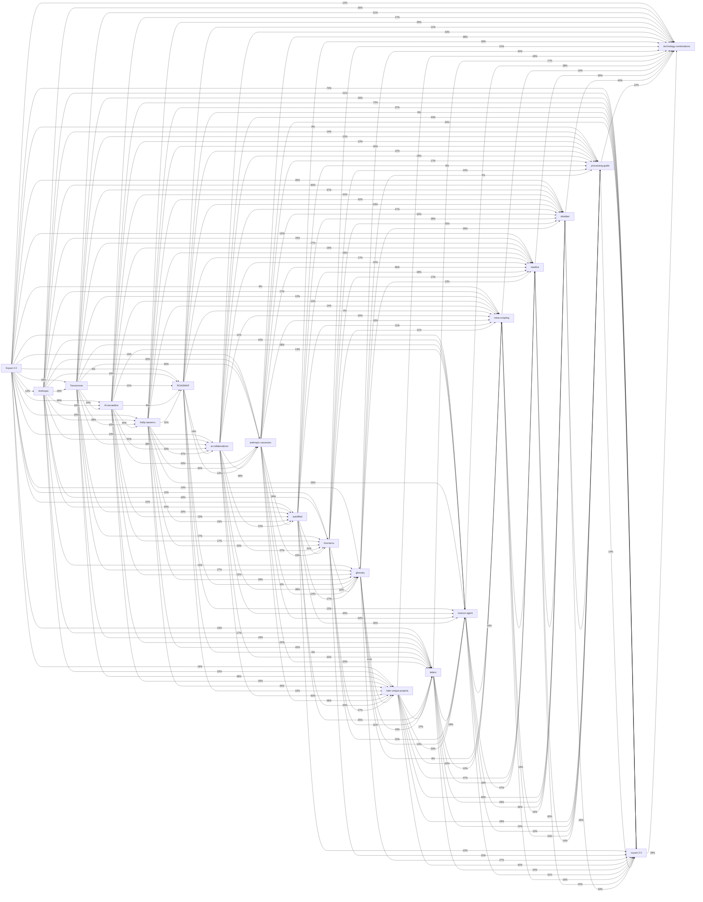

# Кросс-секционный анализ

<!-- summary -->
> _(косинусное сходство TF-IDF векторов)_
**Проекты:** Svyazi

---

_Обновлено: 2026-05-13_

---

## Матрица сходства секций

_(косинусное сходство TF-IDF векторов)_

| Секция | Svyazi 2.0 | Anthropic | Технологии | AI-ансамбли | Хабр-проекты | ROADMAP | ai-collaborations | anthropic-vacancies | autofilled | Контакты | glossary | habr-unique-projects | letters | lorenzo-agent | meta-scripting | nautilus | obsidian | processing-guide | svyazi-2-0 | technology-combinations |
|--------|------|------|------|------|------|------|------|------|------|------|------|------|------|------|------|------|------|------|------|------|
| `Svyazi 2.0` | **—** | 0.12 █░░░░ | 0.16 █░░░░ | 0.94 █████ | 0.25 ██░░░ | 0.06 ░░░░░ | 0.23 ██░░░ | 0.13 █░░░░ | 0.10 ░░░░░ | 0.12 █░░░░ | 0.14 █░░░░ | 0.16 █░░░░ | 0.15 █░░░░ | 0.11 █░░░░ | 0.08 ░░░░░ | 0.12 █░░░░ | 0.35 ███░░ | 0.09 ░░░░░ | 0.74 █████ | 0.12 █░░░░ |
| `Anthropic` | 0.12 █░░░░ | **—** | 0.29 ██░░░ | 0.16 █░░░░ | 0.28 ██░░░ | 0.15 █░░░░ | 0.31 ███░░ | 0.45 ████░ | 0.34 ███░░ | 0.18 █░░░░ | 0.13 █░░░░ | 0.32 ███░░ | 0.17 █░░░░ | 0.43 ████░ | 0.17 █░░░░ | 0.76 █████ | 0.80 █████ | 0.14 █░░░░ | 0.21 ██░░░ | 0.26 ██░░░ |
| `Технологии` | 0.16 █░░░░ | 0.29 ██░░░ | **—** | 0.24 ██░░░ | 0.42 ████░ | 0.11 █░░░░ | 0.38 ███░░ | 0.30 ███░░ | 0.20 ██░░░ | 0.17 █░░░░ | 0.27 ██░░░ | 0.38 ███░░ | 0.19 █░░░░ | 0.28 ██░░░ | 0.12 █░░░░ | 0.27 ██░░░ | 0.37 ███░░ | 0.15 █░░░░ | 0.29 ██░░░ | 0.51 █████ |
| `AI-ансамбли` | 0.94 █████ | 0.16 █░░░░ | 0.24 ██░░░ | **—** | 0.44 ████░ | 0.09 ░░░░░ | 0.33 ███░░ | 0.16 █░░░░ | 0.13 █░░░░ | 0.17 █░░░░ | 0.21 ██░░░ | 0.26 ██░░░ | 0.22 ██░░░ | 0.14 █░░░░ | 0.10 █░░░░ | 0.16 █░░░░ | 0.41 ████░ | 0.12 █░░░░ | 0.72 █████ | 0.17 █░░░░ |
| `Хабр-проекты` | 0.25 ██░░░ | 0.28 ██░░░ | 0.42 ████░ | 0.44 ████░ | **—** | 0.11 █░░░░ | 0.47 ████░ | 0.30 ███░░ | 0.23 ██░░░ | 0.33 ███░░ | 0.29 ██░░░ | 0.49 ████░ | 0.42 ████░ | 0.26 ██░░░ | 0.14 █░░░░ | 0.26 ██░░░ | 0.41 ████░ | 0.20 █░░░░ | 0.37 ███░░ | 0.29 ██░░░ |
| `ROADMAP` | 0.06 ░░░░░ | 0.15 █░░░░ | 0.11 █░░░░ | 0.09 ░░░░░ | 0.11 █░░░░ | **—** | 0.14 █░░░░ | 0.12 █░░░░ | 0.03 ░░░░░ | 0.04 ░░░░░ | 0.07 ░░░░░ | 0.10 ░░░░░ | 0.06 ░░░░░ | 0.12 █░░░░ | 0.07 ░░░░░ | 0.17 █░░░░ | 0.19 █░░░░ | 0.12 █░░░░ | 0.09 ░░░░░ | 0.11 █░░░░ |
| `ai-collaborations` | 0.23 ██░░░ | 0.31 ███░░ | 0.38 ███░░ | 0.33 ███░░ | 0.47 ████░ | 0.14 █░░░░ | **—** | 0.48 ████░ | 0.23 ██░░░ | 0.27 ██░░░ | 0.39 ███░░ | 0.60 █████ | 0.32 ███░░ | 0.45 ████░ | 0.20 ██░░░ | 0.42 ████░ | 0.47 ████░ | 0.18 █░░░░ | 0.43 ████░ | 0.43 ████░ |
| `anthropic-vacancies` | 0.13 █░░░░ | 0.45 ████░ | 0.30 ███░░ | 0.16 █░░░░ | 0.30 ███░░ | 0.12 █░░░░ | 0.48 ████░ | **—** | 0.26 ██░░░ | 0.22 ██░░░ | 0.14 █░░░░ | 0.58 █████ | 0.20 ██░░░ | 0.64 █████ | 0.20 ██░░░ | 0.66 █████ | 0.62 █████ | 0.17 █░░░░ | 0.34 ███░░ | 0.38 ███░░ |
| `autofilled` | 0.10 ░░░░░ | 0.34 ███░░ | 0.20 ██░░░ | 0.13 █░░░░ | 0.23 ██░░░ | 0.03 ░░░░░ | 0.23 ██░░░ | 0.26 ██░░░ | **—** | 0.31 ███░░ | 0.17 █░░░░ | 0.25 ██░░░ | 0.25 ██░░░ | 0.26 ██░░░ | 0.11 █░░░░ | 0.28 ██░░░ | 0.36 ███░░ | 0.08 ░░░░░ | 0.22 ██░░░ | 0.17 █░░░░ |
| `Контакты` | 0.12 █░░░░ | 0.18 █░░░░ | 0.17 █░░░░ | 0.17 █░░░░ | 0.33 ███░░ | 0.04 ░░░░░ | 0.27 ██░░░ | 0.22 ██░░░ | 0.31 ███░░ | **—** | 0.16 █░░░░ | 0.27 ██░░░ | 0.31 ███░░ | 0.22 ██░░░ | 0.11 █░░░░ | 0.17 █░░░░ | 0.25 ██░░░ | 0.10 █░░░░ | 0.25 ██░░░ | 0.21 ██░░░ |
| `glossary` | 0.14 █░░░░ | 0.13 █░░░░ | 0.27 ██░░░ | 0.21 ██░░░ | 0.29 ██░░░ | 0.07 ░░░░░ | 0.39 ███░░ | 0.14 █░░░░ | 0.17 █░░░░ | 0.16 █░░░░ | **—** | 0.41 ████░ | 0.19 █░░░░ | 0.13 █░░░░ | 0.06 ░░░░░ | 0.13 █░░░░ | 0.29 ██░░░ | 0.05 ░░░░░ | 0.27 ██░░░ | 0.40 ████░ |
| `habr-unique-projects` | 0.16 █░░░░ | 0.32 ███░░ | 0.38 ███░░ | 0.26 ██░░░ | 0.49 ████░ | 0.10 ░░░░░ | 0.60 █████ | 0.58 █████ | 0.25 ██░░░ | 0.27 ██░░░ | 0.41 ████░ | **—** | 0.27 ██░░░ | 0.50 █████ | 0.20 ██░░░ | 0.47 ████░ | 0.48 ████░ | 0.18 █░░░░ | 0.40 ███░░ | 0.49 ████░ |
| `letters` | 0.15 █░░░░ | 0.17 █░░░░ | 0.19 █░░░░ | 0.22 ██░░░ | 0.42 ████░ | 0.06 ░░░░░ | 0.32 ███░░ | 0.20 ██░░░ | 0.25 ██░░░ | 0.31 ███░░ | 0.19 █░░░░ | 0.27 ██░░░ | **—** | 0.18 █░░░░ | 0.12 █░░░░ | 0.18 █░░░░ | 0.26 ██░░░ | 0.12 █░░░░ | 0.24 ██░░░ | 0.17 █░░░░ |
| `lorenzo-agent` | 0.11 █░░░░ | 0.43 ████░ | 0.28 ██░░░ | 0.14 █░░░░ | 0.26 ██░░░ | 0.12 █░░░░ | 0.45 ████░ | 0.64 █████ | 0.26 ██░░░ | 0.22 ██░░░ | 0.13 █░░░░ | 0.50 █████ | 0.18 █░░░░ | **—** | 0.19 █░░░░ | 0.57 █████ | 0.56 █████ | 0.15 █░░░░ | 0.31 ███░░ | 0.38 ███░░ |
| `meta-scripting` | 0.08 ░░░░░ | 0.17 █░░░░ | 0.12 █░░░░ | 0.10 █░░░░ | 0.14 █░░░░ | 0.07 ░░░░░ | 0.20 ██░░░ | 0.20 ██░░░ | 0.11 █░░░░ | 0.11 █░░░░ | 0.06 ░░░░░ | 0.20 ██░░░ | 0.12 █░░░░ | 0.19 █░░░░ | **—** | 0.19 █░░░░ | 0.24 ██░░░ | 0.23 ██░░░ | 0.16 █░░░░ | 0.15 █░░░░ |
| `nautilus` | 0.12 █░░░░ | 0.76 █████ | 0.27 ██░░░ | 0.16 █░░░░ | 0.26 ██░░░ | 0.17 █░░░░ | 0.42 ████░ | 0.66 █████ | 0.28 ██░░░ | 0.17 █░░░░ | 0.13 █░░░░ | 0.47 ████░ | 0.18 █░░░░ | 0.57 █████ | 0.19 █░░░░ | **—** | 0.82 █████ | 0.14 █░░░░ | 0.24 ██░░░ | 0.35 ███░░ |
| `obsidian` | 0.35 ███░░ | 0.80 █████ | 0.37 ███░░ | 0.41 ████░ | 0.41 ████░ | 0.19 █░░░░ | 0.47 ████░ | 0.62 █████ | 0.36 ███░░ | 0.25 ██░░░ | 0.29 ██░░░ | 0.48 ████░ | 0.26 ██░░░ | 0.56 █████ | 0.24 ██░░░ | 0.82 █████ | **—** | 0.26 ██░░░ | 0.43 ████░ | 0.40 ████░ |
| `processing-guide` | 0.09 ░░░░░ | 0.14 █░░░░ | 0.15 █░░░░ | 0.12 █░░░░ | 0.20 █░░░░ | 0.12 █░░░░ | 0.18 █░░░░ | 0.17 █░░░░ | 0.08 ░░░░░ | 0.10 █░░░░ | 0.05 ░░░░░ | 0.18 █░░░░ | 0.12 █░░░░ | 0.15 █░░░░ | 0.23 ██░░░ | 0.14 █░░░░ | 0.26 ██░░░ | **—** | 0.14 █░░░░ | 0.12 █░░░░ |
| `svyazi-2-0` | 0.74 █████ | 0.21 ██░░░ | 0.29 ██░░░ | 0.72 █████ | 0.37 ███░░ | 0.09 ░░░░░ | 0.43 ████░ | 0.34 ███░░ | 0.22 ██░░░ | 0.25 ██░░░ | 0.27 ██░░░ | 0.40 ███░░ | 0.24 ██░░░ | 0.31 ███░░ | 0.16 █░░░░ | 0.24 ██░░░ | 0.43 ████░ | 0.14 █░░░░ | **—** | 0.29 ██░░░ |
| `technology-combinations` | 0.12 █░░░░ | 0.26 ██░░░ | 0.51 █████ | 0.17 █░░░░ | 0.29 ██░░░ | 0.11 █░░░░ | 0.43 ████░ | 0.38 ███░░ | 0.17 █░░░░ | 0.21 ██░░░ | 0.40 ████░ | 0.49 ████░ | 0.17 █░░░░ | 0.38 ███░░ | 0.15 █░░░░ | 0.35 ███░░ | 0.40 ████░ | 0.12 █░░░░ | 0.29 ██░░░ | **—** |

## Граф связей

_(толщина / процент = косинусное сходство × 100)_

```mermaid
graph LR
    01_svyazi["Svyazi 2.0"]
    02_anthropic_vacancies["Anthropic"]
    03_technology_combinations["Технологии"]
    04_ai_collaborations["AI-ансамбли"]
    05_habr_projects["Хабр-проекты"]
    ROADMAP["ROADMAP"]
    ai_collaborations["ai-collaborations"]
    anthropic_vacancies["anthropic-vacancies"]
    autofilled["autofilled"]
    contacts["Контакты"]
    glossary["glossary"]
    habr_unique_projects["habr-unique-projects"]
    letters["letters"]
    lorenzo_agent["lorenzo-agent"]
    meta_scripting["meta-scripting"]
    nautilus["nautilus"]
    obsidian["obsidian"]
    processing_guide["processing-guide"]
    svyazi_2_0["svyazi-2-0"]
    technology_combinations["technology-combinations"]
    01_svyazi -- 12% --> 02_anthropic_vacancies
    01_svyazi -- 16% --> 03_technology_combinations
    01_svyazi -- 94% --> 04_ai_collaborations
    01_svyazi -- 25% --> 05_habr_projects
    01_svyazi -- 6% --> ROADMAP
    01_svyazi -- 23% --> ai_collaborations
    01_svyazi -- 13% --> anthropic_vacancies
    01_svyazi -- 10% --> autofilled
    01_svyazi -- 12% --> contacts
    01_svyazi -- 14% --> glossary
    01_svyazi -- 16% --> habr_unique_projects
    01_svyazi -- 16% --> letters
    01_svyazi -- 11% --> lorenzo_agent
    01_svyazi -- 8% --> meta_scripting
    01_svyazi -- 12% --> nautilus
    01_svyazi -- 35% --> obsidian
    01_svyazi -- 8% --> processing_guide
    01_svyazi -- 74% --> svyazi_2_0
    01_svyazi -- 12% --> technology_combinations
    02_anthropic_vacancies -- 29% --> 03_technology_combinations
    02_anthropic_vacancies -- 16% --> 04_ai_collaborations
    02_anthropic_vacancies -- 28% --> 05_habr_projects
    02_anthropic_vacancies -- 16% --> ROADMAP
    02_anthropic_vacancies -- 31% --> ai_collaborations
    02_anthropic_vacancies -- 45% --> anthropic_vacancies
    02_anthropic_vacancies -- 34% --> autofilled
    02_anthropic_vacancies -- 18% --> contacts
    02_anthropic_vacancies -- 13% --> glossary
    02_anthropic_vacancies -- 32% --> habr_unique_projects
    02_anthropic_vacancies -- 17% --> letters
    02_anthropic_vacancies -- 44% --> lorenzo_agent
    02_anthropic_vacancies -- 17% --> meta_scripting
    02_anthropic_vacancies -- 76% --> nautilus
    02_anthropic_vacancies -- 80% --> obsidian
    02_anthropic_vacancies -- 14% --> processing_guide
    02_anthropic_vacancies -- 21% --> svyazi_2_0
    02_anthropic_vacancies -- 26% --> technology_combinations
    03_technology_combinations -- 24% --> 04_ai_collaborations
    03_technology_combinations -- 42% --> 05_habr_projects
    03_technology_combinations -- 11% --> ROADMAP
    03_technology_combinations -- 38% --> ai_collaborations
    03_technology_combinations -- 30% --> anthropic_vacancies
    03_technology_combinations -- 20% --> autofilled
    03_technology_combinations -- 17% --> contacts
    03_technology_combinations -- 27% --> glossary
    03_technology_combinations -- 38% --> habr_unique_projects
    03_technology_combinations -- 19% --> letters
    03_technology_combinations -- 28% --> lorenzo_agent
    03_technology_combinations -- 12% --> meta_scripting
    03_technology_combinations -- 27% --> nautilus
    03_technology_combinations -- 37% --> obsidian
    03_technology_combinations -- 15% --> processing_guide
    03_technology_combinations -- 29% --> svyazi_2_0
    03_technology_combinations -- 51% --> technology_combinations
    04_ai_collaborations -- 44% --> 05_habr_projects
    04_ai_collaborations -- 9% --> ROADMAP
    04_ai_collaborations -- 33% --> ai_collaborations
    04_ai_collaborations -- 16% --> anthropic_vacancies
    04_ai_collaborations -- 13% --> autofilled
    04_ai_collaborations -- 17% --> contacts
    04_ai_collaborations -- 22% --> glossary
    04_ai_collaborations -- 26% --> habr_unique_projects
    04_ai_collaborations -- 22% --> letters
    04_ai_collaborations -- 14% --> lorenzo_agent
    04_ai_collaborations -- 10% --> meta_scripting
    04_ai_collaborations -- 16% --> nautilus
    04_ai_collaborations -- 41% --> obsidian
    04_ai_collaborations -- 12% --> processing_guide
    04_ai_collaborations -- 72% --> svyazi_2_0
    04_ai_collaborations -- 17% --> technology_combinations
    05_habr_projects -- 11% --> ROADMAP
    05_habr_projects -- 47% --> ai_collaborations
    05_habr_projects -- 30% --> anthropic_vacancies
    05_habr_projects -- 23% --> autofilled
    05_habr_projects -- 33% --> contacts
    05_habr_projects -- 29% --> glossary
    05_habr_projects -- 49% --> habr_unique_projects
    05_habr_projects -- 42% --> letters
    05_habr_projects -- 26% --> lorenzo_agent
    05_habr_projects -- 14% --> meta_scripting
    05_habr_projects -- 26% --> nautilus
    05_habr_projects -- 42% --> obsidian
    05_habr_projects -- 20% --> processing_guide
    05_habr_projects -- 37% --> svyazi_2_0
    05_habr_projects -- 29% --> technology_combinations
    ROADMAP -- 14% --> ai_collaborations
    ROADMAP -- 12% --> anthropic_vacancies
    ROADMAP -- 6% --> glossary
    ROADMAP -- 10% --> habr_unique_projects
    ROADMAP -- 6% --> letters
    ROADMAP -- 12% --> lorenzo_agent
    ROADMAP -- 6% --> meta_scripting
    ROADMAP -- 17% --> nautilus
    ROADMAP -- 19% --> obsidian
    ROADMAP -- 12% --> processing_guide
    ROADMAP -- 9% --> svyazi_2_0
    ROADMAP -- 11% --> technology_combinations
    ai_collaborations -- 48% --> anthropic_vacancies
    ai_collaborations -- 22% --> autofilled
    ai_collaborations -- 27% --> contacts
    ai_collaborations -- 39% --> glossary
    ai_collaborations -- 60% --> habr_unique_projects
    ai_collaborations -- 32% --> letters
    ai_collaborations -- 45% --> lorenzo_agent
    ai_collaborations -- 20% --> meta_scripting
    ai_collaborations -- 42% --> nautilus
    ai_collaborations -- 47% --> obsidian
    ai_collaborations -- 18% --> processing_guide
    ai_collaborations -- 43% --> svyazi_2_0
    ai_collaborations -- 43% --> technology_combinations
    anthropic_vacancies -- 26% --> autofilled
    anthropic_vacancies -- 22% --> contacts
    anthropic_vacancies -- 14% --> glossary
    anthropic_vacancies -- 58% --> habr_unique_projects
    anthropic_vacancies -- 20% --> letters
    anthropic_vacancies -- 64% --> lorenzo_agent
    anthropic_vacancies -- 20% --> meta_scripting
    anthropic_vacancies -- 66% --> nautilus
    anthropic_vacancies -- 62% --> obsidian
    anthropic_vacancies -- 17% --> processing_guide
    anthropic_vacancies -- 34% --> svyazi_2_0
    anthropic_vacancies -- 38% --> technology_combinations
    autofilled -- 31% --> contacts
    autofilled -- 17% --> glossary
    autofilled -- 25% --> habr_unique_projects
    autofilled -- 25% --> letters
    autofilled -- 26% --> lorenzo_agent
    autofilled -- 11% --> meta_scripting
    autofilled -- 28% --> nautilus
    autofilled -- 36% --> obsidian
    autofilled -- 8% --> processing_guide
    autofilled -- 22% --> svyazi_2_0
    autofilled -- 18% --> technology_combinations
    contacts -- 16% --> glossary
    contacts -- 27% --> habr_unique_projects
    contacts -- 31% --> letters
    contacts -- 22% --> lorenzo_agent
    contacts -- 11% --> meta_scripting
    contacts -- 17% --> nautilus
    contacts -- 25% --> obsidian
    contacts -- 10% --> processing_guide
    contacts -- 25% --> svyazi_2_0
    contacts -- 21% --> technology_combinations
    glossary -- 41% --> habr_unique_projects
    glossary -- 19% --> letters
    glossary -- 13% --> lorenzo_agent
    glossary -- 6% --> meta_scripting
    glossary -- 13% --> nautilus
    glossary -- 29% --> obsidian
    glossary -- 5% --> processing_guide
    glossary -- 27% --> svyazi_2_0
    glossary -- 40% --> technology_combinations
    habr_unique_projects -- 27% --> letters
    habr_unique_projects -- 50% --> lorenzo_agent
    habr_unique_projects -- 20% --> meta_scripting
    habr_unique_projects -- 47% --> nautilus
    habr_unique_projects -- 48% --> obsidian
    habr_unique_projects -- 18% --> processing_guide
    habr_unique_projects -- 40% --> svyazi_2_0
    habr_unique_projects -- 49% --> technology_combinations
    letters -- 18% --> lorenzo_agent
    letters -- 12% --> meta_scripting
    letters -- 18% --> nautilus
    letters -- 26% --> obsidian
    letters -- 12% --> processing_guide
    letters -- 24% --> svyazi_2_0
    letters -- 17% --> technology_combinations
    lorenzo_agent -- 19% --> meta_scripting
    lorenzo_agent -- 57% --> nautilus
    lorenzo_agent -- 56% --> obsidian
    lorenzo_agent -- 15% --> processing_guide
    lorenzo_agent -- 31% --> svyazi_2_0
    lorenzo_agent -- 38% --> technology_combinations
    meta_scripting -- 19% --> nautilus
    meta_scripting -- 24% --> obsidian
    meta_scripting -- 23% --> processing_guide
    meta_scripting -- 16% --> svyazi_2_0
    meta_scripting -- 15% --> technology_combinations
    nautilus -- 82% --> obsidian
    nautilus -- 14% --> processing_guide
    nautilus -- 24% --> svyazi_2_0
    nautilus -- 35% --> technology_combinations
    obsidian -- 26% --> processing_guide
    obsidian -- 43% --> svyazi_2_0
    obsidian -- 40% --> technology_combinations
    processing_guide -- 14% --> svyazi_2_0
    processing_guide -- 12% --> technology_combinations
    svyazi_2_0 -- 29% --> technology_combinations
```

## Топ-40 кросс-секционных концептов

_Присутствуют в ≥ 2 секциях_

| Концепт | Секций | Авг. TF-IDF | Присутствует в |
|---------|--------|-------------|----------------|
| `svyazi` | 20 | 11.5755 | `Svyazi 2.0`, `Anthropic`, `Технологии`, `AI-ансамбли`, `Хабр-проекты`, `ROADMAP`, `ai-collaborations`, `anthropic-vacancies`, `autofilled`, `Контакты`, `glossary`, `habr-unique-projects`, `letters`, `lorenzo-agent`, `meta-scripting`, `nautilus`, `obsidian`, `processing-guide`, `svyazi-2-0`, `technology-combinations` |
| `документ` | 20 | 10.9354 | `Svyazi 2.0`, `Anthropic`, `Технологии`, `AI-ансамбли`, `Хабр-проекты`, `ROADMAP`, `ai-collaborations`, `anthropic-vacancies`, `autofilled`, `Контакты`, `glossary`, `habr-unique-projects`, `letters`, `lorenzo-agent`, `meta-scripting`, `nautilus`, `obsidian`, `processing-guide`, `svyazi-2-0`, `technology-combinations` |
| `readme` | 20 | 7.8340 | `Svyazi 2.0`, `Anthropic`, `Технологии`, `AI-ансамбли`, `Хабр-проекты`, `ROADMAP`, `ai-collaborations`, `anthropic-vacancies`, `autofilled`, `Контакты`, `glossary`, `habr-unique-projects`, `letters`, `lorenzo-agent`, `meta-scripting`, `nautilus`, `obsidian`, `processing-guide`, `svyazi-2-0`, `technology-combinations` |
| `документы` | 20 | 7.4901 | `Svyazi 2.0`, `Anthropic`, `Технологии`, `AI-ансамбли`, `Хабр-проекты`, `ROADMAP`, `ai-collaborations`, `anthropic-vacancies`, `autofilled`, `Контакты`, `glossary`, `habr-unique-projects`, `letters`, `lorenzo-agent`, `meta-scripting`, `nautilus`, `obsidian`, `processing-guide`, `svyazi-2-0`, `technology-combinations` |
| `lorenzo` | 20 | 6.9630 | `Svyazi 2.0`, `Anthropic`, `Технологии`, `AI-ансамбли`, `Хабр-проекты`, `ROADMAP`, `ai-collaborations`, `anthropic-vacancies`, `autofilled`, `Контакты`, `glossary`, `habr-unique-projects`, `letters`, `lorenzo-agent`, `meta-scripting`, `nautilus`, `obsidian`, `processing-guide`, `svyazi-2-0`, `technology-combinations` |
| `также` | 20 | 6.8035 | `Svyazi 2.0`, `Anthropic`, `Технологии`, `AI-ансамбли`, `Хабр-проекты`, `ROADMAP`, `ai-collaborations`, `anthropic-vacancies`, `autofilled`, `Контакты`, `glossary`, `habr-unique-projects`, `letters`, `lorenzo-agent`, `meta-scripting`, `nautilus`, `obsidian`, `processing-guide`, `svyazi-2-0`, `technology-combinations` |
| `search` | 20 | 6.0630 | `Svyazi 2.0`, `Anthropic`, `Технологии`, `AI-ансамбли`, `Хабр-проекты`, `ROADMAP`, `ai-collaborations`, `anthropic-vacancies`, `autofilled`, `Контакты`, `glossary`, `habr-unique-projects`, `letters`, `lorenzo-agent`, `meta-scripting`, `nautilus`, `obsidian`, `processing-guide`, `svyazi-2-0`, `technology-combinations` |
| `связанные` | 20 | 5.5171 | `Svyazi 2.0`, `Anthropic`, `Технологии`, `AI-ансамбли`, `Хабр-проекты`, `ROADMAP`, `ai-collaborations`, `anthropic-vacancies`, `autofilled`, `Контакты`, `glossary`, `habr-unique-projects`, `letters`, `lorenzo-agent`, `meta-scripting`, `nautilus`, `obsidian`, `processing-guide`, `svyazi-2-0`, `technology-combinations` |
| `этот` | 20 | 5.4862 | `Svyazi 2.0`, `Anthropic`, `Технологии`, `AI-ансамбли`, `Хабр-проекты`, `ROADMAP`, `ai-collaborations`, `anthropic-vacancies`, `autofilled`, `Контакты`, `glossary`, `habr-unique-projects`, `letters`, `lorenzo-agent`, `meta-scripting`, `nautilus`, `obsidian`, `processing-guide`, `svyazi-2-0`, `technology-combinations` |
| `ссылается` | 20 | 4.9175 | `Svyazi 2.0`, `Anthropic`, `Технологии`, `AI-ансамбли`, `Хабр-проекты`, `ROADMAP`, `ai-collaborations`, `anthropic-vacancies`, `autofilled`, `Контакты`, `glossary`, `habr-unique-projects`, `letters`, `lorenzo-agent`, `meta-scripting`, `nautilus`, `obsidian`, `processing-guide`, `svyazi-2-0`, `technology-combinations` |
| `obsidian` | 20 | 4.1857 | `Svyazi 2.0`, `Anthropic`, `Технологии`, `AI-ансамбли`, `Хабр-проекты`, `ROADMAP`, `ai-collaborations`, `anthropic-vacancies`, `autofilled`, `Контакты`, `glossary`, `habr-unique-projects`, `letters`, `lorenzo-agent`, `meta-scripting`, `nautilus`, `obsidian`, `processing-guide`, `svyazi-2-0`, `technology-combinations` |
| `time` | 20 | 3.9581 | `Svyazi 2.0`, `Anthropic`, `Технологии`, `AI-ансамбли`, `Хабр-проекты`, `ROADMAP`, `ai-collaborations`, `anthropic-vacancies`, `autofilled`, `Контакты`, `glossary`, `habr-unique-projects`, `letters`, `lorenzo-agent`, `meta-scripting`, `nautilus`, `obsidian`, `processing-guide`, `svyazi-2-0`, `technology-combinations` |
| `reading` | 20 | 3.6274 | `Svyazi 2.0`, `Anthropic`, `Технологии`, `AI-ансамбли`, `Хабр-проекты`, `ROADMAP`, `ai-collaborations`, `anthropic-vacancies`, `autofilled`, `Контакты`, `glossary`, `habr-unique-projects`, `letters`, `lorenzo-agent`, `meta-scripting`, `nautilus`, `obsidian`, `processing-guide`, `svyazi-2-0`, `technology-combinations` |
| `outline` | 20 | 2.9502 | `Svyazi 2.0`, `Anthropic`, `Технологии`, `AI-ансамбли`, `Хабр-проекты`, `ROADMAP`, `ai-collaborations`, `anthropic-vacancies`, `autofilled`, `Контакты`, `glossary`, `habr-unique-projects`, `letters`, `lorenzo-agent`, `meta-scripting`, `nautilus`, `obsidian`, `processing-guide`, `svyazi-2-0`, `technology-combinations` |
| `основе` | 20 | 2.7297 | `Svyazi 2.0`, `Anthropic`, `Технологии`, `AI-ансамбли`, `Хабр-проекты`, `ROADMAP`, `ai-collaborations`, `anthropic-vacancies`, `autofilled`, `Контакты`, `glossary`, `habr-unique-projects`, `letters`, `lorenzo-agent`, `meta-scripting`, `nautilus`, `obsidian`, `processing-guide`, `svyazi-2-0`, `technology-combinations` |
| `проекты` | 20 | 2.6111 | `Svyazi 2.0`, `Anthropic`, `Технологии`, `AI-ансамбли`, `Хабр-проекты`, `ROADMAP`, `ai-collaborations`, `anthropic-vacancies`, `autofilled`, `Контакты`, `glossary`, `habr-unique-projects`, `letters`, `lorenzo-agent`, `meta-scripting`, `nautilus`, `obsidian`, `processing-guide`, `svyazi-2-0`, `technology-combinations` |
| `сходство` | 19 | 8.8754 | `Svyazi 2.0`, `Anthropic`, `Технологии`, `AI-ансамбли`, `Хабр-проекты`, `ai-collaborations`, `anthropic-vacancies`, `autofilled`, `Контакты`, `glossary`, `habr-unique-projects`, `letters`, `lorenzo-agent`, `meta-scripting`, `nautilus`, `obsidian`, `processing-guide`, `svyazi-2-0`, `technology-combinations` |
| `смотрите` | 19 | 7.4079 | `Svyazi 2.0`, `Anthropic`, `Технологии`, `AI-ансамбли`, `Хабр-проекты`, `ai-collaborations`, `anthropic-vacancies`, `autofilled`, `Контакты`, `glossary`, `habr-unique-projects`, `letters`, `lorenzo-agent`, `meta-scripting`, `nautilus`, `obsidian`, `processing-guide`, `svyazi-2-0`, `technology-combinations` |
| `memory` | 19 | 6.4996 | `Svyazi 2.0`, `Anthropic`, `Технологии`, `AI-ансамбли`, `Хабр-проекты`, `ROADMAP`, `ai-collaborations`, `anthropic-vacancies`, `autofilled`, `Контакты`, `glossary`, `habr-unique-projects`, `letters`, `lorenzo-agent`, `nautilus`, `obsidian`, `processing-guide`, `svyazi-2-0`, `technology-combinations` |
| `использование` | 19 | 6.4138 | `Svyazi 2.0`, `Anthropic`, `Технологии`, `AI-ансамбли`, `Хабр-проекты`, `ai-collaborations`, `anthropic-vacancies`, `autofilled`, `Контакты`, `glossary`, `habr-unique-projects`, `letters`, `lorenzo-agent`, `meta-scripting`, `nautilus`, `obsidian`, `processing-guide`, `svyazi-2-0`, `technology-combinations` |
| `knowledge` | 19 | 4.7599 | `Svyazi 2.0`, `Anthropic`, `Технологии`, `AI-ансамбли`, `Хабр-проекты`, `ROADMAP`, `ai-collaborations`, `anthropic-vacancies`, `autofilled`, `Контакты`, `glossary`, `habr-unique-projects`, `letters`, `lorenzo-agent`, `nautilus`, `obsidian`, `processing-guide`, `svyazi-2-0`, `technology-combinations` |
| `habr` | 19 | 4.7054 | `Svyazi 2.0`, `Anthropic`, `Технологии`, `AI-ансамбли`, `Хабр-проекты`, `ROADMAP`, `ai-collaborations`, `anthropic-vacancies`, `autofilled`, `Контакты`, `glossary`, `habr-unique-projects`, `letters`, `lorenzo-agent`, `nautilus`, `obsidian`, `processing-guide`, `svyazi-2-0`, `technology-combinations` |
| `ссылки` | 19 | 4.4368 | `Svyazi 2.0`, `Anthropic`, `Технологии`, `AI-ансамбли`, `Хабр-проекты`, `ai-collaborations`, `anthropic-vacancies`, `autofilled`, `Контакты`, `glossary`, `habr-unique-projects`, `letters`, `lorenzo-agent`, `meta-scripting`, `nautilus`, `obsidian`, `processing-guide`, `svyazi-2-0`, `technology-combinations` |
| `похожие` | 19 | 4.3983 | `Svyazi 2.0`, `Anthropic`, `Технологии`, `AI-ансамбли`, `Хабр-проекты`, `ai-collaborations`, `anthropic-vacancies`, `autofilled`, `Контакты`, `glossary`, `habr-unique-projects`, `letters`, `lorenzo-agent`, `meta-scripting`, `nautilus`, `obsidian`, `processing-guide`, `svyazi-2-0`, `technology-combinations` |
| `tables` | 19 | 4.3202 | `Svyazi 2.0`, `Anthropic`, `Технологии`, `AI-ансамбли`, `Хабр-проекты`, `ai-collaborations`, `anthropic-vacancies`, `autofilled`, `Контакты`, `glossary`, `habr-unique-projects`, `letters`, `lorenzo-agent`, `meta-scripting`, `nautilus`, `obsidian`, `processing-guide`, `svyazi-2-0`, `technology-combinations` |
| `note` | 19 | 3.8069 | `Svyazi 2.0`, `Anthropic`, `Технологии`, `AI-ансамбли`, `Хабр-проекты`, `ai-collaborations`, `anthropic-vacancies`, `autofilled`, `Контакты`, `glossary`, `habr-unique-projects`, `letters`, `lorenzo-agent`, `meta-scripting`, `nautilus`, `obsidian`, `processing-guide`, `svyazi-2-0`, `technology-combinations` |
| `readability` | 19 | 3.3687 | `Svyazi 2.0`, `Anthropic`, `Технологии`, `AI-ансамбли`, `Хабр-проекты`, `ai-collaborations`, `anthropic-vacancies`, `autofilled`, `Контакты`, `glossary`, `habr-unique-projects`, `letters`, `lorenzo-agent`, `meta-scripting`, `nautilus`, `obsidian`, `processing-guide`, `svyazi-2-0`, `technology-combinations` |
| `contents` | 19 | 3.2491 | `Svyazi 2.0`, `Anthropic`, `Технологии`, `AI-ансамбли`, `Хабр-проекты`, `ai-collaborations`, `anthropic-vacancies`, `autofilled`, `Контакты`, `glossary`, `habr-unique-projects`, `letters`, `lorenzo-agent`, `meta-scripting`, `nautilus`, `obsidian`, `processing-guide`, `svyazi-2-0`, `technology-combinations` |
| `исследования` | 19 | 3.0631 | `Svyazi 2.0`, `Anthropic`, `Технологии`, `AI-ансамбли`, `Хабр-проекты`, `ai-collaborations`, `anthropic-vacancies`, `autofilled`, `Контакты`, `glossary`, `habr-unique-projects`, `letters`, `lorenzo-agent`, `meta-scripting`, `nautilus`, `obsidian`, `processing-guide`, `svyazi-2-0`, `technology-combinations` |
| `research` | 19 | 2.7121 | `Svyazi 2.0`, `Anthropic`, `Технологии`, `AI-ансамбли`, `Хабр-проекты`, `ROADMAP`, `ai-collaborations`, `anthropic-vacancies`, `autofilled`, `Контакты`, `glossary`, `habr-unique-projects`, `letters`, `lorenzo-agent`, `nautilus`, `obsidian`, `processing-guide`, `svyazi-2-0`, `technology-combinations` |
| `содержание` | 19 | 2.1972 | `Svyazi 2.0`, `Anthropic`, `Технологии`, `AI-ансамбли`, `Хабр-проекты`, `ai-collaborations`, `anthropic-vacancies`, `autofilled`, `Контакты`, `glossary`, `habr-unique-projects`, `letters`, `lorenzo-agent`, `meta-scripting`, `nautilus`, `obsidian`, `processing-guide`, `svyazi-2-0`, `technology-combinations` |
| `раздел` | 19 | 1.8294 | `Svyazi 2.0`, `Anthropic`, `Технологии`, `AI-ансамбли`, `Хабр-проекты`, `ROADMAP`, `ai-collaborations`, `anthropic-vacancies`, `Контакты`, `glossary`, `habr-unique-projects`, `letters`, `lorenzo-agent`, `meta-scripting`, `nautilus`, `obsidian`, `processing-guide`, `svyazi-2-0`, `technology-combinations` |
| `auto` | 19 | 1.7925 | `Svyazi 2.0`, `Anthropic`, `Технологии`, `AI-ансамбли`, `Хабр-проекты`, `ROADMAP`, `ai-collaborations`, `anthropic-vacancies`, `autofilled`, `Контакты`, `glossary`, `habr-unique-projects`, `letters`, `meta-scripting`, `nautilus`, `obsidian`, `processing-guide`, `svyazi-2-0`, `technology-combinations` |
| `между` | 19 | 1.6092 | `Svyazi 2.0`, `Anthropic`, `Технологии`, `AI-ансамбли`, `Хабр-проекты`, `ROADMAP`, `ai-collaborations`, `anthropic-vacancies`, `Контакты`, `glossary`, `habr-unique-projects`, `letters`, `lorenzo-agent`, `meta-scripting`, `nautilus`, `obsidian`, `processing-guide`, `svyazi-2-0`, `technology-combinations` |
| `агентов` | 19 | 1.5320 | `Svyazi 2.0`, `Anthropic`, `Технологии`, `AI-ансамбли`, `Хабр-проекты`, `ROADMAP`, `ai-collaborations`, `anthropic-vacancies`, `Контакты`, `glossary`, `habr-unique-projects`, `letters`, `lorenzo-agent`, `meta-scripting`, `nautilus`, `obsidian`, `processing-guide`, `svyazi-2-0`, `technology-combinations` |
| `автоматически` | 19 | 1.2883 | `Svyazi 2.0`, `Anthropic`, `Технологии`, `AI-ансамбли`, `Хабр-проекты`, `ROADMAP`, `ai-collaborations`, `anthropic-vacancies`, `Контакты`, `glossary`, `habr-unique-projects`, `letters`, `lorenzo-agent`, `meta-scripting`, `nautilus`, `obsidian`, `processing-guide`, `svyazi-2-0`, `technology-combinations` |
| `glossary` | 19 | 1.1643 | `Svyazi 2.0`, `Anthropic`, `Технологии`, `AI-ансамбли`, `Хабр-проекты`, `ai-collaborations`, `anthropic-vacancies`, `autofilled`, `Контакты`, `glossary`, `habr-unique-projects`, `letters`, `lorenzo-agent`, `meta-scripting`, `nautilus`, `obsidian`, `processing-guide`, `svyazi-2-0`, `technology-combinations` |
| `проекта` | 19 | 1.0347 | `Svyazi 2.0`, `Anthropic`, `Технологии`, `AI-ансамбли`, `Хабр-проекты`, `ROADMAP`, `ai-collaborations`, `anthropic-vacancies`, `Контакты`, `glossary`, `habr-unique-projects`, `letters`, `lorenzo-agent`, `meta-scripting`, `nautilus`, `obsidian`, `processing-guide`, `svyazi-2-0`, `technology-combinations` |
| `файлов` | 19 | 0.6241 | `Svyazi 2.0`, `Anthropic`, `Технологии`, `AI-ансамбли`, `Хабр-проекты`, `ai-collaborations`, `anthropic-vacancies`, `autofilled`, `Контакты`, `glossary`, `habr-unique-projects`, `letters`, `lorenzo-agent`, `meta-scripting`, `nautilus`, `obsidian`, `processing-guide`, `svyazi-2-0`, `technology-combinations` |
| `agent` | 18 | 7.7861 | `Svyazi 2.0`, `Anthropic`, `Технологии`, `AI-ансамбли`, `Хабр-проекты`, `ROADMAP`, `ai-collaborations`, `anthropic-vacancies`, `Контакты`, `glossary`, `habr-unique-projects`, `letters`, `lorenzo-agent`, `nautilus`, `obsidian`, `processing-guide`, `svyazi-2-0`, `technology-combinations` |

## Детальная карта концептов

_Для каждого концепта — TF-IDF вес в каждой секции_

| Концепт | Svyazi 2.0 | Anthropic | Технологии | AI-ансамбл | Хабр-проек | ROADMAP | ai-collabo | anthropic- | autofilled | Контакты | glossary | habr-uniqu | letters | lorenzo-ag | meta-scrip | nautilus | obsidian | processing | svyazi-2-0 | technology |
|---------|------|------|------|------|------|------|------|------|------|------|------|------|------|------|------|------|------|------|------|------|
| `svyazi` | **12.768** | **0.967** | **10.514** | **15.380** | **10.438** | **0.199** | **8.342** | **0.275** | **55.092** | **18.235** | **48.343** | **6.560** | **14.614** | **0.552** | **1.343** | **0.160** | **4.457** | **2.200** | **15.927** | **5.144** |
| `документ` | **5.551** | **8.161** | **9.763** | **3.799** | **5.702** | **3.577** | **11.123** | **11.231** | **24.485** | **29.176** | **5.071** | **14.957** | **11.274** | **11.186** | **10.745** | **6.598** | **5.449** | **5.623** | **17.425** | **17.810** |
| `readme` | **3.608** | **5.306** | **9.763** | **1.760** | **6.958** | **1.192** | **9.198** | **6.096** | **30.607** | **13.858** | **5.071** | **8.725** | **10.856** | **4.971** | **8.059** | **4.279** | **5.260** | **3.545** | **10.493** | **7.073** |
| `документы` | **6.384** | **9.112** | **9.763** | **3.428** | **5.316** | **0.795** | **4.813** | **6.069** | **43.962** | **16.047** | **1.352** | **4.789** | **4.593** | **5.110** | **5.373** | **2.708** | **5.487** | **4.278** | **6.308** | **4.115** |
| `lorenzo` | **0.555** | **3.361** | **3.380** | **0.046** | **1.450** | **1.789** | **3.316** | **4.888** | **52.309** | **9.117** | **0.676** | **3.674** | **0.835** | **33.143** | **3.358** | **1.205** | **3.900** | **2.078** | **5.871** | **4.308** |
| `также` | **5.551** | **3.894** | **3.755** | **3.289** | **4.156** | **0.596** | **8.449** | **9.062** | **15.025** | **16.776** | **3.719** | **9.643** | **3.758** | **8.654** | **9.402** | **4.478** | **4.022** | **2.445** | **9.431** | **9.966** |
| `search` | **17.302** | **0.675** | **3.755** | **9.312** | **0.870** | **2.782** | **7.594** | **6.014** | **3.339** | **5.471** | **3.043** | **5.838** | **1.670** | **6.583** | **10.074** | **4.028** | **4.552** | **5.378** | **18.737** | **4.244** |
| `связанные` | **1.110** | **6.841** | **9.012** | **0.185** | **3.769** | **0.099** | **4.171** | **5.822** | **42.849** | **0.729** | **2.028** | **6.363** | **1.670** | **5.156** | **2.686** | **2.250** | **2.555** | **2.200** | **5.122** | **5.722** |
| `этот` | **3.978** | **4.415** | **4.131** | **3.521** | **2.706** | **1.292** | **4.171** | **3.954** | **18.364** | **13.494** | **2.704** | **6.166** | **7.933** | **3.268** | **5.373** | **2.716** | **3.518** | **2.567** | **7.995** | **7.458** |
| `ссылается` | **3.331** | **3.561** | **4.131** | **2.641** | **2.513** | **0.894** | **3.957** | **3.268** | **18.364** | **13.494** | **2.704** | **6.035** | **4.175** | **2.854** | **4.701** | **2.029** | **2.855** | **2.078** | **7.370** | **7.394** |
| `obsidian` | **0.278** | **0.394** | **1.502** | **1.204** | **3.769** | **0.099** | **6.096** | **5.327** | **5.565** | **0.729** | **2.704** | **8.594** | **7.098** | **5.064** | **6.044** | **3.883** | **6.153** | **6.723** | **6.121** | **6.365** |
| `time` | **0.833** | **0.757** | **0.751** | **0.787** | **0.870** | **2.782** | **5.882** | **6.178** | **2.226** | **5.106** | **2.704** | **5.117** | **8.768** | **6.629** | **9.402** | **4.585** | **2.780** | **0.978** | **4.309** | **7.716** |
| `reading` | **0.555** | **0.297** | **0.751** | **0.463** | **0.773** | **0.298** | **5.775** | **6.069** | **2.226** | **5.106** | **2.704** | **4.986** | **8.351** | **5.984** | **10.745** | **3.997** | **2.346** | **1.956** | **5.371** | **3.793** |
| `outline` | **1.295** | **0.363** | **0.751** | **0.556** | **1.160** | **0.199** | **5.989** | **5.904** | **2.226** | **5.106** | **2.028** | **5.117** | **0.835** | **5.708** | **9.402** | **3.890** | **0.412** | **0.978** | **3.997** | **3.086** |
| `основе` | **0.555** | **2.169** | **4.131** | **0.046** | **1.353** | **0.199** | **3.529** | **4.339** | **6.121** | **0.729** | **2.028** | **5.642** | **1.670** | **4.189** | **3.358** | **2.151** | **0.822** | **1.711** | **3.935** | **5.915** |
| `проекты` | **1.388** | **0.240** | **4.131** | **2.455** | **3.576** | **0.298** | **3.743** | **0.302** | **5.565** | **10.941** | **2.704** | **2.755** | **3.340** | **1.197** | **0.672** | **0.214** | **1.001** | **2.200** | **3.185** | **2.315** |
| `сходство` | **4.173** | **4.728** | **4.726** | **2.284** | **3.649** | — | **10.432** | **9.792** | **22.762** | **18.360** | **4.255** | **11.558** | **11.823** | **8.883** | **12.678** | **6.128** | **5.017** | **4.872** | **11.791** | **10.722** |
| `смотрите` | **5.725** | **3.971** | **3.938** | **3.304** | **4.156** | — | **8.637** | **9.389** | **15.758** | **17.595** | **3.900** | **9.976** | **3.941** | **9.076** | **9.861** | **4.560** | **4.187** | **2.564** | **9.826** | **10.385** |
| `memory` | **9.510** | **1.202** | **0.394** | **8.940** | **17.130** | **2.188** | **11.778** | **2.448** | **2.334** | **11.857** | **15.601** | **3.715** | **18.392** | **0.483** | — | **0.224** | **3.250** | **1.410** | **10.546** | **2.090** |
| `использование` | **4.852** | **3.289** | **3.151** | **3.401** | **3.548** | — | **9.310** | **9.821** | **19.260** | **0.765** | **4.255** | **10.664** | **11.386** | **9.414** | **1.409** | **4.496** | **4.237** | **0.256** | **8.909** | **9.441** |

<!-- see-also -->

---

**Смотрите также:**
- [KNOWLEDGE_MAP](KNOWLEDGE_MAP.md)
- [KEYWORD_INDEX](KEYWORD_INDEX.md)
- [STATS](STATS.md)
- [SENTIMENT](SENTIMENT.md)

