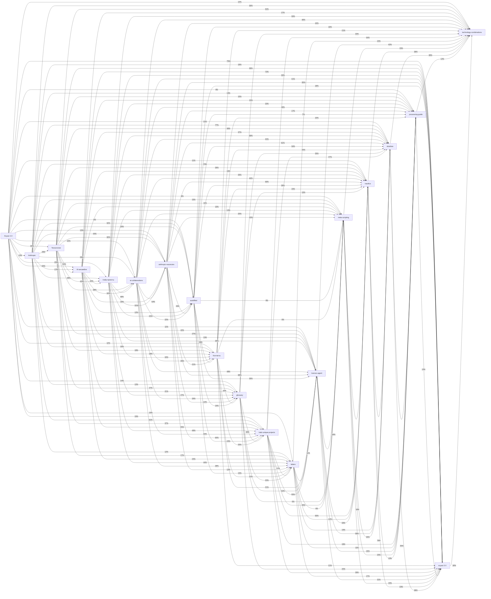

# Кросс-секционный анализ

<!-- toc -->
## Содержание

- [Contents](#contents)
- [Матрица сходства секций](#матрица-сходства-секций)
- [Граф связей](#граф-связей)
- [Топ-40 кросс-секционных концептов](#топ-40-кросс-секционных-концептов)
- [Детальная карта концептов](#детальная-карта-концептов)
- [Использование](#использование)
- [Смотрите также](#смотрите-также)

---


<!-- toc-auto -->
## Contents

- [Матрица сходства секций](#матрица-сходства-секций)
- [Граф связей](#граф-связей)
- [Топ-40 кросс-секционных концептов](#топ-40-кросс-секционных-концептов)
- [Детальная карта концептов](#детальная-карта-концептов)
- [Использование](#использование)
- [Смотрите также](#смотрите-также)


> [!NOTE]
> Раздел `CROSS_SECTION` формируется автоматически из данных репозитория.

<!-- alert-added -->
<!-- tags: cross-section, docs -->


<!-- summary -->
> `CROSS_SECTION` — раздел документации проекта Lorenzo.


_Обновлено: 2026-05-11_

---

## Матрица сходства секций

_(косинусное сходство TF-IDF векторов)_

| Секция | Svyazi 2.0 | Anthropic | Технологии | AI-ансамбли | Хабр-проекты | ai-collaborations | anthropic-vacancies | autofilled | Контакты | glossary | habr-unique-projects | letters | lorenzo-agent | meta-scripting | nautilus | obsidian | processing-guide | svyazi-2-0 | technology-combinations |
|--------|------|------|------|------|------|------|------|------|------|------|------|------|------|------|------|------|------|------|------|
| `Svyazi 2.0` | **—** | 0.13 █░░░░ | 0.16 █░░░░ | 0.94 █████ | 0.25 ██░░░ | 0.22 ██░░░ | 0.12 █░░░░ | 0.09 ░░░░░ | 0.12 █░░░░ | 0.14 █░░░░ | 0.15 █░░░░ | 0.15 █░░░░ | 0.11 █░░░░ | 0.08 ░░░░░ | 0.11 █░░░░ | 0.31 ███░░ | 0.09 ░░░░░ | 0.75 █████ | 0.12 █░░░░ |
| `Anthropic` | 0.13 █░░░░ | **—** | 0.29 ██░░░ | 0.17 █░░░░ | 0.28 ██░░░ | 0.29 ██░░░ | 0.44 ████░ | 0.34 ███░░ | 0.20 ██░░░ | 0.12 █░░░░ | 0.31 ███░░ | 0.12 █░░░░ | 0.42 ████░ | 0.15 █░░░░ | 0.73 █████ | 0.77 █████ | 0.13 █░░░░ | 0.19 █░░░░ | 0.26 ██░░░ |
| `Технологии` | 0.16 █░░░░ | 0.29 ██░░░ | **—** | 0.24 ██░░░ | 0.42 ████░ | 0.38 ███░░ | 0.30 ███░░ | 0.20 █░░░░ | 0.18 █░░░░ | 0.27 ██░░░ | 0.37 ███░░ | 0.17 █░░░░ | 0.27 ██░░░ | 0.11 █░░░░ | 0.26 ██░░░ | 0.36 ███░░ | 0.15 █░░░░ | 0.26 ██░░░ | 0.52 █████ |
| `AI-ансамбли` | 0.94 █████ | 0.17 █░░░░ | 0.24 ██░░░ | **—** | 0.44 ████░ | 0.34 ███░░ | 0.15 █░░░░ | 0.12 █░░░░ | 0.18 █░░░░ | 0.21 ██░░░ | 0.25 ██░░░ | 0.24 ██░░░ | 0.13 █░░░░ | 0.10 █░░░░ | 0.16 █░░░░ | 0.37 ███░░ | 0.12 █░░░░ | 0.73 █████ | 0.17 █░░░░ |
| `Хабр-проекты` | 0.25 ██░░░ | 0.28 ██░░░ | 0.42 ████░ | 0.44 ████░ | **—** | 0.48 ████░ | 0.31 ███░░ | 0.22 ██░░░ | 0.34 ███░░ | 0.27 ██░░░ | 0.49 ████░ | 0.44 ████░ | 0.26 ██░░░ | 0.14 █░░░░ | 0.26 ██░░░ | 0.39 ███░░ | 0.20 ██░░░ | 0.33 ███░░ | 0.30 ███░░ |
| `ai-collaborations` | 0.22 ██░░░ | 0.29 ██░░░ | 0.38 ███░░ | 0.34 ███░░ | 0.48 ████░ | **—** | 0.54 █████ | 0.22 ██░░░ | 0.26 ██░░░ | 0.34 ███░░ | 0.64 █████ | 0.28 ██░░░ | 0.48 ████░ | 0.20 ██░░░ | 0.44 ████░ | 0.44 ████░ | 0.18 █░░░░ | 0.41 ████░ | 0.48 ████░ |
| `anthropic-vacancies` | 0.12 █░░░░ | 0.44 ████░ | 0.30 ███░░ | 0.15 █░░░░ | 0.31 ███░░ | 0.54 █████ | **—** | 0.26 ██░░░ | 0.21 ██░░░ | 0.12 █░░░░ | 0.64 █████ | 0.12 █░░░░ | 0.68 █████ | 0.20 █░░░░ | 0.66 █████ | 0.61 █████ | 0.17 █░░░░ | 0.35 ███░░ | 0.44 ████░ |
| `autofilled` | 0.09 ░░░░░ | 0.34 ███░░ | 0.20 █░░░░ | 0.12 █░░░░ | 0.22 ██░░░ | 0.22 ██░░░ | 0.26 ██░░░ | **—** | 0.28 ██░░░ | 0.14 █░░░░ | 0.24 ██░░░ | 0.13 █░░░░ | 0.27 ██░░░ | 0.09 ░░░░░ | 0.26 ██░░░ | 0.34 ███░░ | 0.07 ░░░░░ | 0.18 █░░░░ | 0.18 █░░░░ |
| `Контакты` | 0.12 █░░░░ | 0.20 ██░░░ | 0.18 █░░░░ | 0.18 █░░░░ | 0.34 ███░░ | 0.26 ██░░░ | 0.21 ██░░░ | 0.28 ██░░░ | **—** | 0.15 █░░░░ | 0.25 ██░░░ | 0.21 ██░░░ | 0.21 ██░░░ | 0.09 ░░░░░ | 0.15 █░░░░ | 0.24 ██░░░ | 0.10 ░░░░░ | 0.21 ██░░░ | 0.21 ██░░░ |
| `glossary` | 0.14 █░░░░ | 0.12 █░░░░ | 0.27 ██░░░ | 0.21 ██░░░ | 0.27 ██░░░ | 0.34 ███░░ | 0.12 █░░░░ | 0.14 █░░░░ | 0.15 █░░░░ | **—** | 0.30 ██░░░ | 0.22 ██░░░ | 0.12 █░░░░ | 0.05 ░░░░░ | 0.13 █░░░░ | 0.25 ██░░░ | 0.05 ░░░░░ | 0.20 ██░░░ | 0.33 ███░░ |
| `habr-unique-projects` | 0.15 █░░░░ | 0.31 ███░░ | 0.37 ███░░ | 0.25 ██░░░ | 0.49 ████░ | 0.64 █████ | 0.64 █████ | 0.24 ██░░░ | 0.25 ██░░░ | 0.30 ██░░░ | **—** | 0.17 █░░░░ | 0.55 █████ | 0.20 ██░░░ | 0.49 ████░ | 0.47 ████░ | 0.18 █░░░░ | 0.39 ███░░ | 0.54 █████ |
| `letters` | 0.15 █░░░░ | 0.12 █░░░░ | 0.17 █░░░░ | 0.24 ██░░░ | 0.44 ████░ | 0.28 ██░░░ | 0.12 █░░░░ | 0.13 █░░░░ | 0.21 ██░░░ | 0.22 ██░░░ | 0.17 █░░░░ | **—** | 0.11 █░░░░ | 0.06 ░░░░░ | 0.12 █░░░░ | 0.19 █░░░░ | 0.11 █░░░░ | 0.17 █░░░░ | 0.10 █░░░░ |
| `lorenzo-agent` | 0.11 █░░░░ | 0.42 ████░ | 0.27 ██░░░ | 0.13 █░░░░ | 0.26 ██░░░ | 0.48 ████░ | 0.68 █████ | 0.27 ██░░░ | 0.21 ██░░░ | 0.12 █░░░░ | 0.55 █████ | 0.11 █░░░░ | **—** | 0.19 █░░░░ | 0.59 █████ | 0.56 █████ | 0.15 █░░░░ | 0.31 ███░░ | 0.42 ████░ |
| `meta-scripting` | 0.08 ░░░░░ | 0.15 █░░░░ | 0.11 █░░░░ | 0.10 █░░░░ | 0.14 █░░░░ | 0.20 ██░░░ | 0.20 █░░░░ | 0.09 ░░░░░ | 0.09 ░░░░░ | 0.05 ░░░░░ | 0.20 ██░░░ | 0.06 ░░░░░ | 0.19 █░░░░ | **—** | 0.18 █░░░░ | 0.20 ██░░░ | 0.24 ██░░░ | 0.15 █░░░░ | 0.15 █░░░░ |
| `nautilus` | 0.11 █░░░░ | 0.73 █████ | 0.26 ██░░░ | 0.16 █░░░░ | 0.26 ██░░░ | 0.44 ████░ | 0.66 █████ | 0.26 ██░░░ | 0.15 █░░░░ | 0.13 █░░░░ | 0.49 ████░ | 0.12 █░░░░ | 0.59 █████ | 0.18 █░░░░ | **—** | 0.77 █████ | 0.13 █░░░░ | 0.23 ██░░░ | 0.38 ███░░ |
| `obsidian` | 0.31 ███░░ | 0.77 █████ | 0.36 ███░░ | 0.37 ███░░ | 0.39 ███░░ | 0.44 ████░ | 0.61 █████ | 0.34 ███░░ | 0.24 ██░░░ | 0.25 ██░░░ | 0.47 ████░ | 0.19 █░░░░ | 0.56 █████ | 0.20 ██░░░ | 0.77 █████ | **—** | 0.25 ██░░░ | 0.38 ███░░ | 0.39 ███░░ |
| `processing-guide` | 0.09 ░░░░░ | 0.13 █░░░░ | 0.15 █░░░░ | 0.12 █░░░░ | 0.20 ██░░░ | 0.18 █░░░░ | 0.17 █░░░░ | 0.07 ░░░░░ | 0.10 ░░░░░ | 0.05 ░░░░░ | 0.18 █░░░░ | 0.11 █░░░░ | 0.15 █░░░░ | 0.24 ██░░░ | 0.13 █░░░░ | 0.25 ██░░░ | **—** | 0.12 █░░░░ | 0.12 █░░░░ |
| `svyazi-2-0` | 0.75 █████ | 0.19 █░░░░ | 0.26 ██░░░ | 0.73 █████ | 0.33 ███░░ | 0.41 ████░ | 0.35 ███░░ | 0.18 █░░░░ | 0.21 ██░░░ | 0.20 ██░░░ | 0.39 ███░░ | 0.17 █░░░░ | 0.31 ███░░ | 0.15 █░░░░ | 0.23 ██░░░ | 0.38 ███░░ | 0.12 █░░░░ | **—** | 0.30 ██░░░ |
| `technology-combinations` | 0.12 █░░░░ | 0.26 ██░░░ | 0.52 █████ | 0.17 █░░░░ | 0.30 ███░░ | 0.48 ████░ | 0.44 ████░ | 0.18 █░░░░ | 0.21 ██░░░ | 0.33 ███░░ | 0.54 █████ | 0.10 █░░░░ | 0.42 ████░ | 0.15 █░░░░ | 0.38 ███░░ | 0.39 ███░░ | 0.12 █░░░░ | 0.30 ██░░░ | **—** |

## Граф связей

_(толщина / процент = косинусное сходство × 100)_


```mermaid
graph LR
    01_svyazi["Svyazi 2.0"]
    02_anthropic_vacancies["Anthropic"]
    03_technology_combinations["Технологии"]
    04_ai_collaborations["AI-ансамбли"]
    05_habr_projects["Хабр-проекты"]
    ai_collaborations["ai-collaborations"]
    anthropic_vacancies["anthropic-vacancies"]
    autofilled["autofilled"]
    contacts["Контакты"]
    glossary["glossary"]
    habr_unique_projects["habr-unique-projects"]
    letters["letters"]
    lorenzo_agent["lorenzo-agent"]
    meta_scripting["meta-scripting"]
    nautilus["nautilus"]
    obsidian["obsidian"]
    processing_guide["processing-guide"]
    svyazi_2_0["svyazi-2-0"]
    technology_combinations["technology-combinations"]
    01_svyazi -- 13% --> 02_anthropic_vacancies
    01_svyazi -- 16% --> 03_technology_combinations
    01_svyazi -- 94% --> 04_ai_collaborations
    01_svyazi -- 25% --> 05_habr_projects
    01_svyazi -- 22% --> ai_collaborations
    01_svyazi -- 12% --> anthropic_vacancies
    01_svyazi -- 9% --> autofilled
    01_svyazi -- 12% --> contacts
    01_svyazi -- 14% --> glossary
    01_svyazi -- 15% --> habr_unique_projects
    01_svyazi -- 15% --> letters
    01_svyazi -- 11% --> lorenzo_agent
    01_svyazi -- 8% --> meta_scripting
    01_svyazi -- 11% --> nautilus
    01_svyazi -- 31% --> obsidian
    01_svyazi -- 8% --> processing_guide
    01_svyazi -- 75% --> svyazi_2_0
    01_svyazi -- 12% --> technology_combinations
    02_anthropic_vacancies -- 29% --> 03_technology_combinations
    02_anthropic_vacancies -- 17% --> 04_ai_collaborations
    02_anthropic_vacancies -- 28% --> 05_habr_projects
    02_anthropic_vacancies -- 29% --> ai_collaborations
    02_anthropic_vacancies -- 44% --> anthropic_vacancies
    02_anthropic_vacancies -- 34% --> autofilled
    02_anthropic_vacancies -- 20% --> contacts
    02_anthropic_vacancies -- 12% --> glossary
    02_anthropic_vacancies -- 31% --> habr_unique_projects
    02_anthropic_vacancies -- 12% --> letters
    02_anthropic_vacancies -- 42% --> lorenzo_agent
    02_anthropic_vacancies -- 15% --> meta_scripting
    02_anthropic_vacancies -- 73% --> nautilus
    02_anthropic_vacancies -- 77% --> obsidian
    02_anthropic_vacancies -- 13% --> processing_guide
    02_anthropic_vacancies -- 19% --> svyazi_2_0
    02_anthropic_vacancies -- 26% --> technology_combinations
    03_technology_combinations -- 24% --> 04_ai_collaborations
    03_technology_combinations -- 42% --> 05_habr_projects
    03_technology_combinations -- 38% --> ai_collaborations
    03_technology_combinations -- 30% --> anthropic_vacancies
    03_technology_combinations -- 20% --> autofilled
    03_technology_combinations -- 18% --> contacts
    03_technology_combinations -- 27% --> glossary
    03_technology_combinations -- 37% --> habr_unique_projects
    03_technology_combinations -- 17% --> letters
    03_technology_combinations -- 27% --> lorenzo_agent
    03_technology_combinations -- 11% --> meta_scripting
    03_technology_combinations -- 26% --> nautilus
    03_technology_combinations -- 36% --> obsidian
    03_technology_combinations -- 15% --> processing_guide
    03_technology_combinations -- 26% --> svyazi_2_0
    03_technology_combinations -- 52% --> technology_combinations
    04_ai_collaborations -- 44% --> 05_habr_projects
    04_ai_collaborations -- 34% --> ai_collaborations
    04_ai_collaborations -- 16% --> anthropic_vacancies
    04_ai_collaborations -- 12% --> autofilled
    04_ai_collaborations -- 18% --> contacts
    04_ai_collaborations -- 21% --> glossary
    04_ai_collaborations -- 25% --> habr_unique_projects
    04_ai_collaborations -- 24% --> letters
    04_ai_collaborations -- 13% --> lorenzo_agent
    04_ai_collaborations -- 10% --> meta_scripting
    04_ai_collaborations -- 16% --> nautilus
    04_ai_collaborations -- 37% --> obsidian
    04_ai_collaborations -- 12% --> processing_guide
    04_ai_collaborations -- 73% --> svyazi_2_0
    04_ai_collaborations -- 17% --> technology_combinations
    05_habr_projects -- 48% --> ai_collaborations
    05_habr_projects -- 31% --> anthropic_vacancies
    05_habr_projects -- 22% --> autofilled
    05_habr_projects -- 34% --> contacts
    05_habr_projects -- 27% --> glossary
    05_habr_projects -- 49% --> habr_unique_projects
    05_habr_projects -- 44% --> letters
    05_habr_projects -- 26% --> lorenzo_agent
    05_habr_projects -- 14% --> meta_scripting
    05_habr_projects -- 26% --> nautilus
    05_habr_projects -- 39% --> obsidian
    05_habr_projects -- 20% --> processing_guide
    05_habr_projects -- 33% --> svyazi_2_0
    05_habr_projects -- 30% --> technology_combinations
    ai_collaborations -- 54% --> anthropic_vacancies
    ai_collaborations -- 22% --> autofilled
    ai_collaborations -- 26% --> contacts
    ai_collaborations -- 34% --> glossary
    ai_collaborations -- 64% --> habr_unique_projects
    ai_collaborations -- 28% --> letters
    ai_collaborations -- 48% --> lorenzo_agent
    ai_collaborations -- 20% --> meta_scripting
    ai_collaborations -- 44% --> nautilus
    ai_collaborations -- 44% --> obsidian
    ai_collaborations -- 18% --> processing_guide
    ai_collaborations -- 41% --> svyazi_2_0
    ai_collaborations -- 48% --> technology_combinations
    anthropic_vacancies -- 26% --> autofilled
    anthropic_vacancies -- 21% --> contacts
    anthropic_vacancies -- 12% --> glossary
    anthropic_vacancies -- 64% --> habr_unique_projects
    anthropic_vacancies -- 12% --> letters
    anthropic_vacancies -- 68% --> lorenzo_agent
    anthropic_vacancies -- 20% --> meta_scripting
    anthropic_vacancies -- 66% --> nautilus
    anthropic_vacancies -- 61% --> obsidian
    anthropic_vacancies -- 17% --> processing_guide
    anthropic_vacancies -- 35% --> svyazi_2_0
    anthropic_vacancies -- 44% --> technology_combinations
    autofilled -- 28% --> contacts
    autofilled -- 14% --> glossary
    autofilled -- 24% --> habr_unique_projects
    autofilled -- 13% --> letters
    autofilled -- 26% --> lorenzo_agent
    autofilled -- 9% --> meta_scripting
    autofilled -- 26% --> nautilus
    autofilled -- 34% --> obsidian
    autofilled -- 7% --> processing_guide
    autofilled -- 18% --> svyazi_2_0
    autofilled -- 18% --> technology_combinations
    contacts -- 15% --> glossary
    contacts -- 25% --> habr_unique_projects
    contacts -- 21% --> letters
    contacts -- 21% --> lorenzo_agent
    contacts -- 9% --> meta_scripting
    contacts -- 15% --> nautilus
    contacts -- 24% --> obsidian
    contacts -- 10% --> processing_guide
    contacts -- 21% --> svyazi_2_0
    contacts -- 21% --> technology_combinations
    glossary -- 30% --> habr_unique_projects
    glossary -- 22% --> letters
    glossary -- 12% --> lorenzo_agent
    glossary -- 5% --> meta_scripting
    glossary -- 13% --> nautilus
    glossary -- 25% --> obsidian
    glossary -- 20% --> svyazi_2_0
    glossary -- 33% --> technology_combinations
    habr_unique_projects -- 17% --> letters
    habr_unique_projects -- 55% --> lorenzo_agent
    habr_unique_projects -- 20% --> meta_scripting
    habr_unique_projects -- 50% --> nautilus
    habr_unique_projects -- 47% --> obsidian
    habr_unique_projects -- 18% --> processing_guide
    habr_unique_projects -- 39% --> svyazi_2_0
    habr_unique_projects -- 54% --> technology_combinations
    letters -- 11% --> lorenzo_agent
    letters -- 6% --> meta_scripting
    letters -- 12% --> nautilus
    letters -- 19% --> obsidian
    letters -- 11% --> processing_guide
    letters -- 17% --> svyazi_2_0
    letters -- 10% --> technology_combinations
    lorenzo_agent -- 19% --> meta_scripting
    lorenzo_agent -- 59% --> nautilus
    lorenzo_agent -- 56% --> obsidian
    lorenzo_agent -- 15% --> processing_guide
    lorenzo_agent -- 31% --> svyazi_2_0
    lorenzo_agent -- 42% --> technology_combinations
    meta_scripting -- 18% --> nautilus
    meta_scripting -- 20% --> obsidian
    meta_scripting -- 24% --> processing_guide
    meta_scripting -- 15% --> svyazi_2_0
    meta_scripting -- 15% --> technology_combinations
    nautilus -- 76% --> obsidian
    nautilus -- 13% --> processing_guide
    nautilus -- 23% --> svyazi_2_0
    nautilus -- 38% --> technology_combinations
    obsidian -- 25% --> processing_guide
    obsidian -- 38% --> svyazi_2_0
    obsidian -- 39% --> technology_combinations
    processing_guide -- 12% --> svyazi_2_0
    processing_guide -- 12% --> technology_combinations
    svyazi_2_0 -- 30% --> technology_combinations
```

## Топ-40 кросс-секционных концептов

_Присутствуют в ≥ 2 секциях_

| Концепт | Секций | Авг. TF-IDF | Присутствует в |
|---------|--------|-------------|----------------|
| `svyazi` | 19 | 12.0598 | `Svyazi 2.0`, `Anthropic`, `Технологии`, `AI-ансамбли`, `Хабр-проекты`, `ai-collaborations`, `anthropic-vacancies`, `autofilled`, `Контакты`, `glossary`, `habr-unique-projects`, `letters`, `lorenzo-agent`, `meta-scripting`, `nautilus`, `obsidian`, `processing-guide`, `svyazi-2-0`, `technology-combinations` |
| `документ` | 19 | 11.6899 | `Svyazi 2.0`, `Anthropic`, `Технологии`, `AI-ансамбли`, `Хабр-проекты`, `ai-collaborations`, `anthropic-vacancies`, `autofilled`, `Контакты`, `glossary`, `habr-unique-projects`, `letters`, `lorenzo-agent`, `meta-scripting`, `nautilus`, `obsidian`, `processing-guide`, `svyazi-2-0`, `technology-combinations` |
| `также` | 19 | 7.4991 | `Svyazi 2.0`, `Anthropic`, `Технологии`, `AI-ансамбли`, `Хабр-проекты`, `ai-collaborations`, `anthropic-vacancies`, `autofilled`, `Контакты`, `glossary`, `habr-unique-projects`, `letters`, `lorenzo-agent`, `meta-scripting`, `nautilus`, `obsidian`, `processing-guide`, `svyazi-2-0`, `technology-combinations` |
| `смотрите` | 19 | 7.4261 | `Svyazi 2.0`, `Anthropic`, `Технологии`, `AI-ансамбли`, `Хабр-проекты`, `ai-collaborations`, `anthropic-vacancies`, `autofilled`, `Контакты`, `glossary`, `habr-unique-projects`, `letters`, `lorenzo-agent`, `meta-scripting`, `nautilus`, `obsidian`, `processing-guide`, `svyazi-2-0`, `technology-combinations` |
| `использование` | 19 | 6.1823 | `Svyazi 2.0`, `Anthropic`, `Технологии`, `AI-ансамбли`, `Хабр-проекты`, `ai-collaborations`, `anthropic-vacancies`, `autofilled`, `Контакты`, `glossary`, `habr-unique-projects`, `letters`, `lorenzo-agent`, `meta-scripting`, `nautilus`, `obsidian`, `processing-guide`, `svyazi-2-0`, `technology-combinations` |
| `этот` | 19 | 5.6991 | `Svyazi 2.0`, `Anthropic`, `Технологии`, `AI-ансамбли`, `Хабр-проекты`, `ai-collaborations`, `anthropic-vacancies`, `autofilled`, `Контакты`, `glossary`, `habr-unique-projects`, `letters`, `lorenzo-agent`, `meta-scripting`, `nautilus`, `obsidian`, `processing-guide`, `svyazi-2-0`, `technology-combinations` |
| `note` | 19 | 3.6945 | `Svyazi 2.0`, `Anthropic`, `Технологии`, `AI-ансамбли`, `Хабр-проекты`, `ai-collaborations`, `anthropic-vacancies`, `autofilled`, `Контакты`, `glossary`, `habr-unique-projects`, `letters`, `lorenzo-agent`, `meta-scripting`, `nautilus`, `obsidian`, `processing-guide`, `svyazi-2-0`, `technology-combinations` |
| `contents` | 19 | 3.0727 | `Svyazi 2.0`, `Anthropic`, `Технологии`, `AI-ансамбли`, `Хабр-проекты`, `ai-collaborations`, `anthropic-vacancies`, `autofilled`, `Контакты`, `glossary`, `habr-unique-projects`, `letters`, `lorenzo-agent`, `meta-scripting`, `nautilus`, `obsidian`, `processing-guide`, `svyazi-2-0`, `technology-combinations` |
| `проекты` | 19 | 2.8736 | `Svyazi 2.0`, `Anthropic`, `Технологии`, `AI-ансамбли`, `Хабр-проекты`, `ai-collaborations`, `anthropic-vacancies`, `autofilled`, `Контакты`, `glossary`, `habr-unique-projects`, `letters`, `lorenzo-agent`, `meta-scripting`, `nautilus`, `obsidian`, `processing-guide`, `svyazi-2-0`, `technology-combinations` |
| `содержание` | 19 | 2.0557 | `Svyazi 2.0`, `Anthropic`, `Технологии`, `AI-ансамбли`, `Хабр-проекты`, `ai-collaborations`, `anthropic-vacancies`, `autofilled`, `Контакты`, `glossary`, `habr-unique-projects`, `letters`, `lorenzo-agent`, `meta-scripting`, `nautilus`, `obsidian`, `processing-guide`, `svyazi-2-0`, `technology-combinations` |
| `lorenzo` | 18 | 8.3840 | `Svyazi 2.0`, `Anthropic`, `Технологии`, `AI-ансамбли`, `Хабр-проекты`, `ai-collaborations`, `anthropic-vacancies`, `autofilled`, `Контакты`, `glossary`, `habr-unique-projects`, `lorenzo-agent`, `meta-scripting`, `nautilus`, `obsidian`, `processing-guide`, `svyazi-2-0`, `technology-combinations` |
| `memory` | 18 | 6.9701 | `Svyazi 2.0`, `Anthropic`, `Технологии`, `AI-ансамбли`, `Хабр-проекты`, `ai-collaborations`, `anthropic-vacancies`, `autofilled`, `Контакты`, `glossary`, `habr-unique-projects`, `letters`, `lorenzo-agent`, `nautilus`, `obsidian`, `processing-guide`, `svyazi-2-0`, `technology-combinations` |
| `связанные` | 18 | 6.8939 | `Svyazi 2.0`, `Anthropic`, `Технологии`, `AI-ансамбли`, `Хабр-проекты`, `ai-collaborations`, `anthropic-vacancies`, `autofilled`, `Контакты`, `glossary`, `habr-unique-projects`, `lorenzo-agent`, `meta-scripting`, `nautilus`, `obsidian`, `processing-guide`, `svyazi-2-0`, `technology-combinations` |
| `search` | 18 | 6.6214 | `Svyazi 2.0`, `Anthropic`, `Технологии`, `AI-ансамбли`, `Хабр-проекты`, `ai-collaborations`, `anthropic-vacancies`, `autofilled`, `Контакты`, `glossary`, `habr-unique-projects`, `lorenzo-agent`, `meta-scripting`, `nautilus`, `obsidian`, `processing-guide`, `svyazi-2-0`, `technology-combinations` |
| `readme` | 18 | 6.5562 | `Svyazi 2.0`, `Anthropic`, `Технологии`, `AI-ансамбли`, `Хабр-проекты`, `ai-collaborations`, `anthropic-vacancies`, `autofilled`, `Контакты`, `glossary`, `habr-unique-projects`, `lorenzo-agent`, `meta-scripting`, `nautilus`, `obsidian`, `processing-guide`, `svyazi-2-0`, `technology-combinations` |
| `документы` | 18 | 6.4896 | `Svyazi 2.0`, `Anthropic`, `Технологии`, `AI-ансамбли`, `Хабр-проекты`, `ai-collaborations`, `anthropic-vacancies`, `autofilled`, `Контакты`, `habr-unique-projects`, `letters`, `lorenzo-agent`, `meta-scripting`, `nautilus`, `obsidian`, `processing-guide`, `svyazi-2-0`, `technology-combinations` |
| `ссылается` | 18 | 5.6280 | `Svyazi 2.0`, `Anthropic`, `Технологии`, `AI-ансамбли`, `Хабр-проекты`, `ai-collaborations`, `anthropic-vacancies`, `autofilled`, `Контакты`, `glossary`, `habr-unique-projects`, `lorenzo-agent`, `meta-scripting`, `nautilus`, `obsidian`, `processing-guide`, `svyazi-2-0`, `technology-combinations` |
| `knowledge` | 18 | 5.0460 | `Svyazi 2.0`, `Anthropic`, `Технологии`, `AI-ансамбли`, `Хабр-проекты`, `ai-collaborations`, `anthropic-vacancies`, `autofilled`, `Контакты`, `glossary`, `habr-unique-projects`, `letters`, `lorenzo-agent`, `nautilus`, `obsidian`, `processing-guide`, `svyazi-2-0`, `technology-combinations` |
| `ссылки` | 18 | 5.0164 | `Svyazi 2.0`, `Anthropic`, `Технологии`, `AI-ансамбли`, `Хабр-проекты`, `ai-collaborations`, `anthropic-vacancies`, `autofilled`, `Контакты`, `glossary`, `habr-unique-projects`, `lorenzo-agent`, `meta-scripting`, `nautilus`, `obsidian`, `processing-guide`, `svyazi-2-0`, `technology-combinations` |
| `claude` | 18 | 4.7443 | `Svyazi 2.0`, `Anthropic`, `Технологии`, `AI-ансамбли`, `Хабр-проекты`, `ai-collaborations`, `anthropic-vacancies`, `Контакты`, `glossary`, `habr-unique-projects`, `letters`, `lorenzo-agent`, `meta-scripting`, `nautilus`, `obsidian`, `processing-guide`, `svyazi-2-0`, `technology-combinations` |
| `habr` | 18 | 4.5856 | `Svyazi 2.0`, `Anthropic`, `Технологии`, `AI-ансамбли`, `Хабр-проекты`, `ai-collaborations`, `anthropic-vacancies`, `autofilled`, `Контакты`, `glossary`, `habr-unique-projects`, `letters`, `lorenzo-agent`, `nautilus`, `obsidian`, `processing-guide`, `svyazi-2-0`, `technology-combinations` |
| `time` | 18 | 3.9910 | `Svyazi 2.0`, `Anthropic`, `AI-ансамбли`, `Хабр-проекты`, `ai-collaborations`, `anthropic-vacancies`, `autofilled`, `Контакты`, `glossary`, `habr-unique-projects`, `letters`, `lorenzo-agent`, `meta-scripting`, `nautilus`, `obsidian`, `processing-guide`, `svyazi-2-0`, `technology-combinations` |
| `исследования` | 18 | 3.4324 | `Svyazi 2.0`, `Anthropic`, `Технологии`, `AI-ансамбли`, `Хабр-проекты`, `ai-collaborations`, `anthropic-vacancies`, `autofilled`, `Контакты`, `glossary`, `habr-unique-projects`, `lorenzo-agent`, `meta-scripting`, `nautilus`, `obsidian`, `processing-guide`, `svyazi-2-0`, `technology-combinations` |
| `основе` | 18 | 3.3596 | `Svyazi 2.0`, `Anthropic`, `Технологии`, `AI-ансамбли`, `Хабр-проекты`, `ai-collaborations`, `anthropic-vacancies`, `autofilled`, `Контакты`, `glossary`, `habr-unique-projects`, `lorenzo-agent`, `meta-scripting`, `nautilus`, `obsidian`, `processing-guide`, `svyazi-2-0`, `technology-combinations` |
| `research` | 18 | 2.5811 | `Svyazi 2.0`, `Anthropic`, `Технологии`, `AI-ансамбли`, `Хабр-проекты`, `ai-collaborations`, `anthropic-vacancies`, `autofilled`, `Контакты`, `glossary`, `habr-unique-projects`, `letters`, `lorenzo-agent`, `nautilus`, `obsidian`, `processing-guide`, `svyazi-2-0`, `technology-combinations` |
| `между` | 18 | 2.0336 | `Svyazi 2.0`, `Anthropic`, `Технологии`, `AI-ансамбли`, `Хабр-проекты`, `ai-collaborations`, `anthropic-vacancies`, `Контакты`, `glossary`, `habr-unique-projects`, `letters`, `lorenzo-agent`, `meta-scripting`, `nautilus`, `obsidian`, `processing-guide`, `svyazi-2-0`, `technology-combinations` |
| `graph` | 18 | 2.0268 | `Svyazi 2.0`, `Anthropic`, `Технологии`, `AI-ансамбли`, `Хабр-проекты`, `ai-collaborations`, `anthropic-vacancies`, `autofilled`, `Контакты`, `glossary`, `habr-unique-projects`, `letters`, `lorenzo-agent`, `nautilus`, `obsidian`, `processing-guide`, `svyazi-2-0`, `technology-combinations` |
| `проект` | 18 | 1.9960 | `Svyazi 2.0`, `Anthropic`, `Технологии`, `AI-ансамбли`, `Хабр-проекты`, `ai-collaborations`, `anthropic-vacancies`, `autofilled`, `Контакты`, `glossary`, `habr-unique-projects`, `letters`, `lorenzo-agent`, `nautilus`, `obsidian`, `processing-guide`, `svyazi-2-0`, `technology-combinations` |
| `агентов` | 18 | 1.8349 | `Svyazi 2.0`, `Anthropic`, `Технологии`, `AI-ансамбли`, `Хабр-проекты`, `ai-collaborations`, `anthropic-vacancies`, `Контакты`, `glossary`, `habr-unique-projects`, `letters`, `lorenzo-agent`, `meta-scripting`, `nautilus`, `obsidian`, `processing-guide`, `svyazi-2-0`, `technology-combinations` |
| `auto` | 18 | 1.3332 | `Svyazi 2.0`, `Anthropic`, `Технологии`, `AI-ансамбли`, `Хабр-проекты`, `ai-collaborations`, `anthropic-vacancies`, `autofilled`, `Контакты`, `glossary`, `habr-unique-projects`, `letters`, `meta-scripting`, `nautilus`, `obsidian`, `processing-guide`, `svyazi-2-0`, `technology-combinations` |
| `проекта` | 18 | 1.1064 | `Svyazi 2.0`, `Anthropic`, `Технологии`, `AI-ансамбли`, `Хабр-проекты`, `ai-collaborations`, `anthropic-vacancies`, `Контакты`, `glossary`, `habr-unique-projects`, `letters`, `lorenzo-agent`, `meta-scripting`, `nautilus`, `obsidian`, `processing-guide`, `svyazi-2-0`, `technology-combinations` |
| `данные` | 18 | 0.7198 | `Svyazi 2.0`, `Anthropic`, `Технологии`, `AI-ансамбли`, `Хабр-проекты`, `ai-collaborations`, `anthropic-vacancies`, `Контакты`, `glossary`, `habr-unique-projects`, `letters`, `lorenzo-agent`, `meta-scripting`, `nautilus`, `obsidian`, `processing-guide`, `svyazi-2-0`, `technology-combinations` |
| `файлов` | 18 | 0.6896 | `Svyazi 2.0`, `Anthropic`, `Технологии`, `AI-ансамбли`, `Хабр-проекты`, `ai-collaborations`, `anthropic-vacancies`, `autofilled`, `Контакты`, `glossary`, `habr-unique-projects`, `lorenzo-agent`, `meta-scripting`, `nautilus`, `obsidian`, `processing-guide`, `svyazi-2-0`, `technology-combinations` |
| `agent` | 17 | 7.5100 | `Svyazi 2.0`, `Anthropic`, `Технологии`, `AI-ансамбли`, `Хабр-проекты`, `ai-collaborations`, `anthropic-vacancies`, `Контакты`, `glossary`, `habr-unique-projects`, `letters`, `lorenzo-agent`, `nautilus`, `obsidian`, `processing-guide`, `svyazi-2-0`, `technology-combinations` |
| `репозитория` | 17 | 6.9706 | `Svyazi 2.0`, `Anthropic`, `Технологии`, `AI-ансамбли`, `Хабр-проекты`, `ai-collaborations`, `anthropic-vacancies`, `autofilled`, `Контакты`, `habr-unique-projects`, `lorenzo-agent`, `meta-scripting`, `nautilus`, `obsidian`, `processing-guide`, `svyazi-2-0`, `technology-combinations` |
| `через` | 17 | 5.0683 | `Svyazi 2.0`, `Anthropic`, `Технологии`, `AI-ансамбли`, `Хабр-проекты`, `ai-collaborations`, `anthropic-vacancies`, `Контакты`, `habr-unique-projects`, `letters`, `lorenzo-agent`, `meta-scripting`, `nautilus`, `obsidian`, `processing-guide`, `svyazi-2-0`, `technology-combinations` |
| `tables` | 17 | 4.8963 | `Svyazi 2.0`, `Anthropic`, `AI-ансамбли`, `Хабр-проекты`, `ai-collaborations`, `anthropic-vacancies`, `autofilled`, `Контакты`, `glossary`, `habr-unique-projects`, `lorenzo-agent`, `meta-scripting`, `nautilus`, `obsidian`, `processing-guide`, `svyazi-2-0`, `technology-combinations` |
| `поиска` | 17 | 4.2043 | `Svyazi 2.0`, `Anthropic`, `Технологии`, `AI-ансамбли`, `Хабр-проекты`, `ai-collaborations`, `anthropic-vacancies`, `Контакты`, `glossary`, `habr-unique-projects`, `letters`, `lorenzo-agent`, `nautilus`, `obsidian`, `processing-guide`, `svyazi-2-0`, `technology-combinations` |
| `reading` | 17 | 4.0652 | `Svyazi 2.0`, `Anthropic`, `AI-ансамбли`, `Хабр-проекты`, `ai-collaborations`, `anthropic-vacancies`, `autofilled`, `Контакты`, `glossary`, `habr-unique-projects`, `lorenzo-agent`, `meta-scripting`, `nautilus`, `obsidian`, `processing-guide`, `svyazi-2-0`, `technology-combinations` |
| `граф` | 17 | 4.0315 | `Svyazi 2.0`, `Anthropic`, `Технологии`, `AI-ансамбли`, `Хабр-проекты`, `ai-collaborations`, `anthropic-vacancies`, `autofilled`, `Контакты`, `habr-unique-projects`, `letters`, `lorenzo-agent`, `nautilus`, `obsidian`, `processing-guide`, `svyazi-2-0`, `technology-combinations` |

## Детальная карта концептов

_Для каждого концепта — TF-IDF вес в каждой секции_

| Концепт | Svyazi 2.0 | Anthropic | Технологии | AI-ансамбл | Хабр-проек | ai-collabo | anthropic- | autofilled | Контакты | glossary | habr-uniqu | letters | lorenzo-ag | meta-scrip | nautilus | obsidian | processing | svyazi-2-0 | technology |
|---------|------|------|------|------|------|------|------|------|------|------|------|------|------|------|------|------|------|------|------|
| `svyazi` | **12.614** | **0.969** | **10.355** | **15.288** | **10.469** | **8.504** | **0.271** | **52.020** | **18.288** | **49.621** | **6.307** | **18.953** | **0.544** | **2.137** | **0.267** | **4.247** | **2.211** | **10.747** | **5.324** |
| `документ` | **5.432** | **8.158** | **9.246** | **3.730** | **5.622** | **12.349** | **12.352** | **26.928** | **28.895** | **5.858** | **16.722** | **4.489** | **12.069** | **11.396** | **7.037** | **7.044** | **5.650** | **19.128** | **20.003** |
| `также` | **5.708** | **3.897** | **4.438** | **3.362** | **4.362** | **8.737** | **10.002** | **16.524** | **17.557** | **3.791** | **10.634** | **1.496** | **9.299** | **9.972** | **4.570** | **4.073** | **2.702** | **10.206** | **11.153** |
| `смотрите` | **5.616** | **3.789** | **4.438** | **3.223** | **4.168** | **8.504** | **9.882** | **16.524** | **17.557** | **3.791** | **10.488** | **1.496** | **9.299** | **9.972** | **4.432** | **3.995** | **2.702** | **10.139** | **11.081** |
| `использование` | **4.788** | **3.133** | **3.698** | **3.316** | **3.587** | **9.203** | **10.334** | **20.196** | **1.463** | **4.135** | **11.221** | **3.990** | **9.645** | **2.849** | **4.384** | **1.766** | **0.491** | **9.192** | **10.073** |
| `этот` | **3.867** | **4.405** | **3.698** | **3.454** | **2.617** | **4.543** | **4.308** | **20.196** | **13.168** | **2.757** | **6.747** | **4.489** | **3.462** | **4.986** | **2.815** | **3.317** | **2.457** | **8.652** | **8.347** |
| `note` | **0.644** | **2.246** | **4.068** | **0.092** | **1.454** | **4.543** | **5.031** | **8.568** | **1.463** | **2.412** | **6.894** | **4.489** | **5.342** | **4.986** | **2.677** | **2.083** | **2.211** | **4.731** | **6.260** |
| `contents` | **3.315** | **4.523** | **1.109** | **1.842** | **1.454** | **2.912** | **4.037** | **6.732** | **5.852** | **2.067** | **3.667** | **0.499** | **3.759** | **3.561** | **2.014** | **2.854** | **0.491** | **3.447** | **4.245** |
| `проекты` | **1.381** | **0.241** | **4.068** | **2.441** | **3.587** | **4.077** | **0.331** | **6.120** | **10.973** | **2.757** | **3.080** | **3.990** | **1.286** | **0.712** | **0.227** | **1.079** | **2.211** | **3.447** | **2.590** |
| `содержание` | **3.591** | **2.810** | **1.479** | **1.980** | **1.551** | **1.514** | **2.079** | **1.224** | **0.366** | **2.757** | **1.247** | **0.499** | **2.028** | **4.986** | **2.168** | **2.274** | **3.562** | **1.217** | **1.727** |
| `lorenzo` | **0.581** | **3.482** | **3.499** | **0.048** | **1.529** | **3.797** | **5.606** | **60.478** | **9.613** | **1.449** | **4.472** | — | **31.667** | **4.493** | **1.411** | **4.355** | **2.324** | **6.964** | **5.144** |
| `memory` | **9.486** | **1.208** | **0.389** | **8.908** | **16.815** | **11.390** | **2.375** | **2.574** | **11.920** | **15.940** | **3.161** | **24.119** | **0.520** | — | **0.238** | **2.786** | **1.421** | **10.019** | **2.194** |
| `связанные` | **1.161** | **7.175** | **9.331** | **0.194** | **3.974** | **4.776** | **6.715** | **49.541** | **0.769** | **2.174** | **7.479** | — | **5.824** | **2.995** | **2.509** | **4.591** | **2.324** | **5.827** | **6.732** |
| `search` | **17.520** | **0.690** | **1.555** | **9.634** | **0.713** | **8.695** | **6.873** | **3.860** | **4.999** | **3.260** | **6.477** | — | **7.228** | **9.734** | **4.473** | **2.727** | **5.165** | **20.891** | **4.690** |
| `readme` | **3.581** | **5.590** | **8.553** | **1.743** | **7.134** | **5.879** | **4.561** | **27.666** | **12.305** | **2.536** | **5.937** | — | **3.536** | **2.995** | **3.410** | **5.429** | **2.712** | **8.243** | **6.203** |
| `документы` | **6.582** | **9.428** | **9.720** | **3.582** | **4.994** | **1.715** | **3.516** | **42.464** | **16.150** | — | **1.311** | **1.049** | **2.392** | **1.498** | **0.850** | **4.848** | **2.970** | **2.913** | **0.832** |
| `ссылается` | **3.388** | **3.730** | **3.888** | **2.711** | **2.548** | **4.531** | **3.737** | **21.232** | **13.843** | **2.898** | **6.939** | — | **3.172** | **4.493** | **2.262** | **2.783** | **2.066** | **8.385** | **8.699** |
| `knowledge` | **4.356** | **2.906** | **12.830** | **4.454** | **10.191** | **8.818** | **1.489** | **1.287** | **5.768** | **5.796** | **3.470** | **11.535** | **3.536** | — | **2.551** | **3.305** | **1.162** | **4.121** | **3.253** |
| `ссылки` | **0.871** | **3.159** | **5.443** | **0.242** | **2.140** | **5.266** | **6.683** | **26.379** | **0.769** | **2.174** | **7.479** | — | **5.876** | **2.995** | **2.764** | **2.954** | **2.324** | **5.969** | **6.808** |
| `claude` | **0.290** | **2.631** | **5.832** | **2.663** | **3.873** | **2.939** | **7.601** | — | **0.385** | **3.260** | **11.488** | **2.097** | **8.320** | **4.493** | **6.088** | **4.499** | **8.523** | **0.355** | **10.061** |


## Использование
```bash
# Запуск
python scripts/improve_cross_section.py
```
```bash
# Вариант 2
python scripts/improve_cross_section.py --dry-run
```

## Смотрите также
- [Главная](README.md)
- [Метрики](METRICS.md)
- [Здоровье](HEALTH.md)
- [Глоссарий](GLOSSARY.md)
- [Сущности](ENTITIES.md)
- [Решения](DECISIONS.md)
- [Контакты](CONTACTS.md)
- [Оценка](SCORING.md)
- [Теги](TAGS.md)

<!-- backlinks -->

---

**Кто ссылается на этот документ (7):**
- [DUPLICATES](DUPLICATES.md)
- [OUTLINE](OUTLINE.md)
- [READABILITY](READABILITY.md)
- [READING_TIME](READING_TIME.md)
- [README](README.md)
- [SEARCH](SEARCH.md)
- [TABLES](TABLES.md)


<!-- similar-docs -->

---

**Похожие документы:**
- [CROSS_SECTION](obsidian/CROSS_SECTION.md) (сходство 0.98)
- [CONCEPT_GRAPH](CONCEPT_GRAPH.md) (сходство 0.39)
- [CONCEPT_GRAPH](obsidian/CONCEPT_GRAPH.md) (сходство 0.38)


<!-- see-also -->

---

**Смотрите также:**
- [CONCEPT_GRAPH](CONCEPT_GRAPH.md)
- [KNOWLEDGE_MAP](KNOWLEDGE_MAP.md)
- [KEYWORD_INDEX](KEYWORD_INDEX.md)
- [DIGEST_WEEKLY](DIGEST_WEEKLY.md)

