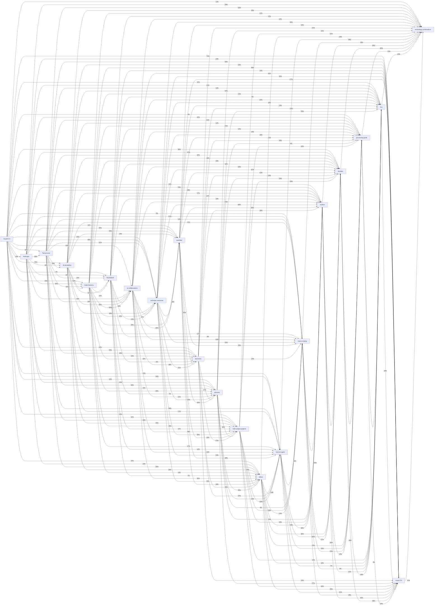

# Кросс-секционный анализ

> [!NOTE]
> Документ создан на основе исследования. Ссылки ведут на связанные материалы.

<!-- alert-added -->

_Обновлено: 2026-05-14_

---

## Матрица сходства секций

_(косинусное сходство TF-IDF векторов)_

| Секция | Svyazi 2.0 | Anthropic | Технологии | AI-ансамбли | Хабр-проекты | ROADMAP | ai-collaborations | anthropic-vacancies | autofilled | Контакты | glossary | habr-unique-projects | letters | lorenzo-agent | meta-scripting | nautilus | obsidian | processing-guide | rfcs | svyazi-2-0 | technology-combinations |
|--------|------|------|------|------|------|------|------|------|------|------|------|------|------|------|------|------|------|------|------|------|------|
| `Svyazi 2.0` | **—** | 0.13 █░░░░ | 0.17 █░░░░ | 0.75 █████ | 0.25 ██░░░ | 0.07 ░░░░░ | 0.24 ██░░░ | 0.13 █░░░░ | 0.11 █░░░░ | 0.12 █░░░░ | 0.14 █░░░░ | 0.17 █░░░░ | 0.16 █░░░░ | 0.12 █░░░░ | 0.09 ░░░░░ | 0.12 █░░░░ | 0.36 ███░░ | 0.09 ░░░░░ | 0.12 █░░░░ | 0.74 █████ | 0.12 █░░░░ |
| `Anthropic` | 0.13 █░░░░ | **—** | 0.30 ██░░░ | 0.18 █░░░░ | 0.30 ██░░░ | 0.17 █░░░░ | 0.34 ███░░ | 0.46 ████░ | 0.40 ███░░ | 0.20 ██░░░ | 0.14 █░░░░ | 0.34 ███░░ | 0.19 █░░░░ | 0.44 ████░ | 0.21 ██░░░ | 0.76 █████ | 0.81 █████ | 0.15 █░░░░ | 0.12 █░░░░ | 0.23 ██░░░ | 0.28 ██░░░ |
| `Технологии` | 0.17 █░░░░ | 0.30 ██░░░ | **—** | 0.25 ██░░░ | 0.42 ████░ | 0.12 █░░░░ | 0.40 ████░ | 0.31 ███░░ | 0.25 ██░░░ | 0.18 █░░░░ | 0.28 ██░░░ | 0.39 ███░░ | 0.20 ██░░░ | 0.28 ██░░░ | 0.14 █░░░░ | 0.28 ██░░░ | 0.41 ████░ | 0.16 █░░░░ | 0.12 █░░░░ | 0.30 ██░░░ | 0.52 █████ |
| `AI-ансамбли` | 0.75 █████ | 0.18 █░░░░ | 0.25 ██░░░ | **—** | 0.54 █████ | 0.11 █░░░░ | 0.39 ███░░ | 0.17 █░░░░ | 0.13 █░░░░ | 0.19 █░░░░ | 0.24 ██░░░ | 0.25 ██░░░ | 0.29 ██░░░ | 0.17 █░░░░ | 0.11 █░░░░ | 0.17 █░░░░ | 0.41 ████░ | 0.12 █░░░░ | 0.24 ██░░░ | 0.63 █████ | 0.18 █░░░░ |
| `Хабр-проекты` | 0.25 ██░░░ | 0.30 ██░░░ | 0.42 ████░ | 0.54 █████ | **—** | 0.12 █░░░░ | 0.50 █████ | 0.32 ███░░ | 0.28 ██░░░ | 0.32 ███░░ | 0.29 ██░░░ | 0.49 ████░ | 0.43 ████░ | 0.27 ██░░░ | 0.17 █░░░░ | 0.27 ██░░░ | 0.46 ████░ | 0.21 ██░░░ | 0.21 ██░░░ | 0.38 ███░░ | 0.31 ███░░ |
| `ROADMAP` | 0.07 ░░░░░ | 0.17 █░░░░ | 0.12 █░░░░ | 0.11 █░░░░ | 0.12 █░░░░ | **—** | 0.16 █░░░░ | 0.13 █░░░░ | 0.04 ░░░░░ | 0.05 ░░░░░ | 0.07 ░░░░░ | 0.11 █░░░░ | 0.07 ░░░░░ | 0.14 █░░░░ | 0.08 ░░░░░ | 0.18 █░░░░ | 0.22 ██░░░ | 0.12 █░░░░ | 0.06 ░░░░░ | 0.10 ░░░░░ | 0.12 █░░░░ |
| `ai-collaborations` | 0.24 ██░░░ | 0.34 ███░░ | 0.40 ████░ | 0.39 ███░░ | 0.50 █████ | 0.16 █░░░░ | **—** | 0.47 ████░ | 0.29 ██░░░ | 0.28 ██░░░ | 0.41 ████░ | 0.58 █████ | 0.35 ███░░ | 0.44 ████░ | 0.24 ██░░░ | 0.42 ████░ | 0.53 █████ | 0.19 █░░░░ | 0.22 ██░░░ | 0.45 ████░ | 0.44 ████░ |
| `anthropic-vacancies` | 0.13 █░░░░ | 0.46 ████░ | 0.31 ███░░ | 0.17 █░░░░ | 0.32 ███░░ | 0.13 █░░░░ | 0.47 ████░ | **—** | 0.30 ███░░ | 0.21 ██░░░ | 0.15 █░░░░ | 0.59 █████ | 0.22 ██░░░ | 0.63 █████ | 0.23 ██░░░ | 0.67 █████ | 0.67 █████ | 0.18 █░░░░ | 0.10 █░░░░ | 0.34 ███░░ | 0.40 ████░ |
| `autofilled` | 0.11 █░░░░ | 0.40 ███░░ | 0.25 ██░░░ | 0.13 █░░░░ | 0.28 ██░░░ | 0.04 ░░░░░ | 0.29 ██░░░ | 0.30 ███░░ | **—** | 0.32 ███░░ | 0.19 █░░░░ | 0.32 ███░░ | 0.28 ██░░░ | 0.30 ███░░ | 0.15 █░░░░ | 0.30 ███░░ | 0.42 ████░ | 0.11 █░░░░ | 0.13 █░░░░ | 0.27 ██░░░ | 0.24 ██░░░ |
| `Контакты` | 0.12 █░░░░ | 0.20 ██░░░ | 0.18 █░░░░ | 0.19 █░░░░ | 0.32 ███░░ | 0.05 ░░░░░ | 0.28 ██░░░ | 0.21 ██░░░ | 0.32 ███░░ | **—** | 0.17 █░░░░ | 0.27 ██░░░ | 0.35 ███░░ | 0.22 ██░░░ | 0.13 █░░░░ | 0.18 █░░░░ | 0.29 ██░░░ | 0.10 ░░░░░ | 0.15 █░░░░ | 0.24 ██░░░ | 0.21 ██░░░ |
| `glossary` | 0.14 █░░░░ | 0.14 █░░░░ | 0.28 ██░░░ | 0.24 ██░░░ | 0.29 ██░░░ | 0.07 ░░░░░ | 0.41 ████░ | 0.15 █░░░░ | 0.19 █░░░░ | 0.17 █░░░░ | **—** | 0.42 ████░ | 0.20 █░░░░ | 0.13 █░░░░ | 0.07 ░░░░░ | 0.14 █░░░░ | 0.29 ██░░░ | 0.06 ░░░░░ | 0.23 ██░░░ | 0.27 ██░░░ | 0.41 ████░ |
| `habr-unique-projects` | 0.17 █░░░░ | 0.34 ███░░ | 0.39 ███░░ | 0.25 ██░░░ | 0.49 ████░ | 0.11 █░░░░ | 0.58 █████ | 0.59 █████ | 0.32 ███░░ | 0.27 ██░░░ | 0.42 ████░ | **—** | 0.29 ██░░░ | 0.50 █████ | 0.23 ██░░░ | 0.49 ████░ | 0.54 █████ | 0.19 █░░░░ | 0.13 █░░░░ | 0.40 ████░ | 0.51 █████ |
| `letters` | 0.16 █░░░░ | 0.19 █░░░░ | 0.20 ██░░░ | 0.29 ██░░░ | 0.43 ████░ | 0.07 ░░░░░ | 0.35 ███░░ | 0.22 ██░░░ | 0.28 ██░░░ | 0.35 ███░░ | 0.20 █░░░░ | 0.29 ██░░░ | **—** | 0.19 █░░░░ | 0.14 █░░░░ | 0.19 █░░░░ | 0.30 ███░░ | 0.13 █░░░░ | 0.16 █░░░░ | 0.26 ██░░░ | 0.19 █░░░░ |
| `lorenzo-agent` | 0.12 █░░░░ | 0.44 ████░ | 0.28 ██░░░ | 0.17 █░░░░ | 0.27 ██░░░ | 0.14 █░░░░ | 0.44 ████░ | 0.63 █████ | 0.30 ███░░ | 0.22 ██░░░ | 0.13 █░░░░ | 0.50 █████ | 0.19 █░░░░ | **—** | 0.20 ██░░░ | 0.58 █████ | 0.60 █████ | 0.15 █░░░░ | 0.07 ░░░░░ | 0.31 ███░░ | 0.38 ███░░ |
| `meta-scripting` | 0.09 ░░░░░ | 0.21 ██░░░ | 0.14 █░░░░ | 0.11 █░░░░ | 0.17 █░░░░ | 0.08 ░░░░░ | 0.24 ██░░░ | 0.23 ██░░░ | 0.15 █░░░░ | 0.13 █░░░░ | 0.07 ░░░░░ | 0.23 ██░░░ | 0.14 █░░░░ | 0.20 ██░░░ | **—** | 0.21 ██░░░ | 0.27 ██░░░ | 0.24 ██░░░ | 0.07 ░░░░░ | 0.18 █░░░░ | 0.18 █░░░░ |
| `nautilus` | 0.12 █░░░░ | 0.76 █████ | 0.28 ██░░░ | 0.17 █░░░░ | 0.27 ██░░░ | 0.18 █░░░░ | 0.42 ████░ | 0.67 █████ | 0.30 ███░░ | 0.18 █░░░░ | 0.14 █░░░░ | 0.49 ████░ | 0.19 █░░░░ | 0.58 █████ | 0.21 ██░░░ | **—** | 0.82 █████ | 0.15 █░░░░ | 0.11 █░░░░ | 0.25 ██░░░ | 0.36 ███░░ |
| `obsidian` | 0.36 ███░░ | 0.81 █████ | 0.41 ████░ | 0.41 ████░ | 0.46 ████░ | 0.22 ██░░░ | 0.53 █████ | 0.67 █████ | 0.42 ████░ | 0.29 ██░░░ | 0.29 ██░░░ | 0.54 █████ | 0.30 ███░░ | 0.60 █████ | 0.27 ██░░░ | 0.82 █████ | **—** | 0.28 ██░░░ | 0.19 █░░░░ | 0.48 ████░ | 0.45 ████░ |
| `processing-guide` | 0.09 ░░░░░ | 0.15 █░░░░ | 0.16 █░░░░ | 0.12 █░░░░ | 0.21 ██░░░ | 0.12 █░░░░ | 0.19 █░░░░ | 0.18 █░░░░ | 0.11 █░░░░ | 0.10 ░░░░░ | 0.06 ░░░░░ | 0.19 █░░░░ | 0.13 █░░░░ | 0.15 █░░░░ | 0.24 ██░░░ | 0.15 █░░░░ | 0.28 ██░░░ | **—** | 0.09 ░░░░░ | 0.14 █░░░░ | 0.13 █░░░░ |
| `rfcs` | 0.12 █░░░░ | 0.12 █░░░░ | 0.12 █░░░░ | 0.24 ██░░░ | 0.21 ██░░░ | 0.06 ░░░░░ | 0.22 ██░░░ | 0.10 █░░░░ | 0.13 █░░░░ | 0.15 █░░░░ | 0.23 ██░░░ | 0.13 █░░░░ | 0.16 █░░░░ | 0.07 ░░░░░ | 0.07 ░░░░░ | 0.11 █░░░░ | 0.19 █░░░░ | 0.09 ░░░░░ | **—** | 0.18 █░░░░ | 0.10 █░░░░ |
| `svyazi-2-0` | 0.74 █████ | 0.23 ██░░░ | 0.30 ██░░░ | 0.63 █████ | 0.38 ███░░ | 0.10 ░░░░░ | 0.45 ████░ | 0.34 ███░░ | 0.27 ██░░░ | 0.24 ██░░░ | 0.27 ██░░░ | 0.40 ████░ | 0.26 ██░░░ | 0.31 ███░░ | 0.18 █░░░░ | 0.25 ██░░░ | 0.48 ████░ | 0.14 █░░░░ | 0.18 █░░░░ | **—** | 0.31 ███░░ |
| `technology-combinations` | 0.12 █░░░░ | 0.28 ██░░░ | 0.52 █████ | 0.18 █░░░░ | 0.31 ███░░ | 0.12 █░░░░ | 0.44 ████░ | 0.40 ████░ | 0.24 ██░░░ | 0.21 ██░░░ | 0.41 ████░ | 0.51 █████ | 0.19 █░░░░ | 0.38 ███░░ | 0.18 █░░░░ | 0.36 ███░░ | 0.45 ████░ | 0.13 █░░░░ | 0.10 █░░░░ | 0.31 ███░░ | **—** |

## Граф связей

_(толщина / процент = косинусное сходство × 100)_

```mermaid
graph LR
    01_svyazi["Svyazi 2.0"]
    02_anthropic_vacancies["Anthropic"]
    03_technology_combinations["Технологии"]
    04_ai_collaborations["AI-ансамбли"]
    05_habr_projects["Хабр-проекты"]
    ROADMAP["ROADMAP"]
    ai_collaborations["ai-collaborations"]
    anthropic_vacancies["anthropic-vacancies"]
    autofilled["autofilled"]
    contacts["Контакты"]
    glossary["glossary"]
    habr_unique_projects["habr-unique-projects"]
    letters["letters"]
    lorenzo_agent["lorenzo-agent"]
    meta_scripting["meta-scripting"]
    nautilus["nautilus"]
    obsidian["obsidian"]
    processing_guide["processing-guide"]
    rfcs["rfcs"]
    svyazi_2_0["svyazi-2-0"]
    technology_combinations["technology-combinations"]
    01_svyazi -- 13% --> 02_anthropic_vacancies
    01_svyazi -- 16% --> 03_technology_combinations
    01_svyazi -- 75% --> 04_ai_collaborations
    01_svyazi -- 25% --> 05_habr_projects
    01_svyazi -- 7% --> ROADMAP
    01_svyazi -- 24% --> ai_collaborations
    01_svyazi -- 13% --> anthropic_vacancies
    01_svyazi -- 11% --> autofilled
    01_svyazi -- 12% --> contacts
    01_svyazi -- 14% --> glossary
    01_svyazi -- 16% --> habr_unique_projects
    01_svyazi -- 16% --> letters
    01_svyazi -- 12% --> lorenzo_agent
    01_svyazi -- 9% --> meta_scripting
    01_svyazi -- 12% --> nautilus
    01_svyazi -- 36% --> obsidian
    01_svyazi -- 9% --> processing_guide
    01_svyazi -- 12% --> rfcs
    01_svyazi -- 74% --> svyazi_2_0
    01_svyazi -- 12% --> technology_combinations
    02_anthropic_vacancies -- 30% --> 03_technology_combinations
    02_anthropic_vacancies -- 18% --> 04_ai_collaborations
    02_anthropic_vacancies -- 30% --> 05_habr_projects
    02_anthropic_vacancies -- 16% --> ROADMAP
    02_anthropic_vacancies -- 34% --> ai_collaborations
    02_anthropic_vacancies -- 46% --> anthropic_vacancies
    02_anthropic_vacancies -- 40% --> autofilled
    02_anthropic_vacancies -- 20% --> contacts
    02_anthropic_vacancies -- 14% --> glossary
    02_anthropic_vacancies -- 34% --> habr_unique_projects
    02_anthropic_vacancies -- 19% --> letters
    02_anthropic_vacancies -- 44% --> lorenzo_agent
    02_anthropic_vacancies -- 21% --> meta_scripting
    02_anthropic_vacancies -- 76% --> nautilus
    02_anthropic_vacancies -- 81% --> obsidian
    02_anthropic_vacancies -- 15% --> processing_guide
    02_anthropic_vacancies -- 12% --> rfcs
    02_anthropic_vacancies -- 23% --> svyazi_2_0
    02_anthropic_vacancies -- 28% --> technology_combinations
    03_technology_combinations -- 25% --> 04_ai_collaborations
    03_technology_combinations -- 42% --> 05_habr_projects
    03_technology_combinations -- 12% --> ROADMAP
    03_technology_combinations -- 40% --> ai_collaborations
    03_technology_combinations -- 31% --> anthropic_vacancies
    03_technology_combinations -- 25% --> autofilled
    03_technology_combinations -- 18% --> contacts
    03_technology_combinations -- 28% --> glossary
    03_technology_combinations -- 39% --> habr_unique_projects
    03_technology_combinations -- 20% --> letters
    03_technology_combinations -- 28% --> lorenzo_agent
    03_technology_combinations -- 14% --> meta_scripting
    03_technology_combinations -- 28% --> nautilus
    03_technology_combinations -- 40% --> obsidian
    03_technology_combinations -- 16% --> processing_guide
    03_technology_combinations -- 12% --> rfcs
    03_technology_combinations -- 30% --> svyazi_2_0
    03_technology_combinations -- 52% --> technology_combinations
    04_ai_collaborations -- 54% --> 05_habr_projects
    04_ai_collaborations -- 11% --> ROADMAP
    04_ai_collaborations -- 39% --> ai_collaborations
    04_ai_collaborations -- 16% --> anthropic_vacancies
    04_ai_collaborations -- 13% --> autofilled
    04_ai_collaborations -- 19% --> contacts
    04_ai_collaborations -- 24% --> glossary
    04_ai_collaborations -- 25% --> habr_unique_projects
    04_ai_collaborations -- 29% --> letters
    04_ai_collaborations -- 17% --> lorenzo_agent
    04_ai_collaborations -- 11% --> meta_scripting
    04_ai_collaborations -- 17% --> nautilus
    04_ai_collaborations -- 42% --> obsidian
    04_ai_collaborations -- 12% --> processing_guide
    04_ai_collaborations -- 24% --> rfcs
    04_ai_collaborations -- 63% --> svyazi_2_0
    04_ai_collaborations -- 18% --> technology_combinations
    05_habr_projects -- 12% --> ROADMAP
    05_habr_projects -- 50% --> ai_collaborations
    05_habr_projects -- 32% --> anthropic_vacancies
    05_habr_projects -- 28% --> autofilled
    05_habr_projects -- 32% --> contacts
    05_habr_projects -- 29% --> glossary
    05_habr_projects -- 49% --> habr_unique_projects
    05_habr_projects -- 43% --> letters
    05_habr_projects -- 27% --> lorenzo_agent
    05_habr_projects -- 17% --> meta_scripting
    05_habr_projects -- 27% --> nautilus
    05_habr_projects -- 46% --> obsidian
    05_habr_projects -- 21% --> processing_guide
    05_habr_projects -- 21% --> rfcs
    05_habr_projects -- 38% --> svyazi_2_0
    05_habr_projects -- 31% --> technology_combinations
    ROADMAP -- 16% --> ai_collaborations
    ROADMAP -- 13% --> anthropic_vacancies
    ROADMAP -- 5% --> contacts
    ROADMAP -- 7% --> glossary
    ROADMAP -- 11% --> habr_unique_projects
    ROADMAP -- 7% --> letters
    ROADMAP -- 14% --> lorenzo_agent
    ROADMAP -- 8% --> meta_scripting
    ROADMAP -- 18% --> nautilus
    ROADMAP -- 22% --> obsidian
    ROADMAP -- 12% --> processing_guide
    ROADMAP -- 6% --> rfcs
    ROADMAP -- 10% --> svyazi_2_0
    ROADMAP -- 12% --> technology_combinations
    ai_collaborations -- 47% --> anthropic_vacancies
    ai_collaborations -- 29% --> autofilled
    ai_collaborations -- 28% --> contacts
    ai_collaborations -- 41% --> glossary
    ai_collaborations -- 58% --> habr_unique_projects
    ai_collaborations -- 35% --> letters
    ai_collaborations -- 44% --> lorenzo_agent
    ai_collaborations -- 24% --> meta_scripting
    ai_collaborations -- 42% --> nautilus
    ai_collaborations -- 53% --> obsidian
    ai_collaborations -- 19% --> processing_guide
    ai_collaborations -- 22% --> rfcs
    ai_collaborations -- 45% --> svyazi_2_0
    ai_collaborations -- 44% --> technology_combinations
    anthropic_vacancies -- 30% --> autofilled
    anthropic_vacancies -- 21% --> contacts
    anthropic_vacancies -- 15% --> glossary
    anthropic_vacancies -- 59% --> habr_unique_projects
    anthropic_vacancies -- 22% --> letters
    anthropic_vacancies -- 63% --> lorenzo_agent
    anthropic_vacancies -- 22% --> meta_scripting
    anthropic_vacancies -- 66% --> nautilus
    anthropic_vacancies -- 67% --> obsidian
    anthropic_vacancies -- 18% --> processing_guide
    anthropic_vacancies -- 10% --> rfcs
    anthropic_vacancies -- 34% --> svyazi_2_0
    anthropic_vacancies -- 40% --> technology_combinations
    autofilled -- 32% --> contacts
    autofilled -- 19% --> glossary
    autofilled -- 32% --> habr_unique_projects
    autofilled -- 28% --> letters
    autofilled -- 30% --> lorenzo_agent
    autofilled -- 15% --> meta_scripting
    autofilled -- 30% --> nautilus
    autofilled -- 42% --> obsidian
    autofilled -- 11% --> processing_guide
    autofilled -- 13% --> rfcs
    autofilled -- 27% --> svyazi_2_0
    autofilled -- 24% --> technology_combinations
    contacts -- 17% --> glossary
    contacts -- 27% --> habr_unique_projects
    contacts -- 35% --> letters
    contacts -- 22% --> lorenzo_agent
    contacts -- 13% --> meta_scripting
    contacts -- 18% --> nautilus
    contacts -- 29% --> obsidian
    contacts -- 10% --> processing_guide
    contacts -- 15% --> rfcs
    contacts -- 24% --> svyazi_2_0
    contacts -- 21% --> technology_combinations
    glossary -- 42% --> habr_unique_projects
    glossary -- 20% --> letters
    glossary -- 13% --> lorenzo_agent
    glossary -- 8% --> meta_scripting
    glossary -- 14% --> nautilus
    glossary -- 29% --> obsidian
    glossary -- 6% --> processing_guide
    glossary -- 23% --> rfcs
    glossary -- 27% --> svyazi_2_0
    glossary -- 41% --> technology_combinations
    habr_unique_projects -- 29% --> letters
    habr_unique_projects -- 50% --> lorenzo_agent
    habr_unique_projects -- 23% --> meta_scripting
    habr_unique_projects -- 49% --> nautilus
    habr_unique_projects -- 54% --> obsidian
    habr_unique_projects -- 19% --> processing_guide
    habr_unique_projects -- 13% --> rfcs
    habr_unique_projects -- 40% --> svyazi_2_0
    habr_unique_projects -- 51% --> technology_combinations
    letters -- 19% --> lorenzo_agent
    letters -- 14% --> meta_scripting
    letters -- 19% --> nautilus
    letters -- 30% --> obsidian
    letters -- 13% --> processing_guide
    letters -- 16% --> rfcs
    letters -- 26% --> svyazi_2_0
    letters -- 19% --> technology_combinations
    lorenzo_agent -- 20% --> meta_scripting
    lorenzo_agent -- 58% --> nautilus
    lorenzo_agent -- 60% --> obsidian
    lorenzo_agent -- 15% --> processing_guide
    lorenzo_agent -- 7% --> rfcs
    lorenzo_agent -- 31% --> svyazi_2_0
    lorenzo_agent -- 38% --> technology_combinations
    meta_scripting -- 21% --> nautilus
    meta_scripting -- 27% --> obsidian
    meta_scripting -- 24% --> processing_guide
    meta_scripting -- 8% --> rfcs
    meta_scripting -- 18% --> svyazi_2_0
    meta_scripting -- 18% --> technology_combinations
    nautilus -- 82% --> obsidian
    nautilus -- 15% --> processing_guide
    nautilus -- 11% --> rfcs
    nautilus -- 25% --> svyazi_2_0
    nautilus -- 36% --> technology_combinations
    obsidian -- 28% --> processing_guide
    obsidian -- 19% --> rfcs
    obsidian -- 48% --> svyazi_2_0
    obsidian -- 45% --> technology_combinations
    processing_guide -- 9% --> rfcs
    processing_guide -- 14% --> svyazi_2_0
    processing_guide -- 13% --> technology_combinations
    rfcs -- 18% --> svyazi_2_0
    rfcs -- 10% --> technology_combinations
    svyazi_2_0 -- 31% --> technology_combinations
```

## Топ-40 кросс-секционных концептов

_Присутствуют в ≥ 2 секциях_

| Концепт | Секций | Авг. TF-IDF | Присутствует в |
|---------|--------|-------------|----------------|
| `документ` | 21 | 13.1351 | `Svyazi 2.0`, `Anthropic`, `Технологии`, `AI-ансамбли`, `Хабр-проекты`, `ROADMAP`, `ai-collaborations`, `anthropic-vacancies`, `autofilled`, `Контакты`, `glossary`, `habr-unique-projects`, `letters`, `lorenzo-agent`, `meta-scripting`, `nautilus`, `obsidian`, `processing-guide`, `rfcs`, `svyazi-2-0`, `technology-combinations` |
| `svyazi` | 21 | 12.9308 | `Svyazi 2.0`, `Anthropic`, `Технологии`, `AI-ансамбли`, `Хабр-проекты`, `ROADMAP`, `ai-collaborations`, `anthropic-vacancies`, `autofilled`, `Контакты`, `glossary`, `habr-unique-projects`, `letters`, `lorenzo-agent`, `meta-scripting`, `nautilus`, `obsidian`, `processing-guide`, `rfcs`, `svyazi-2-0`, `technology-combinations` |
| `readme` | 21 | 7.1568 | `Svyazi 2.0`, `Anthropic`, `Технологии`, `AI-ансамбли`, `Хабр-проекты`, `ROADMAP`, `ai-collaborations`, `anthropic-vacancies`, `autofilled`, `Контакты`, `glossary`, `habr-unique-projects`, `letters`, `lorenzo-agent`, `meta-scripting`, `nautilus`, `obsidian`, `processing-guide`, `rfcs`, `svyazi-2-0`, `technology-combinations` |
| `также` | 21 | 6.6861 | `Svyazi 2.0`, `Anthropic`, `Технологии`, `AI-ансамбли`, `Хабр-проекты`, `ROADMAP`, `ai-collaborations`, `anthropic-vacancies`, `autofilled`, `Контакты`, `glossary`, `habr-unique-projects`, `letters`, `lorenzo-agent`, `meta-scripting`, `nautilus`, `obsidian`, `processing-guide`, `rfcs`, `svyazi-2-0`, `technology-combinations` |
| `смотрите` | 21 | 6.5927 | `Svyazi 2.0`, `Anthropic`, `Технологии`, `AI-ансамбли`, `Хабр-проекты`, `ROADMAP`, `ai-collaborations`, `anthropic-vacancies`, `autofilled`, `Контакты`, `glossary`, `habr-unique-projects`, `letters`, `lorenzo-agent`, `meta-scripting`, `nautilus`, `obsidian`, `processing-guide`, `rfcs`, `svyazi-2-0`, `technology-combinations` |
| `связанные` | 21 | 6.4124 | `Svyazi 2.0`, `Anthropic`, `Технологии`, `AI-ансамбли`, `Хабр-проекты`, `ROADMAP`, `ai-collaborations`, `anthropic-vacancies`, `autofilled`, `Контакты`, `glossary`, `habr-unique-projects`, `letters`, `lorenzo-agent`, `meta-scripting`, `nautilus`, `obsidian`, `processing-guide`, `rfcs`, `svyazi-2-0`, `technology-combinations` |
| `этот` | 21 | 6.1926 | `Svyazi 2.0`, `Anthropic`, `Технологии`, `AI-ансамбли`, `Хабр-проекты`, `ROADMAP`, `ai-collaborations`, `anthropic-vacancies`, `autofilled`, `Контакты`, `glossary`, `habr-unique-projects`, `letters`, `lorenzo-agent`, `meta-scripting`, `nautilus`, `obsidian`, `processing-guide`, `rfcs`, `svyazi-2-0`, `technology-combinations` |
| `ссылается` | 21 | 5.5799 | `Svyazi 2.0`, `Anthropic`, `Технологии`, `AI-ансамбли`, `Хабр-проекты`, `ROADMAP`, `ai-collaborations`, `anthropic-vacancies`, `autofilled`, `Контакты`, `glossary`, `habr-unique-projects`, `letters`, `lorenzo-agent`, `meta-scripting`, `nautilus`, `obsidian`, `processing-guide`, `rfcs`, `svyazi-2-0`, `technology-combinations` |
| `time` | 21 | 4.2220 | `Svyazi 2.0`, `Anthropic`, `Технологии`, `AI-ансамбли`, `Хабр-проекты`, `ROADMAP`, `ai-collaborations`, `anthropic-vacancies`, `autofilled`, `Контакты`, `glossary`, `habr-unique-projects`, `letters`, `lorenzo-agent`, `meta-scripting`, `nautilus`, `obsidian`, `processing-guide`, `rfcs`, `svyazi-2-0`, `technology-combinations` |
| `основе` | 21 | 4.1590 | `Svyazi 2.0`, `Anthropic`, `Технологии`, `AI-ансамбли`, `Хабр-проекты`, `ROADMAP`, `ai-collaborations`, `anthropic-vacancies`, `autofilled`, `Контакты`, `glossary`, `habr-unique-projects`, `letters`, `lorenzo-agent`, `meta-scripting`, `nautilus`, `obsidian`, `processing-guide`, `rfcs`, `svyazi-2-0`, `technology-combinations` |
| `reading` | 21 | 3.9870 | `Svyazi 2.0`, `Anthropic`, `Технологии`, `AI-ансамбли`, `Хабр-проекты`, `ROADMAP`, `ai-collaborations`, `anthropic-vacancies`, `autofilled`, `Контакты`, `glossary`, `habr-unique-projects`, `letters`, `lorenzo-agent`, `meta-scripting`, `nautilus`, `obsidian`, `processing-guide`, `rfcs`, `svyazi-2-0`, `technology-combinations` |
| `state` | 21 | 3.7021 | `Svyazi 2.0`, `Anthropic`, `Технологии`, `AI-ансамбли`, `Хабр-проекты`, `ROADMAP`, `ai-collaborations`, `anthropic-vacancies`, `autofilled`, `Контакты`, `glossary`, `habr-unique-projects`, `letters`, `lorenzo-agent`, `meta-scripting`, `nautilus`, `obsidian`, `processing-guide`, `rfcs`, `svyazi-2-0`, `technology-combinations` |
| `проекты` | 21 | 2.6525 | `Svyazi 2.0`, `Anthropic`, `Технологии`, `AI-ансамбли`, `Хабр-проекты`, `ROADMAP`, `ai-collaborations`, `anthropic-vacancies`, `autofilled`, `Контакты`, `glossary`, `habr-unique-projects`, `letters`, `lorenzo-agent`, `meta-scripting`, `nautilus`, `obsidian`, `processing-guide`, `rfcs`, `svyazi-2-0`, `technology-combinations` |
| `memory` | 20 | 7.6463 | `Svyazi 2.0`, `Anthropic`, `Технологии`, `AI-ансамбли`, `Хабр-проекты`, `ROADMAP`, `ai-collaborations`, `anthropic-vacancies`, `autofilled`, `Контакты`, `glossary`, `habr-unique-projects`, `letters`, `lorenzo-agent`, `nautilus`, `obsidian`, `processing-guide`, `rfcs`, `svyazi-2-0`, `technology-combinations` |
| `документы` | 20 | 7.6211 | `Svyazi 2.0`, `Anthropic`, `Технологии`, `AI-ансамбли`, `Хабр-проекты`, `ROADMAP`, `ai-collaborations`, `anthropic-vacancies`, `autofilled`, `Контакты`, `glossary`, `habr-unique-projects`, `letters`, `lorenzo-agent`, `meta-scripting`, `nautilus`, `obsidian`, `processing-guide`, `svyazi-2-0`, `technology-combinations` |
| `search` | 20 | 6.0904 | `Svyazi 2.0`, `Anthropic`, `Технологии`, `AI-ансамбли`, `Хабр-проекты`, `ROADMAP`, `ai-collaborations`, `anthropic-vacancies`, `autofilled`, `Контакты`, `glossary`, `habr-unique-projects`, `letters`, `lorenzo-agent`, `meta-scripting`, `nautilus`, `obsidian`, `processing-guide`, `svyazi-2-0`, `technology-combinations` |
| `ссылки` | 20 | 5.4033 | `Svyazi 2.0`, `Anthropic`, `Технологии`, `AI-ансамбли`, `Хабр-проекты`, `ai-collaborations`, `anthropic-vacancies`, `autofilled`, `Контакты`, `glossary`, `habr-unique-projects`, `letters`, `lorenzo-agent`, `meta-scripting`, `nautilus`, `obsidian`, `processing-guide`, `rfcs`, `svyazi-2-0`, `technology-combinations` |
| `knowledge` | 20 | 5.2832 | `Svyazi 2.0`, `Anthropic`, `Технологии`, `AI-ансамбли`, `Хабр-проекты`, `ROADMAP`, `ai-collaborations`, `anthropic-vacancies`, `autofilled`, `Контакты`, `glossary`, `habr-unique-projects`, `letters`, `lorenzo-agent`, `meta-scripting`, `nautilus`, `obsidian`, `processing-guide`, `svyazi-2-0`, `technology-combinations` |
| `исследования` | 20 | 4.5848 | `Svyazi 2.0`, `Anthropic`, `Технологии`, `AI-ансамбли`, `Хабр-проекты`, `ai-collaborations`, `anthropic-vacancies`, `autofilled`, `Контакты`, `glossary`, `habr-unique-projects`, `letters`, `lorenzo-agent`, `meta-scripting`, `nautilus`, `obsidian`, `processing-guide`, `rfcs`, `svyazi-2-0`, `technology-combinations` |
| `создан` | 20 | 4.4226 | `Svyazi 2.0`, `Anthropic`, `Технологии`, `AI-ансамбли`, `Хабр-проекты`, `ai-collaborations`, `anthropic-vacancies`, `autofilled`, `Контакты`, `glossary`, `habr-unique-projects`, `letters`, `lorenzo-agent`, `meta-scripting`, `nautilus`, `obsidian`, `processing-guide`, `rfcs`, `svyazi-2-0`, `technology-combinations` |
| `note` | 20 | 4.3040 | `Svyazi 2.0`, `Anthropic`, `Технологии`, `AI-ансамбли`, `Хабр-проекты`, `ai-collaborations`, `anthropic-vacancies`, `autofilled`, `Контакты`, `glossary`, `habr-unique-projects`, `letters`, `lorenzo-agent`, `meta-scripting`, `nautilus`, `obsidian`, `processing-guide`, `rfcs`, `svyazi-2-0`, `technology-combinations` |
| `obsidian` | 20 | 4.0889 | `Svyazi 2.0`, `Anthropic`, `Технологии`, `AI-ансамбли`, `Хабр-проекты`, `ROADMAP`, `ai-collaborations`, `anthropic-vacancies`, `autofilled`, `Контакты`, `glossary`, `habr-unique-projects`, `letters`, `lorenzo-agent`, `meta-scripting`, `nautilus`, `obsidian`, `processing-guide`, `svyazi-2-0`, `technology-combinations` |
| `ведут` | 20 | 3.8358 | `Svyazi 2.0`, `Anthropic`, `Технологии`, `AI-ансамбли`, `Хабр-проекты`, `ai-collaborations`, `anthropic-vacancies`, `autofilled`, `Контакты`, `glossary`, `habr-unique-projects`, `letters`, `lorenzo-agent`, `meta-scripting`, `nautilus`, `obsidian`, `processing-guide`, `rfcs`, `svyazi-2-0`, `technology-combinations` |
| `материалы` | 20 | 3.8299 | `Svyazi 2.0`, `Anthropic`, `Технологии`, `AI-ансамбли`, `Хабр-проекты`, `ai-collaborations`, `anthropic-vacancies`, `autofilled`, `Контакты`, `glossary`, `habr-unique-projects`, `letters`, `lorenzo-agent`, `meta-scripting`, `nautilus`, `obsidian`, `processing-guide`, `rfcs`, `svyazi-2-0`, `technology-combinations` |
| `outline` | 20 | 3.0982 | `Svyazi 2.0`, `Anthropic`, `Технологии`, `AI-ансамбли`, `Хабр-проекты`, `ROADMAP`, `ai-collaborations`, `anthropic-vacancies`, `autofilled`, `Контакты`, `glossary`, `habr-unique-projects`, `letters`, `lorenzo-agent`, `meta-scripting`, `nautilus`, `obsidian`, `processing-guide`, `svyazi-2-0`, `technology-combinations` |
| `approved` | 20 | 2.4040 | `Svyazi 2.0`, `Anthropic`, `Технологии`, `AI-ансамбли`, `Хабр-проекты`, `ROADMAP`, `ai-collaborations`, `anthropic-vacancies`, `autofilled`, `glossary`, `habr-unique-projects`, `letters`, `lorenzo-agent`, `meta-scripting`, `nautilus`, `obsidian`, `processing-guide`, `rfcs`, `svyazi-2-0`, `technology-combinations` |
| `если` | 20 | 2.2163 | `Svyazi 2.0`, `Anthropic`, `Технологии`, `AI-ансамбли`, `Хабр-проекты`, `ROADMAP`, `ai-collaborations`, `anthropic-vacancies`, `Контакты`, `glossary`, `habr-unique-projects`, `letters`, `lorenzo-agent`, `meta-scripting`, `nautilus`, `obsidian`, `processing-guide`, `rfcs`, `svyazi-2-0`, `technology-combinations` |
| `один` | 20 | 1.7676 | `Svyazi 2.0`, `Anthropic`, `Технологии`, `AI-ансамбли`, `Хабр-проекты`, `ROADMAP`, `ai-collaborations`, `anthropic-vacancies`, `Контакты`, `glossary`, `habr-unique-projects`, `letters`, `lorenzo-agent`, `meta-scripting`, `nautilus`, `obsidian`, `processing-guide`, `rfcs`, `svyazi-2-0`, `technology-combinations` |
| `автоматически` | 20 | 1.5834 | `Svyazi 2.0`, `Anthropic`, `Технологии`, `AI-ансамбли`, `Хабр-проекты`, `ROADMAP`, `ai-collaborations`, `anthropic-vacancies`, `Контакты`, `glossary`, `habr-unique-projects`, `letters`, `lorenzo-agent`, `meta-scripting`, `nautilus`, `obsidian`, `processing-guide`, `rfcs`, `svyazi-2-0`, `technology-combinations` |
| `между` | 20 | 1.5596 | `Svyazi 2.0`, `Anthropic`, `Технологии`, `AI-ансамбли`, `Хабр-проекты`, `ROADMAP`, `ai-collaborations`, `anthropic-vacancies`, `Контакты`, `glossary`, `habr-unique-projects`, `letters`, `lorenzo-agent`, `meta-scripting`, `nautilus`, `obsidian`, `processing-guide`, `rfcs`, `svyazi-2-0`, `technology-combinations` |
| `агент` | 20 | 1.4202 | `Svyazi 2.0`, `Anthropic`, `Технологии`, `AI-ансамбли`, `Хабр-проекты`, `ROADMAP`, `ai-collaborations`, `anthropic-vacancies`, `Контакты`, `glossary`, `habr-unique-projects`, `letters`, `lorenzo-agent`, `meta-scripting`, `nautilus`, `obsidian`, `processing-guide`, `rfcs`, `svyazi-2-0`, `technology-combinations` |
| `сходство` | 19 | 8.6137 | `Svyazi 2.0`, `Anthropic`, `Технологии`, `AI-ансамбли`, `Хабр-проекты`, `ai-collaborations`, `anthropic-vacancies`, `autofilled`, `Контакты`, `glossary`, `habr-unique-projects`, `letters`, `lorenzo-agent`, `meta-scripting`, `nautilus`, `obsidian`, `processing-guide`, `svyazi-2-0`, `technology-combinations` |
| `lorenzo` | 19 | 6.9974 | `Svyazi 2.0`, `Anthropic`, `Технологии`, `Хабр-проекты`, `ROADMAP`, `ai-collaborations`, `anthropic-vacancies`, `autofilled`, `Контакты`, `glossary`, `habr-unique-projects`, `letters`, `lorenzo-agent`, `meta-scripting`, `nautilus`, `obsidian`, `processing-guide`, `svyazi-2-0`, `technology-combinations` |
| `использование` | 19 | 6.7966 | `Svyazi 2.0`, `Anthropic`, `Технологии`, `AI-ансамбли`, `Хабр-проекты`, `ai-collaborations`, `anthropic-vacancies`, `autofilled`, `Контакты`, `glossary`, `habr-unique-projects`, `letters`, `lorenzo-agent`, `meta-scripting`, `nautilus`, `obsidian`, `processing-guide`, `svyazi-2-0`, `technology-combinations` |
| `через` | 19 | 4.6730 | `Svyazi 2.0`, `Anthropic`, `Технологии`, `AI-ансамбли`, `Хабр-проекты`, `ROADMAP`, `ai-collaborations`, `anthropic-vacancies`, `Контакты`, `habr-unique-projects`, `letters`, `lorenzo-agent`, `meta-scripting`, `nautilus`, `obsidian`, `processing-guide`, `rfcs`, `svyazi-2-0`, `technology-combinations` |
| `claude` | 19 | 4.5843 | `Svyazi 2.0`, `Anthropic`, `Технологии`, `AI-ансамбли`, `Хабр-проекты`, `ai-collaborations`, `anthropic-vacancies`, `Контакты`, `glossary`, `habr-unique-projects`, `letters`, `lorenzo-agent`, `meta-scripting`, `nautilus`, `obsidian`, `processing-guide`, `rfcs`, `svyazi-2-0`, `technology-combinations` |
| `habr` | 19 | 4.5636 | `Svyazi 2.0`, `Anthropic`, `Технологии`, `AI-ансамбли`, `Хабр-проекты`, `ROADMAP`, `ai-collaborations`, `anthropic-vacancies`, `autofilled`, `Контакты`, `glossary`, `habr-unique-projects`, `letters`, `lorenzo-agent`, `nautilus`, `obsidian`, `processing-guide`, `svyazi-2-0`, `technology-combinations` |
| `похожие` | 19 | 4.2139 | `Svyazi 2.0`, `Anthropic`, `Технологии`, `AI-ансамбли`, `Хабр-проекты`, `ai-collaborations`, `anthropic-vacancies`, `autofilled`, `Контакты`, `glossary`, `habr-unique-projects`, `letters`, `lorenzo-agent`, `meta-scripting`, `nautilus`, `obsidian`, `processing-guide`, `svyazi-2-0`, `technology-combinations` |
| `tables` | 19 | 4.1828 | `Svyazi 2.0`, `Anthropic`, `Технологии`, `AI-ансамбли`, `Хабр-проекты`, `ai-collaborations`, `anthropic-vacancies`, `autofilled`, `Контакты`, `glossary`, `habr-unique-projects`, `letters`, `lorenzo-agent`, `meta-scripting`, `nautilus`, `obsidian`, `processing-guide`, `svyazi-2-0`, `technology-combinations` |
| `contents` | 19 | 3.5642 | `Svyazi 2.0`, `Anthropic`, `Технологии`, `AI-ансамбли`, `Хабр-проекты`, `ai-collaborations`, `anthropic-vacancies`, `autofilled`, `Контакты`, `glossary`, `habr-unique-projects`, `letters`, `lorenzo-agent`, `meta-scripting`, `nautilus`, `obsidian`, `processing-guide`, `svyazi-2-0`, `technology-combinations` |

## Детальная карта концептов

_Для каждого концепта — TF-IDF вес в каждой секции_

| Концепт | Svyazi 2.0 | Anthropic | Технологии | AI-ансамбл | Хабр-проек | ROADMAP | ai-collabo | anthropic- | autofilled | Контакты | glossary | habr-uniqu | letters | lorenzo-ag | meta-scrip | nautilus | obsidian | processing | rfcs | svyazi-2-0 | technology |
|---------|------|------|------|------|------|------|------|------|------|------|------|------|------|------|------|------|------|------|------|------|------|
| `документ` | **6.671** | **9.648** | **10.255** | **4.807** | **7.586** | **4.060** | **12.540** | **11.631** | **40.197** | **30.449** | **7.923** | **17.030** | **14.883** | **11.333** | **16.187** | **7.505** | **8.614** | **6.658** | **7.955** | **19.568** | **20.336** |
| `svyazi` | **12.532** | **0.937** | **11.315** | **12.372** | **11.052** | **0.387** | **7.838** | **0.271** | **49.129** | **26.179** | **47.210** | **6.378** | **14.079** | **0.592** | **1.199** | **0.240** | **4.034** | **2.103** | **42.959** | **15.782** | **4.960** |
| `readme` | **3.606** | **5.068** | **9.547** | **3.205** | **7.399** | **1.160** | **9.111** | **6.032** | **25.011** | **7.055** | **4.952** | **8.611** | **10.459** | **5.098** | **7.794** | **4.252** | **5.530** | **3.504** | **5.569** | **10.075** | **7.254** |
| `также` | **5.590** | **4.038** | **3.890** | **3.503** | **4.308** | **1.160** | **8.132** | **8.953** | **16.079** | **13.925** | **4.292** | **9.376** | **4.022** | **8.602** | **10.192** | **4.410** | **5.545** | **2.453** | **3.182** | **9.085** | **9.672** |
| `смотрите` | **5.500** | **3.925** | **3.890** | **3.391** | **4.121** | **0.580** | **7.838** | **8.845** | **16.079** | **13.925** | **4.292** | **9.249** | **4.022** | **8.602** | **10.192** | **4.282** | **5.501** | **2.453** | **3.182** | **8.969** | **9.610** |
| `связанные` | **1.533** | **7.553** | **9.194** | **0.894** | **4.308** | **0.097** | **4.997** | **5.789** | **49.129** | **5.756** | **2.311** | **6.187** | **2.011** | **5.098** | **3.597** | **2.502** | **4.279** | **2.570** | **3.182** | **6.173** | **7.502** |
| `этот` | **4.327** | **4.633** | **4.243** | **3.764** | **3.372** | **1.257** | **4.703** | **3.976** | **25.011** | **12.440** | **4.622** | **6.315** | **8.447** | **3.459** | **8.393** | **2.937** | **3.951** | **2.687** | **5.569** | **8.561** | **7.378** |
| `ссылается` | **3.426** | **3.784** | **4.243** | **3.056** | **3.184** | **0.870** | **4.507** | **3.300** | **25.011** | **12.625** | **4.622** | **6.187** | **4.827** | **3.050** | **7.794** | **2.231** | **3.319** | **2.219** | **3.978** | **7.629** | **7.316** |
| `time` | **0.902** | **0.732** | **1.061** | **1.789** | **0.937** | **2.707** | **5.682** | **6.113** | **1.786** | **7.612** | **2.971** | **5.039** | **8.850** | **6.645** | **10.192** | **4.582** | **1.773** | **1.051** | **6.364** | **4.310** | **7.564** |
| `основе` | **0.902** | **3.042** | **4.597** | **0.783** | **1.686** | **0.193** | **4.507** | **4.761** | **15.185** | **5.756** | **2.971** | **7.590** | **3.218** | **4.142** | **4.197** | **2.607** | **2.552** | **2.103** | **3.182** | **5.183** | **8.184** |
| `reading` | **0.631** | **0.288** | **1.061** | **2.944** | **0.843** | **0.290** | **5.584** | **6.005** | **1.786** | **7.612** | **2.971** | **4.911** | **8.447** | **6.008** | **11.391** | **4.004** | **1.455** | **1.986** | **6.364** | **5.300** | **3.844** |
| `state` | **2.434** | **1.992** | **6.011** | **2.199** | **3.184** | **4.640** | **3.331** | **3.030** | **5.806** | **3.156** | **1.321** | **3.700** | **4.022** | **2.867** | **2.998** | **2.231** | **0.481** | **1.402** | **15.115** | **3.669** | **4.154** |
| `проекты` | **1.352** | **0.239** | **4.950** | **2.795** | **3.465** | **0.773** | **3.527** | **0.297** | **4.466** | **12.811** | **2.311** | **2.615** | **3.218** | **1.183** | **0.600** | **0.210** | **1.002** | **2.336** | **1.591** | **3.727** | **2.232** |
| `memory` | **9.341** | **1.211** | **0.740** | **18.953** | **16.859** | **2.529** | **12.201** | **2.406** | **1.870** | **8.744** | **15.547** | **3.604** | **17.680** | **0.476** | — | **0.220** | **3.432** | **1.834** | **22.479** | **10.788** | **2.011** |
| `документы` | **6.793** | **9.769** | **9.621** | **2.886** | **5.979** | **0.809** | **4.921** | **6.256** | **47.675** | **11.075** | **1.728** | **5.006** | **4.631** | **5.335** | **6.274** | **2.838** | **5.930** | **4.279** | — | **6.399** | **4.218** |
| `search` | **17.832** | **0.741** | **4.071** | **7.917** | **0.980** | **2.833** | **7.895** | **6.228** | **3.272** | **3.109** | **3.455** | **6.275** | **2.105** | **6.907** | **10.666** | **4.222** | **3.643** | **5.745** | — | **19.503** | **4.412** |
| `ссылки` | **1.321** | **3.837** | **5.921** | **0.975** | **2.450** | — | **5.742** | **6.030** | **28.979** | **6.023** | **2.418** | **6.475** | **2.105** | **5.382** | **3.764** | **2.885** | **3.240** | **2.689** | **3.330** | **6.582** | **7.916** |
| `knowledge` | **4.529** | **2.882** | **12.582** | **14.234** | **10.390** | **3.035** | **8.920** | **1.387** | **0.935** | **10.298** | **5.873** | **3.271** | **8.419** | **3.144** | **0.627** | **2.374** | **3.657** | **1.222** | — | **4.510** | **3.374** |
| `исследования` | **1.887** | **3.004** | **4.811** | **0.858** | **1.764** | — | **4.716** | **4.897** | **17.761** | **6.023** | **2.764** | **7.943** | **3.368** | **4.287** | **3.764** | **2.634** | **2.625** | **1.467** | **3.330** | **5.485** | **8.305** |
| `создан` | **0.849** | **3.015** | **4.441** | **0.780** | **1.960** | — | **4.716** | **4.869** | **15.892** | **6.023** | **3.110** | **7.943** | **3.368** | **4.287** | **3.764** | **2.579** | **2.584** | **1.467** | **3.330** | **5.363** | **8.111** |

<!-- backlinks -->

---

**Кто ссылается на этот документ (12):**
- [DEMO](DEMO.md)
- [HEATMAP](HEATMAP.md)
- [KNOWLEDGE_MAP](KNOWLEDGE_MAP.md)
- [OUTLINE](OUTLINE.md)
- [READABILITY](READABILITY.md)
- [READING_TIME](READING_TIME.md)
- [README](README.md)
- [SEARCH](SEARCH.md)
- _...ещё 4_

