# Граф связей проектов

Рёбра = совместные упоминания в одном файле (≥ 2 раз).

```mermaid
graph TD
  subgraph ingestion[INGESTION]
    Svyazi[Svyazi]
    CardIndex[CardIndex]
    Firecrawl[Firecrawl]
  end
  subgraph knowledge[KNOWLEDGE]
    AgentFS[AgentFS]
    knowledge_space[knowledge-space]
    Wikontic[Wikontic]
  end
  subgraph memory[MEMORY]
    Yodoca[Yodoca]
    NGT_Memory[NGT Memory]
    MemNet[MemNet]
  end
  subgraph rag[RAG]
    LiteParse[LiteParse]
    Legal_RAG[Legal RAG]
    Hybrid_RAG[Hybrid RAG]
    Graph_RAG[Graph RAG]
  end
  subgraph orchestration[ORCHESTRATION]
    mclaude[mclaude]
    AI_Factory[AI Factory]
    Rufler[Rufler]
    AutoResearch[AutoResearch]
  end
  subgraph security[SECURITY]
    SENTINEL[SENTINEL]
    LiteLLM[LiteLLM]
    Auto_AI_Router[Auto AI Router]
    Tool_Search[Tool Search]
  end
  subgraph sync[SYNC]
    Yjs[Yjs]
    Automerge[Automerge]
  end
  Svyazi -- 125 --> Yodoca
  Svyazi -- 120 --> CardIndex
  Svyazi -- 93 --> MemNet
  Svyazi -- 92 --> AgentFS
  Svyazi -- 87 --> knowledge_space
  Svyazi -- 84 --> mclaude
  CardIndex -- 83 --> Yodoca
  Svyazi -- 82 --> NGT_Memory
  Svyazi -- 81 --> Rufler
  AgentFS -- 80 --> Yodoca
  CardIndex -- 79 --> AgentFS
  Svyazi -- 77 --> LiteParse
  AgentFS -- 75 --> knowledge_space
  Svyazi -- 72 --> AI_Factory
  mclaude -- 72 --> Yodoca
  knowledge_space -- 71 --> Yodoca
  Yodoca -- 71 --> MemNet
  Yodoca -- 69 --> NGT_Memory
  Rufler -- 68 --> Yodoca
  CardIndex -- 67 --> knowledge_space
  AgentFS -- 66 --> LiteParse
  mclaude -- 65 --> Rufler
  Svyazi -- 64 --> SENTINEL
  AgentFS -- 64 --> mclaude
  mclaude -- 64 --> AI_Factory
  LiteParse -- 64 --> Yodoca
  knowledge_space -- 63 --> mclaude
  CardIndex -- 62 --> LiteParse
  AgentFS -- 62 --> Rufler
  knowledge_space -- 62 --> Rufler
  Svyazi -- 60 --> Auto_AI_Router
  CardIndex -- 60 --> Rufler
  CardIndex -- 60 --> NGT_Memory
  CardIndex -- 59 --> mclaude
  mclaude -- 59 --> LiteParse
  AI_Factory -- 59 --> Yodoca
  Svyazi -- 58 --> AutoResearch
  AgentFS -- 58 --> SENTINEL
  AgentFS -- 57 --> AI_Factory
  knowledge_space -- 57 --> LiteParse
  AI_Factory -- 57 --> Rufler
  Rufler -- 56 --> LiteParse
  AgentFS -- 54 --> NGT_Memory
  knowledge_space -- 54 --> NGT_Memory
  CardIndex -- 53 --> AI_Factory
  knowledge_space -- 53 --> MemNet
  CardIndex -- 52 --> MemNet
  CardIndex -- 52 --> SENTINEL
  AI_Factory -- 52 --> LiteParse
  Yodoca -- 52 --> SENTINEL
  mclaude -- 51 --> NGT_Memory
  LiteParse -- 50 --> SENTINEL
  AI_Factory -- 49 --> NGT_Memory
  Rufler -- 49 --> SENTINEL
  LiteLLM -- 49 --> Auto_AI_Router
  CardIndex -- 48 --> Auto_AI_Router
  Rufler -- 48 --> MemNet
  Yodoca -- 48 --> AutoResearch
  SENTINEL -- 48 --> Auto_AI_Router
  Svyazi -- 47 --> Tool_Search
  knowledge_space -- 47 --> AI_Factory
  AI_Factory -- 47 --> SENTINEL
  LiteParse -- 47 --> Legal_RAG
  LiteParse -- 47 --> NGT_Memory
  Svyazi -- 46 --> Legal_RAG
  LiteParse -- 46 --> Auto_AI_Router
  Svyazi -- 45 --> LiteLLM
  Yodoca -- 45 --> Auto_AI_Router
  NGT_Memory -- 45 --> Auto_AI_Router
  SENTINEL -- 45 --> Tool_Search
  Svyazi -- 44 --> Graph_RAG
  AgentFS -- 44 --> MemNet
  AgentFS -- 44 --> Auto_AI_Router
  knowledge_space -- 44 --> SENTINEL
  mclaude -- 44 --> MemNet
  Rufler -- 44 --> AutoResearch
  Svyazi -- 43 --> Hybrid_RAG
  mclaude -- 43 --> SENTINEL
  LiteParse -- 43 --> MemNet
  SENTINEL -- 43 --> LiteLLM
  AgentFS -- 42 --> AutoResearch
  mclaude -- 42 --> AutoResearch
  LiteParse -- 42 --> Hybrid_RAG
  LiteParse -- 42 --> Graph_RAG
  Auto_AI_Router -- 42 --> Tool_Search
  Svyazi -- 41 --> Yjs
  AgentFS -- 41 --> Tool_Search
  Rufler -- 41 --> NGT_Memory
  LiteParse -- 41 --> AutoResearch
  LiteLLM -- 41 --> Tool_Search
  Svyazi -- 40 --> Wikontic
  CardIndex -- 40 --> AutoResearch
  AI_Factory -- 40 --> Auto_AI_Router
  LiteParse -- 40 --> LiteLLM
  NGT_Memory -- 40 --> MemNet
  NGT_Memory -- 40 --> SENTINEL
  CardIndex -- 39 --> Tool_Search
  AgentFS -- 39 --> LiteLLM
  AI_Factory -- 39 --> AutoResearch
  LiteParse -- 39 --> Tool_Search
  Legal_RAG -- 39 --> Graph_RAG
  CardIndex -- 38 --> LiteLLM
  AgentFS -- 38 --> Legal_RAG
  AgentFS -- 38 --> Hybrid_RAG
  knowledge_space -- 38 --> Auto_AI_Router
  knowledge_space -- 38 --> AutoResearch
  Yodoca -- 38 --> LiteLLM
  Yodoca -- 38 --> Tool_Search
  CardIndex -- 37 --> Legal_RAG
  CardIndex -- 37 --> Hybrid_RAG
  mclaude -- 37 --> Auto_AI_Router
  Legal_RAG -- 37 --> SENTINEL
  Hybrid_RAG -- 37 --> Yodoca
  Graph_RAG -- 37 --> SENTINEL
  CardIndex -- 36 --> Yjs
  AgentFS -- 36 --> Graph_RAG
  Rufler -- 36 --> Auto_AI_Router
  Legal_RAG -- 36 --> Hybrid_RAG
  Legal_RAG -- 36 --> Yodoca
  Legal_RAG -- 36 --> Auto_AI_Router
  Hybrid_RAG -- 36 --> Graph_RAG
  Yodoca -- 36 --> Wikontic
  Yjs -- 36 --> Automerge
  AI_Factory -- 35 --> Legal_RAG
  AI_Factory -- 35 --> LiteLLM
  AI_Factory -- 35 --> Tool_Search
  Legal_RAG -- 35 --> NGT_Memory
  Hybrid_RAG -- 35 --> NGT_Memory
  Hybrid_RAG -- 35 --> SENTINEL
  NGT_Memory -- 35 --> LiteLLM
  NGT_Memory -- 35 --> AutoResearch
  mclaude -- 34 --> Legal_RAG
  Rufler -- 34 --> Hybrid_RAG
  Hybrid_RAG -- 34 --> Auto_AI_Router
  MemNet -- 34 --> AutoResearch
  CardIndex -- 33 --> Graph_RAG
  knowledge_space -- 33 --> Legal_RAG
  knowledge_space -- 33 --> Hybrid_RAG
  mclaude -- 33 --> Hybrid_RAG
  AI_Factory -- 33 --> Hybrid_RAG
  AI_Factory -- 33 --> MemNet
  Rufler -- 33 --> Tool_Search
  Auto_AI_Router -- 33 --> AutoResearch
  Svyazi -- 32 --> Automerge
  mclaude -- 32 --> Graph_RAG
  mclaude -- 32 --> LiteLLM
  Rufler -- 32 --> Legal_RAG
  Rufler -- 32 --> LiteLLM
  Legal_RAG -- 32 --> LiteLLM
  Hybrid_RAG -- 32 --> LiteLLM
  Graph_RAG -- 32 --> Yodoca
  Graph_RAG -- 32 --> NGT_Memory
  Graph_RAG -- 32 --> Auto_AI_Router
  MemNet -- 32 --> Auto_AI_Router
  CardIndex -- 31 --> Wikontic
  AgentFS -- 31 --> Yjs
  knowledge_space -- 31 --> Graph_RAG
  knowledge_space -- 31 --> LiteLLM
  mclaude -- 31 --> Tool_Search
  Legal_RAG -- 31 --> Tool_Search
  Yodoca -- 31 --> Yjs
  NGT_Memory -- 31 --> Tool_Search
  NGT_Memory -- 31 --> Wikontic
  MemNet -- 31 --> SENTINEL
  knowledge_space -- 30 --> Tool_Search
  knowledge_space -- 30 --> Yjs
  AI_Factory -- 30 --> Graph_RAG
  MemNet -- 30 --> Wikontic
  Rufler -- 29 --> Graph_RAG
  Rufler -- 29 --> Yjs
  LiteParse -- 29 --> Yjs
  LiteLLM -- 29 --> AutoResearch
  AgentFS -- 28 --> Automerge
  Yodoca -- 28 --> Automerge
  NGT_Memory -- 28 --> Yjs
  SENTINEL -- 28 --> AutoResearch
  AutoResearch -- 28 --> Yjs
  CardIndex -- 27 --> Automerge
  knowledge_space -- 27 --> Automerge
  mclaude -- 27 --> Yjs
  Rufler -- 27 --> Automerge
  Hybrid_RAG -- 27 --> Tool_Search
  Graph_RAG -- 27 --> MemNet
  Graph_RAG -- 27 --> LiteLLM
  knowledge_space -- 26 --> Wikontic
  LiteParse -- 26 --> Automerge
  Legal_RAG -- 26 --> MemNet
  MemNet -- 26 --> Yjs
  AutoResearch -- 26 --> Automerge
  mclaude -- 25 --> Automerge
  Hybrid_RAG -- 25 --> MemNet
  Hybrid_RAG -- 25 --> AutoResearch
  Graph_RAG -- 25 --> Tool_Search
  MemNet -- 25 --> LiteLLM
  Auto_AI_Router -- 24 --> Yjs
  Tool_Search -- 24 --> AutoResearch
  AgentFS -- 23 --> Wikontic
  AI_Factory -- 23 --> Yjs
  NGT_Memory -- 23 --> Automerge
  Rufler -- 22 --> Wikontic
  Legal_RAG -- 22 --> AutoResearch
  MemNet -- 22 --> Automerge
  AutoResearch -- 22 --> Wikontic
  AI_Factory -- 21 --> Automerge
  LiteParse -- 21 --> Wikontic
  Graph_RAG -- 21 --> AutoResearch
  MemNet -- 21 --> Tool_Search
  Hybrid_RAG -- 20 --> Yjs
  SENTINEL -- 20 --> Yjs
  Svyazi -- 19 --> Firecrawl
  Hybrid_RAG -- 19 --> Automerge
  Auto_AI_Router -- 19 --> Automerge
  knowledge_space -- 18 --> Firecrawl
  mclaude -- 18 --> Wikontic
  Legal_RAG -- 18 --> Yjs
  Graph_RAG -- 18 --> Yjs
  SENTINEL -- 18 --> Automerge
  LiteLLM -- 18 --> Yjs
  AgentFS -- 17 --> Firecrawl
  LiteLLM -- 17 --> Automerge
  Wikontic -- 17 --> Yjs
  Rufler -- 16 --> Firecrawl
  Legal_RAG -- 16 --> Automerge
  Graph_RAG -- 16 --> Automerge
  Yodoca -- 16 --> Firecrawl
  SENTINEL -- 16 --> Wikontic
  CardIndex -- 15 --> Firecrawl
  AI_Factory -- 15 --> Wikontic
  SENTINEL -- 15 --> Firecrawl
  Wikontic -- 15 --> Automerge
  Hybrid_RAG -- 14 --> Wikontic
  Auto_AI_Router -- 14 --> Wikontic
  Tool_Search -- 14 --> Yjs
  Tool_Search -- 14 --> Automerge
  LiteParse -- 13 --> Firecrawl
  Graph_RAG -- 13 --> Wikontic
  MemNet -- 13 --> Firecrawl
  mclaude -- 12 --> Firecrawl
  AI_Factory -- 12 --> Firecrawl
  LiteLLM -- 12 --> Wikontic
  Wikontic -- 12 --> Firecrawl
  Legal_RAG -- 11 --> Wikontic
  Hybrid_RAG -- 11 --> Firecrawl
  NGT_Memory -- 10 --> Firecrawl
  Tool_Search -- 10 --> Wikontic
  Graph_RAG -- 9 --> Firecrawl
  LiteLLM -- 9 --> Firecrawl
  Auto_AI_Router -- 9 --> Firecrawl
  Tool_Search -- 9 --> Firecrawl
  AutoResearch -- 9 --> Firecrawl
  Firecrawl -- 9 --> Yjs
  Firecrawl -- 9 --> Automerge
  Legal_RAG -- 8 --> Firecrawl
```



## Топ совместных упоминаний

| Проект A | Проект B | Файлов вместе |
|----------|----------|---------------|
| **Svyazi** | **Yodoca** | 125 |
| **Svyazi** | **CardIndex** | 120 |
| **Svyazi** | **MemNet** | 93 |
| **Svyazi** | **AgentFS** | 92 |
| **Svyazi** | **knowledge-space** | 87 |
| **Svyazi** | **mclaude** | 84 |
| **CardIndex** | **Yodoca** | 83 |
| **Svyazi** | **NGT Memory** | 82 |
| **Svyazi** | **Rufler** | 81 |
| **AgentFS** | **Yodoca** | 80 |
| **CardIndex** | **AgentFS** | 79 |
| **Svyazi** | **LiteParse** | 77 |
| **AgentFS** | **knowledge-space** | 75 |
| **Svyazi** | **AI Factory** | 72 |
| **mclaude** | **Yodoca** | 72 |
| **knowledge-space** | **Yodoca** | 71 |
| **Yodoca** | **MemNet** | 71 |
| **Yodoca** | **NGT Memory** | 69 |
| **Rufler** | **Yodoca** | 68 |
| **CardIndex** | **knowledge-space** | 67 |
| **AgentFS** | **LiteParse** | 66 |
| **mclaude** | **Rufler** | 65 |
| **Svyazi** | **SENTINEL** | 64 |
| **AgentFS** | **mclaude** | 64 |
| **mclaude** | **AI Factory** | 64 |

## DOT-формат (Graphviz)

```dot
digraph lorenzo {
  rankdir=LR;
  node [shape=box];
  subgraph cluster_ingestion {
    label="INGESTION";
    Svyazi [label="Svyazi"];
    CardIndex [label="CardIndex"];
    Firecrawl [label="Firecrawl"];
  }
  subgraph cluster_knowledge {
    label="KNOWLEDGE";
    AgentFS [label="AgentFS"];
    knowledge_space [label="knowledge-space"];
    Wikontic [label="Wikontic"];
  }
  subgraph cluster_memory {
    label="MEMORY";
    Yodoca [label="Yodoca"];
    NGT_Memory [label="NGT Memory"];
    MemNet [label="MemNet"];
  }
  subgraph cluster_rag {
    label="RAG";
    LiteParse [label="LiteParse"];
    Legal_RAG [label="Legal RAG"];
    Hybrid_RAG [label="Hybrid RAG"];
    Graph_RAG [label="Graph RAG"];
  }
  subgraph cluster_orchestration {
    label="ORCHESTRATION";
    mclaude [label="mclaude"];
    AI_Factory [label="AI Factory"];
    Rufler [label="Rufler"];
    AutoResearch [label="AutoResearch"];
  }
  subgraph cluster_security {
    label="SECURITY";
    SENTINEL [label="SENTINEL"];
    LiteLLM [label="LiteLLM"];
    Auto_AI_Router [label="Auto AI Router"];
    Tool_Search [label="Tool Search"];
  }
  subgraph cluster_sync {
    label="SYNC";
    Yjs [label="Yjs"];
    Automerge [label="Automerge"];
  }
  Svyazi -> CardIndex [label="120"];
  Svyazi -> AgentFS [label="92"];
  Svyazi -> knowledge_space [label="87"];
  Svyazi -> mclaude [label="84"];
  Svyazi -> AI_Factory [label="72"];
  Svyazi -> Rufler [label="81"];
  Svyazi -> LiteParse [label="77"];
  Svyazi -> Legal_RAG [label="46"];
  Svyazi -> Hybrid_RAG [label="43"];
  Svyazi -> Graph_RAG [label="44"];
  Svyazi -> Yodoca [label="125"];
  Svyazi -> NGT_Memory [label="82"];
  Svyazi -> MemNet [label="93"];
  Svyazi -> SENTINEL [label="64"];
  Svyazi -> LiteLLM [label="45"];
  Svyazi -> Auto_AI_Router [label="60"];
  Svyazi -> Tool_Search [label="47"];
  Svyazi -> AutoResearch [label="58"];
  Svyazi -> Wikontic [label="40"];
  Svyazi -> Firecrawl [label="19"];
  Svyazi -> Yjs [label="41"];
  Svyazi -> Automerge [label="32"];
  CardIndex -> AgentFS [label="79"];
  CardIndex -> knowledge_space [label="67"];
  CardIndex -> mclaude [label="59"];
  CardIndex -> AI_Factory [label="53"];
  CardIndex -> Rufler [label="60"];
  CardIndex -> LiteParse [label="62"];
  CardIndex -> Legal_RAG [label="37"];
  CardIndex -> Hybrid_RAG [label="37"];
  CardIndex -> Graph_RAG [label="33"];
  CardIndex -> Yodoca [label="83"];
  CardIndex -> NGT_Memory [label="60"];
  CardIndex -> MemNet [label="52"];
  CardIndex -> SENTINEL [label="52"];
  CardIndex -> LiteLLM [label="38"];
  CardIndex -> Auto_AI_Router [label="48"];
  CardIndex -> Tool_Search [label="39"];
  CardIndex -> AutoResearch [label="40"];
  CardIndex -> Wikontic [label="31"];
  CardIndex -> Firecrawl [label="15"];
  CardIndex -> Yjs [label="36"];
  CardIndex -> Automerge [label="27"];
  AgentFS -> knowledge_space [label="75"];
  AgentFS -> mclaude [label="64"];
  AgentFS -> AI_Factory [label="57"];
  AgentFS -> Rufler [label="62"];
  AgentFS -> LiteParse [label="66"];
  AgentFS -> Legal_RAG [label="38"];
  AgentFS -> Hybrid_RAG [label="38"];
  AgentFS -> Graph_RAG [label="36"];
  AgentFS -> Yodoca [label="80"];
  AgentFS -> NGT_Memory [label="54"];
  AgentFS -> MemNet [label="44"];
  AgentFS -> SENTINEL [label="58"];
  AgentFS -> LiteLLM [label="39"];
  AgentFS -> Auto_AI_Router [label="44"];
  AgentFS -> Tool_Search [label="41"];
  AgentFS -> AutoResearch [label="42"];
  AgentFS -> Wikontic [label="23"];
  AgentFS -> Firecrawl [label="17"];
  AgentFS -> Yjs [label="31"];
  AgentFS -> Automerge [label="28"];
  knowledge_space -> mclaude [label="63"];
  knowledge_space -> AI_Factory [label="47"];
  knowledge_space -> Rufler [label="62"];
  knowledge_space -> LiteParse [label="57"];
  knowledge_space -> Legal_RAG [label="33"];
  knowledge_space -> Hybrid_RAG [label="33"];
  knowledge_space -> Graph_RAG [label="31"];
  knowledge_space -> Yodoca [label="71"];
  knowledge_space -> NGT_Memory [label="54"];
  knowledge_space -> MemNet [label="53"];
  knowledge_space -> SENTINEL [label="44"];
  knowledge_space -> LiteLLM [label="31"];
  knowledge_space -> Auto_AI_Router [label="38"];
  knowledge_space -> Tool_Search [label="30"];
  knowledge_space -> AutoResearch [label="38"];
  knowledge_space -> Wikontic [label="26"];
  knowledge_space -> Firecrawl [label="18"];
  knowledge_space -> Yjs [label="30"];
  knowledge_space -> Automerge [label="27"];
  mclaude -> AI_Factory [label="64"];
  mclaude -> Rufler [label="65"];
  mclaude -> LiteParse [label="59"];
  mclaude -> Legal_RAG [label="34"];
  mclaude -> Hybrid_RAG [label="33"];
  mclaude -> Graph_RAG [label="32"];
  mclaude -> Yodoca [label="72"];
  mclaude -> NGT_Memory [label="51"];
  mclaude -> MemNet [label="44"];
  mclaude -> SENTINEL [label="43"];
  mclaude -> LiteLLM [label="32"];
  mclaude -> Auto_AI_Router [label="37"];
  mclaude -> Tool_Search [label="31"];
  mclaude -> AutoResearch [label="42"];
  mclaude -> Wikontic [label="18"];
  mclaude -> Firecrawl [label="12"];
  mclaude -> Yjs [label="27"];
  mclaude -> Automerge [label="25"];
  AI_Factory -> Rufler [label="57"];
  AI_Factory -> LiteParse [label="52"];
  AI_Factory -> Legal_RAG [label="35"];
  AI_Factory -> Hybrid_RAG [label="33"];
  AI_Factory -> Graph_RAG [label="30"];
  AI_Factory -> Yodoca [label="59"];
  AI_Factory -> NGT_Memory [label="49"];
  AI_Factory -> MemNet [label="33"];
  AI_Factory -> SENTINEL [label="47"];
  AI_Factory -> LiteLLM [label="35"];
  AI_Factory -> Auto_AI_Router [label="40"];
  AI_Factory -> Tool_Search [label="35"];
  AI_Factory -> AutoResearch [label="39"];
  AI_Factory -> Wikontic [label="15"];
  AI_Factory -> Firecrawl [label="12"];
  AI_Factory -> Yjs [label="23"];
  AI_Factory -> Automerge [label="21"];
  Rufler -> LiteParse [label="56"];
  Rufler -> Legal_RAG [label="32"];
  Rufler -> Hybrid_RAG [label="34"];
  Rufler -> Graph_RAG [label="29"];
  Rufler -> Yodoca [label="68"];
  Rufler -> NGT_Memory [label="41"];
  Rufler -> MemNet [label="48"];
  Rufler -> SENTINEL [label="49"];
  Rufler -> LiteLLM [label="32"];
  Rufler -> Auto_AI_Router [label="36"];
  Rufler -> Tool_Search [label="33"];
  Rufler -> AutoResearch [label="44"];
  Rufler -> Wikontic [label="22"];
  Rufler -> Firecrawl [label="16"];
  Rufler -> Yjs [label="29"];
  Rufler -> Automerge [label="27"];
  LiteParse -> Legal_RAG [label="47"];
  LiteParse -> Hybrid_RAG [label="42"];
  LiteParse -> Graph_RAG [label="42"];
  LiteParse -> Yodoca [label="64"];
  LiteParse -> NGT_Memory [label="47"];
  LiteParse -> MemNet [label="43"];
  LiteParse -> SENTINEL [label="50"];
  LiteParse -> LiteLLM [label="40"];
  LiteParse -> Auto_AI_Router [label="46"];
  LiteParse -> Tool_Search [label="39"];
  LiteParse -> AutoResearch [label="41"];
  LiteParse -> Wikontic [label="21"];
  LiteParse -> Firecrawl [label="13"];
  LiteParse -> Yjs [label="29"];
  LiteParse -> Automerge [label="26"];
  Legal_RAG -> Hybrid_RAG [label="36"];
  Legal_RAG -> Graph_RAG [label="39"];
  Legal_RAG -> Yodoca [label="36"];
  Legal_RAG -> NGT_Memory [label="35"];
  Legal_RAG -> MemNet [label="26"];
  Legal_RAG -> SENTINEL [label="37"];
  Legal_RAG -> LiteLLM [label="32"];
  Legal_RAG -> Auto_AI_Router [label="36"];
  Legal_RAG -> Tool_Search [label="31"];
  Legal_RAG -> AutoResearch [label="22"];
  Legal_RAG -> Wikontic [label="11"];
  Legal_RAG -> Firecrawl [label="8"];
  Legal_RAG -> Yjs [label="18"];
  Legal_RAG -> Automerge [label="16"];
  Hybrid_RAG -> Graph_RAG [label="36"];
  Hybrid_RAG -> Yodoca [label="37"];
  Hybrid_RAG -> NGT_Memory [label="35"];
  Hybrid_RAG -> MemNet [label="25"];
  Hybrid_RAG -> SENTINEL [label="35"];
  Hybrid_RAG -> LiteLLM [label="32"];
  Hybrid_RAG -> Auto_AI_Router [label="34"];
  Hybrid_RAG -> Tool_Search [label="27"];
  Hybrid_RAG -> AutoResearch [label="25"];
  Hybrid_RAG -> Wikontic [label="14"];
  Hybrid_RAG -> Firecrawl [label="11"];
  Hybrid_RAG -> Yjs [label="20"];
  Hybrid_RAG -> Automerge [label="19"];
  Graph_RAG -> Yodoca [label="32"];
  Graph_RAG -> NGT_Memory [label="32"];
  Graph_RAG -> MemNet [label="27"];
  Graph_RAG -> SENTINEL [label="37"];
  Graph_RAG -> LiteLLM [label="27"];
  Graph_RAG -> Auto_AI_Router [label="32"];
  Graph_RAG -> Tool_Search [label="25"];
  Graph_RAG -> AutoResearch [label="21"];
  Graph_RAG -> Wikontic [label="13"];
  Graph_RAG -> Firecrawl [label="9"];
  Graph_RAG -> Yjs [label="18"];
  Graph_RAG -> Automerge [label="16"];
  Yodoca -> NGT_Memory [label="69"];
  Yodoca -> MemNet [label="71"];
  Yodoca -> SENTINEL [label="52"];
  Yodoca -> LiteLLM [label="38"];
  Yodoca -> Auto_AI_Router [label="45"];
  Yodoca -> Tool_Search [label="38"];
  Yodoca -> AutoResearch [label="48"];
  Yodoca -> Wikontic [label="36"];
  Yodoca -> Firecrawl [label="16"];
  Yodoca -> Yjs [label="31"];
  Yodoca -> Automerge [label="28"];
  NGT_Memory -> MemNet [label="40"];
  NGT_Memory -> SENTINEL [label="40"];
  NGT_Memory -> LiteLLM [label="35"];
  NGT_Memory -> Auto_AI_Router [label="45"];
  NGT_Memory -> Tool_Search [label="31"];
  NGT_Memory -> AutoResearch [label="35"];
  NGT_Memory -> Wikontic [label="31"];
  NGT_Memory -> Firecrawl [label="10"];
  NGT_Memory -> Yjs [label="28"];
  NGT_Memory -> Automerge [label="23"];
  MemNet -> SENTINEL [label="31"];
  MemNet -> LiteLLM [label="25"];
  MemNet -> Auto_AI_Router [label="32"];
  MemNet -> Tool_Search [label="21"];
  MemNet -> AutoResearch [label="34"];
  MemNet -> Wikontic [label="30"];
  MemNet -> Firecrawl [label="13"];
  MemNet -> Yjs [label="26"];
  MemNet -> Automerge [label="22"];
  SENTINEL -> LiteLLM [label="43"];
  SENTINEL -> Auto_AI_Router [label="48"];
  SENTINEL -> Tool_Search [label="45"];
  SENTINEL -> AutoResearch [label="28"];
  SENTINEL -> Wikontic [label="16"];
  SENTINEL -> Firecrawl [label="15"];
  SENTINEL -> Yjs [label="20"];
  SENTINEL -> Automerge [label="18"];
  LiteLLM -> Auto_AI_Router [label="49"];
  LiteLLM -> Tool_Search [label="41"];
  LiteLLM -> AutoResearch [label="29"];
  LiteLLM -> Wikontic [label="12"];
  LiteLLM -> Firecrawl [label="9"];
  LiteLLM -> Yjs [label="18"];
  LiteLLM -> Automerge [label="17"];
  Auto_AI_Router -> Tool_Search [label="42"];
  Auto_AI_Router -> AutoResearch [label="33"];
  Auto_AI_Router -> Wikontic [label="14"];
  Auto_AI_Router -> Firecrawl [label="9"];
  Auto_AI_Router -> Yjs [label="24"];
  Auto_AI_Router -> Automerge [label="19"];
  Tool_Search -> AutoResearch [label="24"];
  Tool_Search -> Wikontic [label="10"];
  Tool_Search -> Firecrawl [label="9"];
  Tool_Search -> Yjs [label="14"];
  Tool_Search -> Automerge [label="14"];
  AutoResearch -> Wikontic [label="22"];
  AutoResearch -> Firecrawl [label="9"];
  AutoResearch -> Yjs [label="28"];
  AutoResearch -> Automerge [label="26"];
  Wikontic -> Firecrawl [label="12"];
  Wikontic -> Yjs [label="17"];
  Wikontic -> Automerge [label="15"];
  Firecrawl -> Yjs [label="9"];
  Firecrawl -> Automerge [label="9"];
  Yjs -> Automerge [label="36"];
}
```

<!-- see-also -->

---

**Смотрите также:**
- [NETWORK](docs/NETWORK.md)
- [GLOSSARY](docs/GLOSSARY.md)
- [MINDMAP](docs/MINDMAP.md)
- [ENTITIES](docs/ENTITIES.md)

