# Граф связей проектов

Рёбра = совместные упоминания в одном файле (≥ 2 раз).

```mermaid
graph TD
  subgraph ingestion[INGESTION]
    Svyazi[Svyazi]
    CardIndex[CardIndex]
    Firecrawl[Firecrawl]
  end
  subgraph knowledge[KNOWLEDGE]
    AgentFS[AgentFS]
    knowledge_space[knowledge-space]
    Wikontic[Wikontic]
  end
  subgraph memory[MEMORY]
    Yodoca[Yodoca]
    NGT_Memory[NGT Memory]
    MemNet[MemNet]
  end
  subgraph rag[RAG]
    LiteParse[LiteParse]
    Legal_RAG[Legal RAG]
    Hybrid_RAG[Hybrid RAG]
    Graph_RAG[Graph RAG]
  end
  subgraph orchestration[ORCHESTRATION]
    mclaude[mclaude]
    AI_Factory[AI Factory]
    Rufler[Rufler]
    AutoResearch[AutoResearch]
  end
  subgraph security[SECURITY]
    SENTINEL[SENTINEL]
    LiteLLM[LiteLLM]
    Auto_AI_Router[Auto AI Router]
    Tool_Search[Tool Search]
  end
  subgraph sync[SYNC]
    Yjs[Yjs]
    Automerge[Automerge]
  end
  Svyazi -- 68 --> Yodoca
  Svyazi -- 60 --> CardIndex
  Svyazi -- 60 --> AgentFS
  AgentFS -- 57 --> Yodoca
  CardIndex -- 56 --> AgentFS
  CardIndex -- 53 --> Yodoca
  Svyazi -- 51 --> knowledge_space
  AgentFS -- 49 --> knowledge_space
  Svyazi -- 48 --> LiteParse
  Svyazi -- 47 --> AI_Factory
  Svyazi -- 47 --> NGT_Memory
  Svyazi -- 46 --> mclaude
  Svyazi -- 46 --> Rufler
  AgentFS -- 46 --> SENTINEL
  knowledge_space -- 46 --> Yodoca
  Svyazi -- 45 --> SENTINEL
  CardIndex -- 45 --> knowledge_space
  CardIndex -- 45 --> Rufler
  AgentFS -- 45 --> Rufler
  AgentFS -- 44 --> AI_Factory
  AgentFS -- 44 --> LiteParse
  mclaude -- 44 --> Yodoca
  AI_Factory -- 44 --> Yodoca
  Rufler -- 44 --> Yodoca
  CardIndex -- 43 --> LiteParse
  CardIndex -- 43 --> SENTINEL
  LiteParse -- 43 --> Yodoca
  CardIndex -- 42 --> mclaude
  CardIndex -- 42 --> AI_Factory
  AgentFS -- 42 --> mclaude
  mclaude -- 42 --> AI_Factory
  Yodoca -- 42 --> NGT_Memory
  Yodoca -- 42 --> SENTINEL
  knowledge_space -- 40 --> NGT_Memory
  mclaude -- 40 --> LiteParse
  CardIndex -- 39 --> NGT_Memory
  AgentFS -- 39 --> NGT_Memory
  mclaude -- 39 --> Rufler
  AI_Factory -- 39 --> LiteParse
  Rufler -- 39 --> LiteParse
  Rufler -- 39 --> SENTINEL
  Svyazi -- 38 --> Auto_AI_Router
  knowledge_space -- 38 --> LiteParse
  mclaude -- 38 --> NGT_Memory
  AI_Factory -- 38 --> Rufler
  LiteParse -- 38 --> SENTINEL
  knowledge_space -- 37 --> mclaude
  knowledge_space -- 37 --> Rufler
  AI_Factory -- 37 --> NGT_Memory
  knowledge_space -- 36 --> AI_Factory
  AI_Factory -- 36 --> SENTINEL
  SENTINEL -- 36 --> Auto_AI_Router
  knowledge_space -- 35 --> SENTINEL
  AgentFS -- 34 --> Auto_AI_Router
  mclaude -- 34 --> SENTINEL
  LiteParse -- 34 --> NGT_Memory
  LiteParse -- 34 --> Auto_AI_Router
  Svyazi -- 33 --> MemNet
  CardIndex -- 33 --> Auto_AI_Router
  Yodoca -- 33 --> Auto_AI_Router
  SENTINEL -- 33 --> Tool_Search
  LiteLLM -- 33 --> Auto_AI_Router
  AgentFS -- 32 --> Tool_Search
  AI_Factory -- 32 --> Auto_AI_Router
  Rufler -- 32 --> NGT_Memory
  Svyazi -- 31 --> Tool_Search
  LiteParse -- 31 --> Legal_RAG
  NGT_Memory -- 31 --> SENTINEL
  NGT_Memory -- 31 --> Auto_AI_Router
  SENTINEL -- 31 --> LiteLLM
  Svyazi -- 30 --> Legal_RAG
  Svyazi -- 30 --> LiteLLM
  Svyazi -- 30 --> AutoResearch
  CardIndex -- 30 --> Tool_Search
  mclaude -- 30 --> Auto_AI_Router
  LiteLLM -- 30 --> Tool_Search
  Auto_AI_Router -- 30 --> Tool_Search
  AgentFS -- 29 --> LiteLLM
  knowledge_space -- 29 --> Auto_AI_Router
  LiteParse -- 29 --> LiteLLM
  LiteParse -- 29 --> Tool_Search
  Yodoca -- 29 --> MemNet
  Yodoca -- 29 --> Tool_Search
  CardIndex -- 28 --> LiteLLM
  AgentFS -- 28 --> Legal_RAG
  AI_Factory -- 28 --> LiteLLM
  AI_Factory -- 28 --> Tool_Search
  Rufler -- 28 --> Auto_AI_Router
  Legal_RAG -- 28 --> SENTINEL
  Legal_RAG -- 28 --> Auto_AI_Router
  Svyazi -- 27 --> Graph_RAG
  CardIndex -- 27 --> Legal_RAG
  AgentFS -- 27 --> AutoResearch
  LiteParse -- 27 --> Graph_RAG
  Legal_RAG -- 27 --> Yodoca
  Yodoca -- 27 --> LiteLLM
  Yodoca -- 27 --> AutoResearch
  Yodoca -- 27 --> Wikontic
  Svyazi -- 26 --> Wikontic
  CardIndex -- 26 --> AutoResearch
  mclaude -- 26 --> Legal_RAG
  AI_Factory -- 26 --> AutoResearch
  Rufler -- 26 --> Tool_Search
  LiteParse -- 26 --> AutoResearch
  Legal_RAG -- 26 --> Graph_RAG
  Graph_RAG -- 26 --> SENTINEL
  CardIndex -- 25 --> Hybrid_RAG
  mclaude -- 25 --> LiteLLM
  mclaude -- 25 --> Tool_Search
  AI_Factory -- 25 --> Legal_RAG
  LiteParse -- 25 --> Hybrid_RAG
  Legal_RAG -- 25 --> NGT_Memory
  Graph_RAG -- 25 --> Auto_AI_Router
  NGT_Memory -- 25 --> LiteLLM
  Svyazi -- 24 --> Hybrid_RAG
  CardIndex -- 24 --> Graph_RAG
  AgentFS -- 24 --> Hybrid_RAG
  AgentFS -- 24 --> Graph_RAG
  knowledge_space -- 24 --> Legal_RAG
  knowledge_space -- 24 --> Tool_Search
  mclaude -- 24 --> AutoResearch
  Rufler -- 24 --> Legal_RAG
  Rufler -- 24 --> LiteLLM
  Rufler -- 24 --> AutoResearch
  Hybrid_RAG -- 24 --> Yodoca
  AgentFS -- 23 --> MemNet
  knowledge_space -- 23 --> LiteLLM
  AI_Factory -- 23 --> Hybrid_RAG
  LiteParse -- 23 --> MemNet
  Legal_RAG -- 23 --> Hybrid_RAG
  Legal_RAG -- 23 --> LiteLLM
  Hybrid_RAG -- 23 --> Auto_AI_Router
  Graph_RAG -- 23 --> Yodoca
  NGT_Memory -- 23 --> Tool_Search
  NGT_Memory -- 23 --> AutoResearch
  CardIndex -- 22 --> MemNet
  knowledge_space -- 22 --> AutoResearch
  mclaude -- 22 --> Hybrid_RAG
  mclaude -- 22 --> Graph_RAG
  Legal_RAG -- 22 --> Tool_Search
  Hybrid_RAG -- 22 --> NGT_Memory
  Hybrid_RAG -- 22 --> SENTINEL
  Hybrid_RAG -- 22 --> LiteLLM
  Graph_RAG -- 22 --> NGT_Memory
  SENTINEL -- 22 --> AutoResearch
  Auto_AI_Router -- 22 --> AutoResearch
  knowledge_space -- 21 --> Graph_RAG
  knowledge_space -- 21 --> MemNet
  AI_Factory -- 21 --> Graph_RAG
  MemNet -- 21 --> SENTINEL
  MemNet -- 21 --> Wikontic
  Svyazi -- 20 --> Yjs
  CardIndex -- 20 --> Yjs
  knowledge_space -- 20 --> Hybrid_RAG
  Rufler -- 20 --> Hybrid_RAG
  Rufler -- 20 --> Graph_RAG
  Rufler -- 20 --> MemNet
  Hybrid_RAG -- 20 --> Graph_RAG
  Hybrid_RAG -- 20 --> Tool_Search
  Graph_RAG -- 20 --> LiteLLM
  LiteLLM -- 20 --> AutoResearch
  CardIndex -- 19 --> Wikontic
  mclaude -- 19 --> MemNet
  Graph_RAG -- 19 --> Tool_Search
  Yodoca -- 19 --> Yjs
  MemNet -- 19 --> Auto_AI_Router
  AgentFS -- 18 --> Yjs
  knowledge_space -- 18 --> Wikontic
  knowledge_space -- 18 --> Yjs
  AI_Factory -- 18 --> MemNet
  LiteParse -- 18 --> Yjs
  NGT_Memory -- 18 --> MemNet
  NGT_Memory -- 18 --> Yjs
  Tool_Search -- 18 --> AutoResearch
  AgentFS -- 17 --> Wikontic
  AI_Factory -- 17 --> Yjs
  NGT_Memory -- 17 --> Wikontic
  AutoResearch -- 17 --> Yjs
  Svyazi -- 16 --> Automerge
  CardIndex -- 16 --> Automerge
  mclaude -- 16 --> Yjs
  Rufler -- 16 --> Yjs
  Legal_RAG -- 16 --> MemNet
  Hybrid_RAG -- 16 --> AutoResearch
  Graph_RAG -- 16 --> MemNet
  Yodoca -- 16 --> Automerge
  NGT_Memory -- 16 --> Automerge
  Auto_AI_Router -- 16 --> Yjs
  Yjs -- 16 --> Automerge
  AgentFS -- 15 --> Automerge
  knowledge_space -- 15 --> Automerge
  AI_Factory -- 15 --> Automerge
  Rufler -- 15 --> Automerge
  LiteParse -- 15 --> Wikontic
  LiteParse -- 15 --> Automerge
  Hybrid_RAG -- 15 --> Yjs
  SENTINEL -- 15 --> Wikontic
  SENTINEL -- 15 --> Yjs
  AutoResearch -- 15 --> Automerge
  Svyazi -- 14 --> Firecrawl
  CardIndex -- 14 --> Firecrawl
  mclaude -- 14 --> Automerge
  Rufler -- 14 --> Wikontic
  Legal_RAG -- 14 --> AutoResearch
  Hybrid_RAG -- 14 --> Automerge
  Graph_RAG -- 14 --> AutoResearch
  Yodoca -- 14 --> Firecrawl
  MemNet -- 14 --> LiteLLM
  MemNet -- 14 --> Tool_Search
  MemNet -- 14 --> AutoResearch
  LiteLLM -- 14 --> Yjs
  LiteLLM -- 14 --> Automerge
  Auto_AI_Router -- 14 --> Automerge
  AgentFS -- 13 --> Firecrawl
  Rufler -- 13 --> Firecrawl
  Legal_RAG -- 13 --> Yjs
  Graph_RAG -- 13 --> Yjs
  SENTINEL -- 13 --> Firecrawl
  SENTINEL -- 13 --> Automerge
  knowledge_space -- 12 --> Firecrawl
  mclaude -- 12 --> Wikontic
  Hybrid_RAG -- 12 --> MemNet
  MemNet -- 12 --> Yjs
  Tool_Search -- 12 --> Yjs
  Tool_Search -- 12 --> Automerge
  AI_Factory -- 11 --> Wikontic
  Legal_RAG -- 11 --> Automerge
  Graph_RAG -- 11 --> Wikontic
  Graph_RAG -- 11 --> Automerge
  Auto_AI_Router -- 11 --> Wikontic
  AutoResearch -- 11 --> Wikontic
  Wikontic -- 11 --> Firecrawl
  AI_Factory -- 10 --> Firecrawl
  LiteParse -- 10 --> Firecrawl
  MemNet -- 10 --> Firecrawl
  Legal_RAG -- 9 --> Wikontic
  MemNet -- 9 --> Automerge
  Tool_Search -- 9 --> Wikontic
  Wikontic -- 9 --> Yjs
  mclaude -- 8 --> Firecrawl
  Hybrid_RAG -- 8 --> Wikontic
  Hybrid_RAG -- 8 --> Firecrawl
  NGT_Memory -- 8 --> Firecrawl
  LiteLLM -- 8 --> Wikontic
  LiteLLM -- 8 --> Firecrawl
  Auto_AI_Router -- 8 --> Firecrawl
  Tool_Search -- 8 --> Firecrawl
  AutoResearch -- 8 --> Firecrawl
  Firecrawl -- 8 --> Yjs
  Firecrawl -- 8 --> Automerge
  Legal_RAG -- 7 --> Firecrawl
  Graph_RAG -- 7 --> Firecrawl
  Wikontic -- 7 --> Automerge
```



## Топ совместных упоминаний

| Проект A | Проект B | Файлов вместе |
|----------|----------|---------------|
| **Svyazi** | **Yodoca** | 68 |
| **Svyazi** | **CardIndex** | 60 |
| **Svyazi** | **AgentFS** | 60 |
| **AgentFS** | **Yodoca** | 57 |
| **CardIndex** | **AgentFS** | 56 |
| **CardIndex** | **Yodoca** | 53 |
| **Svyazi** | **knowledge-space** | 51 |
| **AgentFS** | **knowledge-space** | 49 |
| **Svyazi** | **LiteParse** | 48 |
| **Svyazi** | **AI Factory** | 47 |
| **Svyazi** | **NGT Memory** | 47 |
| **Svyazi** | **mclaude** | 46 |
| **Svyazi** | **Rufler** | 46 |
| **AgentFS** | **SENTINEL** | 46 |
| **knowledge-space** | **Yodoca** | 46 |
| **Svyazi** | **SENTINEL** | 45 |
| **CardIndex** | **knowledge-space** | 45 |
| **CardIndex** | **Rufler** | 45 |
| **AgentFS** | **Rufler** | 45 |
| **AgentFS** | **AI Factory** | 44 |
| **AgentFS** | **LiteParse** | 44 |
| **mclaude** | **Yodoca** | 44 |
| **AI Factory** | **Yodoca** | 44 |
| **Rufler** | **Yodoca** | 44 |
| **CardIndex** | **LiteParse** | 43 |

## DOT-формат (Graphviz)

```dot
digraph lorenzo {
  rankdir=LR;
  node [shape=box];
  subgraph cluster_ingestion {
    label="INGESTION";
    Svyazi [label="Svyazi"];
    CardIndex [label="CardIndex"];
    Firecrawl [label="Firecrawl"];
  }
  subgraph cluster_knowledge {
    label="KNOWLEDGE";
    AgentFS [label="AgentFS"];
    knowledge_space [label="knowledge-space"];
    Wikontic [label="Wikontic"];
  }
  subgraph cluster_memory {
    label="MEMORY";
    Yodoca [label="Yodoca"];
    NGT_Memory [label="NGT Memory"];
    MemNet [label="MemNet"];
  }
  subgraph cluster_rag {
    label="RAG";
    LiteParse [label="LiteParse"];
    Legal_RAG [label="Legal RAG"];
    Hybrid_RAG [label="Hybrid RAG"];
    Graph_RAG [label="Graph RAG"];
  }
  subgraph cluster_orchestration {
    label="ORCHESTRATION";
    mclaude [label="mclaude"];
    AI_Factory [label="AI Factory"];
    Rufler [label="Rufler"];
    AutoResearch [label="AutoResearch"];
  }
  subgraph cluster_security {
    label="SECURITY";
    SENTINEL [label="SENTINEL"];
    LiteLLM [label="LiteLLM"];
    Auto_AI_Router [label="Auto AI Router"];
    Tool_Search [label="Tool Search"];
  }
  subgraph cluster_sync {
    label="SYNC";
    Yjs [label="Yjs"];
    Automerge [label="Automerge"];
  }
  Svyazi -> CardIndex [label="60"];
  Svyazi -> AgentFS [label="60"];
  Svyazi -> knowledge_space [label="51"];
  Svyazi -> mclaude [label="46"];
  Svyazi -> AI_Factory [label="47"];
  Svyazi -> Rufler [label="46"];
  Svyazi -> LiteParse [label="48"];
  Svyazi -> Legal_RAG [label="30"];
  Svyazi -> Hybrid_RAG [label="24"];
  Svyazi -> Graph_RAG [label="27"];
  Svyazi -> Yodoca [label="68"];
  Svyazi -> NGT_Memory [label="47"];
  Svyazi -> MemNet [label="33"];
  Svyazi -> SENTINEL [label="45"];
  Svyazi -> LiteLLM [label="30"];
  Svyazi -> Auto_AI_Router [label="38"];
  Svyazi -> Tool_Search [label="31"];
  Svyazi -> AutoResearch [label="30"];
  Svyazi -> Wikontic [label="26"];
  Svyazi -> Firecrawl [label="14"];
  Svyazi -> Yjs [label="20"];
  Svyazi -> Automerge [label="16"];
  CardIndex -> AgentFS [label="56"];
  CardIndex -> knowledge_space [label="45"];
  CardIndex -> mclaude [label="42"];
  CardIndex -> AI_Factory [label="42"];
  CardIndex -> Rufler [label="45"];
  CardIndex -> LiteParse [label="43"];
  CardIndex -> Legal_RAG [label="27"];
  CardIndex -> Hybrid_RAG [label="25"];
  CardIndex -> Graph_RAG [label="24"];
  CardIndex -> Yodoca [label="53"];
  CardIndex -> NGT_Memory [label="39"];
  CardIndex -> MemNet [label="22"];
  CardIndex -> SENTINEL [label="43"];
  CardIndex -> LiteLLM [label="28"];
  CardIndex -> Auto_AI_Router [label="33"];
  CardIndex -> Tool_Search [label="30"];
  CardIndex -> AutoResearch [label="26"];
  CardIndex -> Wikontic [label="19"];
  CardIndex -> Firecrawl [label="14"];
  CardIndex -> Yjs [label="20"];
  CardIndex -> Automerge [label="16"];
  AgentFS -> knowledge_space [label="49"];
  AgentFS -> mclaude [label="42"];
  AgentFS -> AI_Factory [label="44"];
  AgentFS -> Rufler [label="45"];
  AgentFS -> LiteParse [label="44"];
  AgentFS -> Legal_RAG [label="28"];
  AgentFS -> Hybrid_RAG [label="24"];
  AgentFS -> Graph_RAG [label="24"];
  AgentFS -> Yodoca [label="57"];
  AgentFS -> NGT_Memory [label="39"];
  AgentFS -> MemNet [label="23"];
  AgentFS -> SENTINEL [label="46"];
  AgentFS -> LiteLLM [label="29"];
  AgentFS -> Auto_AI_Router [label="34"];
  AgentFS -> Tool_Search [label="32"];
  AgentFS -> AutoResearch [label="27"];
  AgentFS -> Wikontic [label="17"];
  AgentFS -> Firecrawl [label="13"];
  AgentFS -> Yjs [label="18"];
  AgentFS -> Automerge [label="15"];
  knowledge_space -> mclaude [label="37"];
  knowledge_space -> AI_Factory [label="36"];
  knowledge_space -> Rufler [label="37"];
  knowledge_space -> LiteParse [label="38"];
  knowledge_space -> Legal_RAG [label="24"];
  knowledge_space -> Hybrid_RAG [label="20"];
  knowledge_space -> Graph_RAG [label="21"];
  knowledge_space -> Yodoca [label="46"];
  knowledge_space -> NGT_Memory [label="40"];
  knowledge_space -> MemNet [label="21"];
  knowledge_space -> SENTINEL [label="35"];
  knowledge_space -> LiteLLM [label="23"];
  knowledge_space -> Auto_AI_Router [label="29"];
  knowledge_space -> Tool_Search [label="24"];
  knowledge_space -> AutoResearch [label="22"];
  knowledge_space -> Wikontic [label="18"];
  knowledge_space -> Firecrawl [label="12"];
  knowledge_space -> Yjs [label="18"];
  knowledge_space -> Automerge [label="15"];
  mclaude -> AI_Factory [label="42"];
  mclaude -> Rufler [label="39"];
  mclaude -> LiteParse [label="40"];
  mclaude -> Legal_RAG [label="26"];
  mclaude -> Hybrid_RAG [label="22"];
  mclaude -> Graph_RAG [label="22"];
  mclaude -> Yodoca [label="44"];
  mclaude -> NGT_Memory [label="38"];
  mclaude -> MemNet [label="19"];
  mclaude -> SENTINEL [label="34"];
  mclaude -> LiteLLM [label="25"];
  mclaude -> Auto_AI_Router [label="30"];
  mclaude -> Tool_Search [label="25"];
  mclaude -> AutoResearch [label="24"];
  mclaude -> Wikontic [label="12"];
  mclaude -> Firecrawl [label="8"];
  mclaude -> Yjs [label="16"];
  mclaude -> Automerge [label="14"];
  AI_Factory -> Rufler [label="38"];
  AI_Factory -> LiteParse [label="39"];
  AI_Factory -> Legal_RAG [label="25"];
  AI_Factory -> Hybrid_RAG [label="23"];
  AI_Factory -> Graph_RAG [label="21"];
  AI_Factory -> Yodoca [label="44"];
  AI_Factory -> NGT_Memory [label="37"];
  AI_Factory -> MemNet [label="18"];
  AI_Factory -> SENTINEL [label="36"];
  AI_Factory -> LiteLLM [label="28"];
  AI_Factory -> Auto_AI_Router [label="32"];
  AI_Factory -> Tool_Search [label="28"];
  AI_Factory -> AutoResearch [label="26"];
  AI_Factory -> Wikontic [label="11"];
  AI_Factory -> Firecrawl [label="10"];
  AI_Factory -> Yjs [label="17"];
  AI_Factory -> Automerge [label="15"];
  Rufler -> LiteParse [label="39"];
  Rufler -> Legal_RAG [label="24"];
  Rufler -> Hybrid_RAG [label="20"];
  Rufler -> Graph_RAG [label="20"];
  Rufler -> Yodoca [label="44"];
  Rufler -> NGT_Memory [label="32"];
  Rufler -> MemNet [label="20"];
  Rufler -> SENTINEL [label="39"];
  Rufler -> LiteLLM [label="24"];
  Rufler -> Auto_AI_Router [label="28"];
  Rufler -> Tool_Search [label="26"];
  Rufler -> AutoResearch [label="24"];
  Rufler -> Wikontic [label="14"];
  Rufler -> Firecrawl [label="13"];
  Rufler -> Yjs [label="16"];
  Rufler -> Automerge [label="15"];
  LiteParse -> Legal_RAG [label="31"];
  LiteParse -> Hybrid_RAG [label="25"];
  LiteParse -> Graph_RAG [label="27"];
  LiteParse -> Yodoca [label="43"];
  LiteParse -> NGT_Memory [label="34"];
  LiteParse -> MemNet [label="23"];
  LiteParse -> SENTINEL [label="38"];
  LiteParse -> LiteLLM [label="29"];
  LiteParse -> Auto_AI_Router [label="34"];
  LiteParse -> Tool_Search [label="29"];
  LiteParse -> AutoResearch [label="26"];
  LiteParse -> Wikontic [label="15"];
  LiteParse -> Firecrawl [label="10"];
  LiteParse -> Yjs [label="18"];
  LiteParse -> Automerge [label="15"];
  Legal_RAG -> Hybrid_RAG [label="23"];
  Legal_RAG -> Graph_RAG [label="26"];
  Legal_RAG -> Yodoca [label="27"];
  Legal_RAG -> NGT_Memory [label="25"];
  Legal_RAG -> MemNet [label="16"];
  Legal_RAG -> SENTINEL [label="28"];
  Legal_RAG -> LiteLLM [label="23"];
  Legal_RAG -> Auto_AI_Router [label="28"];
  Legal_RAG -> Tool_Search [label="22"];
  Legal_RAG -> AutoResearch [label="14"];
  Legal_RAG -> Wikontic [label="9"];
  Legal_RAG -> Firecrawl [label="7"];
  Legal_RAG -> Yjs [label="13"];
  Legal_RAG -> Automerge [label="11"];
  Hybrid_RAG -> Graph_RAG [label="20"];
  Hybrid_RAG -> Yodoca [label="24"];
  Hybrid_RAG -> NGT_Memory [label="22"];
  Hybrid_RAG -> MemNet [label="12"];
  Hybrid_RAG -> SENTINEL [label="22"];
  Hybrid_RAG -> LiteLLM [label="22"];
  Hybrid_RAG -> Auto_AI_Router [label="23"];
  Hybrid_RAG -> Tool_Search [label="20"];
  Hybrid_RAG -> AutoResearch [label="16"];
  Hybrid_RAG -> Wikontic [label="8"];
  Hybrid_RAG -> Firecrawl [label="8"];
  Hybrid_RAG -> Yjs [label="15"];
  Hybrid_RAG -> Automerge [label="14"];
  Graph_RAG -> Yodoca [label="23"];
  Graph_RAG -> NGT_Memory [label="22"];
  Graph_RAG -> MemNet [label="16"];
  Graph_RAG -> SENTINEL [label="26"];
  Graph_RAG -> LiteLLM [label="20"];
  Graph_RAG -> Auto_AI_Router [label="25"];
  Graph_RAG -> Tool_Search [label="19"];
  Graph_RAG -> AutoResearch [label="14"];
  Graph_RAG -> Wikontic [label="11"];
  Graph_RAG -> Firecrawl [label="7"];
  Graph_RAG -> Yjs [label="13"];
  Graph_RAG -> Automerge [label="11"];
  Yodoca -> NGT_Memory [label="42"];
  Yodoca -> MemNet [label="29"];
  Yodoca -> SENTINEL [label="42"];
  Yodoca -> LiteLLM [label="27"];
  Yodoca -> Auto_AI_Router [label="33"];
  Yodoca -> Tool_Search [label="29"];
  Yodoca -> AutoResearch [label="27"];
  Yodoca -> Wikontic [label="27"];
  Yodoca -> Firecrawl [label="14"];
  Yodoca -> Yjs [label="19"];
  Yodoca -> Automerge [label="16"];
  NGT_Memory -> MemNet [label="18"];
  NGT_Memory -> SENTINEL [label="31"];
  NGT_Memory -> LiteLLM [label="25"];
  NGT_Memory -> Auto_AI_Router [label="31"];
  NGT_Memory -> Tool_Search [label="23"];
  NGT_Memory -> AutoResearch [label="23"];
  NGT_Memory -> Wikontic [label="17"];
  NGT_Memory -> Firecrawl [label="8"];
  NGT_Memory -> Yjs [label="18"];
  NGT_Memory -> Automerge [label="16"];
  MemNet -> SENTINEL [label="21"];
  MemNet -> LiteLLM [label="14"];
  MemNet -> Auto_AI_Router [label="19"];
  MemNet -> Tool_Search [label="14"];
  MemNet -> AutoResearch [label="14"];
  MemNet -> Wikontic [label="21"];
  MemNet -> Firecrawl [label="10"];
  MemNet -> Yjs [label="12"];
  MemNet -> Automerge [label="9"];
  SENTINEL -> LiteLLM [label="31"];
  SENTINEL -> Auto_AI_Router [label="36"];
  SENTINEL -> Tool_Search [label="33"];
  SENTINEL -> AutoResearch [label="22"];
  SENTINEL -> Wikontic [label="15"];
  SENTINEL -> Firecrawl [label="13"];
  SENTINEL -> Yjs [label="15"];
  SENTINEL -> Automerge [label="13"];
  LiteLLM -> Auto_AI_Router [label="33"];
  LiteLLM -> Tool_Search [label="30"];
  LiteLLM -> AutoResearch [label="20"];
  LiteLLM -> Wikontic [label="8"];
  LiteLLM -> Firecrawl [label="8"];
  LiteLLM -> Yjs [label="14"];
  LiteLLM -> Automerge [label="14"];
  Auto_AI_Router -> Tool_Search [label="30"];
  Auto_AI_Router -> AutoResearch [label="22"];
  Auto_AI_Router -> Wikontic [label="11"];
  Auto_AI_Router -> Firecrawl [label="8"];
  Auto_AI_Router -> Yjs [label="16"];
  Auto_AI_Router -> Automerge [label="14"];
  Tool_Search -> AutoResearch [label="18"];
  Tool_Search -> Wikontic [label="9"];
  Tool_Search -> Firecrawl [label="8"];
  Tool_Search -> Yjs [label="12"];
  Tool_Search -> Automerge [label="12"];
  AutoResearch -> Wikontic [label="11"];
  AutoResearch -> Firecrawl [label="8"];
  AutoResearch -> Yjs [label="17"];
  AutoResearch -> Automerge [label="15"];
  Wikontic -> Firecrawl [label="11"];
  Wikontic -> Yjs [label="9"];
  Wikontic -> Automerge [label="7"];
  Firecrawl -> Yjs [label="8"];
  Firecrawl -> Automerge [label="8"];
  Yjs -> Automerge [label="16"];
}
```

<!-- see-also -->

---

**Смотрите также:**
- [NETWORK](docs/NETWORK.md)
- [GLOSSARY](docs/GLOSSARY.md)
- [MINDMAP](docs/MINDMAP.md)
- [MISSING](docs/MISSING.md)

