# Граф связей проектов

Рёбра = совместные упоминания в одном файле (≥ 2 раз).

```mermaid
graph TD
  subgraph ingestion[INGESTION]
    Svyazi[Svyazi]
    CardIndex[CardIndex]
    Firecrawl[Firecrawl]
  end
  subgraph knowledge[KNOWLEDGE]
    AgentFS[AgentFS]
    knowledge-space[knowledge-space]
    Wikontic[Wikontic]
  end
  subgraph memory[MEMORY]
    Yodoca[Yodoca]
    NGT_Memory[NGT Memory]
    MemNet[MemNet]
  end
  subgraph rag[RAG]
    LiteParse[LiteParse]
    Legal_RAG[Legal RAG]
    Hybrid_RAG[Hybrid RAG]
    Graph_RAG[Graph RAG]
  end
  subgraph orchestration[ORCHESTRATION]
    mclaude[mclaude]
    AI_Factory[AI Factory]
    Rufler[Rufler]
    AutoResearch[AutoResearch]
  end
  subgraph security[SECURITY]
    SENTINEL[SENTINEL]
    LiteLLM[LiteLLM]
    Auto_AI_Router[Auto AI Router]
    Tool_Search[Tool Search]
  end
  subgraph sync[SYNC]
    Yjs[Yjs]
    Automerge[Automerge]
  end
  Svyazi -- 32 --> CardIndex
  Svyazi -- 30 --> AI_Factory
  Svyazi -- 30 --> Yodoca
  Svyazi -- 29 --> NGT_Memory
  Svyazi -- 28 --> mclaude
  Svyazi -- 27 --> AgentFS
  CardIndex -- 27 --> NGT_Memory
  AgentFS -- 27 --> AI_Factory
  mclaude -- 27 --> AI_Factory
  AI_Factory -- 27 --> Yodoca
  Yodoca -- 27 --> NGT_Memory
  Svyazi -- 26 --> LiteParse
  CardIndex -- 26 --> Yodoca
  mclaude -- 26 --> Yodoca
  AI_Factory -- 26 --> NGT_Memory
  CardIndex -- 25 --> AgentFS
  CardIndex -- 25 --> mclaude
  CardIndex -- 25 --> AI_Factory
  AgentFS -- 25 --> Yodoca
  mclaude -- 25 --> NGT_Memory
  AgentFS -- 24 --> mclaude
  Svyazi -- 23 --> Auto_AI_Router
  CardIndex -- 23 --> LiteParse
  AgentFS -- 23 --> LiteParse
  AgentFS -- 23 --> NGT_Memory
  AI_Factory -- 23 --> LiteParse
  LiteParse -- 23 --> Yodoca
  Svyazi -- 22 --> LiteLLM
  LiteLLM -- 22 --> Auto_AI_Router
  Svyazi -- 22 --> Rufler
  mclaude -- 22 --> LiteParse
  Svyazi -- 21 --> SENTINEL
  Svyazi -- 21 --> AutoResearch
  CardIndex -- 21 --> knowledge-space
  CardIndex -- 21 --> Rufler
  CardIndex -- 21 --> Auto_AI_Router
  AgentFS -- 21 --> SENTINEL
  AgentFS -- 21 --> Auto_AI_Router
  knowledge-space -- 21 --> NGT_Memory
  mclaude -- 21 --> Rufler
  AI_Factory -- 21 --> Rufler
  AI_Factory -- 21 --> SENTINEL
  AI_Factory -- 21 --> Auto_AI_Router
  LiteParse -- 21 --> NGT_Memory
  Yodoca -- 21 --> Auto_AI_Router
  SENTINEL -- 21 --> Auto_AI_Router
  Svyazi -- 20 --> Tool_Search
  LiteParse -- 20 --> Auto_AI_Router
  LiteLLM -- 20 --> Tool_Search
  Auto_AI_Router -- 20 --> Tool_Search
  Svyazi -- 20 --> knowledge-space
  AgentFS -- 20 --> Rufler
  AgentFS -- 20 --> LiteLLM
  AI_Factory -- 20 --> LiteLLM
  AI_Factory -- 20 --> AutoResearch
  Rufler -- 20 --> LiteParse
  Rufler -- 20 --> Yodoca
  NGT_Memory -- 20 --> Auto_AI_Router
  SENTINEL -- 20 --> LiteLLM
  LiteParse -- 19 --> LiteLLM
  CardIndex -- 19 --> SENTINEL
  CardIndex -- 19 --> LiteLLM
  AgentFS -- 19 --> knowledge-space
  AgentFS -- 19 --> Tool_Search
  AgentFS -- 19 --> AutoResearch
  knowledge-space -- 19 --> AI_Factory
  knowledge-space -- 19 --> Yodoca
  AI_Factory -- 19 --> Tool_Search
  Rufler -- 19 --> NGT_Memory
  LiteParse -- 19 --> SENTINEL
  Yodoca -- 19 --> SENTINEL
  Yodoca -- 19 --> LiteLLM
  Yodoca -- 19 --> AutoResearch
  NGT_Memory -- 19 --> SENTINEL
  NGT_Memory -- 19 --> LiteLLM
  SENTINEL -- 19 --> Tool_Search
  LiteParse -- 18 --> Tool_Search
  Svyazi -- 18 --> Legal_RAG
  Svyazi -- 18 --> Hybrid_RAG
  CardIndex -- 18 --> Hybrid_RAG
  CardIndex -- 18 --> AutoResearch
  knowledge-space -- 18 --> mclaude
  mclaude -- 18 --> SENTINEL
  mclaude -- 18 --> Auto_AI_Router
  LiteParse -- 18 --> Legal_RAG
  Hybrid_RAG -- 18 --> Yodoca
  Hybrid_RAG -- 18 --> NGT_Memory
  CardIndex -- 17 --> Tool_Search
  AgentFS -- 17 --> Hybrid_RAG
  knowledge-space -- 17 --> LiteParse
  mclaude -- 17 --> LiteLLM
  mclaude -- 17 --> AutoResearch
  AI_Factory -- 17 --> Hybrid_RAG
  Rufler -- 17 --> AutoResearch
  LiteParse -- 17 --> Hybrid_RAG
  LiteParse -- 17 --> AutoResearch
  Yodoca -- 17 --> Tool_Search
  NGT_Memory -- 17 --> Tool_Search
  NGT_Memory -- 17 --> AutoResearch
  Auto_AI_Router -- 17 --> AutoResearch
  Svyazi -- 16 --> Graph_RAG
  CardIndex -- 16 --> Legal_RAG
  AgentFS -- 16 --> Legal_RAG
  knowledge-space -- 16 --> Rufler
  mclaude -- 16 --> Hybrid_RAG
  mclaude -- 16 --> Tool_Search
  AI_Factory -- 16 --> Legal_RAG
  Rufler -- 16 --> SENTINEL
  Rufler -- 16 --> LiteLLM
  Rufler -- 16 --> Auto_AI_Router
  Legal_RAG -- 16 --> Yodoca
  Legal_RAG -- 16 --> NGT_Memory
  Legal_RAG -- 16 --> SENTINEL
  Legal_RAG -- 16 --> Auto_AI_Router
  Hybrid_RAG -- 16 --> Auto_AI_Router
  knowledge-space -- 15 --> SENTINEL
  knowledge-space -- 15 --> Auto_AI_Router
  mclaude -- 15 --> Legal_RAG
  Rufler -- 15 --> Tool_Search
  LiteParse -- 15 --> Graph_RAG
  Legal_RAG -- 15 --> Hybrid_RAG
  Legal_RAG -- 15 --> Graph_RAG
  Legal_RAG -- 15 --> LiteLLM
  Hybrid_RAG -- 15 --> SENTINEL
  Hybrid_RAG -- 15 --> LiteLLM
  SENTINEL -- 15 --> AutoResearch
  LiteLLM -- 15 --> AutoResearch
  Svyazi -- 14 --> Yjs
  CardIndex -- 14 --> Graph_RAG
  CardIndex -- 14 --> Yjs
  knowledge-space -- 14 --> LiteLLM
  knowledge-space -- 14 --> AutoResearch
  Rufler -- 14 --> Hybrid_RAG
  Legal_RAG -- 14 --> Tool_Search
  Graph_RAG -- 14 --> NGT_Memory
  Graph_RAG -- 14 --> SENTINEL
  AgentFS -- 13 --> Graph_RAG
  knowledge-space -- 13 --> Hybrid_RAG
  knowledge-space -- 13 --> Tool_Search
  AI_Factory -- 13 --> Graph_RAG
  Rufler -- 13 --> Legal_RAG
  Hybrid_RAG -- 13 --> Graph_RAG
  Hybrid_RAG -- 13 --> Tool_Search
  Hybrid_RAG -- 13 --> AutoResearch
  Graph_RAG -- 13 --> Yodoca
  Graph_RAG -- 13 --> Auto_AI_Router
  Yodoca -- 13 --> Yjs
  NGT_Memory -- 13 --> Yjs
  Tool_Search -- 13 --> AutoResearch
  Svyazi -- 12 --> Automerge
  CardIndex -- 12 --> Automerge
  AgentFS -- 12 --> Yjs
  knowledge-space -- 12 --> Legal_RAG
  knowledge-space -- 12 --> Yjs
  mclaude -- 12 --> Graph_RAG
  AI_Factory -- 12 --> Yjs
  LiteParse -- 12 --> Yjs
  Hybrid_RAG -- 12 --> Yjs
  Graph_RAG -- 12 --> LiteLLM
  Yodoca -- 12 --> Automerge
  NGT_Memory -- 12 --> Automerge
  AutoResearch -- 12 --> Yjs
  Yjs -- 12 --> Automerge
  AgentFS -- 11 --> Automerge
  knowledge-space -- 11 --> Automerge
  mclaude -- 11 --> Yjs
  AI_Factory -- 11 --> Automerge
  Rufler -- 11 --> Yjs
  Rufler -- 11 --> Automerge
  LiteParse -- 11 --> Automerge
  Legal_RAG -- 11 --> AutoResearch
  Hybrid_RAG -- 11 --> Automerge
  Graph_RAG -- 11 --> Tool_Search
  Auto_AI_Router -- 11 --> Yjs
  AutoResearch -- 11 --> Automerge
  Svyazi -- 10 --> MemNet
  MemNet -- 10 --> Auto_AI_Router
  knowledge-space -- 10 --> Graph_RAG
  mclaude -- 10 --> Automerge
  Rufler -- 10 --> Graph_RAG
  Graph_RAG -- 10 --> AutoResearch
  Yodoca -- 10 --> MemNet
  NGT_Memory -- 10 --> MemNet
  SENTINEL -- 10 --> Yjs
  LiteLLM -- 10 --> Yjs
  LiteLLM -- 10 --> Automerge
  Auto_AI_Router -- 10 --> Automerge
  LiteParse -- 9 --> MemNet
  MemNet -- 9 --> LiteLLM
  CardIndex -- 9 --> MemNet
  Legal_RAG -- 9 --> Yjs
  Hybrid_RAG -- 9 --> MemNet
  Graph_RAG -- 9 --> Yjs
  SENTINEL -- 9 --> Automerge
  MemNet -- 8 --> Tool_Search
  CardIndex -- 8 --> Wikontic
  AgentFS -- 8 --> MemNet
  AI_Factory -- 8 --> MemNet
  Legal_RAG -- 8 --> MemNet
  Legal_RAG -- 8 --> Automerge
  Graph_RAG -- 8 --> MemNet
  Graph_RAG -- 8 --> Automerge
  NGT_Memory -- 8 --> Wikontic
  MemNet -- 8 --> SENTINEL
  MemNet -- 8 --> AutoResearch
  Tool_Search -- 8 --> Yjs
  Tool_Search -- 8 --> Automerge
  mclaude -- 7 --> MemNet
  Rufler -- 7 --> MemNet
  MemNet -- 7 --> Yjs
  Svyazi -- 6 --> Wikontic
  knowledge-space -- 6 --> MemNet
  knowledge-space -- 6 --> Wikontic
  MemNet -- 6 --> Automerge
  Svyazi -- 5 --> Firecrawl
  CardIndex -- 5 --> Firecrawl
  Hybrid_RAG -- 5 --> Wikontic
  Hybrid_RAG -- 5 --> Firecrawl
  Graph_RAG -- 5 --> Wikontic
  Yodoca -- 5 --> Wikontic
  Yodoca -- 5 --> Firecrawl
  NGT_Memory -- 5 --> Firecrawl
  MemNet -- 5 --> Wikontic
  LiteLLM -- 5 --> Firecrawl
  Auto_AI_Router -- 5 --> Wikontic
  Auto_AI_Router -- 5 --> Firecrawl
  AutoResearch -- 5 --> Wikontic
  AutoResearch -- 5 --> Firecrawl
  Wikontic -- 5 --> Yjs
  Firecrawl -- 5 --> Yjs
  Firecrawl -- 5 --> Automerge
  AgentFS -- 4 --> Wikontic
  AgentFS -- 4 --> Firecrawl
  knowledge-space -- 4 --> Firecrawl
  AI_Factory -- 4 --> Wikontic
  AI_Factory -- 4 --> Firecrawl
  Rufler -- 4 --> Firecrawl
  LiteParse -- 4 --> Wikontic
  LiteParse -- 4 --> Firecrawl
  Legal_RAG -- 4 --> Wikontic
  Legal_RAG -- 4 --> Firecrawl
  Graph_RAG -- 4 --> Firecrawl
  MemNet -- 4 --> Firecrawl
  SENTINEL -- 4 --> Wikontic
  SENTINEL -- 4 --> Firecrawl
  LiteLLM -- 4 --> Wikontic
  Wikontic -- 4 --> Firecrawl
  Wikontic -- 4 --> Automerge
  mclaude -- 3 --> Wikontic
  mclaude -- 3 --> Firecrawl
  Rufler -- 3 --> Wikontic
  Tool_Search -- 3 --> Wikontic
  Tool_Search -- 3 --> Firecrawl
```



## Топ совместных упоминаний

| Проект A | Проект B | Файлов вместе |
|----------|----------|---------------|
| **Svyazi** | **CardIndex** | 32 |
| **Svyazi** | **AI Factory** | 30 |
| **Svyazi** | **Yodoca** | 30 |
| **Svyazi** | **NGT Memory** | 29 |
| **Svyazi** | **mclaude** | 28 |
| **Svyazi** | **AgentFS** | 27 |
| **CardIndex** | **NGT Memory** | 27 |
| **AgentFS** | **AI Factory** | 27 |
| **mclaude** | **AI Factory** | 27 |
| **AI Factory** | **Yodoca** | 27 |
| **Yodoca** | **NGT Memory** | 27 |
| **Svyazi** | **LiteParse** | 26 |
| **CardIndex** | **Yodoca** | 26 |
| **mclaude** | **Yodoca** | 26 |
| **AI Factory** | **NGT Memory** | 26 |
| **CardIndex** | **AgentFS** | 25 |
| **CardIndex** | **mclaude** | 25 |
| **CardIndex** | **AI Factory** | 25 |
| **AgentFS** | **Yodoca** | 25 |
| **mclaude** | **NGT Memory** | 25 |
| **AgentFS** | **mclaude** | 24 |
| **Svyazi** | **Auto AI Router** | 23 |
| **CardIndex** | **LiteParse** | 23 |
| **AgentFS** | **LiteParse** | 23 |
| **AgentFS** | **NGT Memory** | 23 |

## DOT-формат (Graphviz)

```dot
digraph lorenzo {
  rankdir=LR;
  node [shape=box];
  subgraph cluster_ingestion {
    label="INGESTION";
    Svyazi [label="Svyazi"];
    CardIndex [label="CardIndex"];
    Firecrawl [label="Firecrawl"];
  }
  subgraph cluster_knowledge {
    label="KNOWLEDGE";
    AgentFS [label="AgentFS"];
    knowledge-space [label="knowledge-space"];
    Wikontic [label="Wikontic"];
  }
  subgraph cluster_memory {
    label="MEMORY";
    Yodoca [label="Yodoca"];
    NGT_Memory [label="NGT Memory"];
    MemNet [label="MemNet"];
  }
  subgraph cluster_rag {
    label="RAG";
    LiteParse [label="LiteParse"];
    Legal_RAG [label="Legal RAG"];
    Hybrid_RAG [label="Hybrid RAG"];
    Graph_RAG [label="Graph RAG"];
  }
  subgraph cluster_orchestration {
    label="ORCHESTRATION";
    mclaude [label="mclaude"];
    AI_Factory [label="AI Factory"];
    Rufler [label="Rufler"];
    AutoResearch [label="AutoResearch"];
  }
  subgraph cluster_security {
    label="SECURITY";
    SENTINEL [label="SENTINEL"];
    LiteLLM [label="LiteLLM"];
    Auto_AI_Router [label="Auto AI Router"];
    Tool_Search [label="Tool Search"];
  }
  subgraph cluster_sync {
    label="SYNC";
    Yjs [label="Yjs"];
    Automerge [label="Automerge"];
  }
  Svyazi -> LiteParse [label="26"];
  Svyazi -> MemNet [label="10"];
  Svyazi -> LiteLLM [label="22"];
  Svyazi -> Auto_AI_Router [label="23"];
  Svyazi -> Tool_Search [label="20"];
  LiteParse -> MemNet [label="9"];
  LiteParse -> LiteLLM [label="19"];
  LiteParse -> Auto_AI_Router [label="20"];
  LiteParse -> Tool_Search [label="18"];
  MemNet -> LiteLLM [label="9"];
  MemNet -> Auto_AI_Router [label="10"];
  MemNet -> Tool_Search [label="8"];
  LiteLLM -> Auto_AI_Router [label="22"];
  LiteLLM -> Tool_Search [label="20"];
  Auto_AI_Router -> Tool_Search [label="20"];
  Svyazi -> CardIndex [label="32"];
  Svyazi -> AgentFS [label="27"];
  Svyazi -> knowledge-space [label="20"];
  Svyazi -> mclaude [label="28"];
  Svyazi -> AI_Factory [label="30"];
  Svyazi -> Rufler [label="22"];
  Svyazi -> Legal_RAG [label="18"];
  Svyazi -> Hybrid_RAG [label="18"];
  Svyazi -> Graph_RAG [label="16"];
  Svyazi -> Yodoca [label="30"];
  Svyazi -> NGT_Memory [label="29"];
  Svyazi -> SENTINEL [label="21"];
  Svyazi -> AutoResearch [label="21"];
  Svyazi -> Wikontic [label="6"];
  Svyazi -> Firecrawl [label="5"];
  Svyazi -> Yjs [label="14"];
  Svyazi -> Automerge [label="12"];
  CardIndex -> AgentFS [label="25"];
  CardIndex -> knowledge-space [label="21"];
  CardIndex -> mclaude [label="25"];
  CardIndex -> AI_Factory [label="25"];
  CardIndex -> Rufler [label="21"];
  CardIndex -> LiteParse [label="23"];
  CardIndex -> Legal_RAG [label="16"];
  CardIndex -> Hybrid_RAG [label="18"];
  CardIndex -> Graph_RAG [label="14"];
  CardIndex -> Yodoca [label="26"];
  CardIndex -> NGT_Memory [label="27"];
  CardIndex -> MemNet [label="9"];
  CardIndex -> SENTINEL [label="19"];
  CardIndex -> LiteLLM [label="19"];
  CardIndex -> Auto_AI_Router [label="21"];
  CardIndex -> Tool_Search [label="17"];
  CardIndex -> AutoResearch [label="18"];
  CardIndex -> Wikontic [label="8"];
  CardIndex -> Firecrawl [label="5"];
  CardIndex -> Yjs [label="14"];
  CardIndex -> Automerge [label="12"];
  AgentFS -> knowledge-space [label="19"];
  AgentFS -> mclaude [label="24"];
  AgentFS -> AI_Factory [label="27"];
  AgentFS -> Rufler [label="20"];
  AgentFS -> LiteParse [label="23"];
  AgentFS -> Legal_RAG [label="16"];
  AgentFS -> Hybrid_RAG [label="17"];
  AgentFS -> Graph_RAG [label="13"];
  AgentFS -> Yodoca [label="25"];
  AgentFS -> NGT_Memory [label="23"];
  AgentFS -> MemNet [label="8"];
  AgentFS -> SENTINEL [label="21"];
  AgentFS -> LiteLLM [label="20"];
  AgentFS -> Auto_AI_Router [label="21"];
  AgentFS -> Tool_Search [label="19"];
  AgentFS -> AutoResearch [label="19"];
  AgentFS -> Wikontic [label="4"];
  AgentFS -> Firecrawl [label="4"];
  AgentFS -> Yjs [label="12"];
  AgentFS -> Automerge [label="11"];
  knowledge-space -> mclaude [label="18"];
  knowledge-space -> AI_Factory [label="19"];
  knowledge-space -> Rufler [label="16"];
  knowledge-space -> LiteParse [label="17"];
  knowledge-space -> Legal_RAG [label="12"];
  knowledge-space -> Hybrid_RAG [label="13"];
  knowledge-space -> Graph_RAG [label="10"];
  knowledge-space -> Yodoca [label="19"];
  knowledge-space -> NGT_Memory [label="21"];
  knowledge-space -> MemNet [label="6"];
  knowledge-space -> SENTINEL [label="15"];
  knowledge-space -> LiteLLM [label="14"];
  knowledge-space -> Auto_AI_Router [label="15"];
  knowledge-space -> Tool_Search [label="13"];
  knowledge-space -> AutoResearch [label="14"];
  knowledge-space -> Wikontic [label="6"];
  knowledge-space -> Firecrawl [label="4"];
  knowledge-space -> Yjs [label="12"];
  knowledge-space -> Automerge [label="11"];
  mclaude -> AI_Factory [label="27"];
  mclaude -> Rufler [label="21"];
  mclaude -> LiteParse [label="22"];
  mclaude -> Legal_RAG [label="15"];
  mclaude -> Hybrid_RAG [label="16"];
  mclaude -> Graph_RAG [label="12"];
  mclaude -> Yodoca [label="26"];
  mclaude -> NGT_Memory [label="25"];
  mclaude -> MemNet [label="7"];
  mclaude -> SENTINEL [label="18"];
  mclaude -> LiteLLM [label="17"];
  mclaude -> Auto_AI_Router [label="18"];
  mclaude -> Tool_Search [label="16"];
  mclaude -> AutoResearch [label="17"];
  mclaude -> Wikontic [label="3"];
  mclaude -> Firecrawl [label="3"];
  mclaude -> Yjs [label="11"];
  mclaude -> Automerge [label="10"];
  AI_Factory -> Rufler [label="21"];
  AI_Factory -> LiteParse [label="23"];
  AI_Factory -> Legal_RAG [label="16"];
  AI_Factory -> Hybrid_RAG [label="17"];
  AI_Factory -> Graph_RAG [label="13"];
  AI_Factory -> Yodoca [label="27"];
  AI_Factory -> NGT_Memory [label="26"];
  AI_Factory -> MemNet [label="8"];
  AI_Factory -> SENTINEL [label="21"];
  AI_Factory -> LiteLLM [label="20"];
  AI_Factory -> Auto_AI_Router [label="21"];
  AI_Factory -> Tool_Search [label="19"];
  AI_Factory -> AutoResearch [label="20"];
  AI_Factory -> Wikontic [label="4"];
  AI_Factory -> Firecrawl [label="4"];
  AI_Factory -> Yjs [label="12"];
  AI_Factory -> Automerge [label="11"];
  Rufler -> LiteParse [label="20"];
  Rufler -> Legal_RAG [label="13"];
  Rufler -> Hybrid_RAG [label="14"];
  Rufler -> Graph_RAG [label="10"];
  Rufler -> Yodoca [label="20"];
  Rufler -> NGT_Memory [label="19"];
  Rufler -> MemNet [label="7"];
  Rufler -> SENTINEL [label="16"];
  Rufler -> LiteLLM [label="16"];
  Rufler -> Auto_AI_Router [label="16"];
  Rufler -> Tool_Search [label="15"];
  Rufler -> AutoResearch [label="17"];
  Rufler -> Wikontic [label="3"];
  Rufler -> Firecrawl [label="4"];
  Rufler -> Yjs [label="11"];
  Rufler -> Automerge [label="11"];
  LiteParse -> Legal_RAG [label="18"];
  LiteParse -> Hybrid_RAG [label="17"];
  LiteParse -> Graph_RAG [label="15"];
  LiteParse -> Yodoca [label="23"];
  LiteParse -> NGT_Memory [label="21"];
  LiteParse -> SENTINEL [label="19"];
  LiteParse -> AutoResearch [label="17"];
  LiteParse -> Wikontic [label="4"];
  LiteParse -> Firecrawl [label="4"];
  LiteParse -> Yjs [label="12"];
  LiteParse -> Automerge [label="11"];
  Legal_RAG -> Hybrid_RAG [label="15"];
  Legal_RAG -> Graph_RAG [label="15"];
  Legal_RAG -> Yodoca [label="16"];
  Legal_RAG -> NGT_Memory [label="16"];
  Legal_RAG -> MemNet [label="8"];
  Legal_RAG -> SENTINEL [label="16"];
  Legal_RAG -> LiteLLM [label="15"];
  Legal_RAG -> Auto_AI_Router [label="16"];
  Legal_RAG -> Tool_Search [label="14"];
  Legal_RAG -> AutoResearch [label="11"];
  Legal_RAG -> Wikontic [label="4"];
  Legal_RAG -> Firecrawl [label="4"];
  Legal_RAG -> Yjs [label="9"];
  Legal_RAG -> Automerge [label="8"];
  Hybrid_RAG -> Graph_RAG [label="13"];
  Hybrid_RAG -> Yodoca [label="18"];
  Hybrid_RAG -> NGT_Memory [label="18"];
  Hybrid_RAG -> MemNet [label="9"];
  Hybrid_RAG -> SENTINEL [label="15"];
  Hybrid_RAG -> LiteLLM [label="15"];
  Hybrid_RAG -> Auto_AI_Router [label="16"];
  Hybrid_RAG -> Tool_Search [label="13"];
  Hybrid_RAG -> AutoResearch [label="13"];
  Hybrid_RAG -> Wikontic [label="5"];
  Hybrid_RAG -> Firecrawl [label="5"];
  Hybrid_RAG -> Yjs [label="12"];
  Hybrid_RAG -> Automerge [label="11"];
  Graph_RAG -> Yodoca [label="13"];
  Graph_RAG -> NGT_Memory [label="14"];
  Graph_RAG -> MemNet [label="8"];
  Graph_RAG -> SENTINEL [label="14"];
  Graph_RAG -> LiteLLM [label="12"];
  Graph_RAG -> Auto_AI_Router [label="13"];
  Graph_RAG -> Tool_Search [label="11"];
  Graph_RAG -> AutoResearch [label="10"];
  Graph_RAG -> Wikontic [label="5"];
  Graph_RAG -> Firecrawl [label="4"];
  Graph_RAG -> Yjs [label="9"];
  Graph_RAG -> Automerge [label="8"];
  Yodoca -> NGT_Memory [label="27"];
  Yodoca -> MemNet [label="10"];
  Yodoca -> SENTINEL [label="19"];
  Yodoca -> LiteLLM [label="19"];
  Yodoca -> Auto_AI_Router [label="21"];
  Yodoca -> Tool_Search [label="17"];
  Yodoca -> AutoResearch [label="19"];
  Yodoca -> Wikontic [label="5"];
  Yodoca -> Firecrawl [label="5"];
  Yodoca -> Yjs [label="13"];
  Yodoca -> Automerge [label="12"];
  NGT_Memory -> MemNet [label="10"];
  NGT_Memory -> SENTINEL [label="19"];
  NGT_Memory -> LiteLLM [label="19"];
  NGT_Memory -> Auto_AI_Router [label="20"];
  NGT_Memory -> Tool_Search [label="17"];
  NGT_Memory -> AutoResearch [label="17"];
  NGT_Memory -> Wikontic [label="8"];
  NGT_Memory -> Firecrawl [label="5"];
  NGT_Memory -> Yjs [label="13"];
  NGT_Memory -> Automerge [label="12"];
  MemNet -> SENTINEL [label="8"];
  MemNet -> AutoResearch [label="8"];
  MemNet -> Wikontic [label="5"];
  MemNet -> Firecrawl [label="4"];
  MemNet -> Yjs [label="7"];
  MemNet -> Automerge [label="6"];
  SENTINEL -> LiteLLM [label="20"];
  SENTINEL -> Auto_AI_Router [label="21"];
  SENTINEL -> Tool_Search [label="19"];
  SENTINEL -> AutoResearch [label="15"];
  SENTINEL -> Wikontic [label="4"];
  SENTINEL -> Firecrawl [label="4"];
  SENTINEL -> Yjs [label="10"];
  SENTINEL -> Automerge [label="9"];
  LiteLLM -> AutoResearch [label="15"];
  LiteLLM -> Wikontic [label="4"];
  LiteLLM -> Firecrawl [label="5"];
  LiteLLM -> Yjs [label="10"];
  LiteLLM -> Automerge [label="10"];
  Auto_AI_Router -> AutoResearch [label="17"];
  Auto_AI_Router -> Wikontic [label="5"];
  Auto_AI_Router -> Firecrawl [label="5"];
  Auto_AI_Router -> Yjs [label="11"];
  Auto_AI_Router -> Automerge [label="10"];
  Tool_Search -> AutoResearch [label="13"];
  Tool_Search -> Wikontic [label="3"];
  Tool_Search -> Firecrawl [label="3"];
  Tool_Search -> Yjs [label="8"];
  Tool_Search -> Automerge [label="8"];
  AutoResearch -> Wikontic [label="5"];
  AutoResearch -> Firecrawl [label="5"];
  AutoResearch -> Yjs [label="12"];
  AutoResearch -> Automerge [label="11"];
  Wikontic -> Firecrawl [label="4"];
  Wikontic -> Yjs [label="5"];
  Wikontic -> Automerge [label="4"];
  Firecrawl -> Yjs [label="5"];
  Firecrawl -> Automerge [label="5"];
  Yjs -> Automerge [label="12"];
}
```
