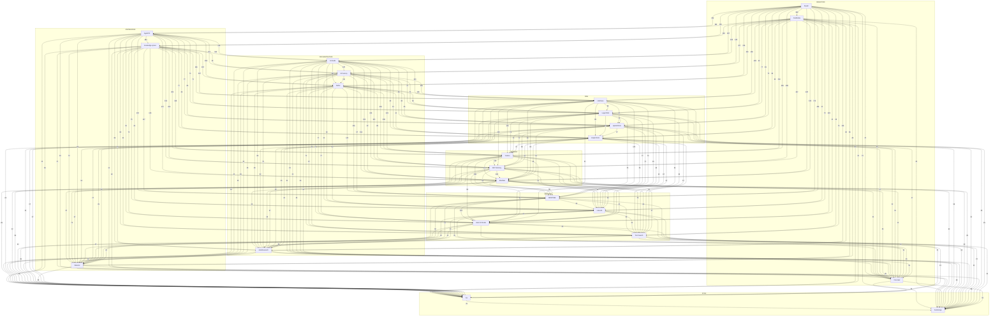

# Граф связей проектов

<!-- summary -->
> Рёбра = совместные упоминания в одном файле (≥ 2 раз).
**Проекты:** Svyazi, CardIndex, AgentFS, knowledge-space, mclaude, AI Factory, Rufler, LiteParse

---
<!-- tags: memory, rag, orchestration, security, knowledge, ingestion, local-first, anthropic, self-improvement -->

Рёбра = совместные упоминания в одном файле (≥ 2 раз).

```mermaid
graph TD
  subgraph ingestion[INGESTION]
    Svyazi[Svyazi]
    CardIndex[CardIndex]
    Firecrawl[Firecrawl]
  end
  subgraph knowledge[KNOWLEDGE]
    AgentFS[AgentFS]
    knowledge-space[knowledge-space]
    Wikontic[Wikontic]
  end
  subgraph memory[MEMORY]
    Yodoca[Yodoca]
    NGT_Memory[NGT Memory]
    MemNet[MemNet]
  end
  subgraph rag[RAG]
    LiteParse[LiteParse]
    Legal_RAG[Legal RAG]
    Hybrid_RAG[Hybrid RAG]
    Graph_RAG[Graph RAG]
  end
  subgraph orchestration[ORCHESTRATION]
    mclaude[mclaude]
    AI_Factory[AI Factory]
    Rufler[Rufler]
    AutoResearch[AutoResearch]
  end
  subgraph security[SECURITY]
    SENTINEL[SENTINEL]
    LiteLLM[LiteLLM]
    Auto_AI_Router[Auto AI Router]
    Tool_Search[Tool Search]
  end
  subgraph sync[SYNC]
    Yjs[Yjs]
    Automerge[Automerge]
  end
  Svyazi -- 294 --> Yodoca
  Svyazi -- 249 --> CardIndex
  Svyazi -- 232 --> AgentFS
  AgentFS -- 201 --> Yodoca
  Svyazi -- 200 --> knowledge-space
  Svyazi -- 197 --> mclaude
  Svyazi -- 194 --> Rufler
  Svyazi -- 187 --> MemNet
  Svyazi -- 186 --> NGT_Memory
  CardIndex -- 184 --> Yodoca
  AgentFS -- 184 --> knowledge-space
  CardIndex -- 182 --> AgentFS
  Svyazi -- 182 --> LiteParse
  Yodoca -- 175 --> NGT_Memory
  Yodoca -- 175 --> MemNet
  Svyazi -- 174 --> SENTINEL
  knowledge-space -- 165 --> Yodoca
  mclaude -- 164 --> Yodoca
  mclaude -- 163 --> Rufler
  AgentFS -- 161 --> LiteParse
  knowledge-space -- 159 --> mclaude
  AgentFS -- 159 --> mclaude
  Rufler -- 158 --> Yodoca
  knowledge-space -- 157 --> Rufler
  AgentFS -- 157 --> SENTINEL
  AgentFS -- 155 --> Rufler
  CardIndex -- 152 --> knowledge-space
  mclaude -- 143 --> LiteParse
  LiteParse -- 142 --> Yodoca
  Svyazi -- 142 --> AI_Factory
  Yodoca -- 138 --> SENTINEL
  CardIndex -- 138 --> LiteParse
  CardIndex -- 137 --> NGT_Memory
  knowledge-space -- 137 --> LiteParse
  Rufler -- 135 --> LiteParse
  CardIndex -- 134 --> SENTINEL
  CardIndex -- 132 --> Rufler
  AgentFS -- 131 --> NGT_Memory
  CardIndex -- 130 --> mclaude
  Rufler -- 127 --> SENTINEL
  LiteParse -- 127 --> SENTINEL
  mclaude -- 127 --> AI_Factory
  CardIndex -- 122 --> MemNet
  Svyazi -- 122 --> Auto_AI_Router
  AI_Factory -- 121 --> Yodoca
  knowledge-space -- 120 --> MemNet
  knowledge-space -- 119 --> NGT_Memory
  AgentFS -- 117 --> MemNet
  knowledge-space -- 117 --> SENTINEL
  AgentFS -- 117 --> AI_Factory
  Rufler -- 116 --> MemNet
  Svyazi -- 115 --> AutoResearch
  mclaude -- 115 --> SENTINEL
  AI_Factory -- 111 --> Rufler
  mclaude -- 109 --> NGT_Memory
  CardIndex -- 107 --> AI_Factory
  AI_Factory -- 105 --> LiteParse
  mclaude -- 104 --> MemNet
  NGT_Memory -- 103 --> MemNet
  AI_Factory -- 101 --> NGT_Memory
  LiteParse -- 101 --> NGT_Memory
  SENTINEL -- 101 --> Auto_AI_Router
  Svyazi -- 99 --> Legal_RAG
  LiteParse -- 99 --> Legal_RAG
  Svyazi -- 98 --> Tool_Search
  LiteParse -- 98 --> MemNet
  Yodoca -- 98 --> AutoResearch
  Svyazi -- 98 --> Graph_RAG
  LiteLLM -- 97 --> Auto_AI_Router
  AI_Factory -- 97 --> SENTINEL
  MemNet -- 96 --> SENTINEL
  Svyazi -- 95 --> Wikontic
  CardIndex -- 95 --> Auto_AI_Router
  knowledge-space -- 95 --> AI_Factory
  SENTINEL -- 93 --> Tool_Search
  Yodoca -- 93 --> Auto_AI_Router
  NGT_Memory -- 93 --> SENTINEL
  LiteParse -- 91 --> Auto_AI_Router
  AgentFS -- 91 --> Auto_AI_Router
  Rufler -- 90 --> AutoResearch
  Svyazi -- 90 --> LiteLLM
  Rufler -- 89 --> NGT_Memory
  Svyazi -- 89 --> Hybrid_RAG
  LiteParse -- 89 --> Graph_RAG
  NGT_Memory -- 89 --> Auto_AI_Router
  mclaude -- 88 --> AutoResearch
  Yodoca -- 87 --> Wikontic
  LiteParse -- 87 --> Hybrid_RAG
  Legal_RAG -- 87 --> Graph_RAG
  Svyazi -- 86 --> Yjs
  AgentFS -- 86 --> AutoResearch
  Auto_AI_Router -- 85 --> Tool_Search
  SENTINEL -- 85 --> LiteLLM
  AgentFS -- 83 --> Tool_Search
  LiteLLM -- 83 --> Tool_Search
  CardIndex -- 82 --> AutoResearch
  LiteParse -- 82 --> AutoResearch
  LiteParse -- 81 --> Tool_Search
  CardIndex -- 79 --> Tool_Search
  Yodoca -- 79 --> Tool_Search
  LiteParse -- 79 --> LiteLLM
  AgentFS -- 79 --> Legal_RAG
  knowledge-space -- 79 --> Auto_AI_Router
  AI_Factory -- 79 --> Auto_AI_Router
  Legal_RAG -- 79 --> Hybrid_RAG
  Graph_RAG -- 79 --> SENTINEL
  knowledge-space -- 78 --> AutoResearch
  Yjs -- 78 --> Automerge
  CardIndex -- 77 --> Legal_RAG
  AgentFS -- 77 --> Hybrid_RAG
  AgentFS -- 77 --> Graph_RAG
  mclaude -- 77 --> Auto_AI_Router
  Rufler -- 77 --> Auto_AI_Router
  Legal_RAG -- 77 --> SENTINEL
  Hybrid_RAG -- 77 --> Graph_RAG
  CardIndex -- 76 --> Yjs
  CardIndex -- 75 --> Hybrid_RAG
  AgentFS -- 75 --> LiteLLM
  AI_Factory -- 75 --> AutoResearch
  Legal_RAG -- 75 --> Yodoca
  Yodoca -- 75 --> LiteLLM
  CardIndex -- 73 --> LiteLLM
  AI_Factory -- 73 --> Tool_Search
  Legal_RAG -- 73 --> NGT_Memory
  Legal_RAG -- 73 --> Auto_AI_Router
  Hybrid_RAG -- 73 --> Yodoca
  knowledge-space -- 72 --> Wikontic
  knowledge-space -- 71 --> Legal_RAG
  mclaude -- 71 --> Legal_RAG
  AI_Factory -- 71 --> Legal_RAG
  Hybrid_RAG -- 71 --> SENTINEL
  Graph_RAG -- 71 --> Yodoca
  MemNet -- 70 --> Wikontic
  Svyazi -- 70 --> Automerge
  SENTINEL -- 70 --> AutoResearch
  CardIndex -- 69 --> Graph_RAG
  knowledge-space -- 69 --> Hybrid_RAG
  knowledge-space -- 69 --> Graph_RAG
  mclaude -- 69 --> Graph_RAG
  AI_Factory -- 69 --> LiteLLM
  Hybrid_RAG -- 69 --> NGT_Memory
  NGT_Memory -- 69 --> LiteLLM
  CardIndex -- 68 --> Wikontic
  MemNet -- 68 --> AutoResearch
  NGT_Memory -- 67 --> Wikontic
  AI_Factory -- 67 --> MemNet
  Rufler -- 67 --> Tool_Search
  Hybrid_RAG -- 67 --> Auto_AI_Router
  Graph_RAG -- 67 --> NGT_Memory
  Graph_RAG -- 67 --> Auto_AI_Router
  NGT_Memory -- 67 --> AutoResearch
  AgentFS -- 66 --> Yjs
  knowledge-space -- 66 --> Yjs
  Yodoca -- 66 --> Yjs
  mclaude -- 65 --> Hybrid_RAG
  mclaude -- 65 --> Tool_Search
  AI_Factory -- 65 --> Hybrid_RAG
  Rufler -- 65 --> Legal_RAG
  Rufler -- 65 --> Hybrid_RAG
  Legal_RAG -- 65 --> Tool_Search
  NGT_Memory -- 65 --> Tool_Search
  AgentFS -- 64 --> Wikontic
  Rufler -- 64 --> Yjs
  MemNet -- 63 --> Auto_AI_Router
  mclaude -- 63 --> LiteLLM
  Rufler -- 63 --> LiteLLM
  Legal_RAG -- 63 --> LiteLLM
  Hybrid_RAG -- 63 --> LiteLLM
  Auto_AI_Router -- 63 --> AutoResearch
  AgentFS -- 62 --> Automerge
  knowledge-space -- 62 --> Automerge
  LiteParse -- 62 --> Yjs
  Yodoca -- 62 --> Automerge
  knowledge-space -- 61 --> LiteLLM
  knowledge-space -- 61 --> Tool_Search
  AI_Factory -- 61 --> Graph_RAG
  Rufler -- 61 --> Graph_RAG
  CardIndex -- 60 --> Automerge
  mclaude -- 60 --> Yjs
  Rufler -- 60 --> Automerge
  AutoResearch -- 60 --> Yjs
  Rufler -- 58 --> Wikontic
  LiteParse -- 58 --> Automerge
  AutoResearch -- 58 --> Automerge
  Hybrid_RAG -- 57 --> Tool_Search
  NGT_Memory -- 57 --> Yjs
  LiteLLM -- 57 --> AutoResearch
  mclaude -- 56 --> Automerge
  MemNet -- 56 --> Yjs
  Legal_RAG -- 55 --> MemNet
  Graph_RAG -- 55 --> MemNet
  LiteParse -- 54 --> Wikontic
  SENTINEL -- 54 --> Yjs
  Graph_RAG -- 53 --> LiteLLM
  Graph_RAG -- 53 --> Tool_Search
  SENTINEL -- 52 --> Automerge
  MemNet -- 51 --> LiteLLM
  Hybrid_RAG -- 51 --> MemNet
  mclaude -- 50 --> Wikontic
  MemNet -- 50 --> Automerge
  SENTINEL -- 50 --> Wikontic
  Hybrid_RAG -- 49 --> AutoResearch
  NGT_Memory -- 49 --> Automerge
  Auto_AI_Router -- 49 --> Yjs
  Tool_Search -- 49 --> AutoResearch
  MemNet -- 47 --> Tool_Search
  AI_Factory -- 45 --> Yjs
  Legal_RAG -- 45 --> AutoResearch
  AI_Factory -- 43 --> Automerge
  AutoResearch -- 42 --> Wikontic
  Hybrid_RAG -- 41 --> Yjs
  Hybrid_RAG -- 41 --> Automerge
  Graph_RAG -- 41 --> AutoResearch
  Auto_AI_Router -- 41 --> Automerge
  Wikontic -- 38 --> Yjs
  Svyazi -- 37 --> Firecrawl
  knowledge-space -- 37 --> Firecrawl
  Legal_RAG -- 37 --> Yjs
  Graph_RAG -- 37 --> Yjs
  LiteLLM -- 37 --> Yjs
  LiteLLM -- 37 --> Automerge
  Wikontic -- 36 --> Automerge
  Legal_RAG -- 35 --> Automerge
  Graph_RAG -- 35 --> Automerge
  AgentFS -- 33 --> Firecrawl
  Rufler -- 31 --> Firecrawl
  Yodoca -- 31 --> Firecrawl
  SENTINEL -- 31 --> Firecrawl
  Tool_Search -- 31 --> Yjs
  Tool_Search -- 31 --> Automerge
  CardIndex -- 29 --> Firecrawl
  AI_Factory -- 29 --> Wikontic
  LiteParse -- 27 --> Firecrawl
  Hybrid_RAG -- 27 --> Wikontic
  Auto_AI_Router -- 27 --> Wikontic
  Graph_RAG -- 25 --> Wikontic
  MemNet -- 25 --> Firecrawl
  Wikontic -- 25 --> Firecrawl
  mclaude -- 23 --> Firecrawl
  AI_Factory -- 23 --> Firecrawl
  Legal_RAG -- 23 --> Wikontic
  Hybrid_RAG -- 23 --> Firecrawl
  LiteLLM -- 23 --> Wikontic
  Tool_Search -- 21 --> Wikontic
  Graph_RAG -- 19 --> Firecrawl
  NGT_Memory -- 19 --> Firecrawl
  LiteLLM -- 19 --> Firecrawl
  Auto_AI_Router -- 19 --> Firecrawl
  Tool_Search -- 19 --> Firecrawl
  AutoResearch -- 19 --> Firecrawl
  Firecrawl -- 19 --> Yjs
  Firecrawl -- 19 --> Automerge
  Legal_RAG -- 17 --> Firecrawl
```

## Топ совместных упоминаний

| Проект A | Проект B | Файлов вместе |
|----------|----------|---------------|
| **Svyazi** | **Yodoca** | 294 |
| **Svyazi** | **CardIndex** | 249 |
| **Svyazi** | **AgentFS** | 232 |
| **AgentFS** | **Yodoca** | 201 |
| **Svyazi** | **knowledge-space** | 200 |
| **Svyazi** | **mclaude** | 197 |
| **Svyazi** | **Rufler** | 194 |
| **Svyazi** | **MemNet** | 187 |
| **Svyazi** | **NGT Memory** | 186 |
| **CardIndex** | **Yodoca** | 184 |
| **AgentFS** | **knowledge-space** | 184 |
| **CardIndex** | **AgentFS** | 182 |
| **Svyazi** | **LiteParse** | 182 |
| **Yodoca** | **NGT Memory** | 175 |
| **Yodoca** | **MemNet** | 175 |
| **Svyazi** | **SENTINEL** | 174 |
| **knowledge-space** | **Yodoca** | 165 |
| **mclaude** | **Yodoca** | 164 |
| **mclaude** | **Rufler** | 163 |
| **AgentFS** | **LiteParse** | 161 |
| **knowledge-space** | **mclaude** | 159 |
| **AgentFS** | **mclaude** | 159 |
| **Rufler** | **Yodoca** | 158 |
| **knowledge-space** | **Rufler** | 157 |
| **AgentFS** | **SENTINEL** | 157 |

## DOT-формат (Graphviz)

```dot
digraph lorenzo {
  rankdir=LR;
  node [shape=box];
  subgraph cluster_ingestion {
    label="INGESTION";
    Svyazi [label="Svyazi"];
    CardIndex [label="CardIndex"];
    Firecrawl [label="Firecrawl"];
  }
  subgraph cluster_knowledge {
    label="KNOWLEDGE";
    AgentFS [label="AgentFS"];
    knowledge-space [label="knowledge-space"];
    Wikontic [label="Wikontic"];
  }
  subgraph cluster_memory {
    label="MEMORY";
    Yodoca [label="Yodoca"];
    NGT_Memory [label="NGT Memory"];
    MemNet [label="MemNet"];
  }
  subgraph cluster_rag {
    label="RAG";
    LiteParse [label="LiteParse"];
    Legal_RAG [label="Legal RAG"];
    Hybrid_RAG [label="Hybrid RAG"];
    Graph_RAG [label="Graph RAG"];
  }
  subgraph cluster_orchestration {
    label="ORCHESTRATION";
    mclaude [label="mclaude"];
    AI_Factory [label="AI Factory"];
    Rufler [label="Rufler"];
    AutoResearch [label="AutoResearch"];
  }
  subgraph cluster_security {
    label="SECURITY";
    SENTINEL [label="SENTINEL"];
    LiteLLM [label="LiteLLM"];
    Auto_AI_Router [label="Auto AI Router"];
    Tool_Search [label="Tool Search"];
  }
  subgraph cluster_sync {
    label="SYNC";
    Yjs [label="Yjs"];
    Automerge [label="Automerge"];
  }
  Svyazi -> CardIndex [label="249"];
  Svyazi -> knowledge-space [label="200"];
  Svyazi -> mclaude [label="197"];
  Svyazi -> Rufler [label="194"];
  Svyazi -> Yodoca [label="294"];
  Svyazi -> NGT_Memory [label="186"];
  Svyazi -> MemNet [label="187"];
  Svyazi -> Wikontic [label="95"];
  CardIndex -> knowledge-space [label="152"];
  CardIndex -> mclaude [label="130"];
  CardIndex -> Rufler [label="132"];
  CardIndex -> Yodoca [label="184"];
  CardIndex -> NGT_Memory [label="137"];
  CardIndex -> MemNet [label="122"];
  CardIndex -> Wikontic [label="68"];
  knowledge-space -> mclaude [label="159"];
  knowledge-space -> Rufler [label="157"];
  knowledge-space -> Yodoca [label="165"];
  knowledge-space -> NGT_Memory [label="119"];
  knowledge-space -> MemNet [label="120"];
  knowledge-space -> Wikontic [label="72"];
  mclaude -> Rufler [label="163"];
  mclaude -> Yodoca [label="164"];
  mclaude -> NGT_Memory [label="109"];
  mclaude -> MemNet [label="104"];
  mclaude -> Wikontic [label="50"];
  Rufler -> Yodoca [label="158"];
  Rufler -> NGT_Memory [label="89"];
  Rufler -> MemNet [label="116"];
  Rufler -> Wikontic [label="58"];
  Yodoca -> NGT_Memory [label="175"];
  Yodoca -> MemNet [label="175"];
  Yodoca -> Wikontic [label="87"];
  NGT_Memory -> MemNet [label="103"];
  NGT_Memory -> Wikontic [label="67"];
  MemNet -> Wikontic [label="70"];
  Svyazi -> AgentFS [label="232"];
  AgentFS -> Yodoca [label="201"];
  AgentFS -> Wikontic [label="64"];
  Svyazi -> SENTINEL [label="174"];
  Svyazi -> Tool_Search [label="98"];
  CardIndex -> AgentFS [label="182"];
  CardIndex -> SENTINEL [label="134"];
  CardIndex -> Tool_Search [label="79"];
  AgentFS -> SENTINEL [label="157"];
  AgentFS -> Tool_Search [label="83"];
  Yodoca -> SENTINEL [label="138"];
  Yodoca -> Tool_Search [label="79"];
  SENTINEL -> Tool_Search [label="93"];
  Svyazi -> LiteParse [label="182"];
  Svyazi -> AutoResearch [label="115"];
  Svyazi -> Yjs [label="86"];
  Svyazi -> Automerge [label="70"];
  CardIndex -> LiteParse [label="138"];
  CardIndex -> AutoResearch [label="82"];
  CardIndex -> Yjs [label="76"];
  CardIndex -> Automerge [label="60"];
  AgentFS -> knowledge-space [label="184"];
  AgentFS -> mclaude [label="159"];
  AgentFS -> Rufler [label="155"];
  AgentFS -> LiteParse [label="161"];
  AgentFS -> MemNet [label="117"];
  AgentFS -> AutoResearch [label="86"];
  AgentFS -> Yjs [label="66"];
  AgentFS -> Automerge [label="62"];
  knowledge-space -> LiteParse [label="137"];
  knowledge-space -> SENTINEL [label="117"];
  knowledge-space -> AutoResearch [label="78"];
  knowledge-space -> Yjs [label="66"];
  knowledge-space -> Automerge [label="62"];
  mclaude -> LiteParse [label="143"];
  mclaude -> SENTINEL [label="115"];
  mclaude -> AutoResearch [label="88"];
  mclaude -> Yjs [label="60"];
  mclaude -> Automerge [label="56"];
  Rufler -> LiteParse [label="135"];
  Rufler -> SENTINEL [label="127"];
  Rufler -> AutoResearch [label="90"];
  Rufler -> Yjs [label="64"];
  Rufler -> Automerge [label="60"];
  LiteParse -> Yodoca [label="142"];
  LiteParse -> MemNet [label="98"];
  LiteParse -> SENTINEL [label="127"];
  LiteParse -> AutoResearch [label="82"];
  LiteParse -> Wikontic [label="54"];
  LiteParse -> Yjs [label="62"];
  LiteParse -> Automerge [label="58"];
  Yodoca -> AutoResearch [label="98"];
  Yodoca -> Yjs [label="66"];
  Yodoca -> Automerge [label="62"];
  MemNet -> SENTINEL [label="96"];
  MemNet -> AutoResearch [label="68"];
  MemNet -> Yjs [label="56"];
  MemNet -> Automerge [label="50"];
  SENTINEL -> AutoResearch [label="70"];
  SENTINEL -> Wikontic [label="50"];
  SENTINEL -> Yjs [label="54"];
  SENTINEL -> Automerge [label="52"];
  AutoResearch -> Wikontic [label="42"];
  AutoResearch -> Yjs [label="60"];
  AutoResearch -> Automerge [label="58"];
  Wikontic -> Yjs [label="38"];
  Wikontic -> Automerge [label="36"];
  Yjs -> Automerge [label="78"];
  Svyazi -> Firecrawl [label="37"];
  CardIndex -> Firecrawl [label="29"];
  AgentFS -> Firecrawl [label="33"];
  knowledge-space -> Firecrawl [label="37"];
  Rufler -> Firecrawl [label="31"];
  Yodoca -> Firecrawl [label="31"];
  SENTINEL -> Firecrawl [label="31"];
  Svyazi -> LiteLLM [label="90"];
  Svyazi -> Auto_AI_Router [label="122"];
  LiteParse -> LiteLLM [label="79"];
  LiteParse -> Auto_AI_Router [label="91"];
  LiteParse -> Tool_Search [label="81"];
  MemNet -> LiteLLM [label="51"];
  MemNet -> Auto_AI_Router [label="63"];
  MemNet -> Tool_Search [label="47"];
  LiteLLM -> Auto_AI_Router [label="97"];
  LiteLLM -> Tool_Search [label="83"];
  Auto_AI_Router -> Tool_Search [label="85"];
  Svyazi -> AI_Factory [label="142"];
  Svyazi -> Legal_RAG [label="99"];
  Svyazi -> Hybrid_RAG [label="89"];
  Svyazi -> Graph_RAG [label="98"];
  CardIndex -> AI_Factory [label="107"];
  CardIndex -> Legal_RAG [label="77"];
  CardIndex -> Hybrid_RAG [label="75"];
  CardIndex -> Graph_RAG [label="69"];
  CardIndex -> LiteLLM [label="73"];
  CardIndex -> Auto_AI_Router [label="95"];
  AgentFS -> AI_Factory [label="117"];
  AgentFS -> Legal_RAG [label="79"];
  AgentFS -> Hybrid_RAG [label="77"];
  AgentFS -> Graph_RAG [label="77"];
  AgentFS -> NGT_Memory [label="131"];
  AgentFS -> LiteLLM [label="75"];
  AgentFS -> Auto_AI_Router [label="91"];
  knowledge-space -> AI_Factory [label="95"];
  knowledge-space -> Legal_RAG [label="71"];
  knowledge-space -> Hybrid_RAG [label="69"];
  knowledge-space -> Graph_RAG [label="69"];
  knowledge-space -> LiteLLM [label="61"];
  knowledge-space -> Auto_AI_Router [label="79"];
  knowledge-space -> Tool_Search [label="61"];
  mclaude -> AI_Factory [label="127"];
  mclaude -> Legal_RAG [label="71"];
  mclaude -> Hybrid_RAG [label="65"];
  mclaude -> Graph_RAG [label="69"];
  mclaude -> LiteLLM [label="63"];
  mclaude -> Auto_AI_Router [label="77"];
  mclaude -> Tool_Search [label="65"];
  mclaude -> Firecrawl [label="23"];
  AI_Factory -> Rufler [label="111"];
  AI_Factory -> LiteParse [label="105"];
  AI_Factory -> Legal_RAG [label="71"];
  AI_Factory -> Hybrid_RAG [label="65"];
  AI_Factory -> Graph_RAG [label="61"];
  AI_Factory -> Yodoca [label="121"];
  AI_Factory -> NGT_Memory [label="101"];
  AI_Factory -> MemNet [label="67"];
  AI_Factory -> SENTINEL [label="97"];
  AI_Factory -> LiteLLM [label="69"];
  AI_Factory -> Auto_AI_Router [label="79"];
  AI_Factory -> Tool_Search [label="73"];
  AI_Factory -> AutoResearch [label="75"];
  AI_Factory -> Wikontic [label="29"];
  AI_Factory -> Firecrawl [label="23"];
  AI_Factory -> Yjs [label="45"];
  AI_Factory -> Automerge [label="43"];
  Rufler -> Legal_RAG [label="65"];
  Rufler -> Hybrid_RAG [label="65"];
  Rufler -> Graph_RAG [label="61"];
  Rufler -> LiteLLM [label="63"];
  Rufler -> Auto_AI_Router [label="77"];
  Rufler -> Tool_Search [label="67"];
  LiteParse -> Legal_RAG [label="99"];
  LiteParse -> Hybrid_RAG [label="87"];
  LiteParse -> Graph_RAG [label="89"];
  LiteParse -> NGT_Memory [label="101"];
  LiteParse -> Firecrawl [label="27"];
  Legal_RAG -> Hybrid_RAG [label="79"];
  Legal_RAG -> Graph_RAG [label="87"];
  Legal_RAG -> Yodoca [label="75"];
  Legal_RAG -> NGT_Memory [label="73"];
  Legal_RAG -> MemNet [label="55"];
  Legal_RAG -> SENTINEL [label="77"];
  Legal_RAG -> LiteLLM [label="63"];
  Legal_RAG -> Auto_AI_Router [label="73"];
  Legal_RAG -> Tool_Search [label="65"];
  Legal_RAG -> AutoResearch [label="45"];
  Legal_RAG -> Wikontic [label="23"];
  Legal_RAG -> Firecrawl [label="17"];
  Legal_RAG -> Yjs [label="37"];
  Legal_RAG -> Automerge [label="35"];
  Hybrid_RAG -> Graph_RAG [label="77"];
  Hybrid_RAG -> Yodoca [label="73"];
  Hybrid_RAG -> NGT_Memory [label="69"];
  Hybrid_RAG -> MemNet [label="51"];
  Hybrid_RAG -> SENTINEL [label="71"];
  Hybrid_RAG -> LiteLLM [label="63"];
  Hybrid_RAG -> Auto_AI_Router [label="67"];
  Hybrid_RAG -> Tool_Search [label="57"];
  Hybrid_RAG -> AutoResearch [label="49"];
  Hybrid_RAG -> Wikontic [label="27"];
  Hybrid_RAG -> Firecrawl [label="23"];
  Hybrid_RAG -> Yjs [label="41"];
  Hybrid_RAG -> Automerge [label="41"];
  Graph_RAG -> Yodoca [label="71"];
  Graph_RAG -> NGT_Memory [label="67"];
  Graph_RAG -> MemNet [label="55"];
  Graph_RAG -> SENTINEL [label="79"];
  Graph_RAG -> LiteLLM [label="53"];
  Graph_RAG -> Auto_AI_Router [label="67"];
  Graph_RAG -> Tool_Search [label="53"];
  Graph_RAG -> AutoResearch [label="41"];
  Graph_RAG -> Wikontic [label="25"];
  Graph_RAG -> Firecrawl [label="19"];
  Graph_RAG -> Yjs [label="37"];
  Graph_RAG -> Automerge [label="35"];
  Yodoca -> LiteLLM [label="75"];
  Yodoca -> Auto_AI_Router [label="93"];
  NGT_Memory -> SENTINEL [label="93"];
  NGT_Memory -> LiteLLM [label="69"];
  NGT_Memory -> Auto_AI_Router [label="89"];
  NGT_Memory -> Tool_Search [label="65"];
  NGT_Memory -> AutoResearch [label="67"];
  NGT_Memory -> Firecrawl [label="19"];
  NGT_Memory -> Yjs [label="57"];
  NGT_Memory -> Automerge [label="49"];
  MemNet -> Firecrawl [label="25"];
  SENTINEL -> LiteLLM [label="85"];
  SENTINEL -> Auto_AI_Router [label="101"];
  LiteLLM -> AutoResearch [label="57"];
  LiteLLM -> Wikontic [label="23"];
  LiteLLM -> Firecrawl [label="19"];
  LiteLLM -> Yjs [label="37"];
  LiteLLM -> Automerge [label="37"];
  Auto_AI_Router -> AutoResearch [label="63"];
  Auto_AI_Router -> Wikontic [label="27"];
  Auto_AI_Router -> Firecrawl [label="19"];
  Auto_AI_Router -> Yjs [label="49"];
  Auto_AI_Router -> Automerge [label="41"];
  Tool_Search -> AutoResearch [label="49"];
  Tool_Search -> Wikontic [label="21"];
  Tool_Search -> Firecrawl [label="19"];
  Tool_Search -> Yjs [label="31"];
  Tool_Search -> Automerge [label="31"];
  AutoResearch -> Firecrawl [label="19"];
  Wikontic -> Firecrawl [label="25"];
  Firecrawl -> Yjs [label="19"];
  Firecrawl -> Automerge [label="19"];
}
```

<!-- see-also -->

---

**Смотрите также:**
- [NETWORK](NETWORK.md)
- [MINDMAP](MINDMAP.md)
- [GLOSSARY](GLOSSARY.md)
- [ENTITIES](ENTITIES.md)

<!-- backlinks -->

---

**Кто ссылается на этот документ (11):**
- [DENSITY](DENSITY.md)
- [DEPENDABOT](DEPENDABOT.md)
- [FOOTNOTES](FOOTNOTES.md)
- [MINDMAP](MINDMAP.md)
- [NETWORK](NETWORK.md)
- [OUTLINE](OUTLINE.md)
- [READABILITY](READABILITY.md)
- [READING_TIME](READING_TIME.md)
- _...ещё 3_

