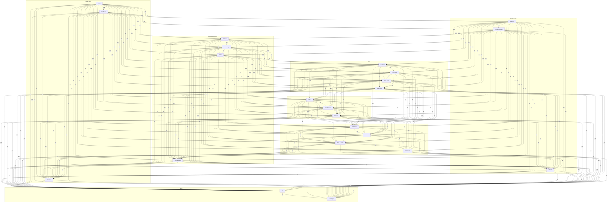

# Граф связей проектов

<!-- toc-auto -->
## Contents

- [Топ совместных упоминаний](#топ-совместных-упоминаний)
- [DOT-формат (Graphviz)](#dot-формат-graphviz)
- [Смотрите также](#смотрите-также)

> [!NOTE]
> Документ создан на основе исследования. Ссылки ведут на связанные материалы.

<!-- alert-added -->

<!-- summary -->
> Рёбра = совместные упоминания в одном файле (≥ 2 раз).
**Проекты:** Svyazi, CardIndex, AgentFS, knowledge-space, mclaude, AI Factory, Rufler, LiteParse

---
<!-- tags: memory, rag, orchestration, security, knowledge, ingestion, local-first, anthropic, self-improve -->

> [!NOTE]
> Документ создан на основе исследования. Ссылки ведут на связанные материалы.

Рёбра = совместные упоминания в одном файле (≥ 2 раз).

```mermaid
graph TD
  subgraph ingestion[INGESTION]
    Svyazi[Svyazi]
    CardIndex[CardIndex]
    Firecrawl[Firecrawl]
  end
  subgraph knowledge[KNOWLEDGE]
    AgentFS[AgentFS]
    knowledge_space[knowledge-space]
    Wikontic[Wikontic]
  end
  subgraph memory[MEMORY]
    Yodoca[Yodoca]
    NGT_Memory[NGT Memory]
    MemNet[MemNet]
  end
  subgraph rag[RAG]
    LiteParse[LiteParse]
    Legal_RAG[Legal RAG]
    Hybrid_RAG[Hybrid RAG]
    Graph_RAG[Graph RAG]
  end
  subgraph orchestration[ORCHESTRATION]
    mclaude[mclaude]
    AI_Factory[AI Factory]
    Rufler[Rufler]
    AutoResearch[AutoResearch]
  end
  subgraph security[SECURITY]
    SENTINEL[SENTINEL]
    LiteLLM[LiteLLM]
    Auto_AI_Router[Auto AI Router]
    Tool_Search[Tool Search]
  end
  subgraph sync[SYNC]
    Yjs[Yjs]
    Automerge[Automerge]
  end
  Svyazi -- 204 --> Yodoca
  Svyazi -- 189 --> CardIndex
  Svyazi -- 163 --> AgentFS
  AgentFS -- 149 --> Yodoca
  Svyazi -- 144 --> knowledge_space
  CardIndex -- 143 --> AgentFS
  CardIndex -- 142 --> Yodoca
  Svyazi -- 138 --> NGT_Memory
  Svyazi -- 137 --> mclaude
  Svyazi -- 137 --> MemNet
  Svyazi -- 133 --> Rufler
  AgentFS -- 132 --> knowledge_space
  Svyazi -- 129 --> LiteParse
  knowledge_space -- 126 --> Yodoca
  Yodoca -- 124 --> NGT_Memory
  mclaude -- 123 --> Yodoca
  Svyazi -- 121 --> AI_Factory
  Rufler -- 119 --> Yodoca
  CardIndex -- 118 --> knowledge_space
  Svyazi -- 117 --> SENTINEL
  Yodoca -- 113 --> MemNet
  AgentFS -- 112 --> LiteParse
  LiteParse -- 112 --> Yodoca
  AgentFS -- 111 --> SENTINEL
  AgentFS -- 111 --> mclaude
  AgentFS -- 111 --> Rufler
  mclaude -- 110 --> Rufler
  CardIndex -- 109 --> LiteParse
  CardIndex -- 108 --> Rufler
  mclaude -- 108 --> AI_Factory
  knowledge_space -- 107 --> mclaude
  CardIndex -- 107 --> NGT_Memory
  AI_Factory -- 106 --> Yodoca
  CardIndex -- 105 --> mclaude
  knowledge_space -- 105 --> Rufler
  AgentFS -- 104 --> AI_Factory
  Yodoca -- 102 --> SENTINEL
  mclaude -- 101 --> LiteParse
  Svyazi -- 101 --> Auto_AI_Router
  AgentFS -- 101 --> NGT_Memory
  knowledge_space -- 101 --> NGT_Memory
  CardIndex -- 99 --> SENTINEL
  knowledge_space -- 99 --> LiteParse
  CardIndex -- 99 --> AI_Factory
  AI_Factory -- 97 --> Rufler
  Rufler -- 96 --> LiteParse
  AI_Factory -- 94 --> LiteParse
  mclaude -- 94 --> NGT_Memory
  Rufler -- 92 --> SENTINEL
  AI_Factory -- 89 --> NGT_Memory
  LiteParse -- 89 --> SENTINEL
  Svyazi -- 88 --> AutoResearch
  CardIndex -- 88 --> MemNet
  SENTINEL -- 88 --> Auto_AI_Router
  knowledge_space -- 86 --> AI_Factory
  knowledge_space -- 85 --> MemNet
  CardIndex -- 85 --> Auto_AI_Router
  AI_Factory -- 85 --> SENTINEL
  LiteParse -- 85 --> NGT_Memory
  knowledge_space -- 84 --> SENTINEL
  Yodoca -- 83 --> Auto_AI_Router
  mclaude -- 82 --> SENTINEL
  LiteLLM -- 81 --> Auto_AI_Router
  AgentFS -- 81 --> Auto_AI_Router
  AgentFS -- 80 --> MemNet
  SENTINEL -- 79 --> Tool_Search
  LiteParse -- 79 --> Auto_AI_Router
  Svyazi -- 79 --> Legal_RAG
  Svyazi -- 78 --> Tool_Search
  LiteParse -- 78 --> Legal_RAG
  NGT_Memory -- 78 --> Auto_AI_Router
  Yodoca -- 77 --> AutoResearch
  Rufler -- 77 --> NGT_Memory
  Svyazi -- 76 --> Graph_RAG
  NGT_Memory -- 76 --> SENTINEL
  Rufler -- 75 --> MemNet
  AgentFS -- 74 --> Tool_Search
  LiteParse -- 74 --> MemNet
  Svyazi -- 74 --> LiteLLM
  SENTINEL -- 74 --> LiteLLM
  AI_Factory -- 72 --> Auto_AI_Router
  mclaude -- 71 --> MemNet
  Auto_AI_Router -- 71 --> Tool_Search
  knowledge_space -- 71 --> Auto_AI_Router
  mclaude -- 71 --> Auto_AI_Router
  NGT_Memory -- 71 --> MemNet
  CardIndex -- 70 --> Tool_Search
  AgentFS -- 70 --> AutoResearch
  Rufler -- 70 --> AutoResearch
  LiteLLM -- 70 --> Tool_Search
  Svyazi -- 70 --> Hybrid_RAG
  LiteParse -- 70 --> Graph_RAG
  LiteParse -- 69 --> Hybrid_RAG
  Svyazi -- 68 --> Wikontic
  Yodoca -- 68 --> Tool_Search
  LiteParse -- 68 --> LiteLLM
  LiteParse -- 68 --> Tool_Search
  AgentFS -- 68 --> LiteLLM
  Rufler -- 68 --> Auto_AI_Router
  Legal_RAG -- 68 --> SENTINEL
  Graph_RAG -- 68 --> SENTINEL
  CardIndex -- 67 --> AutoResearch
  mclaude -- 67 --> AutoResearch
  LiteParse -- 67 --> AutoResearch
  AgentFS -- 67 --> Legal_RAG
  Legal_RAG -- 67 --> Graph_RAG
  Yodoca -- 66 --> Wikontic
  AI_Factory -- 66 --> AutoResearch
  CardIndex -- 66 --> Legal_RAG
  CardIndex -- 66 --> LiteLLM
  Legal_RAG -- 66 --> Yodoca
  CardIndex -- 65 --> Hybrid_RAG
  AgentFS -- 65 --> Hybrid_RAG
  Legal_RAG -- 65 --> Auto_AI_Router
  Yodoca -- 65 --> LiteLLM
  Svyazi -- 64 --> Yjs
  AI_Factory -- 64 --> Tool_Search
  Hybrid_RAG -- 64 --> Yodoca
  AgentFS -- 63 --> Graph_RAG
  mclaude -- 63 --> Legal_RAG
  AI_Factory -- 63 --> LiteLLM
  Legal_RAG -- 63 --> NGT_Memory
  knowledge_space -- 61 --> AutoResearch
  AI_Factory -- 61 --> Legal_RAG
  Graph_RAG -- 61 --> Auto_AI_Router
  knowledge_space -- 60 --> Legal_RAG
  Legal_RAG -- 60 --> Hybrid_RAG
  Hybrid_RAG -- 60 --> NGT_Memory
  Graph_RAG -- 60 --> Yodoca
  NGT_Memory -- 60 --> LiteLLM
  AI_Factory -- 59 --> MemNet
  CardIndex -- 59 --> Graph_RAG
  mclaude -- 59 --> Graph_RAG
  Rufler -- 59 --> Legal_RAG
  Rufler -- 59 --> Tool_Search
  Hybrid_RAG -- 59 --> SENTINEL
  MemNet -- 59 --> SENTINEL
  mclaude -- 58 --> Hybrid_RAG
  AI_Factory -- 58 --> Hybrid_RAG
  Hybrid_RAG -- 58 --> Graph_RAG
  Hybrid_RAG -- 58 --> Auto_AI_Router
  NGT_Memory -- 58 --> AutoResearch
  CardIndex -- 57 --> Yjs
  knowledge_space -- 57 --> Graph_RAG
  mclaude -- 57 --> LiteLLM
  mclaude -- 57 --> Tool_Search
  Rufler -- 57 --> Hybrid_RAG
  Graph_RAG -- 57 --> NGT_Memory
  Yjs -- 56 --> Automerge
  knowledge_space -- 56 --> Hybrid_RAG
  Rufler -- 56 --> LiteLLM
  knowledge_space -- 55 --> Tool_Search
  Legal_RAG -- 55 --> LiteLLM
  Hybrid_RAG -- 55 --> LiteLLM
  NGT_Memory -- 55 --> Tool_Search
  CardIndex -- 54 --> Wikontic
  knowledge_space -- 54 --> LiteLLM
  Legal_RAG -- 54 --> Tool_Search
  Auto_AI_Router -- 54 --> AutoResearch
  MemNet -- 53 --> Wikontic
  MemNet -- 53 --> Auto_AI_Router
  Rufler -- 53 --> Graph_RAG
  Svyazi -- 52 --> Automerge
  Yodoca -- 52 --> Yjs
  AI_Factory -- 52 --> Graph_RAG
  MemNet -- 51 --> AutoResearch
  AgentFS -- 50 --> Yjs
  NGT_Memory -- 50 --> Wikontic
  knowledge_space -- 49 --> Yjs
  Hybrid_RAG -- 49 --> Tool_Search
  SENTINEL -- 49 --> AutoResearch
  LiteLLM -- 49 --> AutoResearch
  LiteParse -- 48 --> Yjs
  Graph_RAG -- 48 --> MemNet
  Rufler -- 47 --> Yjs
  Yodoca -- 47 --> Automerge
  Legal_RAG -- 47 --> MemNet
  Graph_RAG -- 47 --> LiteLLM
  NGT_Memory -- 47 --> Yjs
  CardIndex -- 45 --> Automerge
  AgentFS -- 45 --> Automerge
  knowledge_space -- 45 --> Wikontic
  AutoResearch -- 45 --> Yjs
  Graph_RAG -- 45 --> Tool_Search
  knowledge_space -- 44 --> Automerge
  mclaude -- 44 --> Yjs
  Rufler -- 44 --> Automerge
  LiteParse -- 43 --> Automerge
  Hybrid_RAG -- 43 --> MemNet
  AgentFS -- 42 --> Wikontic
  MemNet -- 42 --> Yjs
  AutoResearch -- 42 --> Automerge
  Hybrid_RAG -- 42 --> AutoResearch
  Tool_Search -- 42 --> AutoResearch
  mclaude -- 41 --> Automerge
  MemNet -- 41 --> LiteLLM
  NGT_Memory -- 41 --> Automerge
  AI_Factory -- 40 --> Yjs
  Auto_AI_Router -- 40 --> Yjs
  Rufler -- 38 --> Wikontic
  LiteParse -- 38 --> Wikontic
  MemNet -- 37 --> Tool_Search
  AI_Factory -- 37 --> Automerge
  Legal_RAG -- 36 --> AutoResearch
  Hybrid_RAG -- 36 --> Yjs
  MemNet -- 35 --> Automerge
  Hybrid_RAG -- 35 --> Automerge
  Graph_RAG -- 35 --> AutoResearch
  SENTINEL -- 35 --> Yjs
  AutoResearch -- 34 --> Wikontic
  Svyazi -- 34 --> Firecrawl
  Auto_AI_Router -- 34 --> Automerge
  Legal_RAG -- 32 --> Yjs
  SENTINEL -- 32 --> Automerge
  LiteLLM -- 32 --> Yjs
  mclaude -- 31 --> Wikontic
  AgentFS -- 31 --> Firecrawl
  knowledge_space -- 31 --> Firecrawl
  Yodoca -- 31 --> Firecrawl
  Graph_RAG -- 31 --> Yjs
  LiteLLM -- 31 --> Automerge
  CardIndex -- 30 --> Firecrawl
  Rufler -- 30 --> Firecrawl
  Wikontic -- 29 --> Yjs
  SENTINEL -- 29 --> Firecrawl
  Legal_RAG -- 29 --> Automerge
  SENTINEL -- 29 --> Wikontic
  Graph_RAG -- 28 --> Automerge
  AI_Factory -- 27 --> Wikontic
  Wikontic -- 26 --> Automerge
  Tool_Search -- 26 --> Yjs
  Tool_Search -- 26 --> Automerge
  MemNet -- 25 --> Firecrawl
  Auto_AI_Router -- 25 --> Wikontic
  LiteParse -- 24 --> Firecrawl
  Hybrid_RAG -- 24 --> Wikontic
  AI_Factory -- 23 --> Firecrawl
  Graph_RAG -- 23 --> Wikontic
  Wikontic -- 23 --> Firecrawl
  mclaude -- 21 --> Firecrawl
  Legal_RAG -- 20 --> Wikontic
  LiteLLM -- 20 --> Wikontic
  Hybrid_RAG -- 19 --> Firecrawl
  NGT_Memory -- 19 --> Firecrawl
  Tool_Search -- 19 --> Wikontic
  LiteLLM -- 17 --> Firecrawl
  Auto_AI_Router -- 17 --> Firecrawl
  Tool_Search -- 17 --> Firecrawl
  AutoResearch -- 17 --> Firecrawl
  Firecrawl -- 17 --> Yjs
  Firecrawl -- 17 --> Automerge
  Legal_RAG -- 16 --> Firecrawl
  Graph_RAG -- 16 --> Firecrawl
```

## Топ совместных упоминаний

| Проект A | Проект B | Файлов вместе |
|----------|----------|---------------|
| **Svyazi** | **Yodoca** | 204 |
| **Svyazi** | **CardIndex** | 189 |
| **Svyazi** | **AgentFS** | 163 |
| **AgentFS** | **Yodoca** | 149 |
| **Svyazi** | **knowledge-space** | 144 |
| **CardIndex** | **AgentFS** | 143 |
| **CardIndex** | **Yodoca** | 142 |
| **Svyazi** | **NGT Memory** | 138 |
| **Svyazi** | **mclaude** | 137 |
| **Svyazi** | **MemNet** | 137 |
| **Svyazi** | **Rufler** | 133 |
| **AgentFS** | **knowledge-space** | 132 |
| **Svyazi** | **LiteParse** | 129 |
| **knowledge-space** | **Yodoca** | 126 |
| **Yodoca** | **NGT Memory** | 124 |
| **mclaude** | **Yodoca** | 123 |
| **Svyazi** | **AI Factory** | 121 |
| **Rufler** | **Yodoca** | 119 |
| **CardIndex** | **knowledge-space** | 118 |
| **Svyazi** | **SENTINEL** | 117 |
| **Yodoca** | **MemNet** | 113 |
| **AgentFS** | **LiteParse** | 112 |
| **LiteParse** | **Yodoca** | 112 |
| **AgentFS** | **SENTINEL** | 111 |
| **AgentFS** | **mclaude** | 111 |

## DOT-формат (Graphviz)

```dot
digraph lorenzo {
  rankdir=LR;
  node [shape=box];
  subgraph cluster_ingestion {
    label="INGESTION";
    Svyazi [label="Svyazi"];
    CardIndex [label="CardIndex"];
    Firecrawl [label="Firecrawl"];
  }
  subgraph cluster_knowledge {
    label="KNOWLEDGE";
    AgentFS [label="AgentFS"];
    knowledge_space [label="knowledge-space"];
    Wikontic [label="Wikontic"];
  }
  subgraph cluster_memory {
    label="MEMORY";
    Yodoca [label="Yodoca"];
    NGT_Memory [label="NGT Memory"];
    MemNet [label="MemNet"];
  }
  subgraph cluster_rag {
    label="RAG";
    LiteParse [label="LiteParse"];
    Legal_RAG [label="Legal RAG"];
    Hybrid_RAG [label="Hybrid RAG"];
    Graph_RAG [label="Graph RAG"];
  }
  subgraph cluster_orchestration {
    label="ORCHESTRATION";
    mclaude [label="mclaude"];
    AI_Factory [label="AI Factory"];
    Rufler [label="Rufler"];
    AutoResearch [label="AutoResearch"];
  }
  subgraph cluster_security {
    label="SECURITY";
    SENTINEL [label="SENTINEL"];
    LiteLLM [label="LiteLLM"];
    Auto_AI_Router [label="Auto AI Router"];
    Tool_Search [label="Tool Search"];
  }
  subgraph cluster_sync {
    label="SYNC";
    Yjs [label="Yjs"];
    Automerge [label="Automerge"];
  }
  Svyazi -> CardIndex [label="189"];
  Svyazi -> AgentFS [label="163"];
  Svyazi -> Yodoca [label="204"];
  Svyazi -> Wikontic [label="68"];
  CardIndex -> AgentFS [label="143"];
  CardIndex -> Yodoca [label="142"];
  CardIndex -> Wikontic [label="54"];
  AgentFS -> Yodoca [label="149"];
  AgentFS -> Wikontic [label="42"];
  Yodoca -> Wikontic [label="66"];
  Svyazi -> SENTINEL [label="117"];
  Svyazi -> Tool_Search [label="78"];
  CardIndex -> SENTINEL [label="99"];
  CardIndex -> Tool_Search [label="70"];
  AgentFS -> SENTINEL [label="111"];
  AgentFS -> Tool_Search [label="74"];
  Yodoca -> SENTINEL [label="102"];
  Yodoca -> Tool_Search [label="68"];
  SENTINEL -> Tool_Search [label="79"];
  Svyazi -> knowledge_space [label="144"];
  Svyazi -> mclaude [label="137"];
  Svyazi -> Rufler [label="133"];
  Svyazi -> LiteParse [label="129"];
  Svyazi -> MemNet [label="137"];
  Svyazi -> AutoResearch [label="88"];
  Svyazi -> Yjs [label="64"];
  Svyazi -> Automerge [label="52"];
  CardIndex -> knowledge_space [label="118"];
  CardIndex -> mclaude [label="105"];
  CardIndex -> Rufler [label="108"];
  CardIndex -> LiteParse [label="109"];
  CardIndex -> MemNet [label="88"];
  CardIndex -> AutoResearch [label="67"];
  CardIndex -> Yjs [label="57"];
  CardIndex -> Automerge [label="45"];
  AgentFS -> knowledge_space [label="132"];
  AgentFS -> mclaude [label="111"];
  AgentFS -> Rufler [label="111"];
  AgentFS -> LiteParse [label="112"];
  AgentFS -> MemNet [label="80"];
  AgentFS -> AutoResearch [label="70"];
  AgentFS -> Yjs [label="50"];
  AgentFS -> Automerge [label="45"];
  knowledge_space -> mclaude [label="107"];
  knowledge_space -> Rufler [label="105"];
  knowledge_space -> LiteParse [label="99"];
  knowledge_space -> Yodoca [label="126"];
  knowledge_space -> MemNet [label="85"];
  knowledge_space -> AutoResearch [label="61"];
  knowledge_space -> Wikontic [label="45"];
  knowledge_space -> Yjs [label="49"];
  knowledge_space -> Automerge [label="44"];
  mclaude -> Rufler [label="110"];
  mclaude -> LiteParse [label="101"];
  mclaude -> Yodoca [label="123"];
  mclaude -> MemNet [label="71"];
  mclaude -> AutoResearch [label="67"];
  mclaude -> Wikontic [label="31"];
  mclaude -> Yjs [label="44"];
  mclaude -> Automerge [label="41"];
  Rufler -> LiteParse [label="96"];
  Rufler -> Yodoca [label="119"];
  Rufler -> MemNet [label="75"];
  Rufler -> AutoResearch [label="70"];
  Rufler -> Wikontic [label="38"];
  Rufler -> Yjs [label="47"];
  Rufler -> Automerge [label="44"];
  LiteParse -> Yodoca [label="112"];
  LiteParse -> MemNet [label="74"];
  LiteParse -> AutoResearch [label="67"];
  LiteParse -> Wikontic [label="38"];
  LiteParse -> Yjs [label="48"];
  LiteParse -> Automerge [label="43"];
  Yodoca -> MemNet [label="113"];
  Yodoca -> AutoResearch [label="77"];
  Yodoca -> Yjs [label="52"];
  Yodoca -> Automerge [label="47"];
  MemNet -> AutoResearch [label="51"];
  MemNet -> Wikontic [label="53"];
  MemNet -> Yjs [label="42"];
  MemNet -> Automerge [label="35"];
  AutoResearch -> Wikontic [label="34"];
  AutoResearch -> Yjs [label="45"];
  AutoResearch -> Automerge [label="42"];
  Wikontic -> Yjs [label="29"];
  Wikontic -> Automerge [label="26"];
  Yjs -> Automerge [label="56"];
  Svyazi -> Firecrawl [label="34"];
  CardIndex -> Firecrawl [label="30"];
  AgentFS -> Firecrawl [label="31"];
  knowledge_space -> SENTINEL [label="84"];
  knowledge_space -> Firecrawl [label="31"];
  Rufler -> SENTINEL [label="92"];
  Rufler -> Firecrawl [label="30"];
  Yodoca -> Firecrawl [label="31"];
  SENTINEL -> Firecrawl [label="29"];
  Svyazi -> LiteLLM [label="74"];
  Svyazi -> Auto_AI_Router [label="101"];
  LiteParse -> LiteLLM [label="68"];
  LiteParse -> Auto_AI_Router [label="79"];
  LiteParse -> Tool_Search [label="68"];
  MemNet -> LiteLLM [label="41"];
  MemNet -> Auto_AI_Router [label="53"];
  MemNet -> Tool_Search [label="37"];
  LiteLLM -> Auto_AI_Router [label="81"];
  LiteLLM -> Tool_Search [label="70"];
  Auto_AI_Router -> Tool_Search [label="71"];
  Svyazi -> AI_Factory [label="121"];
  CardIndex -> AI_Factory [label="99"];
  AgentFS -> AI_Factory [label="104"];
  knowledge_space -> AI_Factory [label="86"];
  mclaude -> AI_Factory [label="108"];
  AI_Factory -> Rufler [label="97"];
  AI_Factory -> LiteParse [label="94"];
  AI_Factory -> Yodoca [label="106"];
  AI_Factory -> MemNet [label="59"];
  AI_Factory -> AutoResearch [label="66"];
  AI_Factory -> Wikontic [label="27"];
  AI_Factory -> Yjs [label="40"];
  AI_Factory -> Automerge [label="37"];
  Svyazi -> Legal_RAG [label="79"];
  Svyazi -> Hybrid_RAG [label="70"];
  Svyazi -> Graph_RAG [label="76"];
  Svyazi -> NGT_Memory [label="138"];
  CardIndex -> Legal_RAG [label="66"];
  CardIndex -> Hybrid_RAG [label="65"];
  CardIndex -> Graph_RAG [label="59"];
  CardIndex -> NGT_Memory [label="107"];
  CardIndex -> LiteLLM [label="66"];
  CardIndex -> Auto_AI_Router [label="85"];
  AgentFS -> Legal_RAG [label="67"];
  AgentFS -> Hybrid_RAG [label="65"];
  AgentFS -> Graph_RAG [label="63"];
  AgentFS -> NGT_Memory [label="101"];
  AgentFS -> LiteLLM [label="68"];
  AgentFS -> Auto_AI_Router [label="81"];
  knowledge_space -> Legal_RAG [label="60"];
  knowledge_space -> Hybrid_RAG [label="56"];
  knowledge_space -> Graph_RAG [label="57"];
  knowledge_space -> NGT_Memory [label="101"];
  knowledge_space -> LiteLLM [label="54"];
  knowledge_space -> Auto_AI_Router [label="71"];
  knowledge_space -> Tool_Search [label="55"];
  mclaude -> Legal_RAG [label="63"];
  mclaude -> Hybrid_RAG [label="58"];
  mclaude -> Graph_RAG [label="59"];
  mclaude -> NGT_Memory [label="94"];
  mclaude -> SENTINEL [label="82"];
  mclaude -> LiteLLM [label="57"];
  mclaude -> Auto_AI_Router [label="71"];
  mclaude -> Tool_Search [label="57"];
  mclaude -> Firecrawl [label="21"];
  AI_Factory -> Legal_RAG [label="61"];
  AI_Factory -> Hybrid_RAG [label="58"];
  AI_Factory -> Graph_RAG [label="52"];
  AI_Factory -> NGT_Memory [label="89"];
  AI_Factory -> SENTINEL [label="85"];
  AI_Factory -> LiteLLM [label="63"];
  AI_Factory -> Auto_AI_Router [label="72"];
  AI_Factory -> Tool_Search [label="64"];
  AI_Factory -> Firecrawl [label="23"];
  Rufler -> Legal_RAG [label="59"];
  Rufler -> Hybrid_RAG [label="57"];
  Rufler -> Graph_RAG [label="53"];
  Rufler -> NGT_Memory [label="77"];
  Rufler -> LiteLLM [label="56"];
  Rufler -> Auto_AI_Router [label="68"];
  Rufler -> Tool_Search [label="59"];
  LiteParse -> Legal_RAG [label="78"];
  LiteParse -> Hybrid_RAG [label="69"];
  LiteParse -> Graph_RAG [label="70"];
  LiteParse -> NGT_Memory [label="85"];
  LiteParse -> SENTINEL [label="89"];
  LiteParse -> Firecrawl [label="24"];
  Legal_RAG -> Hybrid_RAG [label="60"];
  Legal_RAG -> Graph_RAG [label="67"];
  Legal_RAG -> Yodoca [label="66"];
  Legal_RAG -> NGT_Memory [label="63"];
  Legal_RAG -> MemNet [label="47"];
  Legal_RAG -> SENTINEL [label="68"];
  Legal_RAG -> LiteLLM [label="55"];
  Legal_RAG -> Auto_AI_Router [label="65"];
  Legal_RAG -> Tool_Search [label="54"];
  Legal_RAG -> AutoResearch [label="36"];
  Legal_RAG -> Wikontic [label="20"];
  Legal_RAG -> Firecrawl [label="16"];
  Legal_RAG -> Yjs [label="32"];
  Legal_RAG -> Automerge [label="29"];
  Hybrid_RAG -> Graph_RAG [label="58"];
  Hybrid_RAG -> Yodoca [label="64"];
  Hybrid_RAG -> NGT_Memory [label="60"];
  Hybrid_RAG -> MemNet [label="43"];
  Hybrid_RAG -> SENTINEL [label="59"];
  Hybrid_RAG -> LiteLLM [label="55"];
  Hybrid_RAG -> Auto_AI_Router [label="58"];
  Hybrid_RAG -> Tool_Search [label="49"];
  Hybrid_RAG -> AutoResearch [label="42"];
  Hybrid_RAG -> Wikontic [label="24"];
  Hybrid_RAG -> Firecrawl [label="19"];
  Hybrid_RAG -> Yjs [label="36"];
  Hybrid_RAG -> Automerge [label="35"];
  Graph_RAG -> Yodoca [label="60"];
  Graph_RAG -> NGT_Memory [label="57"];
  Graph_RAG -> MemNet [label="48"];
  Graph_RAG -> SENTINEL [label="68"];
  Graph_RAG -> LiteLLM [label="47"];
  Graph_RAG -> Auto_AI_Router [label="61"];
  Graph_RAG -> Tool_Search [label="45"];
  Graph_RAG -> AutoResearch [label="35"];
  Graph_RAG -> Wikontic [label="23"];
  Graph_RAG -> Firecrawl [label="16"];
  Graph_RAG -> Yjs [label="31"];
  Graph_RAG -> Automerge [label="28"];
  Yodoca -> NGT_Memory [label="124"];
  Yodoca -> LiteLLM [label="65"];
  Yodoca -> Auto_AI_Router [label="83"];
  NGT_Memory -> MemNet [label="71"];
  NGT_Memory -> SENTINEL [label="76"];
  NGT_Memory -> LiteLLM [label="60"];
  NGT_Memory -> Auto_AI_Router [label="78"];
  NGT_Memory -> Tool_Search [label="55"];
  NGT_Memory -> AutoResearch [label="58"];
  NGT_Memory -> Wikontic [label="50"];
  NGT_Memory -> Firecrawl [label="19"];
  NGT_Memory -> Yjs [label="47"];
  NGT_Memory -> Automerge [label="41"];
  MemNet -> SENTINEL [label="59"];
  MemNet -> Firecrawl [label="25"];
  SENTINEL -> LiteLLM [label="74"];
  SENTINEL -> Auto_AI_Router [label="88"];
  SENTINEL -> AutoResearch [label="49"];
  SENTINEL -> Wikontic [label="29"];
  SENTINEL -> Yjs [label="35"];
  SENTINEL -> Automerge [label="32"];
  LiteLLM -> AutoResearch [label="49"];
  LiteLLM -> Wikontic [label="20"];
  LiteLLM -> Firecrawl [label="17"];
  LiteLLM -> Yjs [label="32"];
  LiteLLM -> Automerge [label="31"];
  Auto_AI_Router -> AutoResearch [label="54"];
  Auto_AI_Router -> Wikontic [label="25"];
  Auto_AI_Router -> Firecrawl [label="17"];
  Auto_AI_Router -> Yjs [label="40"];
  Auto_AI_Router -> Automerge [label="34"];
  Tool_Search -> AutoResearch [label="42"];
  Tool_Search -> Wikontic [label="19"];
  Tool_Search -> Firecrawl [label="17"];
  Tool_Search -> Yjs [label="26"];
  Tool_Search -> Automerge [label="26"];
  AutoResearch -> Firecrawl [label="17"];
  Wikontic -> Firecrawl [label="23"];
  Firecrawl -> Yjs [label="17"];
  Firecrawl -> Automerge [label="17"];
}
```

<!-- see-also -->

---

## Смотрите также
- [NETWORK](NETWORK.md)
- [MINDMAP](MINDMAP.md)
- [GLOSSARY](GLOSSARY.md)
- [ENTITIES](ENTITIES.md)

