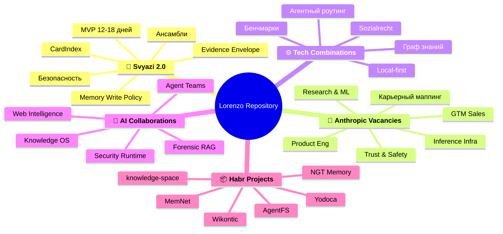
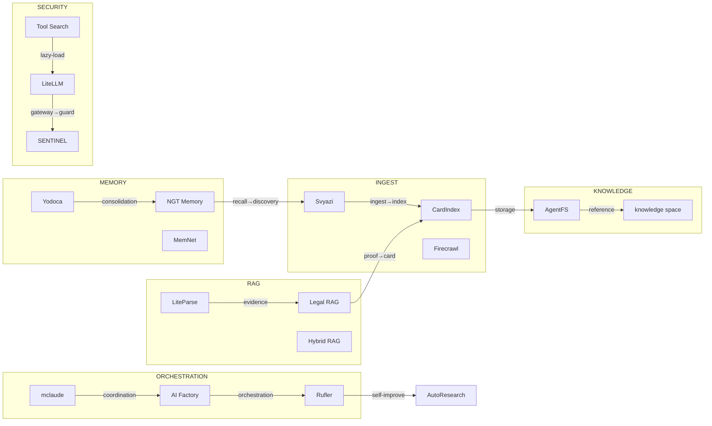

# Майндмап репозитория Lorenzo

## Структура разделов

## Поток данных между проектами

## Легенда

| Слой | Проекты |
|------|---------|
| Ingestion | Svyazi, CardIndex, Firecrawl |
| Knowledge | AgentFS, knowledge-space |
| Memory | Yodoca, NGT Memory, MemNet |
| RAG | LiteParse, Legal RAG, Hybrid RAG, Graph RAG |
| Orchestration | mclaude, AI Factory, Rufler, AutoResearch |
| Security | LiteLLM, SENTINEL, Tool Search, Auto AI Router |
| Sync | Yjs, Automerge |

<!-- see-also -->

---

**Смотрите также:**
- [GLOSSARY](docs/GLOSSARY.md)
- [GRAPH](docs/GRAPH.md)
- [NETWORK](docs/NETWORK.md)
- [CONTACT_PRIORITY](docs/CONTACT_PRIORITY.md)

