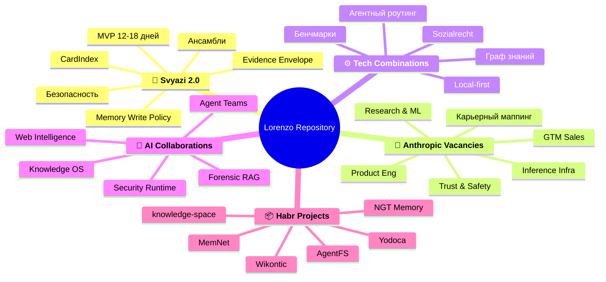
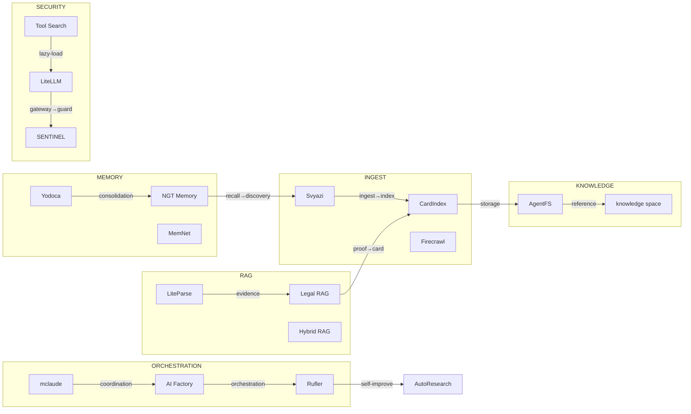

# Майндмап репозитория Lorenzo

## Структура разделов

## Поток данных между проектами

## Легенда

| Слой | Проекты |
|------|---------|
| Ingestion | Svyazi, CardIndex, Firecrawl |
| Knowledge | AgentFS, knowledge-space |
| Memory | Yodoca, NGT Memory, MemNet |
| RAG | LiteParse, Legal RAG, Hybrid RAG, Graph RAG |
| Orchestration | mclaude, AI Factory, Rufler, AutoResearch |
| Security | LiteLLM, SENTINEL, Tool Search, Auto AI Router |
| Sync | Yjs, Automerge |

<!-- backlinks-auto -->
## Упоминается в

- [docs](README.md)
- [Все таблицы репозитория](TABLES.md)
- [Домен: немецкое социальное право](03-technology-combinations/04-sozialrecht-domain.md)
- [Карта репозитория Lorenzo](SITEMAP.md)

<!-- related-auto -->
## Связанные документы

- [Нарратив проекта Lorenzo](NARRATIVE.md) _21%_
- [13 Contacts](01-svyazi/13-contacts.md) _17%_
- [План прототипа и возможные контакты](04-ai-collaborations/05-план-прототипа-и-возможные-контакты.md) _17%_
- [Контактная стратегия и узкие вопросы для авторов](04-ai-collaborations/13-контактная-стратегия-и-узкие-вопросы-для-авторов.md) _17%_
- [Матрица компонентов Svyazi 2.0](COMPONENT_MATRIX.md) _17%_
- [Граф связей проектов](GRAPH.md) _17%_
- [Сеть проектов и авторов](NETWORK.md) _17%_
- [Приоритеты файлов](PRIORITIES.md) _17%_
