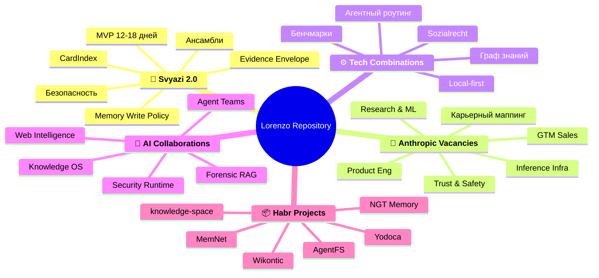
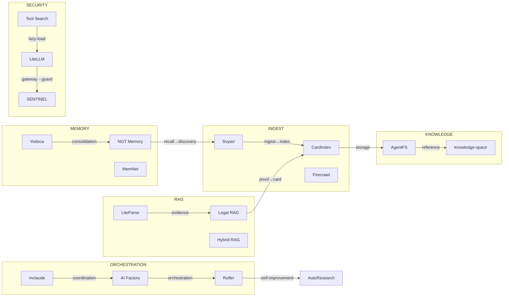

# Майндмап репозитория Lorenzo

<!-- summary -->
> > 🎯 **Проблема:** Майндмап репозитория Lorenzo Contents - Структура разделов(структура-разделов) - Поток данных между проектами(поток-данных-между-проектами) - Легенда(легенда) Структура разделов По
**Проекты:** Svyazi, CardIndex, AgentFS, knowledge-space, mclaude, AI Factory, Rufler, LiteParse

---
<!-- tags: memory, rag, orchestration, security, knowledge, ingestion, local-first, architecture, roadmap, anthropic, self-improvement, collaboration -->

<!-- abstract-auto -->
> **Абстракт** (авто)
>
> 🎯 **Проблема:** Майндмап репозитория Lorenzo Contents - Структура разделов(структура-разделов) - Поток данных между проектами(поток-данных-между-проектами) - Легенда(легенда) Структура разделов По
> 🏷️ **Ключевые слова:** `graph`, `glossary`, `entities`, `структура`, `разделов`, `поток`, `данных`, `между`
>

<!-- toc-auto -->
## Contents

- [Структура разделов](#структура-разделов)
- [Поток данных между проектами](#поток-данных-между-проектами)
- [Легенда](#легенда)

## Структура разделов

## Поток данных между проектами

## Легенда

| Слой | Проекты |
|------|---------|
| Ingestion | Svyazi, CardIndex, Firecrawl |
| Knowledge | AgentFS, knowledge-space |
| Memory | Yodoca, NGT Memory, MemNet |
| RAG | LiteParse, Legal RAG, Hybrid RAG, Graph RAG |
| Orchestration | mclaude, AI Factory, Rufler, AutoResearch |
| Security | LiteLLM, SENTINEL, Tool Search, Auto AI Router |
| Sync | Yjs, Automerge |

<!-- similar-docs -->

---

**Похожие документы:**
- [GLOSSARY](docs/GLOSSARY.md) (сходство 0.42)
- [GRAPH](docs/GRAPH.md) (сходство 0.18)
- [ENTITIES](docs/ENTITIES.md) (сходство 0.17)

<!-- see-also -->

---

**Смотрите также:**
- [GLOSSARY](docs/GLOSSARY.md)
- [GRAPH](docs/GRAPH.md)
- [NETWORK](docs/NETWORK.md)
- [ENTITIES](docs/ENTITIES.md)

