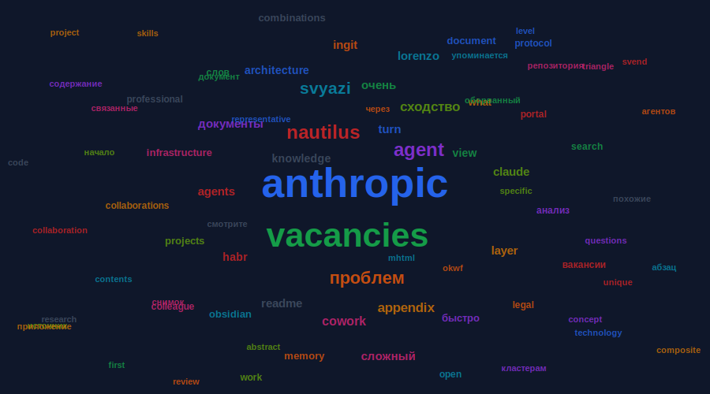

# Word Cloud

Визуализация 80 самых частых слов репозитория.

## Топ-20 слов

| # | Слово | Частота |
|---|-------|---------|
| 1 | **anthropic** | 5,050 |
| 2 | **vacancies** | 4,506 |
| 3 | **agent** | 1,422 |
| 4 | **turn** | 1,376 |
| 5 | **svyazi** | 1,039 |
| 6 | **сходство** | 1,007 |
| 7 | **view** | 973 |
| 8 | **cowork** | 926 |
| 9 | **nautilus** | 912 |
| 10 | **appendix** | 822 |
| 11 | **ingit** | 776 |
| 12 | **agents** | 701 |
| 13 | **knowledge** | 691 |
| 14 | **portal** | 659 |
| 15 | **protocol** | 617 |
| 16 | **search** | 604 |
| 17 | **document** | 599 |
| 18 | **memory** | 591 |
| 19 | **lorenzo** | 557 |
| 20 | **claude** | 556 |
