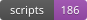

# Бейджи репозитория

Автоматически генерируются скриптом `improve_badges.py`.

## Текущие бейджи

 — `docs/badges/docs.svg`
 — `docs/badges/words.svg`
 — `docs/badges/scripts.svg`
 — `docs/badges/health.svg`
 — `docs/badges/scoring.svg`
 — `docs/badges/license.svg`
 — `docs/badges/branch.svg`

## Использование в README

```markdown


```
