# Граф концептов базы знаний

_Обновлено: 2026-05-13_

Концептов: **40** | Связей: **776** (мин. вес: 2)

## Диаграмма

```mermaid
graph TD
    документ["документ\n(956)"]
    сходство["сходство\n(723)"]
    смотрите["смотрите\n(692)"]
    также["также\n(688)"]
    anthropic["anthropic\n(632)"]
    использование["использование\n(632)"]
    связанные["связанные\n(550)"]
    note["note\n(537)"]
    репозитория("репозитория\n(462)")
    ссылки["ссылки\n(455)"]
    документы["документы\n(444)"]
    создан["создан\n(429)"]
    основе["основе\n(425)"]
    claude["claude\n(423)"]
    исследования["исследования\n(415)"]
    ведут["ведут\n(384)"]
    этот["этот\n(375)"]
    материалы["материалы\n(370)"]
    auto["auto\n(368)"]
    источник["источник\n(365)"]
    agent{{"agent\n(351)"}}
    lorenzo["lorenzo\n(329)"]
    mhtml["mhtml\n(321)"]
    readme["readme\n(319)"]
    ссылается["ссылается\n(314)"]
    раздел["раздел\n(304)"]
    снимок["снимок\n(301)"]
    nautilus["nautilus\n(283)"]
    svyazi("svyazi\n(271)")
    docs["docs\n(259)"]
    knowledge["knowledge\n(244)"]
    через["через\n(242)"]
    summary["summary\n(242)"]
    поиска[["поиска\n(237)"]]
    search[["search\n(235)"]]
    похожие["похожие\n(234)"]
    вакансии["вакансии\n(233)"]
    vacancies["vacancies\n(231)"]
    корень["корень\n(211)"]
    time["time\n(205)"]
    смотрите -- 684 |толстый|--> также
    документ -- 672 |толстый|--> сходство
    документ -- 643 |толстый|--> смотрите
    документ -- 641 |толстый|--> также
    использование -- 601 |толстый|--> смотрите
    использование -- 597 |толстый|--> также
    документ -- 591 |толстый|--> использование
    документ -- 524 |толстый|--> связанные
    смотрите -- 522 |толстый|--> сходство
    сходство -- 522 |толстый|--> также
    anthropic -- 498 |толстый|--> документ
    note -- 494 |толстый|--> документ
    использование -- 483 |толстый|--> сходство
    документ -- 451 |толстый|--> ссылки
    note -- 445 |толстый|--> сходство
    документ -- 435 |толстый|--> репозитория
    связанные -- 434 |толстый|--> смотрите
    связанные -- 432 |толстый|--> также
    связанные -- 429 |толстый|--> ссылки
    документ -- 428 |толстый|--> создан
    note -- 426 |толстый|--> создан
    документ -- 423 |толстый|--> основе
    документ -- 416 |толстый|--> документы
    репозитория -- 415 |толстый|--> сходство
    документ -- 414 |толстый|--> исследования
    использование -- 413 |толстый|--> связанные
    note -- 411 |толстый|--> основе
    основе -- 411 |толстый|--> создан
    связанные -- 408 |толстый|--> сходство
    note -- 408 |толстый|--> исследования
    исследования -- 408 |толстый|--> основе
    исследования -- 406 |толстый|--> создан
    note -- 400 |толстый|--> связанные
    note -- 397 |толстый|--> ссылки
    основе -- 397 |толстый|--> связанные
    создан -- 396 |толстый|--> ссылки
    основе -- 395 |толстый|--> ссылки
    связанные -- 395 |толстый|--> создан
    исследования -- 393 |толстый|--> связанные
    исследования -- 393 |толстый|--> ссылки
    note -- 390 |толстый|--> смотрите
    note -- 390 |толстый|--> также
    ссылки -- 389 |толстый|--> также
    смотрите -- 388 |толстый|--> ссылки
    anthropic -- 386 |толстый|--> смотрите
    note -- 384 |толстый|--> ведут
    ведут -- 384 |толстый|--> документ
    ведут -- 384 |толстый|--> исследования
    ведут -- 384 |толстый|--> основе
    ведут -- 384 |толстый|--> создан
    ведут -- 384 |толстый|--> ссылки
    ссылки -- 383 |толстый|--> сходство
    anthropic -- 382 |толстый|--> также
    ведут -- 381 |толстый|--> связанные
    создан -- 377 |толстый|--> также
    смотрите -- 376 |толстый|--> создан
    основе -- 375 |толстый|--> также
    claude -- 374 |толстый|--> документ
    основе -- 373 |толстый|--> смотрите
    note -- 372 |толстый|--> использование
```

## Топ концептов по связям

| Концепт | Файлов | Связей | Категория |
|---------|--------|--------|-----------|
| `документ` | 956 | 13218 | other |
| `сходство` | 723 | 11112 | other |
| `смотрите` | 692 | 10946 | other |
| `также` | 688 | 10917 | other |
| `использование` | 632 | 10136 | other |
| `note` | 537 | 9339 | other |
| `связанные` | 550 | 9246 | other |
| `ссылки` | 455 | 8490 | other |
| `создан` | 429 | 8178 | other |
| `основе` | 425 | 8126 | other |
| `репозитория` | 462 | 8065 | project |
| `anthropic` | 632 | 8057 | other |
| `исследования` | 415 | 8012 | other |
| `ведут` | 384 | 7611 | other |
| `материалы` | 370 | 7371 | other |
| `источник` | 365 | 6952 | other |
| `claude` | 423 | 6515 | other |
| `документы` | 444 | 6328 | other |
| `mhtml` | 321 | 6297 | other |
| `снимок` | 301 | 5979 | other |
| `этот` | 375 | 5360 | other |
| `lorenzo` | 329 | 5117 | other |
| `ссылается` | 314 | 4790 | other |
| `раздел` | 304 | 4685 | other |
| `вакансии` | 233 | 4630 | other |
| `поиска` | 237 | 4332 | knowledge |
| `auto` | 368 | 4279 | other |
| `корень` | 211 | 4250 | other |
| `через` | 242 | 3922 | other |
| `readme` | 319 | 3526 | other |
