# Граф концептов базы знаний

<!-- toc -->
## Содержание

- [Диаграмма](#диаграмма)
- [Топ концептов по связям](#топ-концептов-по-связям)
- [Смотрите также](#смотрите-также)

---

<!-- toc-auto -->

> [!NOTE]
> Раздел `CONCEPT_GRAPH` формируется автоматически из данных репозитория.

<!-- alert-added -->
<!-- tags: concept-graph, docs -->

<!-- summary -->
> `CONCEPT_GRAPH` — раздел документации проекта Lorenzo.

_Обновлено: 2026-05-11_

Концептов: **40** | Связей: **776** (мин. вес: 2)

## Диаграмма

```mermaid
graph TD
    документ["документ\n(937)"]
    сходство["сходство\n(746)"]
    смотрите["смотрите\n(687)"]
    также["также\n(683)"]
    использование["использование\n(637)"]
    anthropic["anthropic\n(633)"]
    связанные["связанные\n(546)"]
    note["note\n(546)"]
    репозитория("репозитория\n(468)")
    ссылки["ссылки\n(452)"]
    документы["документы\n(451)"]
    создан["создан\n(427)"]
    основе["основе\n(423)"]
    claude["claude\n(422)"]
    исследования["исследования\n(413)"]
    auto["auto\n(384)"]
    ведут["ведут\n(381)"]
    этот["этот\n(372)"]
    материалы["материалы\n(367)"]
    источник["источник\n(365)"]
    agent{{"agent\n(345)"}}
    lorenzo["lorenzo\n(322)"]
    mhtml["mhtml\n(320)"]
    ссылается["ссылается\n(312)"]
    readme["readme\n(309)"]
    раздел["раздел\n(303)"]
    снимок["снимок\n(300)"]
    nautilus["nautilus\n(280)"]
    svyazi("svyazi\n(273)")
    knowledge["knowledge\n(248)"]
    docs["docs\n(243)"]
    через["через\n(241)"]
    поиска[["поиска\n(237)"]]
    summary["summary\n(237)"]
    похожие["похожие\n(237)"]
    вакансии["вакансии\n(234)"]
    search[["search\n(227)"]]
    vacancies["vacancies\n(225)"]
    корень["корень\n(210)"]
    кластерам["кластерам\n(205)"]
    документ -- 681 |толстый|--> сходство
    смотрите -- 680 |толстый|--> также
    документ -- 644 |толстый|--> смотрите
    документ -- 641 |толстый|--> также
    использование -- 605 |толстый|--> смотрите
    использование -- 601 |толстый|--> также
    документ -- 597 |толстый|--> использование
    смотрите -- 530 |толстый|--> сходство
    сходство -- 529 |толстый|--> также
    документ -- 520 |толстый|--> связанные
    note -- 490 |толстый|--> документ
    anthropic -- 489 |толстый|--> документ
    использование -- 488 |толстый|--> сходство
    note -- 459 |толстый|--> сходство
    документ -- 447 |толстый|--> ссылки
    документ -- 435 |толстый|--> репозитория
    связанные -- 434 |толстый|--> смотрите
    связанные -- 431 |толстый|--> также
    репозитория -- 426 |толстый|--> сходство
    документ -- 426 |толстый|--> создан
    связанные -- 425 |толстый|--> ссылки
    note -- 424 |толстый|--> создан
    документ -- 420 |толстый|--> основе
    документ -- 419 |толстый|--> документы
    использование -- 414 |толстый|--> связанные
    документ -- 412 |толстый|--> исследования
    связанные -- 410 |толстый|--> сходство
    основе -- 409 |толстый|--> создан
    note -- 408 |толстый|--> основе
    исследования -- 406 |толстый|--> основе
    note -- 405 |толстый|--> исследования
    исследования -- 404 |толстый|--> создан
    note -- 398 |толстый|--> связанные
    note -- 394 |толстый|--> ссылки
    основе -- 393 |толстый|--> связанные
    создан -- 393 |толстый|--> ссылки
    основе -- 392 |толстый|--> ссылки
    связанные -- 392 |толстый|--> создан
    исследования -- 390 |толстый|--> связанные
    исследования -- 390 |толстый|--> ссылки
    note -- 390 |толстый|--> смотрите
    note -- 390 |толстый|--> также
    ссылки -- 389 |толстый|--> также
    смотрите -- 388 |толстый|--> ссылки
    ссылки -- 386 |толстый|--> сходство
    anthropic -- 381 |толстый|--> смотрите
    ведут -- 381 |толстый|--> документ
    ведут -- 381 |толстый|--> исследования
    ведут -- 381 |толстый|--> основе
    ведут -- 381 |толстый|--> создан
    ведут -- 381 |толстый|--> ссылки
    note -- 380 |толстый|--> ведут
    ведут -- 378 |толстый|--> связанные
    anthropic -- 377 |толстый|--> также
    note -- 377 |толстый|--> использование
    создан -- 377 |толстый|--> также
    смотрите -- 376 |толстый|--> создан
    основе -- 375 |толстый|--> также
    создан -- 375 |толстый|--> сходство
    основе -- 374 |толстый|--> смотрите
```

## Топ концептов по связям

| Концепт | Файлов | Связей | Категория |
|---------|--------|--------|-----------|
| `документ` | 937 | 13177 | other |
| `сходство` | 746 | 11386 | other |
| `смотрите` | 687 | 11051 | other |
| `также` | 683 | 11011 | other |
| `использование` | 637 | 10339 | other |
| `note` | 546 | 9420 | other |
| `связанные` | 546 | 9307 | other |
| `ссылки` | 452 | 8558 | other |
| `создан` | 427 | 8255 | other |
| `репозитория` | 468 | 8227 | project |
| `anthropic` | 633 | 8204 | other |
| `основе` | 423 | 8188 | other |
| `исследования` | 413 | 8088 | other |
| `ведут` | 381 | 7679 | other |
| `материалы` | 367 | 7440 | other |
| `источник` | 365 | 7107 | other |
| `claude` | 422 | 6660 | other |
| `mhtml` | 320 | 6434 | other |
| `документы` | 451 | 6422 | other |
| `снимок` | 300 | 6119 | other |
| `этот` | 372 | 5327 | other |
| `lorenzo` | 322 | 5089 | other |
| `вакансии` | 234 | 4834 | other |
| `раздел` | 303 | 4762 | other |
| `ссылается` | 312 | 4746 | other |
| `поиска` | 237 | 4412 | knowledge |
| `корень` | 210 | 4379 | other |
| `кластерам` | 205 | 4350 | other |
| `auto` | 384 | 4335 | other |
| `через` | 241 | 3987 | other |

## Смотрите также
- [[README|Главная]]
- [[METRICS|Метрики]]
- [[HEALTH|Здоровье]]
- [[GLOSSARY|Глоссарий]]
- [[ENTITIES|Сущности]]
