# Граф концептов базы знаний

_Обновлено: 2026-06-05_

Концептов: **40** | Связей: **777** (мин. вес: 2)

## Диаграмма

```mermaid
graph TD
    документ["документ\n(1070)"]
    смотрите["смотрите\n(701)"]
    также["также\n(699)"]
    использование["использование\n(641)"]
    сходство["сходство\n(635)"]
    anthropic["anthropic\n(620)"]
    связанные["связанные\n(600)"]
    создан["создан\n(543)"]
    основе["основе\n(536)"]
    ссылки["ссылки\n(517)"]
    исследования["исследования\n(517)"]
    note["note\n(470)"]
    репозитория("репозитория\n(456)")
    ведут["ведут\n(453)"]
    документы["документы\n(440)"]
    материалы["материалы\n(440)"]
    claude["claude\n(428)"]
    этот["этот\n(424)"]
    agent{{"agent\n(362)"}}
    ссылается["ссылается\n(360)"]
    auto["auto\n(338)"]
    источник["источник\n(333)"]
    readme["readme\n(314)"]
    mhtml["mhtml\n(303)"]
    svyazi("svyazi\n(295)")
    раздел["раздел\n(291)"]
    knowledge["knowledge\n(284)"]
    снимок["снимок\n(282)"]
    nautilus["nautilus\n(279)"]
    lorenzo["lorenzo\n(277)"]
    docs["docs\n(268)"]
    через["через\n(252)"]
    похожие["похожие\n(241)"]
    search[["search\n(239)"]]
    вакансии["вакансии\n(230)"]
    поиска[["поиска\n(229)"]]
    summary["summary\n(226)"]
    memory[("memory\n(225)")]
    vacancies["vacancies\n(223)"]
    time["time\n(223)"]
    смотрите -- 697 |толстый|--> также
    документ -- 663 |толстый|--> смотрите
    документ -- 662 |толстый|--> также
    использование -- 608 |толстый|--> смотрите
    документ -- 606 |толстый|--> использование
    использование -- 605 |толстый|--> также
    документ -- 597 |толстый|--> сходство
    документ -- 582 |толстый|--> связанные
    документ -- 542 |толстый|--> создан
    документ -- 535 |толстый|--> основе
    основе -- 526 |толстый|--> создан
    документ -- 516 |толстый|--> исследования
    исследования -- 514 |толстый|--> основе
    исследования -- 513 |толстый|--> создан
    anthropic -- 512 |толстый|--> документ
    документ -- 512 |толстый|--> ссылки
    связанные -- 491 |толстый|--> ссылки
    создан -- 484 |толстый|--> ссылки
    основе -- 483 |толстый|--> ссылки
    связанные -- 482 |толстый|--> создан
    основе -- 481 |толстый|--> связанные
    исследования -- 478 |толстый|--> ссылки
    исследования -- 474 |толстый|--> связанные
    смотрите -- 455 |толстый|--> сходство
    сходство -- 454 |толстый|--> также
    ведут -- 453 |толстый|--> документ
    ведут -- 453 |толстый|--> исследования
    ведут -- 453 |толстый|--> основе
    ведут -- 453 |толстый|--> создан
    ведут -- 453 |толстый|--> ссылки
    ведут -- 449 |толстый|--> связанные
    связанные -- 444 |толстый|--> смотрите
    связанные -- 444 |толстый|--> также
    note -- 441 |толстый|--> документ
    документ -- 440 |толстый|--> материалы
    материалы -- 438 |толстый|--> связанные
    материалы -- 438 |толстый|--> ссылки
    ведут -- 437 |толстый|--> материалы
    исследования -- 437 |толстый|--> материалы
    материалы -- 437 |толстый|--> основе
    материалы -- 437 |толстый|--> создан
    документ -- 428 |толстый|--> репозитория
    создан -- 428 |толстый|--> также
    смотрите -- 427 |толстый|--> создан
    использование -- 424 |толстый|--> связанные
    основе -- 424 |толстый|--> также
    основе -- 423 |толстый|--> смотрите
    использование -- 421 |толстый|--> сходство
    ссылки -- 418 |толстый|--> также
    смотрите -- 417 |толстый|--> ссылки
    документ -- 410 |толстый|--> этот
    исследования -- 409 |толстый|--> также
    документ -- 408 |толстый|--> документы
    исследования -- 408 |толстый|--> смотрите
    использование -- 404 |толстый|--> создан
    использование -- 402 |толстый|--> основе
    использование -- 396 |толстый|--> ссылки
    использование -- 388 |толстый|--> исследования
    claude -- 380 |толстый|--> документ
    репозитория -- 378 |толстый|--> сходство
```

## Топ концептов по связям

| Концепт | Файлов | Связей | Категория |
|---------|--------|--------|-----------|
| `документ` | 1070 | 13954 | other |
| `смотрите` | 701 | 10911 | other |
| `также` | 699 | 10889 | other |
| `использование` | 641 | 10143 | other |
| `сходство` | 635 | 9765 | other |
| `связанные` | 600 | 9746 | other |
| `создан` | 543 | 9421 | other |
| `основе` | 536 | 9358 | other |
| `ссылки` | 517 | 9192 | other |
| `исследования` | 517 | 9157 | other |
| `ведут` | 453 | 8388 | other |
| `материалы` | 440 | 8176 | other |
| `note` | 470 | 8051 | other |
| `anthropic` | 620 | 7962 | other |
| `репозитория` | 456 | 7872 | project |
| `claude` | 428 | 6534 | other |
| `источник` | 333 | 6329 | other |
| `документы` | 440 | 6264 | other |
| `этот` | 424 | 5915 | other |
| `mhtml` | 303 | 5855 | other |
| `снимок` | 282 | 5532 | other |
| `ссылается` | 360 | 5334 | other |
| `вакансии` | 230 | 4458 | other |
| `lorenzo` | 277 | 4449 | other |
| `раздел` | 291 | 4412 | other |
| `поиска` | 229 | 4176 | knowledge |
| `auto` | 338 | 4122 | other |
| `через` | 252 | 4019 | other |
| `agent` | 362 | 3669 | agent |
| `readme` | 314 | 3545 | other |
