# Граф концептов базы знаний

<!-- toc-auto -->

> [!NOTE]
> Раздел `CONCEPT_GRAPH` формируется автоматически из данных репозитория.

<!-- alert-added -->
<!-- tags: concept-graph, docs -->

<!-- summary -->
> `CONCEPT_GRAPH` — раздел документации проекта Lorenzo.

_Обновлено: 2026-05-11_

Концептов: **40** | Связей: **777** (мин. вес: 2)

## Диаграмма

```mermaid
graph TD
    документ["документ\n(936)"]
    сходство["сходство\n(746)"]
    смотрите["смотрите\n(687)"]
    также["также\n(683)"]
    anthropic["anthropic\n(635)"]
    использование["использование\n(633)"]
    note["note\n(545)"]
    связанные["связанные\n(544)"]
    репозитория("репозитория\n(470)")
    ссылки["ссылки\n(451)"]
    документы["документы\n(449)"]
    создан["создан\n(426)"]
    claude["claude\n(422)"]
    основе["основе\n(422)"]
    исследования["исследования\n(413)"]
    auto["auto\n(381)"]
    ведут["ведут\n(380)"]
    этот["этот\n(370)"]
    материалы["материалы\n(366)"]
    источник["источник\n(365)"]
    agent{{"agent\n(346)"}}
    lorenzo["lorenzo\n(320)"]
    mhtml["mhtml\n(320)"]
    ссылается["ссылается\n(314)"]
    readme["readme\n(307)"]
    раздел["раздел\n(302)"]
    снимок["снимок\n(300)"]
    nautilus["nautilus\n(284)"]
    svyazi("svyazi\n(272)")
    knowledge["knowledge\n(250)"]
    docs["docs\n(246)"]
    через["через\n(242)"]
    summary["summary\n(239)"]
    поиска[["поиска\n(237)"]]
    похожие["похожие\n(237)"]
    вакансии["вакансии\n(234)"]
    search[["search\n(228)"]]
    vacancies["vacancies\n(228)"]
    корень["корень\n(210)"]
    кластерам["кластерам\n(205)"]
    документ -- 681 |толстый|--> сходство
    смотрите -- 680 |толстый|--> также
    документ -- 642 |толстый|--> смотрите
    документ -- 639 |толстый|--> также
    использование -- 604 |толстый|--> смотрите
    использование -- 600 |толстый|--> также
    документ -- 593 |толстый|--> использование
    смотрите -- 529 |толстый|--> сходство
    сходство -- 528 |толстый|--> также
    документ -- 518 |толстый|--> связанные
    anthropic -- 490 |толстый|--> документ
    note -- 489 |толстый|--> документ
    использование -- 486 |толстый|--> сходство
    note -- 457 |толстый|--> сходство
    документ -- 446 |толстый|--> ссылки
    документ -- 435 |толстый|--> репозитория
    связанные -- 433 |толстый|--> смотрите
    связанные -- 430 |толстый|--> также
    репозитория -- 426 |толстый|--> сходство
    документ -- 425 |толстый|--> создан
    связанные -- 424 |толстый|--> ссылки
    note -- 423 |толстый|--> создан
    документ -- 419 |толстый|--> основе
    документ -- 417 |толстый|--> документы
    использование -- 413 |толстый|--> связанные
    документ -- 412 |толстый|--> исследования
    связанные -- 408 |толстый|--> сходство
    основе -- 408 |толстый|--> создан
    note -- 407 |толстый|--> основе
    исследования -- 405 |толстый|--> основе
    note -- 404 |толстый|--> исследования
    исследования -- 403 |толстый|--> создан
    note -- 397 |толстый|--> связанные
    note -- 393 |толстый|--> ссылки
    основе -- 392 |толстый|--> связанные
    создан -- 392 |толстый|--> ссылки
    основе -- 391 |толстый|--> ссылки
    связанные -- 391 |толстый|--> создан
    исследования -- 389 |толстый|--> связанные
    исследования -- 389 |толстый|--> ссылки
    note -- 389 |толстый|--> смотрите
    note -- 389 |толстый|--> также
    ссылки -- 388 |толстый|--> также
    смотрите -- 387 |толстый|--> ссылки
    anthropic -- 384 |толстый|--> смотрите
    ссылки -- 384 |толстый|--> сходство
    anthropic -- 380 |толстый|--> также
    ведут -- 380 |толстый|--> документ
    ведут -- 380 |толстый|--> исследования
    ведут -- 380 |толстый|--> основе
    ведут -- 380 |толстый|--> создан
    ведут -- 380 |толстый|--> ссылки
    note -- 379 |толстый|--> ведут
    ведут -- 377 |толстый|--> связанные
    note -- 376 |толстый|--> использование
    создан -- 376 |толстый|--> также
    смотрите -- 375 |толстый|--> создан
    основе -- 374 |толстый|--> также
    claude -- 373 |толстый|--> документ
    основе -- 373 |толстый|--> смотрите
```

## Топ концептов по связям

| Концепт | Файлов | Связей | Категория |
|---------|--------|--------|-----------|
| `документ` | 936 | 13154 | other |
| `сходство` | 746 | 11373 | other |
| `смотрите` | 687 | 11044 | other |
| `также` | 683 | 11004 | other |
| `использование` | 633 | 10288 | other |
| `note` | 545 | 9399 | other |
| `связанные` | 544 | 9288 | other |
| `ссылки` | 451 | 8549 | other |
| `создан` | 426 | 8239 | other |
| `репозитория` | 470 | 8235 | project |
| `anthropic` | 635 | 8224 | other |
| `основе` | 422 | 8174 | other |
| `исследования` | 413 | 8083 | other |
| `ведут` | 380 | 7665 | other |
| `материалы` | 366 | 7426 | other |
| `источник` | 365 | 7109 | other |
| `claude` | 422 | 6657 | other |
| `mhtml` | 320 | 6434 | other |
| `документы` | 449 | 6401 | other |
| `снимок` | 300 | 6119 | other |
| `этот` | 370 | 5300 | other |
| `lorenzo` | 320 | 5080 | other |
| `вакансии` | 234 | 4835 | other |
| `ссылается` | 314 | 4762 | other |
| `раздел` | 302 | 4745 | other |
| `поиска` | 237 | 4412 | knowledge |
| `корень` | 210 | 4379 | other |
| `кластерам` | 205 | 4352 | other |
| `auto` | 381 | 4289 | other |
| `через` | 242 | 3989 | other |

## Смотрите также
- [[README|Главная]]
- [[METRICS|Метрики]]
- [[HEALTH|Здоровье]]
- [[GLOSSARY|Глоссарий]]
- [[ENTITIES|Сущности]]
