# Граф концептов базы знаний

<!-- toc -->
## Содержание

- [Contents](#contents)
- [Диаграмма](#диаграмма)
- [Топ концептов по связям](#топ-концептов-по-связям)
- [Смотрите также](#смотрите-также)

---

<!-- toc-auto -->
## Contents

- [Диаграмма](#диаграмма)
- [Топ концептов по связям](#топ-концептов-по-связям)
- [Смотрите также](#смотрите-также)

> [!NOTE]
> Документ создан на основе исследования. Ссылки ведут на связанные материалы.

<!-- alert-added -->

<!-- summary -->
> Концептов: **40** | Связей: **779** (мин. вес: 2)
**Проекты:** Svyazi

---
<!-- tags: ingestion, architecture, anthropic, collaboration -->

> [!NOTE]
> Документ создан на основе исследования. Ссылки ведут на связанные материалы.

_Обновлено: 2026-05-10_

Концептов: **40** | Связей: **779** (мин. вес: 2)

## Диаграмма

```mermaid
graph TD
    docs["docs\n(1044)"]
    anthropic["anthropic\n(814)"]
    claude["claude\n(521)"]
    vacancies["vacancies\n(500)"]
    источник["источник\n(466)"]
    summary["summary\n(432)"]
    mhtml["mhtml\n(413)"]
    снимок["снимок\n(400)"]
    репозитория("репозитория\n(397)")
    корень["корень\n(377)"]
    вакансии["вакансии\n(354)"]
    agent{{"agent\n(348)"}}
    кластерам["кластерам\n(340)"]
    nautilus["nautilus\n(332)"]
    раздел["раздел\n(306)"]
    диалога["диалога\n(270)"]
    tags["tags\n(265)"]
    svyazi("svyazi\n(255)")
    knowledge["knowledge\n(255)"]
    readme["readme\n(237)"]
    architecture["architecture\n(230)"]
    auto["auto\n(224)"]
    appendix["appendix\n(212)"]
    документы["документы\n(209)"]
    сходство["сходство\n(195)"]
    memory[("memory\n(189)")]
    collaboration["collaboration\n(174)"]
    документ["документ\n(173)"]
    habr["habr\n(169)"]
    agents{{"agents\n(168)"}}
    layer[/"layer\n(167)"/]
    work["work\n(160)"]
    portal["portal\n(155)"]
    projects["projects\n(149)"]
    protocol[/"protocol\n(144)"/]
    ingit["ingit\n(144)"]
    legal["legal\n(143)"]
    document[\"document\n(142)"\]
    first["first\n(137)"]
    cowork["cowork\n(137)"]
    anthropic -- 757 |толстый|--> docs
    anthropic -- 500 |толстый|--> vacancies
    docs -- 494 |толстый|--> vacancies
    claude -- 478 |толстый|--> docs
    docs -- 440 |толстый|--> источник
    anthropic -- 415 |толстый|--> claude
    mhtml -- 406 |толстый|--> источник
    mhtml -- 400 |толстый|--> снимок
    источник -- 400 |толстый|--> снимок
    claude -- 387 |толстый|--> mhtml
    claude -- 387 |толстый|--> источник
    docs -- 386 |толстый|--> mhtml
    claude -- 381 |толстый|--> снимок
    mhtml -- 377 |толстый|--> корень
    источник -- 377 |толстый|--> корень
    источник -- 377 |толстый|--> репозитория
    корень -- 377 |толстый|--> снимок
    mhtml -- 376 |толстый|--> репозитория
    репозитория -- 376 |толстый|--> снимок
    docs -- 376 |толстый|--> снимок
    корень -- 375 |толстый|--> репозитория
    docs -- 369 |толстый|--> репозитория
    claude -- 361 |толстый|--> репозитория
    claude -- 359 |толстый|--> корень
    anthropic -- 353 |толстый|--> вакансии
    docs -- 353 |толстый|--> корень
    docs -- 345 |толстый|--> summary
    anthropic -- 340 |толстый|--> кластерам
    вакансии -- 340 |толстый|--> кластерам
    docs -- 330 |толстый|--> вакансии
    anthropic -- 319 |толстый|--> источник
    claude -- 317 |толстый|--> вакансии
    docs -- 316 |толстый|--> кластерам
    anthropic -- 314 |толстый|--> mhtml
    claude -- 309 |толстый|--> кластерам
    agent -- 307 |толстый|--> docs
    anthropic -- 307 |толстый|--> снимок
    anthropic -- 303 |толстый|--> nautilus
    docs -- 301 |толстый|--> nautilus
    anthropic -- 301 |толстый|--> репозитория
    mhtml -- 299 |толстый|--> вакансии
    вакансии -- 299 |толстый|--> источник
    вакансии -- 299 |толстый|--> снимок
    anthropic -- 297 |толстый|--> корень
    mhtml -- 295 |толстый|--> кластерам
    источник -- 295 |толстый|--> кластерам
    кластерам -- 295 |толстый|--> снимок
    вакансии -- 292 |толстый|--> репозитория
    вакансии -- 292 |толстый|--> корень
    кластерам -- 292 |толстый|--> корень
    кластерам -- 290 |толстый|--> репозитория
    источник -- 288 |толстый|--> раздел
    anthropic -- 285 |толстый|--> раздел
    docs -- 280 |толстый|--> раздел
    раздел -- 274 |толстый|--> репозитория
    claude -- 274 |толстый|--> раздел
    вакансии -- 272 |толстый|--> раздел
    кластерам -- 271 |толстый|--> раздел
    mhtml -- 270 |толстый|--> диалога
    mhtml -- 270 |толстый|--> раздел
```

## Топ концептов по связям

| Концепт | Файлов | Связей | Категория |
|---------|--------|--------|-----------|
| `docs` | 1044 | 9859 | other |
| `anthropic` | 814 | 8375 | other |
| `claude` | 521 | 6233 | other |
| `источник` | 466 | 5833 | other |
| `mhtml` | 413 | 5447 | other |
| `снимок` | 400 | 5393 | other |
| `репозитория` | 397 | 5353 | project |
| `корень` | 377 | 5183 | other |
| `вакансии` | 354 | 5011 | other |
| `кластерам` | 340 | 4887 | other |
| `vacancies` | 500 | 4864 | other |
| `раздел` | 306 | 4330 | other |
| `диалога` | 270 | 4041 | other |
| `nautilus` | 332 | 3986 | other |
| `summary` | 432 | 3891 | other |
| `agent` | 348 | 3500 | agent |
| `tags` | 265 | 2868 | other |
| `architecture` | 230 | 2451 | other |
| `knowledge` | 255 | 2421 | other |
| `appendix` | 212 | 2281 | other |
| `readme` | 237 | 2206 | other |
| `svyazi` | 255 | 2007 | project |
| `документы` | 209 | 1968 | other |
| `auto` | 224 | 1949 | other |
| `collaboration` | 174 | 1942 | other |
| `portal` | 155 | 1835 | other |
| `habr` | 169 | 1817 | other |
| `layer` | 167 | 1813 | architecture |
| `сходство` | 195 | 1782 | other |
| `protocol` | 144 | 1772 | architecture |

<!-- see-also -->

---

## Смотрите также
- [[15-glossary]]
- [[13-reference-implementation]]
- [[10-query-result]]
- [[11-relevance-ranking]]

<!-- backlinks -->

---

**Кто ссылается на этот документ (3):**
- [READABILITY](../READABILITY.md)
- [READING_TIME](../READING_TIME.md)
- [SEARCH](../SEARCH.md)

