# Граф связей проектов

<!-- toc -->
## Содержание

- [Contents](#contents)
- [Топ совместных упоминаний](#топ-совместных-упоминаний)
- [DOT-формат (Graphviz)](#dot-формат-graphviz)

---


<!-- toc-auto -->
## Contents

- [Топ совместных упоминаний](#топ-совместных-упоминаний)
- [DOT-формат (Graphviz)](#dot-формат-graphviz)


> [!NOTE]
> Раздел `GRAPH` формируется автоматически из данных репозитория.

<!-- alert-added -->
<!-- tags: graph, docs -->


<!-- summary -->
> `GRAPH` — раздел документации проекта Lorenzo.


Рёбра = совместные упоминания в одном файле (≥ 2 раз).

```mermaid
graph TD
  subgraph ingestion[INGESTION]
    Svyazi[Svyazi]
    CardIndex[CardIndex]
    Firecrawl[Firecrawl]
  end
  subgraph knowledge[KNOWLEDGE]
    AgentFS[AgentFS]
    knowledge-space[knowledge-space]
    Wikontic[Wikontic]
  end
  subgraph memory[MEMORY]
    Yodoca[Yodoca]
    NGT_Memory[NGT Memory]
    MemNet[MemNet]
  end
  subgraph rag[RAG]
    LiteParse[LiteParse]
    Legal_RAG[Legal RAG]
    Hybrid_RAG[Hybrid RAG]
    Graph_RAG[Graph RAG]
  end
  subgraph orchestration[ORCHESTRATION]
    mclaude[mclaude]
    AI_Factory[AI Factory]
    Rufler[Rufler]
    AutoResearch[AutoResearch]
  end
  subgraph security[SECURITY]
    SENTINEL[SENTINEL]
    LiteLLM[LiteLLM]
    Auto_AI_Router[Auto AI Router]
    Tool_Search[Tool Search]
  end
  subgraph sync[SYNC]
    Yjs[Yjs]
    Automerge[Automerge]
  end
  Svyazi -- 277 --> Yodoca
  Svyazi -- 247 --> CardIndex
  Svyazi -- 217 --> AgentFS
  AgentFS -- 194 --> Yodoca
  Svyazi -- 190 --> knowledge-space
  Svyazi -- 187 --> mclaude
  CardIndex -- 180 --> Yodoca
  Svyazi -- 179 --> Rufler
  Svyazi -- 177 --> NGT_Memory
  AgentFS -- 175 --> knowledge-space
  Svyazi -- 174 --> MemNet
  CardIndex -- 173 --> AgentFS
  Svyazi -- 167 --> LiteParse
  Yodoca -- 161 --> NGT_Memory
  Yodoca -- 160 --> MemNet
  knowledge-space -- 159 --> Yodoca
  mclaude -- 158 --> Yodoca
  mclaude -- 150 --> Rufler
  Rufler -- 149 --> Yodoca
  AgentFS -- 147 --> mclaude
  AgentFS -- 146 --> LiteParse
  knowledge-space -- 145 --> mclaude
  Svyazi -- 143 --> AI_Factory
  CardIndex -- 142 --> knowledge-space
  knowledge-space -- 142 --> Rufler
  AgentFS -- 141 --> Rufler
  Svyazi -- 138 --> SENTINEL
  LiteParse -- 135 --> Yodoca
  CardIndex -- 133 --> NGT_Memory
  CardIndex -- 130 --> LiteParse
  mclaude -- 130 --> LiteParse
  mclaude -- 129 --> AI_Factory
  AgentFS -- 127 --> SENTINEL
  knowledge-space -- 126 --> LiteParse
  CardIndex -- 124 --> mclaude
  CardIndex -- 124 --> Rufler
  Rufler -- 124 --> LiteParse
  AgentFS -- 124 --> NGT_Memory
  AI_Factory -- 122 --> Yodoca
  AgentFS -- 118 --> AI_Factory
  Yodoca -- 117 --> SENTINEL
  Svyazi -- 115 --> Auto_AI_Router
  knowledge-space -- 115 --> NGT_Memory
  Svyazi -- 114 --> AutoResearch
  AI_Factory -- 113 --> Rufler
  CardIndex -- 111 --> MemNet
  CardIndex -- 109 --> SENTINEL
  CardIndex -- 109 --> AI_Factory
  knowledge-space -- 108 --> MemNet
  mclaude -- 107 --> NGT_Memory
  AgentFS -- 106 --> MemNet
  AI_Factory -- 106 --> LiteParse
  Rufler -- 104 --> MemNet
  Rufler -- 102 --> SENTINEL
  AI_Factory -- 102 --> NGT_Memory
  LiteParse -- 100 --> SENTINEL
  Yodoca -- 98 --> AutoResearch
  LiteParse -- 98 --> Legal_RAG
  SENTINEL -- 98 --> Auto_AI_Router
  Svyazi -- 97 --> Legal_RAG
  knowledge-space -- 96 --> AI_Factory
  LiteParse -- 96 --> NGT_Memory
  mclaude -- 95 --> MemNet
  AI_Factory -- 95 --> SENTINEL
  LiteLLM -- 95 --> Auto_AI_Router
  Svyazi -- 94 --> Tool_Search
  CardIndex -- 94 --> Auto_AI_Router
  SENTINEL -- 93 --> Tool_Search
  NGT_Memory -- 92 --> MemNet
  Svyazi -- 92 --> Graph_RAG
  Svyazi -- 91 --> Wikontic
  knowledge-space -- 91 --> SENTINEL
  Yodoca -- 91 --> Auto_AI_Router
  Rufler -- 89 --> AutoResearch
  mclaude -- 89 --> SENTINEL
  LiteParse -- 89 --> Auto_AI_Router
  Svyazi -- 88 --> Yjs
  NGT_Memory -- 88 --> SENTINEL
  NGT_Memory -- 88 --> Auto_AI_Router
  LiteParse -- 87 --> MemNet
  Svyazi -- 87 --> Hybrid_RAG
  mclaude -- 86 --> AutoResearch
  Svyazi -- 86 --> LiteLLM
  AgentFS -- 86 --> Auto_AI_Router
  Rufler -- 86 --> NGT_Memory
  LiteParse -- 86 --> Hybrid_RAG
  AgentFS -- 85 --> AutoResearch
  LiteParse -- 85 --> Graph_RAG
  SENTINEL -- 85 --> LiteLLM
  Yodoca -- 84 --> Wikontic
  AgentFS -- 84 --> Tool_Search
  Legal_RAG -- 84 --> Graph_RAG
  Auto_AI_Router -- 83 --> Tool_Search
  LiteParse -- 82 --> AutoResearch
  CardIndex -- 81 --> AutoResearch
  LiteLLM -- 81 --> Tool_Search
  CardIndex -- 80 --> Tool_Search
  Yjs -- 80 --> Automerge
  AgentFS -- 80 --> Legal_RAG
  Yodoca -- 79 --> Tool_Search
  AgentFS -- 79 --> Hybrid_RAG
  AI_Factory -- 79 --> Auto_AI_Router
  LiteParse -- 79 --> Tool_Search
  CardIndex -- 78 --> Legal_RAG
  Legal_RAG -- 78 --> SENTINEL
  knowledge-space -- 77 --> AutoResearch
  CardIndex -- 77 --> Hybrid_RAG
  knowledge-space -- 77 --> Auto_AI_Router
  LiteParse -- 77 --> LiteLLM
  Legal_RAG -- 77 --> Hybrid_RAG
  Legal_RAG -- 77 --> Yodoca
  Graph_RAG -- 77 --> SENTINEL
  AgentFS -- 76 --> LiteLLM
  Rufler -- 76 --> Auto_AI_Router
  Hybrid_RAG -- 76 --> Yodoca
  CardIndex -- 75 --> Yjs
  mclaude -- 75 --> Auto_AI_Router
  AI_Factory -- 75 --> AutoResearch
  Legal_RAG -- 75 --> NGT_Memory
  Hybrid_RAG -- 75 --> Graph_RAG
  Yodoca -- 75 --> LiteLLM
  CardIndex -- 74 --> LiteLLM
  AgentFS -- 74 --> Graph_RAG
  Legal_RAG -- 74 --> Auto_AI_Router
  mclaude -- 73 --> Legal_RAG
  AI_Factory -- 73 --> Tool_Search
  Svyazi -- 72 --> Automerge
  knowledge-space -- 72 --> Legal_RAG
  AI_Factory -- 72 --> Legal_RAG
  Hybrid_RAG -- 72 --> SENTINEL
  Hybrid_RAG -- 71 --> NGT_Memory
  knowledge-space -- 70 --> Hybrid_RAG
  MemNet -- 70 --> SENTINEL
  CardIndex -- 69 --> Wikontic
  MemNet -- 69 --> Wikontic
  AI_Factory -- 69 --> LiteLLM
  Graph_RAG -- 69 --> Yodoca
  NGT_Memory -- 69 --> LiteLLM
  NGT_Memory -- 68 --> Wikontic
  knowledge-space -- 68 --> Wikontic
  MemNet -- 67 --> AutoResearch
  mclaude -- 67 --> Hybrid_RAG
  mclaude -- 67 --> Graph_RAG
  Rufler -- 67 --> Legal_RAG
  Rufler -- 67 --> Hybrid_RAG
  Rufler -- 67 --> Tool_Search
  Hybrid_RAG -- 67 --> Auto_AI_Router
  NGT_Memory -- 67 --> AutoResearch
  AgentFS -- 66 --> Yjs
  knowledge-space -- 66 --> Yjs
  Yodoca -- 66 --> Yjs
  CardIndex -- 66 --> Graph_RAG
  knowledge-space -- 66 --> Graph_RAG
  AI_Factory -- 66 --> Hybrid_RAG
  AI_Factory -- 66 --> MemNet
  Legal_RAG -- 66 --> Tool_Search
  mclaude -- 65 --> Tool_Search
  Graph_RAG -- 65 --> NGT_Memory
  Graph_RAG -- 65 --> Auto_AI_Router
  NGT_Memory -- 65 --> Tool_Search
  Legal_RAG -- 64 --> LiteLLM
  Rufler -- 63 --> Yjs
  mclaude -- 63 --> LiteLLM
  Rufler -- 63 --> LiteLLM
  Hybrid_RAG -- 63 --> LiteLLM
  Auto_AI_Router -- 63 --> AutoResearch
  AgentFS -- 62 --> Wikontic
  AgentFS -- 62 --> Automerge
  knowledge-space -- 62 --> Automerge
  Yodoca -- 62 --> Automerge
  knowledge-space -- 62 --> LiteLLM
  knowledge-space -- 62 --> Tool_Search
  LiteParse -- 61 --> Yjs
  AI_Factory -- 61 --> Graph_RAG
  Rufler -- 61 --> Graph_RAG
  Rufler -- 60 --> Automerge
  CardIndex -- 59 --> Automerge
  mclaude -- 59 --> Yjs
  AutoResearch -- 58 --> Yjs
  LiteParse -- 57 --> Automerge
  Hybrid_RAG -- 57 --> Tool_Search
  NGT_Memory -- 57 --> Yjs
  LiteLLM -- 57 --> AutoResearch
  mclaude -- 56 --> Automerge
  AutoResearch -- 56 --> Automerge
  MemNet -- 56 --> Auto_AI_Router
  MemNet -- 55 --> Yjs
  Legal_RAG -- 55 --> MemNet
  SENTINEL -- 55 --> AutoResearch
  Rufler -- 54 --> Wikontic
  Graph_RAG -- 53 --> LiteLLM
  Graph_RAG -- 53 --> Tool_Search
  LiteParse -- 52 --> Wikontic
  mclaude -- 51 --> Wikontic
  Hybrid_RAG -- 51 --> MemNet
  Graph_RAG -- 51 --> MemNet
  MemNet -- 49 --> Automerge
  Hybrid_RAG -- 49 --> AutoResearch
  NGT_Memory -- 49 --> Automerge
  Tool_Search -- 49 --> AutoResearch
  Auto_AI_Router -- 48 --> Yjs
  MemNet -- 47 --> LiteLLM
  AutoResearch -- 45 --> Wikontic
  AI_Factory -- 44 --> Yjs
  Legal_RAG -- 44 --> AutoResearch
  MemNet -- 43 --> Tool_Search
  AI_Factory -- 42 --> Automerge
  Hybrid_RAG -- 41 --> Yjs
  Hybrid_RAG -- 41 --> Automerge
  Graph_RAG -- 41 --> AutoResearch
  SENTINEL -- 40 --> Yjs
  Auto_AI_Router -- 40 --> Automerge
  Wikontic -- 39 --> Yjs
  Svyazi -- 39 --> Firecrawl
  knowledge-space -- 39 --> Firecrawl
  SENTINEL -- 38 --> Automerge
  Wikontic -- 37 --> Automerge
  Legal_RAG -- 37 --> Yjs
  Graph_RAG -- 36 --> Yjs
  LiteLLM -- 36 --> Yjs
  LiteLLM -- 36 --> Automerge
  AgentFS -- 35 --> Firecrawl
  Legal_RAG -- 35 --> Automerge
  Graph_RAG -- 34 --> Automerge
  Rufler -- 33 --> Firecrawl
  Yodoca -- 33 --> Firecrawl
  SENTINEL -- 33 --> Wikontic
  CardIndex -- 31 --> Firecrawl
  SENTINEL -- 31 --> Firecrawl
  AI_Factory -- 30 --> Wikontic
  Tool_Search -- 30 --> Yjs
  Tool_Search -- 30 --> Automerge
  Hybrid_RAG -- 29 --> Wikontic
  LiteParse -- 27 --> Firecrawl
  MemNet -- 27 --> Firecrawl
  Auto_AI_Router -- 27 --> Wikontic
  mclaude -- 25 --> Firecrawl
  AI_Factory -- 25 --> Firecrawl
  Graph_RAG -- 25 --> Wikontic
  Wikontic -- 25 --> Firecrawl
  Legal_RAG -- 23 --> Wikontic
  Hybrid_RAG -- 23 --> Firecrawl
  LiteLLM -- 23 --> Wikontic
  NGT_Memory -- 21 --> Firecrawl
  Tool_Search -- 21 --> Wikontic
  Graph_RAG -- 19 --> Firecrawl
  LiteLLM -- 19 --> Firecrawl
  Auto_AI_Router -- 19 --> Firecrawl
  Tool_Search -- 19 --> Firecrawl
  AutoResearch -- 19 --> Firecrawl
  Firecrawl -- 19 --> Yjs
  Firecrawl -- 19 --> Automerge
  Legal_RAG -- 17 --> Firecrawl
```



## Топ совместных упоминаний

| Проект A | Проект B | Файлов вместе |
|----------|----------|---------------|
| **Svyazi** | **Yodoca** | 277 |
| **Svyazi** | **CardIndex** | 247 |
| **Svyazi** | **AgentFS** | 217 |
| **AgentFS** | **Yodoca** | 194 |
| **Svyazi** | **knowledge-space** | 190 |
| **Svyazi** | **mclaude** | 187 |
| **CardIndex** | **Yodoca** | 180 |
| **Svyazi** | **Rufler** | 179 |
| **Svyazi** | **NGT Memory** | 177 |
| **AgentFS** | **knowledge-space** | 175 |
| **Svyazi** | **MemNet** | 174 |
| **CardIndex** | **AgentFS** | 173 |
| **Svyazi** | **LiteParse** | 167 |
| **Yodoca** | **NGT Memory** | 161 |
| **Yodoca** | **MemNet** | 160 |
| **knowledge-space** | **Yodoca** | 159 |
| **mclaude** | **Yodoca** | 158 |
| **mclaude** | **Rufler** | 150 |
| **Rufler** | **Yodoca** | 149 |
| **AgentFS** | **mclaude** | 147 |
| **AgentFS** | **LiteParse** | 146 |
| **knowledge-space** | **mclaude** | 145 |
| **Svyazi** | **AI Factory** | 143 |
| **CardIndex** | **knowledge-space** | 142 |
| **knowledge-space** | **Rufler** | 142 |

## DOT-формат (Graphviz)

```dot
digraph lorenzo {
  rankdir=LR;
  node [shape=box];
  subgraph cluster_ingestion {
    label="INGESTION";
    Svyazi [label="Svyazi"];
    CardIndex [label="CardIndex"];
    Firecrawl [label="Firecrawl"];
  }
  subgraph cluster_knowledge {
    label="KNOWLEDGE";
    AgentFS [label="AgentFS"];
    knowledge-space [label="knowledge-space"];
    Wikontic [label="Wikontic"];
  }
  subgraph cluster_memory {
    label="MEMORY";
    Yodoca [label="Yodoca"];
    NGT_Memory [label="NGT Memory"];
    MemNet [label="MemNet"];
  }
  subgraph cluster_rag {
    label="RAG";
    LiteParse [label="LiteParse"];
    Legal_RAG [label="Legal RAG"];
    Hybrid_RAG [label="Hybrid RAG"];
    Graph_RAG [label="Graph RAG"];
  }
  subgraph cluster_orchestration {
    label="ORCHESTRATION";
    mclaude [label="mclaude"];
    AI_Factory [label="AI Factory"];
    Rufler [label="Rufler"];
    AutoResearch [label="AutoResearch"];
  }
  subgraph cluster_security {
    label="SECURITY";
    SENTINEL [label="SENTINEL"];
    LiteLLM [label="LiteLLM"];
    Auto_AI_Router [label="Auto AI Router"];
    Tool_Search [label="Tool Search"];
  }
  subgraph cluster_sync {
    label="SYNC";
    Yjs [label="Yjs"];
    Automerge [label="Automerge"];
  }
  Svyazi -> CardIndex [label="247"];
  Svyazi -> mclaude [label="187"];
  Svyazi -> Yodoca [label="277"];
  Svyazi -> NGT_Memory [label="177"];
  Svyazi -> MemNet [label="174"];
  Svyazi -> Wikontic [label="91"];
  CardIndex -> mclaude [label="124"];
  CardIndex -> Yodoca [label="180"];
  CardIndex -> NGT_Memory [label="133"];
  CardIndex -> MemNet [label="111"];
  CardIndex -> Wikontic [label="69"];
  mclaude -> Yodoca [label="158"];
  mclaude -> NGT_Memory [label="107"];
  mclaude -> MemNet [label="95"];
  mclaude -> Wikontic [label="51"];
  Yodoca -> NGT_Memory [label="161"];
  Yodoca -> MemNet [label="160"];
  Yodoca -> Wikontic [label="84"];
  NGT_Memory -> MemNet [label="92"];
  NGT_Memory -> Wikontic [label="68"];
  MemNet -> Wikontic [label="69"];
  Svyazi -> AgentFS [label="217"];
  AgentFS -> Yodoca [label="194"];
  AgentFS -> Wikontic [label="62"];
  Svyazi -> SENTINEL [label="138"];
  Svyazi -> Tool_Search [label="94"];
  CardIndex -> AgentFS [label="173"];
  CardIndex -> SENTINEL [label="109"];
  CardIndex -> Tool_Search [label="80"];
  AgentFS -> SENTINEL [label="127"];
  AgentFS -> Tool_Search [label="84"];
  Yodoca -> SENTINEL [label="117"];
  Yodoca -> Tool_Search [label="79"];
  SENTINEL -> Tool_Search [label="93"];
  Svyazi -> knowledge-space [label="190"];
  CardIndex -> knowledge-space [label="142"];
  AgentFS -> knowledge-space [label="175"];
  Svyazi -> Rufler [label="179"];
  Svyazi -> LiteParse [label="167"];
  Svyazi -> AutoResearch [label="114"];
  Svyazi -> Yjs [label="88"];
  Svyazi -> Automerge [label="72"];
  CardIndex -> Rufler [label="124"];
  CardIndex -> LiteParse [label="130"];
  CardIndex -> AutoResearch [label="81"];
  CardIndex -> Yjs [label="75"];
  CardIndex -> Automerge [label="59"];
  AgentFS -> mclaude [label="147"];
  AgentFS -> Rufler [label="141"];
  AgentFS -> LiteParse [label="146"];
  AgentFS -> MemNet [label="106"];
  AgentFS -> AutoResearch [label="85"];
  AgentFS -> Yjs [label="66"];
  AgentFS -> Automerge [label="62"];
  knowledge-space -> mclaude [label="145"];
  knowledge-space -> Rufler [label="142"];
  knowledge-space -> LiteParse [label="126"];
  knowledge-space -> Yodoca [label="159"];
  knowledge-space -> MemNet [label="108"];
  knowledge-space -> AutoResearch [label="77"];
  knowledge-space -> Wikontic [label="68"];
  knowledge-space -> Yjs [label="66"];
  knowledge-space -> Automerge [label="62"];
  mclaude -> Rufler [label="150"];
  mclaude -> LiteParse [label="130"];
  mclaude -> AutoResearch [label="86"];
  mclaude -> Yjs [label="59"];
  mclaude -> Automerge [label="56"];
  Rufler -> LiteParse [label="124"];
  Rufler -> Yodoca [label="149"];
  Rufler -> MemNet [label="104"];
  Rufler -> AutoResearch [label="89"];
  Rufler -> Wikontic [label="54"];
  Rufler -> Yjs [label="63"];
  Rufler -> Automerge [label="60"];
  LiteParse -> Yodoca [label="135"];
  LiteParse -> MemNet [label="87"];
  LiteParse -> AutoResearch [label="82"];
  LiteParse -> Wikontic [label="52"];
  LiteParse -> Yjs [label="61"];
  LiteParse -> Automerge [label="57"];
  Yodoca -> AutoResearch [label="98"];
  Yodoca -> Yjs [label="66"];
  Yodoca -> Automerge [label="62"];
  MemNet -> AutoResearch [label="67"];
  MemNet -> Yjs [label="55"];
  MemNet -> Automerge [label="49"];
  AutoResearch -> Wikontic [label="45"];
  AutoResearch -> Yjs [label="58"];
  AutoResearch -> Automerge [label="56"];
  Wikontic -> Yjs [label="39"];
  Wikontic -> Automerge [label="37"];
  Yjs -> Automerge [label="80"];
  Svyazi -> Firecrawl [label="39"];
  CardIndex -> Firecrawl [label="31"];
  AgentFS -> Firecrawl [label="35"];
  knowledge-space -> SENTINEL [label="91"];
  knowledge-space -> Firecrawl [label="39"];
  Rufler -> SENTINEL [label="102"];
  Rufler -> Firecrawl [label="33"];
  Yodoca -> Firecrawl [label="33"];
  SENTINEL -> Firecrawl [label="31"];
  Svyazi -> AI_Factory [label="143"];
  Svyazi -> Legal_RAG [label="97"];
  Svyazi -> Hybrid_RAG [label="87"];
  Svyazi -> Graph_RAG [label="92"];
  Svyazi -> LiteLLM [label="86"];
  Svyazi -> Auto_AI_Router [label="115"];
  CardIndex -> AI_Factory [label="109"];
  CardIndex -> Legal_RAG [label="78"];
  CardIndex -> Hybrid_RAG [label="77"];
  CardIndex -> Graph_RAG [label="66"];
  CardIndex -> LiteLLM [label="74"];
  CardIndex -> Auto_AI_Router [label="94"];
  AgentFS -> AI_Factory [label="118"];
  AgentFS -> Legal_RAG [label="80"];
  AgentFS -> Hybrid_RAG [label="79"];
  AgentFS -> Graph_RAG [label="74"];
  AgentFS -> NGT_Memory [label="124"];
  AgentFS -> LiteLLM [label="76"];
  AgentFS -> Auto_AI_Router [label="86"];
  knowledge-space -> AI_Factory [label="96"];
  knowledge-space -> Legal_RAG [label="72"];
  knowledge-space -> Hybrid_RAG [label="70"];
  knowledge-space -> Graph_RAG [label="66"];
  knowledge-space -> NGT_Memory [label="115"];
  knowledge-space -> LiteLLM [label="62"];
  knowledge-space -> Auto_AI_Router [label="77"];
  knowledge-space -> Tool_Search [label="62"];
  mclaude -> AI_Factory [label="129"];
  mclaude -> Legal_RAG [label="73"];
  mclaude -> Hybrid_RAG [label="67"];
  mclaude -> Graph_RAG [label="67"];
  mclaude -> SENTINEL [label="89"];
  mclaude -> LiteLLM [label="63"];
  mclaude -> Auto_AI_Router [label="75"];
  mclaude -> Tool_Search [label="65"];
  mclaude -> Firecrawl [label="25"];
  AI_Factory -> Rufler [label="113"];
  AI_Factory -> LiteParse [label="106"];
  AI_Factory -> Legal_RAG [label="72"];
  AI_Factory -> Hybrid_RAG [label="66"];
  AI_Factory -> Graph_RAG [label="61"];
  AI_Factory -> Yodoca [label="122"];
  AI_Factory -> NGT_Memory [label="102"];
  AI_Factory -> MemNet [label="66"];
  AI_Factory -> SENTINEL [label="95"];
  AI_Factory -> LiteLLM [label="69"];
  AI_Factory -> Auto_AI_Router [label="79"];
  AI_Factory -> Tool_Search [label="73"];
  AI_Factory -> AutoResearch [label="75"];
  AI_Factory -> Wikontic [label="30"];
  AI_Factory -> Firecrawl [label="25"];
  AI_Factory -> Yjs [label="44"];
  AI_Factory -> Automerge [label="42"];
  Rufler -> Legal_RAG [label="67"];
  Rufler -> Hybrid_RAG [label="67"];
  Rufler -> Graph_RAG [label="61"];
  Rufler -> NGT_Memory [label="86"];
  Rufler -> LiteLLM [label="63"];
  Rufler -> Auto_AI_Router [label="76"];
  Rufler -> Tool_Search [label="67"];
  LiteParse -> Legal_RAG [label="98"];
  LiteParse -> Hybrid_RAG [label="86"];
  LiteParse -> Graph_RAG [label="85"];
  LiteParse -> NGT_Memory [label="96"];
  LiteParse -> SENTINEL [label="100"];
  LiteParse -> LiteLLM [label="77"];
  LiteParse -> Auto_AI_Router [label="89"];
  LiteParse -> Tool_Search [label="79"];
  LiteParse -> Firecrawl [label="27"];
  Legal_RAG -> Hybrid_RAG [label="77"];
  Legal_RAG -> Graph_RAG [label="84"];
  Legal_RAG -> Yodoca [label="77"];
  Legal_RAG -> NGT_Memory [label="75"];
  Legal_RAG -> MemNet [label="55"];
  Legal_RAG -> SENTINEL [label="78"];
  Legal_RAG -> LiteLLM [label="64"];
  Legal_RAG -> Auto_AI_Router [label="74"];
  Legal_RAG -> Tool_Search [label="66"];
  Legal_RAG -> AutoResearch [label="44"];
  Legal_RAG -> Wikontic [label="23"];
  Legal_RAG -> Firecrawl [label="17"];
  Legal_RAG -> Yjs [label="37"];
  Legal_RAG -> Automerge [label="35"];
  Hybrid_RAG -> Graph_RAG [label="75"];
  Hybrid_RAG -> Yodoca [label="76"];
  Hybrid_RAG -> NGT_Memory [label="71"];
  Hybrid_RAG -> MemNet [label="51"];
  Hybrid_RAG -> SENTINEL [label="72"];
  Hybrid_RAG -> LiteLLM [label="63"];
  Hybrid_RAG -> Auto_AI_Router [label="67"];
  Hybrid_RAG -> Tool_Search [label="57"];
  Hybrid_RAG -> AutoResearch [label="49"];
  Hybrid_RAG -> Wikontic [label="29"];
  Hybrid_RAG -> Firecrawl [label="23"];
  Hybrid_RAG -> Yjs [label="41"];
  Hybrid_RAG -> Automerge [label="41"];
  Graph_RAG -> Yodoca [label="69"];
  Graph_RAG -> NGT_Memory [label="65"];
  Graph_RAG -> MemNet [label="51"];
  Graph_RAG -> SENTINEL [label="77"];
  Graph_RAG -> LiteLLM [label="53"];
  Graph_RAG -> Auto_AI_Router [label="65"];
  Graph_RAG -> Tool_Search [label="53"];
  Graph_RAG -> AutoResearch [label="41"];
  Graph_RAG -> Wikontic [label="25"];
  Graph_RAG -> Firecrawl [label="19"];
  Graph_RAG -> Yjs [label="36"];
  Graph_RAG -> Automerge [label="34"];
  Yodoca -> LiteLLM [label="75"];
  Yodoca -> Auto_AI_Router [label="91"];
  NGT_Memory -> SENTINEL [label="88"];
  NGT_Memory -> LiteLLM [label="69"];
  NGT_Memory -> Auto_AI_Router [label="88"];
  NGT_Memory -> Tool_Search [label="65"];
  NGT_Memory -> AutoResearch [label="67"];
  NGT_Memory -> Firecrawl [label="21"];
  NGT_Memory -> Yjs [label="57"];
  NGT_Memory -> Automerge [label="49"];
  MemNet -> SENTINEL [label="70"];
  MemNet -> LiteLLM [label="47"];
  MemNet -> Auto_AI_Router [label="56"];
  MemNet -> Tool_Search [label="43"];
  MemNet -> Firecrawl [label="27"];
  SENTINEL -> LiteLLM [label="85"];
  SENTINEL -> Auto_AI_Router [label="98"];
  SENTINEL -> AutoResearch [label="55"];
  SENTINEL -> Wikontic [label="33"];
  SENTINEL -> Yjs [label="40"];
  SENTINEL -> Automerge [label="38"];
  LiteLLM -> Auto_AI_Router [label="95"];
  LiteLLM -> Tool_Search [label="81"];
  LiteLLM -> AutoResearch [label="57"];
  LiteLLM -> Wikontic [label="23"];
  LiteLLM -> Firecrawl [label="19"];
  LiteLLM -> Yjs [label="36"];
  LiteLLM -> Automerge [label="36"];
  Auto_AI_Router -> Tool_Search [label="83"];
  Auto_AI_Router -> AutoResearch [label="63"];
  Auto_AI_Router -> Wikontic [label="27"];
  Auto_AI_Router -> Firecrawl [label="19"];
  Auto_AI_Router -> Yjs [label="48"];
  Auto_AI_Router -> Automerge [label="40"];
  Tool_Search -> AutoResearch [label="49"];
  Tool_Search -> Wikontic [label="21"];
  Tool_Search -> Firecrawl [label="19"];
  Tool_Search -> Yjs [label="30"];
  Tool_Search -> Automerge [label="30"];
  AutoResearch -> Firecrawl [label="19"];
  Wikontic -> Firecrawl [label="25"];
  Firecrawl -> Yjs [label="19"];
  Firecrawl -> Automerge [label="19"];
}
```

<!-- see-also -->

---

**Смотрите также:**
- [[NETWORK]]
- [[MINDMAP]]
- [[GLOSSARY]]
- [[ENTITIES]]


<!-- backlinks -->

---

**Кто ссылается на этот документ (4):**
- [READABILITY](../READABILITY.md)
- [READING_TIME](../READING_TIME.md)
- [SEARCH](../SEARCH.md)
- [TABLES](../TABLES.md)

