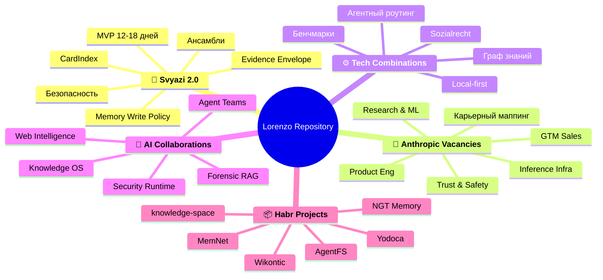
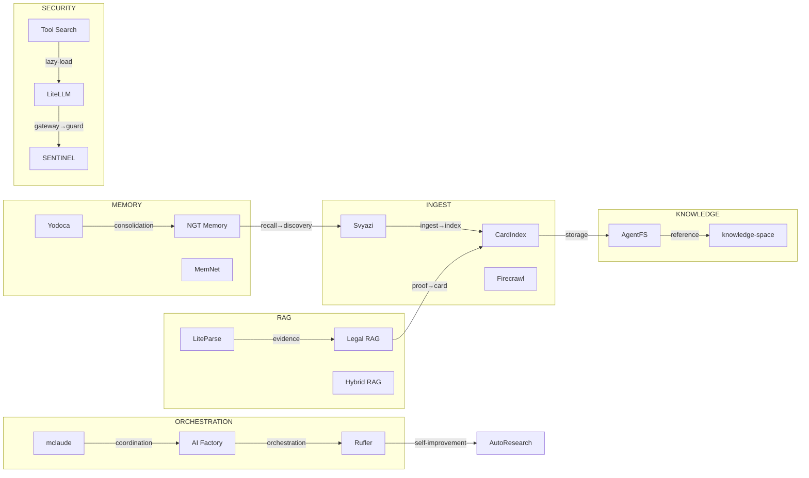

# Майндмап репозитория Lorenzo

<!-- toc-auto -->
## Contents

- [Структура разделов](#структура-разделов)
- [Поток данных между проектами](#поток-данных-между-проектами)
- [Легенда](#легенда)
- [Смотрите также](#смотрите-также)

> [!NOTE]
> Документ создан на основе исследования. Ссылки ведут на связанные материалы.

<!-- alert-added -->

<!-- summary -->

> [!NOTE]
> Документ создан на основе исследования. Ссылки ведут на связанные материалы.

> knowledge-space[knowledge-space]
**Проекты:** Svyazi, CardIndex, AgentFS, knowledge-space, mclaude, AI Factory, Rufler, LiteParse

---
<!-- tags: memory, rag, orchestration, security, knowledge, ingestion, local-first, architecture, roadmap, anthropic, self-improvement, collaboration -->

## Структура разделов

## Поток данных между проектами

## Легенда

| Слой | Проекты |
|------|---------|
| Ingestion | Svyazi, CardIndex, Firecrawl |
| Knowledge | AgentFS, knowledge-space |
| Memory | Yodoca, NGT Memory, MemNet |
| RAG | LiteParse, Legal RAG, Hybrid RAG, Graph RAG |
| Orchestration | mclaude, AI Factory, Rufler, AutoResearch |
| Security | LiteLLM, SENTINEL, Tool Search, Auto AI Router |
| Sync | Yjs, Automerge |

<!-- see-also -->

---

## Смотрите также
- [[GLOSSARY]]
- [[CONTACT_PRIORITY]]
- [[GRAPH]]
- [[NETWORK]]

<!-- backlinks -->

---

**Кто ссылается на этот документ (4):**
- [READABILITY](../READABILITY.md)
- [READING_TIME](../READING_TIME.md)
- [SEARCH](../SEARCH.md)
- [TABLES](../TABLES.md)

