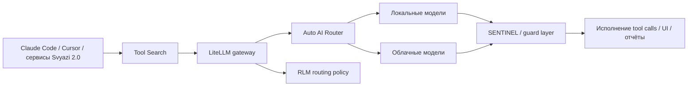

# Ансамбль E — Safe and cheap execution plane

<!-- summary -->
> > Источник: `deep-research-report (1).md`.
**Проекты:** Svyazi, SENTINEL, LiteLLM, Auto AI Router, Tool Search

---
<!-- tags: orchestration, security, ingestion, architecture -->

> Источник: `deep-research-report (1).md`.

Даже идеальный memory/discovery‑стек провалится, если исполнение дорого или уязвимо. Поэтому нужен периметр: LiteLLM как центральный unified API, Auto AI Router как лёгкий Go‑sidecar для rate limits и failover, Tool Search как lazy loading MCP‑инструментов, RLM‑Toolkit как формализованный budget/privacy routing, а SENTINEL как runtime‑защита агентной поверхности. citeturn11search2turn39view0turn39view1turn20view18turn20view10

## Схема

## Ожидаемые новые свойства

- **Реальная экономия контекста ещё до первого токена работы**: в кейсе Tool Search MCP‑overhead упал с 82k до 5.7k токенов, а свободное окно выросло на 76k. citeturn39view1
- **Бюджетный и privacy‑aware роутинг**: RLM‑Toolkit уже описывает budget‑first, quality‑first и privacy‑first конфигурации как первый класс настроек. citeturn20view18
- **Меньший blast radius на gateway‑слое**: Auto AI Router даёт lightweight sidecar в Go с 30–80 MB RAM и OpenAI‑совместимым endpoint, что удобно для self‑hosted периметра. citeturn39view0
- **Защитный барьер между агентом и реальным миром**: SENTINEL позиционируется как «иммунная система» для AI‑приложений с быстрыми Rust‑движками и micro‑model swarm. citeturn20view10

<!-- see-also -->

---

**Смотрите также:**
- [[security-routing-plane]]
- [[04-ensembles-overview]]
- [[04-приоритетные-ансамбли]]
- [[budget-routing]]

<!-- similar-docs -->

---

**Похожие документы:**
- [[security-routing-plane]] (сходство 0.29)
- [[04-ensembles-overview]] (сходство 0.22)
- [[04-ensembles-overview]] (сходство 0.21)

