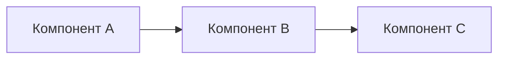

# Ансамбль: [Название]

> [!WARNING]
> Документ содержит описание рисков и ограничений. Изучите их перед принятием архитектурных решений.

<!-- alert-added -->

<!-- summary -->
> <!-- summary: Ансамбль из X компонентов для Y задачи -->

---


<!-- summary: Ансамбль из X компонентов для Y задачи -->
<!-- tags: ансамбль, архитектура -->

## Назначение

[Какую задачу решает ансамбль. Почему именно эта комбинация компонентов.]

## Компоненты

| Компонент | Роль | Лицензия |
|-----------|------|----------|
| [Проект A] | [роль] | [лицензия] |
| [Проект B] | [роль] | [лицензия] |

## Архитектурная схема



## Контракт взаимодействия

```yaml
input:
  type: [тип входа]
  format: [формат]
output:
  type: [тип выхода]
  format: [формат]
```

## Риски и ограничения

- [Риск 1]
- [Ограничение 1]

## MVP-шаги

1. [Шаг 1]
2. [Шаг 2]
3. [Шаг 3]

---
_Создано: 2026-04-29_

<!-- see-also -->

---

**Смотрите также:**
- [[project-component]]
- [[decision-record]]
- [[research-summary]]


<!-- similar-docs -->

---

**Похожие документы:**
- [ensemble](docs/templates/ensemble.md) (сходство 0.51)
- [118-appendix-a-шаблон-для-header-warning](docs/02-anthropic-vacancies/118-appendix-a-шаблон-для-header-warning.md) (сходство 0.23)
- [118-appendix-a-шаблон-для-header-warning](docs/obsidian/02-anthropic-vacancies/118-appendix-a-шаблон-для-header-warning.md) (сходство 0.21)

