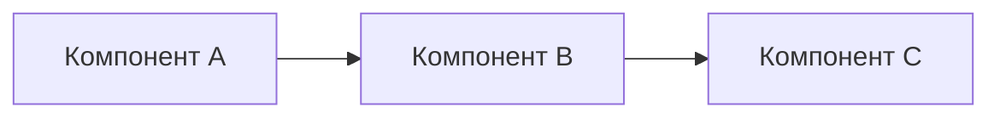

# Ансамбль: [Название]

> [!NOTE]
> Раздел `ensemble` формируется автоматически из данных репозитория.

<!-- alert-added -->

<!-- summary: Ансамбль из X компонентов для Y задачи -->
<!-- tags: ансамбль, архитектура -->

## Назначение

[Какую задачу решает ансамбль. Почему именно эта комбинация компонентов.]

## Компоненты

| Компонент | Роль | Лицензия |
|-----------|------|----------|
| [Проект A] | [роль] | [лицензия] |
| [Проект B] | [роль] | [лицензия] |

## Архитектурная схема


```mermaid
graph LR
    A[Компонент A] --> B[Компонент B]
    B --> C[Компонент C]
```

## Контракт взаимодействия

```yaml
input:
  type: [тип входа]
  format: [формат]
output:
  type: [тип выхода]
  format: [формат]
```

## Риски и ограничения

- [Риск 1]
- [Ограничение 1]

## MVP-шаги

1. [Шаг 1]
2. [Шаг 2]
3. [Шаг 3]

---
_Создано: 2026-05-11_

## Смотрите также
- [[README|Главная]]
- [[METRICS|Метрики]]
- [[HEALTH|Здоровье]]
- [[GLOSSARY|Глоссарий]]
- [[ENTITIES|Сущности]]

<!-- backlinks -->

---

**Кто ссылается на этот документ (4):**
- [READABILITY](../../READABILITY.md)
- [READING_TIME](../../READING_TIME.md)
- [SEARCH](../../SEARCH.md)
- [TABLES](../../TABLES.md)

