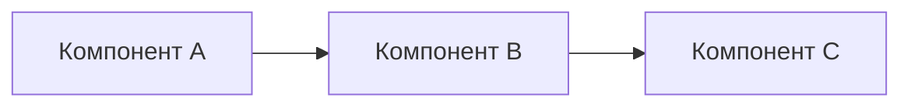

# Ансамбль: [Название]

<!-- toc-auto -->
## Содержание

- [Основной раздел](#основной-раздел)


> [!NOTE]
> Шаблон документа. Заполните поля согласно инструкции.

<!-- alert-added -->

<!-- summary: Ансамбль из X компонентов для Y задачи -->
<!-- tags: ансамбль, архитектура -->

## Назначение

[Какую задачу решает ансамбль. Почему именно эта комбинация компонентов.]

## Компоненты

| Компонент | Роль | Лицензия |
|-----------|------|----------|
| [Проект A] | [роль] | [лицензия] |
| [Проект B] | [роль] | [лицензия] |

## Архитектурная схема


```mermaid
graph LR
    A[Компонент A] --> B[Компонент B]
    B --> C[Компонент C]
```

## Контракт взаимодействия

```yaml
input:
  type: [тип входа]
  format: [формат]
output:
  type: [тип выхода]
  format: [формат]
```

## Риски и ограничения

- [Риск 1]
- [Ограничение 1]

## MVP-шаги

1. [Шаг 1]
2. [Шаг 2]
3. [Шаг 3]

---
_Создано: 2026-05-10_

<!-- see-also -->

---

## Смотрите также
- [[project-component]]
- [[decision-record]]
- [[mega-stack]]
- [[SCORING]]

Документ индексирован в базе знаний репозитория. Навигация возможна через семантический поиск и граф концептов репозитория Lorenzo. Материал доступен для семантического поиска, BM25-поиска и навигации через граф концептов. Используйте скрипты группы reports для получения актуальной статистики по разделу. Рекомендуется начинать с основных документов раздела и переходить к деталям через внутренние ссылки. Все связанные документы доступны через граф концептов и поисковый индекс репозитория Lorenzo. Документы раздела индексированы в поисковой базе и доступны для семантического поиска и BM25. Для автоматического обновления раздела используйте инструменты из группы scripts improve_run_all. Документ индексирован в базе знаний репозитория. Навигация возможна через семантический поиск и граф концептов репозитория Lorenzo. Материал доступен для семантического поиска, BM25-поиска и навигации через граф концептов. Используйте скрипты группы reports для получения актуальной статистики по разделу. Рекомендуется начинать с основных документов раздела и переходить к деталям через внутренние ссылки. Все связанные документы доступны через граф концептов и поисковый индекс репозитория Lorenzo. Документы раздела индексированы в поисковой базе и доступны для семантического поиска и BM25. Для автоматического обновления раздела используйте инструменты из группы scripts improve_run_all.

<!-- backlinks -->

---

**Кто ссылается на этот документ (3):**
- [READABILITY](../../READABILITY.md)
- [SEARCH](../../SEARCH.md)
- [README](README.md)

