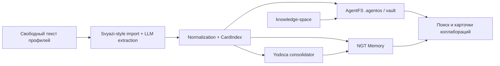

# Ансамбль A — Collaboration OS

> [!IMPORTANT]
> Ключевой документ для понимания архитектуры. Рекомендуется прочитать в первую очередь.

<!-- alert-added -->

<!-- summary -->
> > Источник: `deep-research-report (1).md`.
**Проекты:** Svyazi, CardIndex, AgentFS, knowledge-space, Yodoca, NGT Memory

---
<!-- tags: memory, rag, knowledge, ingestion, architecture, self-improvement, collaboration -->

> Источник: `deep-research-report (1).md`.

Это базовый сценарий для Svyazi‑2.0: Svyazi отвечает за извлечение и нормализацию профилей, AgentFS — за единое файловое ядро и политику, knowledge-space — за agent‑readable reference layer, NGT Memory — за быстрые ассоциативные связи, Yodoca — за ночную консолидацию и забывание шумов. Такой стек превращает «случайные находки коллабораций» в воспроизводимую машинерию. citeturn41search0turn27view0turn33view2turn22view4turn21view0

## Схема

## Ожидаемые новые свойства

- **Serendipity не как баг, а как режим работы**: быстрый поиск больше не ограничен совпадением явных skills; ассоциативная память подтягивает слабые ко‑активации тем и интересов. citeturn41search0turn22view4
- **Единый source of truth для разных агентов и сессий**: rules, memory, security и task state больше не дублируются по `CLAUDE.md`, `.cursor/rules/` и другим runtime‑форматам. citeturn33view4turn27view0
- **Контролируемое забывание вместо бесконечного накопления мусора**: Yodoca явно вводит Ebbinghaus‑decay, prune и приватный write‑path‑консолидатор. citeturn21view0turn21view1
- **Agent‑first knowledge retrieval**: knowledge-space снижает стоимость «ориентации в проекте», потому что хранит не туториалы, а уже очищенные reference‑карты с граблями и рабочими паттернами. citeturn33view3turn37search1

<!-- see-also -->

---

**Смотрите также:**
- [04-ensembles-overview](docs/01-svyazi/04-ensembles-overview.md)
- [04-приоритетные-ансамбли](docs/04-ai-collaborations/04-приоритетные-ансамбли.md)
- [knowledge-space](docs/svyazi-2-0/components/knowledge-space.md)
- [license-tree](docs/svyazi-2-0/limitations/license-tree.md)

<!-- similar-docs -->

---

**Похожие документы:**
- [04-ensembles-overview](docs/01-svyazi/04-ensembles-overview.md) (сходство 0.22)
- [04-ensembles-overview](docs/obsidian/01-svyazi/04-ensembles-overview.md) (сходство 0.22)
- [04-приоритетные-ансамбли](docs/04-ai-collaborations/04-приоритетные-ансамбли.md) (сходство 0.20)

