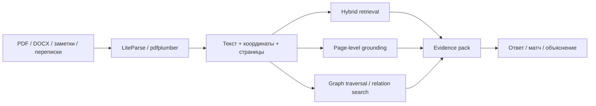

# Ансамбль B — Forensic RAG для доказуемого matching и review

<!-- summary -->
> > Источник: `deep-research-report (1).md`.
**Проекты:** Svyazi, LiteParse, Legal RAG, Hybrid RAG, Graph RAG

---
<!-- tags: rag, ingestion, architecture, self-improvement -->

> Источник: `deep-research-report (1).md`.

Если Svyazi‑2.0 должен не только находить людей и идеи, но и объяснять, *почему* возникла рекомендация, нужен evidence‑first слой. Здесь research-docs/LiteParse даёт spatial grounding и HTML‑отчёты, Legal RAG — page‑level модель доказуемости, Hybrid RAG — лёгкий контролируемый backend, а Graph RAG — multi‑hop reasoning по связям между сущностями и пассажами. citeturn20view5turn20view6turn34view2turn34view3

## Схема

## Ожидаемые новые свойства

- **Верифицируемые ответы**: у пользователя появляется не просто текстовый вывод, а визуально подсвеченный фрагмент страницы, к которому можно вернуться. citeturn20view5turn34view2
- **Правильная единица доказательства — страница, а не чанк**: Legal RAG прямо показывает, почему page‑level grounding удобнее для обратного перехода к источнику. citeturn20view6
- **Multi‑hop объяснения**: Graph RAG добавляет ответы на вопросы о связях и косвенных маршрутах между объектами, где обычный chunk‑RAG ломается. citeturn34view3
- **Контроль над retrieval‑слоем без «фреймворкового тумана»**: Hybrid RAG‑подход на pdfplumber/FAISS/TF‑IDF проще дебажить и дешевле держать в локальном контуре, чем тяжёлые универсальные RAG‑фреймворки. citeturn34view2

<!-- see-also -->

---

**Смотрите также:**
- [04-ensembles-overview](docs/01-svyazi/04-ensembles-overview.md)
- [04-приоритетные-ансамбли](docs/04-ai-collaborations/04-приоритетные-ансамбли.md)
- [F-evidence-backed-intake](docs/svyazi-2-0/ensembles/F-evidence-backed-intake.md)
- [evidence-envelope](docs/svyazi-2-0/architecture/evidence-envelope.md)

<!-- similar-docs -->

---

**Похожие документы:**
- [04-ensembles-overview](docs/01-svyazi/04-ensembles-overview.md) (сходство 0.21)
- [04-ensembles-overview](docs/obsidian/01-svyazi/04-ensembles-overview.md) (сходство 0.21)
- [04-приоритетные-ансамбли](docs/04-ai-collaborations/04-приоритетные-ансамбли.md) (сходство 0.19)

